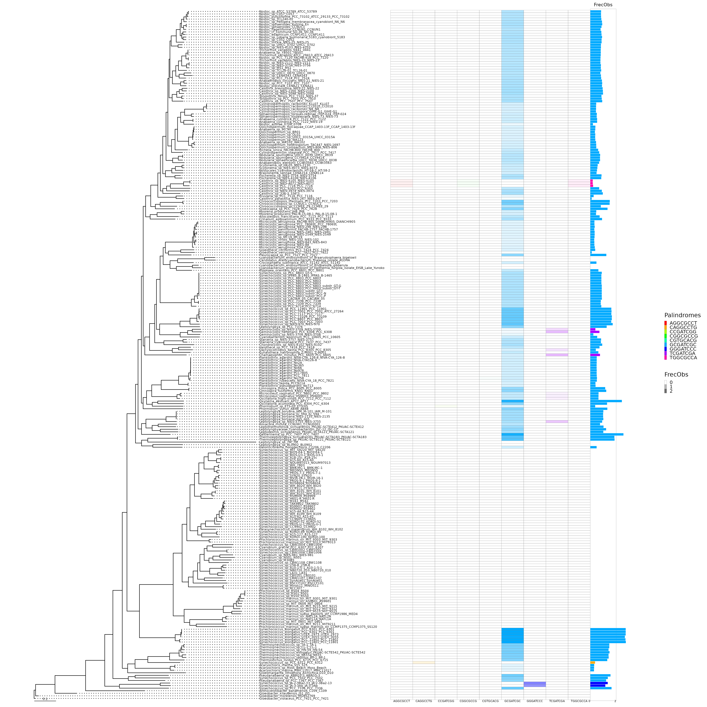

# Métodos

Se descargaron 2 conjuntos de genomas de cianobacterias del servidor del NCBI (https://www.ncbi.nlm.nih.gov/genome/browse/#!/prokaryotes).

Estos conjuntos corresponden a:

* 269 genomas completos y aquellos que solo contenian el cromosoma (**complete_chr**)
* 165 genomas nuevos usados en @{cabello2022elucidating} (**pico**)

Dichos genomas fueron descargados en formato Genebank (.gbk o gbff).

## Abundancia de palíndromos. 

Una vez descargados los genomas, el siguiente paso fue calcular el valor observado y esperado de repeticiones de todos los posibles octámeros palindrómicos de 8 nucleótidos. 

El valor observado es el número de veces que cada octámero palindrómico se repite a lo largo de cada genoma. 
El valor esperado se calculó mediante un **modelo de markov de 3er orden**.

### Modelos de Markov
En una cadena de Markov, el valor tomado por una variable aleatoria depende de los valores tomados por la variable aleatoria en un estado anterior. El número de estados históricos que influyen en el valor de la variable aleatoria en un lugar dado a lo largo de la secuencia también se conoce como el **grado del proceso de Markov**. El modelo de cadena de Markov de **primer grado** tiene parámetros $|\Sigma| + |\Sigma|^2$, correspondientes a las frecuencias de nucleótidos individuales así como a las frecuencias de dinucleótidos. De esta manera, este modelo permite que una posición sea dependiente de la posición anterior. Sin embargo, las frecuencias se modelan de manera invariable en la posición y, por lo tanto, pueden no ser adecuadas para modelar señales. Este modelo de secuencia $M$ se define sobre el espacio muestral $\Sigma^{*}$ y asigna una probabilidad a cada secuencia $x$ de longitud $n(x)$ sobre $\Sigma^{*}$:

\begin{equation}
P(x|M) = P_1(x_1) \prod_{i=2,...,n(x)} P_2(x_i|x_{i-1},...,x_{i-n})
(\#eq:markov)
\end{equation}

donde $P_1$ es una función de probabilidad en $\Sigma$ que modela la distribución de $\alpha$'s en la primera posición de la secuencia y $P_2$ es la función de probabilidad condicional en $\Sigma\times\Sigma$ que modela la distribución de $\beta$'s en la posición $i>1$ en el símbolo alfabético $\alpha$ en la posición $i-1$. La estimación de parámetros se hace utilizando el estimador de ***probabilidad máxima***. Las probabilidades de transición se estiman utilizando el teorema de Bayes, como se muestra a continuación:

\begin{equation}
P_2(\beta|\alpha)={P(\alpha\beta) \over P(\alpha)}
(\#eq:bayes)
\end{equation}

De esta manera, las probabilidades transicionales condicionales de encontrar una base $\beta$ en la posición ($i$) dado que la base $\alpha$ se encontró en la posición ($i-1$) se calculan encontrando la abundancia del dinucleótido $\alpha\beta$ como una fracción de la abundancia del nucleótido $\alpha$.

**Ejemplo:**

Considerando una la secuencia de 25 nucleótidos.
$$Seq = AACGT\space CTCTA\space TCATG\space CCAGG\space ATCTG$$

Al considerar los modelos de cadena de Markov de **primer grado**, es necesario calcular los $4-parámetros$ correspondientes a las **frecuencias de nucleótidos individuales** y los $4^2$ parámetros correspondientes a las **frecuencias de dinucleótidos**. Los parámetros de $\Sigma$ son:

\begin{equation} 
\begin{split}
\Sigma & = \{frec(A),frec(C),frec(G),frec(T),\}\\
 & =\{\frac{6}{25},\frac{7}{25},\frac{7}{25},\frac{5}{25}\}
\end{split}
(\#eq:EQ3)
\end{equation}

Para calcular $P_2$, los valores de probabilidad condicional $\Sigma \times \Sigma$, las frecuencias de dinucleótidos y las probabilidades se calculan a partir de los datos de secuencia. Las frecuencias de los dinucleótidos y las probabilidades se muestran a continuación (con los números entre paréntesis que representan las probabilidades):

\begin{equation}
\Sigma \times \Sigma = 
\begin{Bmatrix}
frec(AA)=\frac{1}{24} & frec(AC)=\frac{1}{24} & frec(AT)=\frac{3}{24} & frec(AG)=\frac{1}{24} \\
frec(CA)=\frac{2}{24} & frec(CC)=\frac{1}{24} & frec(CT)=\frac{3}{24} &frec(CG)=\frac{1}{24} \\
frec(TA)=\frac{1}{24} & frec(TC)=\frac{4}{24} & frec(TT)=\frac{0}{24} & frec(TG)=\frac{1}{24} \\
frec(GA)=\frac{1}{24} & frec(GC)=\frac{1}{24} & frec(GT)=\frac{1}{24} & frec(GG)=\frac{1}{24}
\end{Bmatrix}
(\#eq:EQ4)
\end{equation}

A continuación, las probabilidades condicionales se calculan utilizando el teorema de Bayes (consulte la Ecuación \@ref(eq:bayes) ). Por ejemplo, la probabilidad de encontrar $C$ en la posición $i+1$ dado que se ha encontrado una $A$ en la posición ($i$) es:

\begin{equation}
P(C|A)= \frac{P_{AC}}{P_A}=\frac{\frac{1}{24}}{\frac{6}{25}}
(\#eq:EQ5)
\end{equation}

Para secuencias grandes, la probabilidad condicional $P(S_i|S_{i-1})$ se aproxima a:

\begin{equation}
P(S_i|S_{i-1}) =\frac{frec(S_iS_{i-1})}{frec(S_{i-1})}
(\#eq:EQ6)
\end{equation}

Las probabilidades condicionales para la secuencia de ejemplo se muestran en \@ref(eq:EQ4). Usando estos parámetros del modelo, la probabilidad de encontrar el patrón $CAAT$ en esta secuencia usando el **modelo de Markov de primer orden** de la secuencia subyacente sería igual a:

\begin{equation}
\begin{split}
P(C)P(A|C)P(A|A)P(T|A) & = P(C)\cdot\frac{P(CA)}{P(C)}\cdot\frac{P(AA)}{P(A)}\cdot\frac{P(AT)}{P(A)} \\
& = (\frac{7}{25}) \cdot (\frac{50}{168}) \cdot (\frac{25}{144}) \cdot (\frac{75}{144})\\
& = 0.0075
\end{split}
(\#eq:EQ7)
\end{equation}

### Modelo de Markov de orden 1 para hallar octanucleótidos

Por ejemplo, para una octanucleótido de 8 letras, digamos HIP1:
$$W=GCGATCGC$$
Los parametros de $\Sigma$ corresponden a:
\begin{equation}
\Sigma= \{frec(A),frec(C),frec(G),frec(T)\}
\end{equation}

Los valores de probabilidad condicional de $\Sigma \times \Sigma$ son:
\begin{equation}
\Sigma \times \Sigma = 
\begin{Bmatrix}
  frec(AA) & frec(AC) & frec(AT) & frec(AG) \\ 
  frec(CA) & frec(CC) & frec(CT) & frec(CG) \\
  frec(TA) & frec(TC) & frec(TT) & frec(TG) \\
  frec(GA) & frec(GC) & frec(GT) & frec(GG)
\end{Bmatrix}
\end{equation}

Si queremos usar un **modelo de orden 1**, la probabilidad de hallar $W$ segun las ecuaciones \@ref(eq:markov) y\@ref(eq:bayes) es:
\begin{equation}
\begin{split}
P(W) & = P(G) \cdot P(C|G) \cdot P(G|C) \cdot P(A|G) \cdot P(T|A) \cdot P(C|T) \cdot P(G|C) \cdot P(C|G)\\
& = {P(G)} \cdot \frac{P(GC)}{P(G)} \cdot \frac{P(CG)}{P(C)} \cdot \frac{P(GA)}{P(G)} \cdot \frac{P(AT)}{P(A)} \cdot \frac{P(TC)}{P(T)} \cdot \frac{P(CG)}{P(C)} \cdot \frac{P(GC)}{P(G)}\\
& = P(GC) \cdot \frac{P(CG)}{P(C)} \cdot \frac{P(GA)}{P(G)} \cdot \frac{P(AT)}{P(A)} \cdot \frac{P(TC)}{P(T)} \cdot \frac{P(CG)}{P(C)} \cdot \frac{P(GC)}{P(G)}
\end{split}
\end{equation}

finalmente:
\begin{equation}
P(W) = \frac{P(GC) \cdot P(CG) \cdot P(GA) \cdot P(AT) \cdot P(TC) \cdot P(CG) \cdot P(GC)}{P(C) \cdot P(G) \cdot P(A) \cdot P(T) \cdot P(C) \cdot P(G)}
(\#eq:Markov1HIP)
\end{equation}

### Abundancia de acuerdo a la frecuencia observada y tasa OE

Adicionalmente se calculó una abundancia de acuerdo a la frecuencia observada cada 1000 nucleótidos (**FrecObs**) y otra en base a la tasa de sitios observados sobre esperados (**OE**).

## Significancia de los conteos observados

Para darle una significancia estadística al conteo se usó una **prueba binomial** y un test **FDR**. 

### Prueba binomial. 


Para calcular la probabilidad de que el **conteo esperado**, el cual sigue una distribución binomial, tome valores MAYORES O IGUALES al **conteo observado**, usamos la función ***pbinom***
```{r, eval = FALSE}
pbinom(q, size, prob, lower.tail = FALSE)  
```

Donde: 

* **q**: Cuantil o vector de cuantiles 
* **size**: Numero de experimentos (n>=0) 
* **prob**: Probabilidad de éxito en cada experimento 
* **lower.tail**: si es TRUE, las probabilidades son P(X<=x), o P(X>x) en otro caso.

Tomemos un caso particular del conteo:

|Spp   |Palindrome |Observed |Markov (Expected)   |GenomeSize |
|:------|:-----------|:---------|:----------------|:-----------|
|336-3 |GCGATCGC   | 6202    |65.396286071305 |6420126    |

La probabilidad de que se observen **6202** sitios $GCGATCGC$, O MAS, si el número de sitios posibles en el genoma es **6420119** ($6420126-8+1$, es decir $GenomeSize-k+1$) y la probabilidad de observar dicho sitio es de: **1.018615e-05** ($65.3962860713054 \over 6420126-8+1$, es decir $Expected \over GenomeSize-k+1$), es casi **0**.

En otras palabras, la probabilidad de que suceda lo que estoy observando es muy baja.

### FDR 

Para estudios en los que se realizan miles de test de forma simultánea, el resultado de estos métodos es demasiado conservativo e impide que se detecten diferencias reales. Una alternativa es controlar el false discovery rate o FDR. 

Para nuestros datos el FDR se calculó en R de usando los valores obtenidos de la prueba binomial:

```{r, eval=FALSE}
p.adjust(pval, method="fdr")
```

Donde **pval** es la probabilidad obtenida de la prueba binomial. 

### Conjuntos de conteos de acuerdo a la significancia
Se crearon 4 conjuntos de resultados de acuerdo a 4 valores mínimos de significancia de acuerdo al FDR:

* **sel32** ($1 \times 10^{-32}$)
* **sel64** ($1 \times 10^{-64}$)
* **sel128** ($1 \times 10^{-128}$)
* **sel256** ($1 \times 10^{-256}$)

El conjunto más laxo corresponde a **sel32** ya que su valor de corte de FDR es $1 \times 10^{-32}$, debido a esto, es el conjunto con más palíndromos (Figure \@ref(fig:FIG1)). Por otro lado, el conjunto **sel256** es el conjunto más restrictivo ya que su valor de corte de FDR es de $1 \times 10^{-256}$, y por lo tanto tiene menos palíndromos (Figure \@ref(fig:FIG2)).

## Visualización de la abundancia: OE vs Frecuencia Observada cada 1000nt 

Para visualizar la abundancia creamos un gráfico que muestra el enriquecimiento OE vs la abundancia por cada 1000 nucleótidos. Esto se hizo para cada conjunto de significancia y para cada conjunto de genomas.

```{r FIG1, echo=FALSE, fig.cap='**Enriquecimiento versus abundancia de palíndromos octámeros en el conjunto de genomas complete\\_chr con un $FDR \\leq 1 \\times 10^{-32}$.** Enriquecimiento (**O/E**) en función de la frecuencia del motivo cada 1000 nt (**FrecObs**). Cada punto representa un palíndromo octámero de un genoma.', out.width='80%', fig.asp=.75, fig.align='center'}
knitr::include_graphics(normalizePath('figures/df_refseq_chr_269_Octanuc_FrecObs_sel32_significative-palindromes.png'))
```

```{r FIG2, echo=FALSE, fig.cap='**Enriquecimiento versus abundancia de palíndromos octámeros en el conjunto de genomas complete\\_chr con un $FDR \\leq 1 \\times 10^{-256}$.** Enriquecimiento (**O/E**) en función de la frecuencia del motivo cada 1000 nt (**FrecObs**). Cada punto representa un palíndromo octámero de un genoma.', out.width='80%', fig.asp=.75, fig.align='center'}
knitr::include_graphics(normalizePath("figures/df_refseq_chr_269_Octanuc_FrecObs_sel256_significative-palindromes.png"))
```

## Filogenia

Se infirieron filogenias para los dos conjuntos de genomas. Para esto usamos el software **Orthofinder** (@{emms2019orthofinder}), el cual utiliza **FastME** para inferir la filogenia  (@{lefort2015fastme}). **FastME** proporciona algoritmos de distancia para inferir filogenias. FastME se basa en una evolución mínima equilibrada, que es el principio mismo de Neighbor Joining (NJ). 

El software se corrió en la línea de comandos de la siguiente manera: 
```{bash, eval=FALSE}
orthofinder –f genomas/ 
```

### Anotación de la filogenia

Para tener una forma de más visual de entender la distribución de los palíndromos en los genomas, anotamos las filogenias de acuerdo a su abundancia. Se anotaron 4 filogenias según la significancia (**sel32**, **sel64**, **sel128** y **sel256**) para los 2 conjuntos de genomas. Además, esta anotación se hizo para la abundancia de acuerdo a la Frecuencia Observada por cada 1000 nucleotidos ($FrecObs$) (Figure \@ref(fig:FIG3)) y a la tasa de Observados sobre esperados ($OE$) (Figure \@ref(fig:FIG4)). 

La anotación de las filogenias consistió en agregarles un heatmap que mostrara la abundancia de cada palíndromo y un diagrama de barras que indicara aquel palíndromo con mayor abundancia. 

```{r FIG3, echo=FALSE, fig.cap='**Filogenia del conjunto de genomas *complete\\_chr* anotada de acuerdo a la Frecuencia observada cada 1000 nt (FrecObs).** La abundancia visualizada en esta filogenia es de acuerdo al conjunto **sel256**, es decir conteos con un $FDR \\leq 1 \\times 10^{-256}$. La filogenia muestra 269 especies, frente a la filogenia se muestra un heatmap que indica la abundancia de cada palíndromo. Frente al Heatmap se muestra un Diagrama de barras el cual indíca el palindromo mas abundante de entre todos.', fig.align='center'}

```

```{r FIG4, echo=FALSE, fig.cap="**Filogenia del conjunto de genomas *complete\\_chr* anotada de acuerdo a la tasa de observados sobre esperados (OE).** La abundancia visualizada en esta filogenia es de acuerdo al conjunto **sel256**, es decir conteos con un $FDR \\leq 1 \\times 10^{-256}$. La filogenia muestra 269 especies, frente a la filogenia se muestra un heatmap que indica la abundancia de cada palíndromo. Frente al Heatmap se muestra un Diagrama de barras el cual indíca el palindromo mas abundante de entre todos.",fig.align='center'}
knitr::include_graphics("figures/refseq_chr_269_Octanuc_OE_sel256_filogenia_HIG.png")
```

## Identificación de casos relevantes

De acuerdo a las filogenias anotadas, se buscaron aquellos casos en los que HIP1 o algún otro palíndromo se hubiera ganado o perdido abruptamente y en su lugar hubiese otro palíndromo abundante. Además, se buscó que en aquellos casos, las ramas en la filogenia no fueran tan largas. Esto se hizo de manera visual revisando el diagrama de barras que mostraba el palíndromo más abundante para cada especie. En total hubo 6 subclados que mostraban cambios abruptos en la abundancia de sus palíndromos (Figure \@ref(fig:FIG5)).
```{r FIG5, echo=FALSE, fig.cap="**Casos de interés.** En la figura se muestran remarcados los casos interesantes: **clado calothrix** (rojo), **clado cyanobacterium** (naranja), **clado geminocystis** (amarillo), **clado thermosynechococcus** (azul), **clado pseudoanabaena** (verde).", fig.align='center'}
knitr::include_graphics("figures/refseq_chr_269_Octanuc_FrecObs_sel256_filogenia_HIG_cases.png")
```

También se hallo un caso interesante en el conjunto **pico** (**clado A18-40**) el cual sirvió como punto de partida para analisis posteriores. En este caso se muestra que la especie Synechococcus A18-40 muestra una tasa OE mucho mayor comparada con las demás especies del clado (Figure \@ref(fig:FIG6)).

```{r FIG6, echo=FALSE, fig.cap="**Casos de interés.** En la figura se muestra remarcado el **clado A18-40** (azul).",fig.align='center'}
knitr::include_graphics("figures/pico_165_Octanuc_OE_sel32_filogenia_HIG_cases.png")
```

## Reconstrucción Ancestral de sitios palindrómicos en ortólogos

Para tratar de entender como es que los sitios HIP1 han ido evolucionando, hicimos una reconstrucción de sitios ancestrales y posteriormente construimos varios conjuntos de redes para visualizar dicha evolución.

### Ortólogos

Para simplificar la reconstrucción de secuencias ancestrales usamos unicamente los ortólogos. Para obtener esto usamos el pipeline 	```get_homologues```:

```{bash, eval=FALSE}
get_homologues.pl -d gbff -t 0 -M -n PPN
```

Después de obtener los ortólgos filtramos:

* aquellos que no estuvieran en las 6 especies del clado
* aquellos que tuvieran mas de una copia (parálogos)
* aquellos sin sitios HIP1

### Reconstrucción

Para hacer la reconstrucción usamos la pagueteria de R ```phangorn```, la cual proporciona varios métodos para estimar estados de caracteres ancestrales con Máxima Parsimonia (MP) o Máxima Verosimilitud (ML). En este caso usamos ML. Adicionalmente podemos asignar los estados ancestrales según la máxima verosimilitud (“ml”):
$$P(x_r=A) = {{L(x_r=A)} \over {\sum\limits_{k\in \{A,C,G,T\}}} L(x_r= k) }$$

y el criterio de mayor probabilidad posterior (“bayes”):
$$P(x_r=A) = {{\pi_A L(x_r=A)} \over {\sum\limits_{k\in \{A,C,G,T\}}} \pi_k L(x_r= k) }$$

dónde $L(x_r)$ es la probabilidad conjunta de los estados en las puntas y el estado en la raíz $x_r$ y $\pi_i$ son las frecuencias base estimadas del estado $i$.

Toda la información de la reconstrucción fue guardada en dos tablas las cuales contienen listas de cada transicion entre cada estado. Estas tablas fueron creadas con la siguiente función:

```{r,eval=FALSE}
source("ASR_Orth_Functions/NodeAndEdges.R")

Create_Transition_Table (SitesTable = "Clados/Callothrix_clade/PALINDROMES/GCGATCGC/Orthologues_Palindrome_sites.txt",
                                EvolutionModel = "F81",
                                Method = "bayes",
                                Phylogeny = "Clados/Callothrix_clade/SpeciesTree_rooted.txt",
                                OrthoPath = "Clados/Callothrix_clade/PALINDROMES/GCGATCGC/Only_ORTHOLOGUES/")
```


