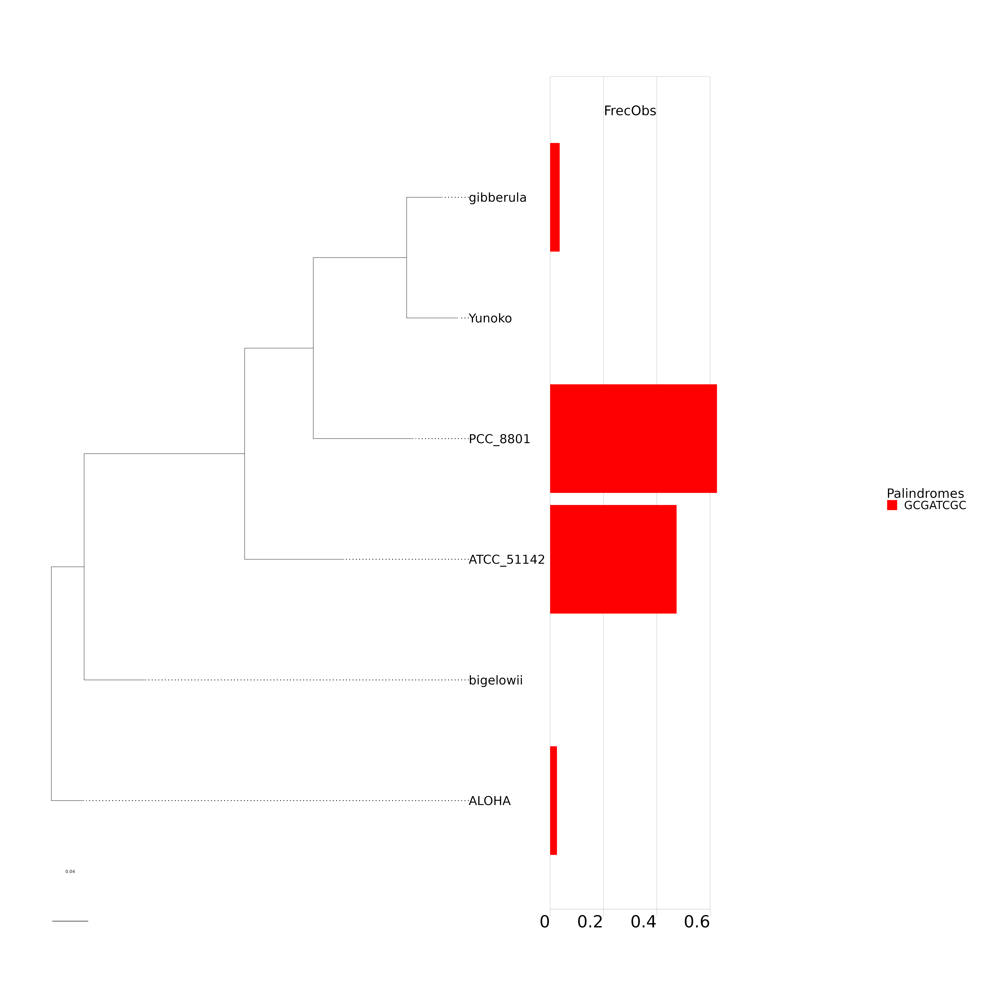
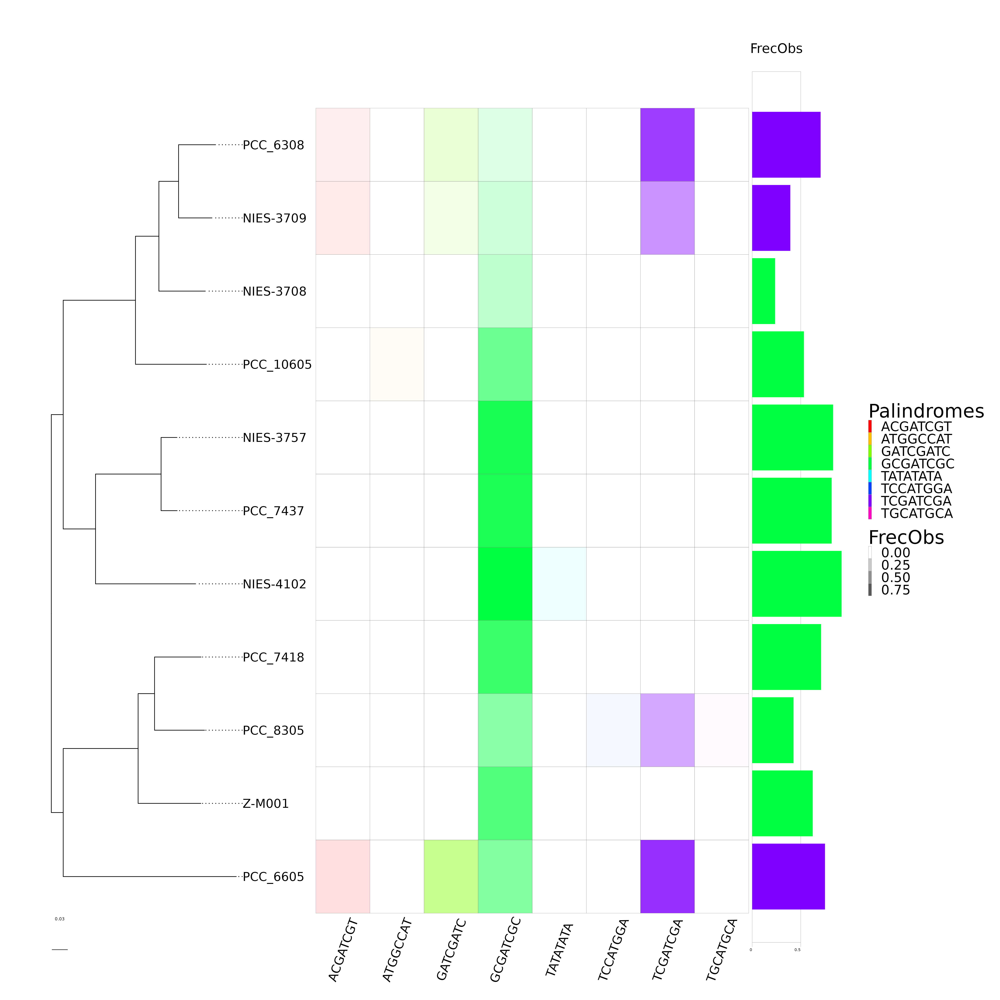
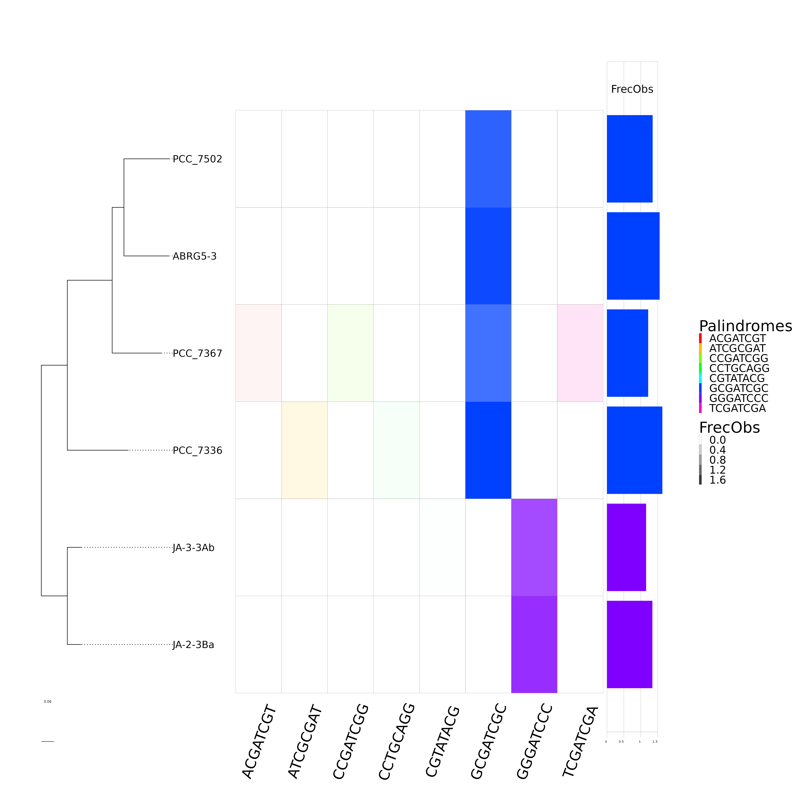
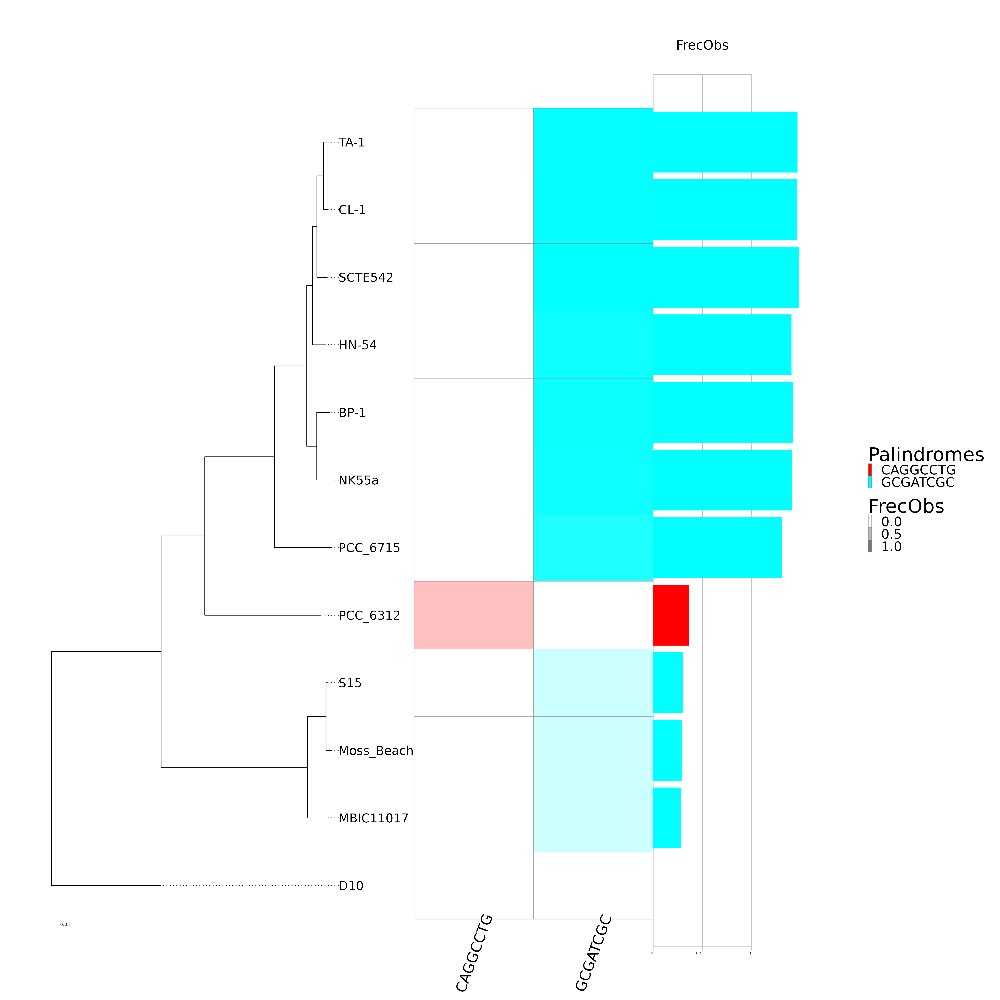
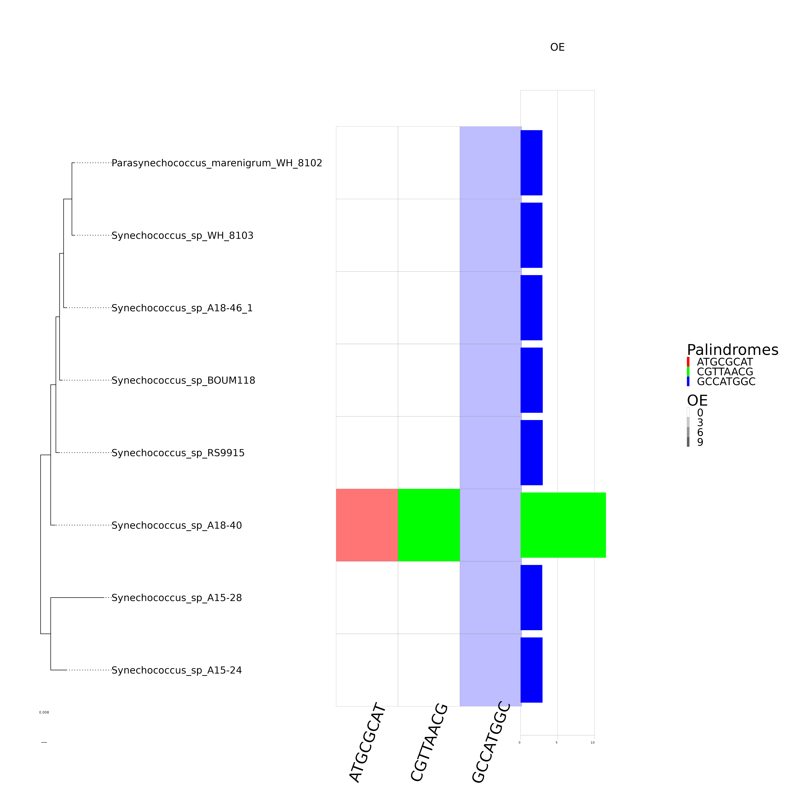
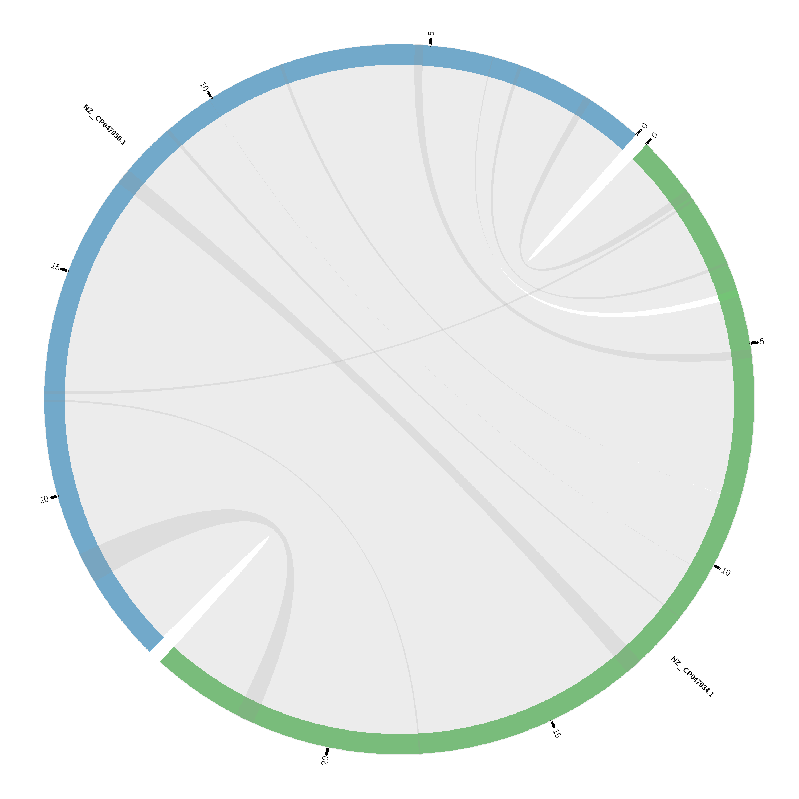
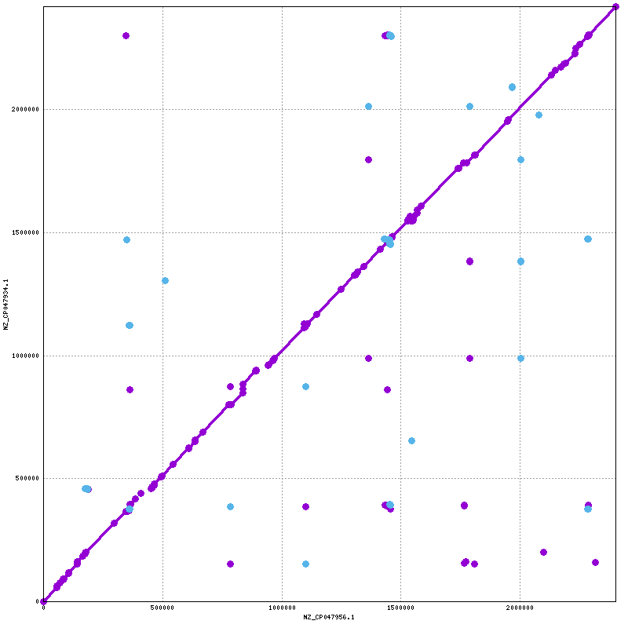
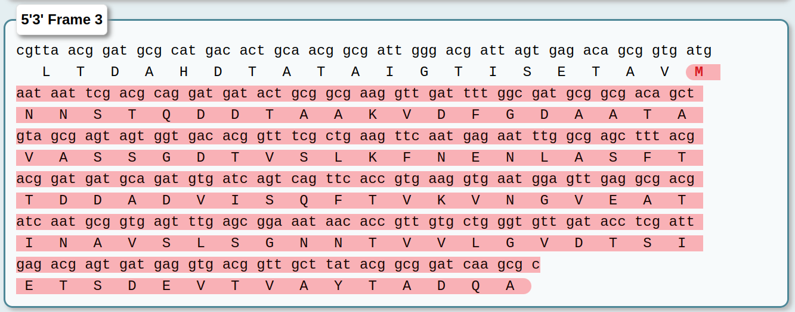
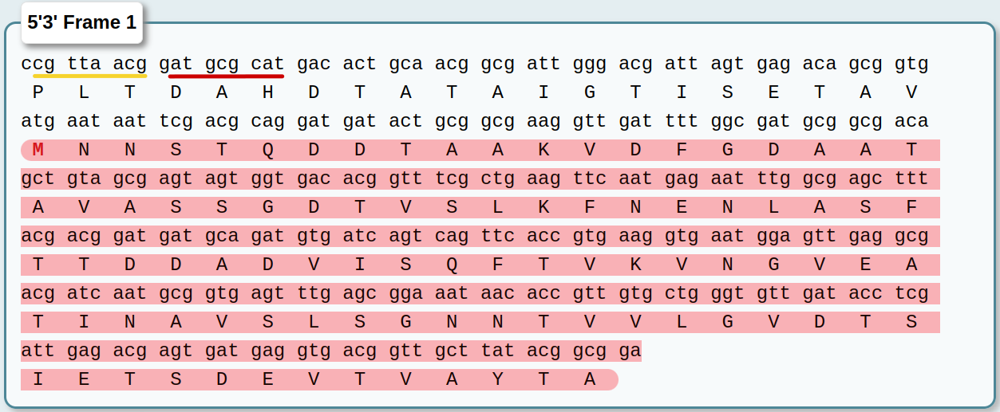

# Resultados

## Clado Calothrix

El clado calothrix contiene 6 especies  y es de interes ya que segun la filogenia estan estrechamente relacionadas y muestra un cambio en el palindromo mas abundante, pasando de **GCGATCGC** a **TGGCGCCA** (Figure \@ref(fig:FIG12)).
```{r FIG12, echo=FALSE, fig.cap="**Filogenia anotada del clado Calothrix.** En esta imagen se muestra un cambio abrupto en la Frecuencia observada de **GCGCATCGC** en las especies PCC\\_6303, NIES-3974 y 336-3.", out.width="100%", fig.align='center'}
knitr::include_graphics("Clados/Callothrix_clade/figures/Calothrix_Octanuc_FrecObs_sel32_filogenia_HIG.png")
```

### GCGATCGC

#### Red de transiciones

Para hacer mas visual la reconstrucción, construimos una red de las transiciones entre los estados ancestrales. Esto lo hicimos en r usando la función ```Create_Transition_Table()```:

```{r,eval=FALSE,message=FALSE,warning=FALSE,results='hide'}
source("ASR_Orth_Functions/NodeAndEdges.R")
Nodes.Edges <- Create_Transition_Table(SitesTable = "Clados/Callothrix_clade/PALINDROMES/GCGATCGC/336-3/Orthologues_Palindrome_sites.txt",
                                EvolutionModel = "F81",
                                Method = "bayes",
                                Phylogeny = "Clados/Callothrix_clade/SpeciesTree_rooted.txt",
                                OrthoPath = "Clados/Callothrix_clade/PALINDROMES/GCGATCGC/336-3/Only_ORTHOLOGUES/")

```

Posteriormente creamos la red usando la función ```Create_Network()```:

```{r,echo=FALSE,message=FALSE,warning=FALSE,results='hide'}
source("ASR_Orth_Functions/NodeAndEdges.R")
Transition_table <- read.table("Clados/Callothrix_clade/PALINDROMES/GCGATCGC/336-3/TRANSICIONES.txt", sep = "\t", header = TRUE )
Network <- Create_Network(Transitions = Transition_table)
```

y visualizamos dicha red .

```{r,echo=FALSE,message=FALSE,warning=FALSE,results='hide'}
nodes = Network[[1]]
edges = Network[[2]]

## Este es otro grafo de fuerzas con peso en sus vertices y te muestra las conceciones de cada nodo de manera mas visual
nodes_d3 <- mutate(nodes, id = id - 1)
edges_d3 <- mutate(edges, from = from - 1, to = to - 1)

FORCE <- networkD3::forceNetwork(Links = edges_d3, Nodes = nodes_d3,
                        Source = "from", Target = "to", 
                        NodeID = "label", Group = "id", Value = "weight", 
                        opacity = 1, fontSize = 16, zoom = TRUE)
```

Para visualizar la red usamos la paqueteria ```networkD3```. Hicimos 2 figuras, la (Figura \@ref(fig:FIG13)) muestra la red como una conexión de nodos a través de vertices con un grosor proporcional al numero de veces que ocurrió cada transición. En dicha red podemos ver algunos nodos con bordes muy gruesos como **GCAATTGC**, **GCAATCGC**, **GCAATAGC**, **GCGATTGC** (Tabla \@ref(tab:TAB6)).

```{r,echo=FALSE,message=FALSE,warning=FALSE,results='hide'}
routes_tidy <- tidygraph::tbl_graph(nodes = nodes,
                         edges = edges,
                         directed = TRUE)

routes_tidy %>% 
  tidygraph::activate(edges) %>% 
  tidygraph::arrange(desc(weight))

RED <- visNetwork::visNetwork(nodes, edges)

```

```{r FIG13, eval=knitr::is_html_output(), echo=FALSE,fig.align='center',fig.cap="**Red de todas las transiciones del clado Calothrix.** En esta imagen se muestra una red en la que cada nodo es un octanucleótido el cual esta unido a otro nodo por un vertice. Dicho vertice tiene un grosor proporcional al numero de veces que dicha transición ocurrió en la reconstrucción ancestral de sitios.",message=FALSE,warning=FALSE}
Sys.setenv("OPENSSL_CONF"="/dev/null")
#RED
FORCE
```

En la (Figura \@ref(fig:FIG14)) podemos ver las transiciones de una forma mas ordenada, con el numero de ocurrencias y la dirección en la que ocurrieron.
```{r FIG14, eval=knitr::is_html_output(), echo=FALSE, fig.align='center',fig.cap="**Red de todas las transiciones del clado Calothrix.** En esta imagen se muestra la red  de la Figura \\@ref(fig:FIG13) de una forma mas visual y con el numero de veces que ocurrio cada transición, asi como la dirección en la que ocurrió.",message=FALSE,warning=FALSE}
Sys.setenv("OPENSSL_CONF"="/dev/null")
## Este ultimo grafo muestra el grafo anterior pero de una forma mas analizable.
networkD3::sankeyNetwork(Links = edges_d3, Nodes = nodes_d3, Source = "from", Target = "to", 
                         NodeID = "label", Value = "weight", fontSize = 16, unit = "TIME(s)")
```

```{r TAB6,  eval=knitr::is_html_output(), echo=FALSE, message=FALSE,warning=FALSE}
library(kableExtra)
library(formattable)
Sys.setenv("OPENSSL_CONF"="/dev/null")
table.Transitions <- as.data.frame(edges)
table.nodes <- as.data.frame(nodes)
for (i in 1:length(table.nodes[,1])){
  table.Transitions$from[table.Transitions$from == table.nodes[i,1]] <- table.nodes[i,2]
  table.Transitions$to[table.Transitions$to == table.nodes[i,1]] <- table.nodes[i,2]
}
table.Transitions <- table.Transitions[order(table.Transitions$weight,decreasing=TRUE),]


row.names(table.Transitions ) <- NULL
table.Transitions$from = cell_spec(table.Transitions$from,
                                   color = ifelse(table.Transitions$from == 'GCGATCGC',"red",ifelse(table.Transitions$from == 'GCAATTGC',"blue","black")))
table.Transitions$to= cell_spec(table.Transitions$to,
                                   color = ifelse(table.Transitions$to == 'GCGATCGC',"red",ifelse(table.Transitions$to == 'GCAATTGC',"blue","black")))

table.Transitions$weight <- color_tile("white", "orange")(table.Transitions$weight)

kbl(table.Transitions, align = "l",caption = "Transiciones entre nodos.",longtable = TRUE,format = "html", escape = F) %>%
  kable_paper(full_width = T) %>%
  column_spec(1:2, bold = T) %>%
  collapse_rows(columns = 1:2, valign = "top")%>%
  kable_styling(c("striped", "condensed"), 
                latex_options = "striped", 
                full_width = F,
                fixed_thead = T,
                font_size = 11)

```

#### Transiciones entre Nodo 9 y Nodo 10
Para entender más como es que se gana o se pierden los sitios palindrómicos revisamos la transición en tre los nodos 9 y 10. Esto es porque es esta transicion de nodos la que separa a los dos subclados entre los que hay una repentino cambio de abundancia de sitios palindrómicos (Figura \@ref(fig:FIG15)).

```{r FIG15,echo=FALSE,fig.cap="**Filogenia del clado Calotrix**. En rojo y azul se muestran los subclados unidos (en verde) por la transición entre los nodos 9 y 10. "}
Tree = ggtree::read.tree("Clados/Callothrix_clade/SpeciesTree_rooted.txt")
tree2 <- ggtree::groupClade(Tree, c(7,10,11))
tree3 <- as.data.frame(tidytree::as_tibble(tree2))

tree3[4,5]<- 3

ggtree::ggtree(tidytree::as.treedata(tree3), ggplot2::aes(color=group),branch.length='none') + 
  ggplot2::theme(legend.position='none')+
  ggtree::scale_color_manual(values=c("red","green","steelblue"))+
  ggtree::geom_label(ggplot2::aes(label = node),show.legend = TRUE)+
    ggtree::geom_cladelab(node=1, label="336-3", align=TRUE, 
                        geom='label', fill='red')+
  ggtree::geom_cladelab(node=2, label="PCC_6303", align=TRUE, 
                        geom='label', fill='red')+
  ggtree::geom_cladelab(node=3, label="NIES-3974", align=TRUE, 
                        geom='label', fill='red',)+
    ggtree::geom_cladelab(node=4, label="PCC_7716", align=TRUE, 
                        geom='label', fill='steelblue')+
  ggtree::geom_cladelab(node=5, label="NIES-4071", align=TRUE, 
                        geom='label', fill='steelblue')+
  ggtree::geom_cladelab(node=6, label="NIES-4105", align=TRUE, 
                        geom='label', fill='steelblue')+
  ggplot2::expand_limits(x = 6) 

```

Para hacer esto filtramos los datos de la red para mostrar unicamente las transiciones que se dieron entre los nodos 9 y 10 e hicimos las mismas figuras.
En la (Figura \@ref(fig:FIG16)) se muestra la red como una conexión de nodos a través de vertices con un grosor proporcional al numero de veces que ocurrió cada transición. En la (Figura \@ref(fig:FIG17)) podemos ver las transiciones de una forma mas ordenada, con el numero de ocurrencias y la dirección en la que ocurrieron.

```{r, echo=FALSE,message=FALSE,warning=FALSE,results='hide'}
Directed_Transition_table <- read.table("Clados/Callothrix_clade/PALINDROMES/GCGATCGC/336-3/TRANSICIONES_DIRECCION.txt", sep = "\t", header = TRUE )
Directed_Network <- Create_Directed_Network(DirectedTransitions = Directed_Transition_table,
                                             Direction = "9--8",
                                             Weight = 30)
nodesL = Directed_Network[[1]]
edgesL = Directed_Network[[2]]

nodes_d3L <- mutate(nodesL, id = id - 1)
edges_d3L <- mutate(edgesL, from = from - 1, to = to - 1)
```

```{r FIG16, eval=knitr::is_html_output(), echo=FALSE,fig.align='center',fig.cap="**Red de las transiciones entre los Nodos 9 y 10 del clado Calothrix.** En esta imagen se muestra una red en la que cada nodo es un octanucleótido el cual esta unido a otro nodo por un vertice. Dicho vertice tiene un grosor proporcional al numero de veces que dicha transición ocurrió en la reconstrucción ancestral de sitios.",message=FALSE,warning=FALSE}
Sys.setenv("OPENSSL_CONF"="/dev/null")
networkD3::forceNetwork(Links = edges_d3L, Nodes = nodes_d3L,
                        Source = "from", Target = "to", 
                        NodeID = "label", Group = "id", Value = "weight", 
                        opacity = 1, fontSize = 16, zoom = TRUE)  
```

```{r FIG17, eval=knitr::is_html_output(), echo=FALSE, fig.align='center',fig.cap="**Red de las transiciones entre los nodos 9 y 10 del clado Calothrix.** En esta imagen se muestra la red  de la Figura \\@ref(fig:FIG16) de una forma mas visual y con el numero de veces que ocurrio cada transición, asi como la dirección en la que ocurrió.",message=FALSE,warning=FALSE}
## Este ultimo grafo muestra el grafo anterior pero de una forma mas analizable.
Sys.setenv("OPENSSL_CONF"="/dev/null")
networkD3::sankeyNetwork(Links = edges_d3L, Nodes = nodes_d3L, Source = "from", Target = "to", 
                         NodeID = "label", Value = "weight", fontSize = 16, unit = "TIME(s)")
```

#### Mutaciones en los codones

Para entender como es que se van ganando o perdiendo los sitios palindrómicos hicimos un análisis del tipo mutaciones de los sitios. Esto lo hicimos viendo en que marco de lectura se encontraba cada nodo y revisando la secuencia de aminoacidos que codificaban. En la (Figura \@ref(fig:FIG18)) mostramos 3 gráficos que indican la abundancia de los peptidos codificados por los sitios palindrómicos de acuerdo al marco de lectura en el que se encuentran.

```{r FIG18, echo=FALSE, fig.show="hold", out.width="50%",fig.align='center',fig.cap="**Abundancia de peptidos por cada nodo segun el marco de lectura.**.",message=FALSE,warning=FALSE,results='hide'}
File= "Clados/Callothrix_clade/PALINDROMES/GCGATCGC/336-3/Orthologues_Palindrome_sites.AllFrames.SECOND.txt"
table = read.table(File,header = TRUE,sep = "\t",row.names = NULL)
tableMA = table[ , c(2,5,8)]
tableMA = as.data.frame(tableMA)

tableM1<-tableMA%>%
  filter(ReadingFrame==1)
AACountsM1 <- data.table::setDT(tableM1)[,list(Counts=as.numeric(.N)),names(tableM1)]
AACountsM1 <- AACountsM1%>% 
  filter(Counts>=20)

tableM2<-tableMA%>%
  filter(ReadingFrame==2)
AACountsM2 <- data.table::setDT(tableM2)[,list(Counts=as.numeric(.N)),names(tableM2)]
AACountsM2 <- AACountsM2%>% 
  filter(Counts>=20)

tableM3<-tableMA%>%
  filter(ReadingFrame==3)
AACountsM3 <- data.table::setDT(tableM3)[,list(Counts=as.numeric(.N)),names(tableM3)]
AACountsM3 <- AACountsM3%>% 
  filter(Counts>=9)
#----------------------------------------------------------------------
ggplot2::ggplot(AACountsM1, ggplot2::aes(x = reorder(Spp, -Counts), y = Counts, fill = AA)) + 
  ggplot2::geom_bar(position="dodge",stat = "identity") +
  ggplot2::theme(axis.text.x = ggplot2::element_text(angle = 45, vjust = 1.0, hjust=1))+
  ggplot2::ggtitle("Marco de lectura 1") +
  ggplot2::xlab("Nodo") + ggplot2::ylab("Conteo") + ggplot2::labs(fill = "Peptido")+
  ggplot2::geom_text(ggplot2::aes(label = Counts, group = AA), position = ggplot2::position_dodge(0.9), vjust = -0.3, size = 2.0)

ggplot2::ggplot(AACountsM2, ggplot2::aes(x = reorder(Spp, -Counts), y = Counts, fill = AA)) + 
  ggplot2::geom_bar(position="dodge",stat = "identity") +
  ggplot2::theme(axis.text.x = ggplot2::element_text(angle = 45, vjust = 1.0, hjust=1))+
  ggplot2::ggtitle("Marco de lectura 2") +
  ggplot2::xlab("Nodo") + ggplot2::ylab("Conteo") + ggplot2::labs(fill = "Peptido")+
  ggplot2::geom_text(ggplot2::aes(label = Counts, group = AA), position = ggplot2::position_dodge(0.9), vjust = -0.3, size = 2.5)

ggplot2::ggplot(AACountsM3, ggplot2::aes(x = reorder(Spp, -Counts), y = Counts, fill = AA)) + 
  ggplot2::geom_bar(position="dodge",stat = "identity") +
  ggplot2::theme(axis.text.x = ggplot2::element_text(angle = 45, vjust = 1.0, hjust=1))+
  ggplot2::ggtitle("Marco de lectura 3") +
  ggplot2::xlab("Nodo") + ggplot2::ylab("Conteo") + ggplot2::labs(fill = "Peptido")+
  ggplot2::geom_text(ggplot2::aes(label = Counts, group = AA), position = ggplot2::position_dodge(0.9), vjust = -0.3, size = 3.0)
```

En la (Figura \@ref(fig:FIG19)) mostramos 3 gráficos que indican la abundancia del tipo de mutaciones que hay en cada nodo de acuerdo al marco de lectura. Lo sitios de mutaciones mostrados pueden ser de los siguientes tipos:

* Conservative (la secuencia de AA cambió pero tiene similitud de acuerdo al score de BLOSUM62)
* ConservativeNoSiteMut (la secuencia de AA cambió pero tiene similitud de acuerdo al score de BLOSUM62. Sin embargo, el sitio no sufrió mutaciones)
* Deletion (La secuencia de AA tiene sufrio 1 o mas deleciones)
* NoMutation (La secuencia de AA no sufrio mutaciones)
* NoSynonym (La secuencia de AA cambió)
* NoSynonymNoSiteMut (La secuencia de AA cambió. Sin embargo, el sitio no sufrió mutaciones.)
* Synonym (El sitio sufrió mutaciones. Sin embargo, la secuencia de AA no cambió.)

```{r FIG19, echo=FALSE, fig.show="hold", out.width="50%",fig.align='center',fig.cap="**Abundancia del tipo de sustitución por cada nodo segun el marco de lectura.**.",message=FALSE,warning=FALSE,results='hide'}
FileRF1 = "Clados/Callothrix_clade/PALINDROMES/GCGATCGC/336-3/codon_mutations_RF1.rooted.txt"
tableRF1 = read.table(FileRF1,header = TRUE,sep = "\t",row.names = NULL)
##Extraigo unicamente la columna de especie (Spp) y SType:
tableM1.SType = tableRF1[ , c(2,20)]
##Cuento los tipos de sustitución para cada Nodo:
tableM1.SType <- data.table::setDT(tableM1.SType)[,list(Counts=as.numeric(.N)),names(tableM1.SType)]

FileRF2 = "Clados/Callothrix_clade/PALINDROMES/GCGATCGC/336-3/codon_mutations_RF2.rooted.txt"
tableRF2 = read.table(FileRF2,header = TRUE,sep = "\t",row.names = NULL)
tableM2.SType = tableRF2[ , c(2,20)]
tableM2.SType <- data.table::setDT(tableM2.SType)[,list(Counts=as.numeric(.N)),names(tableM2.SType)]

FileRF3 = "Clados/Callothrix_clade/PALINDROMES/GCGATCGC/336-3/codon_mutations_RF3.rooted.txt"
tableRF3 = read.table(FileRF3,header = TRUE,sep = "\t",row.names = NULL)
tableM3.SType = tableRF3[ , c(2,22)]
tableM3.SType <- data.table::setDT(tableM3.SType)[,list(Counts=as.numeric(.N)),names(tableM3.SType)]

ggplot2::ggplot(tableM1.SType, ggplot2::aes(x = reorder(Spp, -Counts), y = Counts, fill = SType)) + 
  ggplot2::geom_bar(position="dodge",stat = "identity") +
  ggplot2::theme(axis.text.x = ggplot2::element_text(angle = 45, vjust = 1.0, hjust=1))+
  ggplot2::ggtitle("Marco de lectura 1") +
  ggplot2::xlab("Nodo") + ggplot2::ylab("Conteo") + ggplot2::labs(fill = "Substitution Type")+
  ggplot2::geom_text(ggplot2::aes(label = Counts, group = SType), position = ggplot2::position_dodge(0.9), vjust = -0.3, size = 3.5)

ggplot2::ggplot(tableM2.SType, ggplot2::aes(x = reorder(Spp, -Counts), y = Counts, fill = SType)) + 
  ggplot2::geom_bar(position="dodge",stat = "identity") +
  ggplot2::theme(axis.text.x = ggplot2::element_text(angle = 45, vjust = 1.0, hjust=1))+
  ggplot2::ggtitle("Marco de lectura 2") +
  ggplot2::xlab("Nodo") + ggplot2::ylab("Conteo") + ggplot2::labs(fill = "Substitution Type")+
  ggplot2::geom_text(ggplot2::aes(label = Counts, group = SType), position = ggplot2::position_dodge(0.9), vjust = -0.3, size = 3.5)

ggplot2::ggplot(tableM3.SType, ggplot2::aes(x = reorder(Spp, -Counts), y = Counts, fill = SType)) + 
  ggplot2::geom_bar(position="dodge",stat = "identity") +
  ggplot2::theme(axis.text.x = ggplot2::element_text(angle = 45, vjust = 1.0, hjust=1))+
  ggplot2::ggtitle("Marco de lectura 3") +
  ggplot2::xlab("Nodo") + ggplot2::ylab("Conteo") + ggplot2::labs(fill = "Substitution Type")+
  ggplot2::geom_text(ggplot2::aes(label = Counts, group = SType), position = ggplot2::position_dodge(0.9), vjust = -0.3, size = 3.5)

```

#### Análisis de sitios en los cuales su ancestro era HIP1

Para tratar de entender como es que los sitios HIP1 se pierden hicimos un análisis unicamente en en las transiciones en las que el nodo ancestral tenia un sitio HIP1.

En la (Figura \@ref(fig:FIG20)) mostramos 3 gráficos que indican la frecuencia del tipo de sustituciones que hubo para estos casos para cada nodo en cada uno de los marcos de lectura.

En la (Figura \@ref(fig:FIG21)) mostramos 3 gráficos (uno por cada marco de lectura) que indican la frecuencia de las mutaciones en cada uno de los 8 nucleótidos del sitio HIP.

En la (Figura \@ref(fig:FIG22)) mostramos 3 gráficos (uno por cada marco de lectura) que indican la frecuencia del tipo sustitucion de bases.

```{r FIG20, echo=FALSE, fig.show="hold", out.width="50%",fig.align='center',fig.cap="**Abundancia del tipo de sustitución por cada nodo segun el marco de lectura. Unicamente para transiciones en los que el nodo ancestral era un sitio HIP1.**",message=FALSE,warning=FALSE,results='hide'}
##Cargo la tabla
FileRF1 = "Clados/Callothrix_clade/PALINDROMES/GCGATCGC/336-3/codon_mutations_RF1.rooted.txt"
tableRF1 = read.table(FileRF1,header = TRUE,sep = "\t",row.names = NULL)
##Filtro dejando solo aquellos casos en los que HIP fue el palíndromo parental
tableRF1<-tableRF1%>%
  filter(AncestorType=='SITE')
tableM1.SType = tableRF1[ , c(2,20)]
tableM1.SType <- data.table::setDT(tableM1.SType)[,list(Counts=as.numeric(.N)),names(tableM1.SType)]

FileRF2 = "Clados/Callothrix_clade/PALINDROMES/GCGATCGC/336-3/codon_mutations_RF2.rooted.txt"
tableRF2 = read.table(FileRF2,header = TRUE,sep = "\t",row.names = NULL)
tableRF2<-tableRF2%>%
  filter(AncestorType=='SITE')
tableM2.SType = tableRF2[ , c(2,20)]
tableM2.SType <- data.table::setDT(tableM2.SType)[,list(Counts=as.numeric(.N)),names(tableM2.SType)]

FileRF3 = "Clados/Callothrix_clade/PALINDROMES/GCGATCGC/336-3/codon_mutations_RF3.rooted.txt"
tableRF3 = read.table(FileRF3,header = TRUE,sep = "\t",row.names = NULL)
tableRF3<-tableRF3%>%
  filter(AncestorType=='SITE')
tableM3.SType = tableRF3[ , c(2,22)]
tableM3.SType <- data.table::setDT(tableM3.SType)[,list(Counts=as.numeric(.N)),names(tableM3.SType)]

ggplot2::ggplot(tableM1.SType, ggplot2::aes(x = reorder(Spp, -Counts), y = Counts, fill = SType)) + 
  ggplot2::geom_bar(position="dodge",stat = "identity") +
  ggplot2::theme(axis.text.x = ggplot2::element_text(angle = 45, vjust = 1.0, hjust=1))+
  ggplot2::ggtitle("Marco de lectura 1 - Nodos con HIP en el nodo parental") +
  ggplot2::xlab("Nodo") + ggplot2::ylab("Conteo") + ggplot2::labs(fill = "Substitution Type")+
  ggplot2::geom_text(ggplot2::aes(label = Counts, group = SType), position = ggplot2::position_dodge(0.9), vjust = -0.3, size = 3.5)

ggplot2::ggplot(tableM2.SType, ggplot2::aes(x = reorder(Spp, -Counts), y = Counts, fill = SType)) + 
  ggplot2::geom_bar(position="dodge",stat = "identity") +
  ggplot2::theme(axis.text.x = ggplot2::element_text(angle = 45, vjust = 1.0, hjust=1))+
  ggplot2::ggtitle("Marco de lectura 2 - Nodos con HIP en el nodo parental") +
  ggplot2::xlab("Nodo") + ggplot2::ylab("Conteo") + ggplot2::labs(fill = "Substitution Type")+
  ggplot2::geom_text(ggplot2::aes(label = Counts, group = SType), position = ggplot2::position_dodge(0.9), vjust = -0.3, size = 3.5)

ggplot2::ggplot(tableM3.SType, ggplot2::aes(x = reorder(Spp, -Counts), y = Counts, fill = SType)) + 
  ggplot2::geom_bar(position="dodge",stat = "identity") +
  ggplot2::theme(axis.text.x = ggplot2::element_text(angle = 45, vjust = 1.0, hjust=1))+
  ggplot2::ggtitle("Marco de lectura 3 - Nodos con HIP en el nodo parental") +
  ggplot2::xlab("Nodo") + ggplot2::ylab("Conteo") + ggplot2::labs(fill = "Substitution Type")+
  ggplot2::geom_text(ggplot2::aes(label = Counts, group = SType), position = ggplot2::position_dodge(0.9), vjust = -0.3, size = 3.5)
```

```{r FIG21, echo=FALSE, fig.show="hold", out.width="50%",fig.align='center',fig.cap="**Frecuencia de las mutaciones de cada nucleótido del sitio HIP para cada nodo segun el marco de lectura.**.",message=FALSE,warning=FALSE,results='hide'}
##Quito los casos que tengan deleciones
tableRF1<-tableRF1%>%
  filter(SType!='Deletion')
##Extraigo los nombres de los nodos
Spps <-unique(tableRF1[ , c(2)])
##Creo otra tabla a partir de las columnas con las mutaciones por sitio (columnas 24 a 31)
HIPmut <- tableRF1[ , c(2,25,26,27,28,29,30,31,32)]

##Creo una tabla con número de mutaciones en cada nucleotido para cada nodo.
## Creo un nuevo dataframe vacío
df = c()
## Para cada nodo hago la suma de las mutaciones  para cada posicion del octanucleótido y lo agrego al nuevo dataframe
for (i in 1:length(Spps)){
  spp <- Spps[i] # Especie en cuestión
  HIPmut.spp <- HIPmut%>%
    filter(Spp==spp) # Filtro la especie en cuestion de la nueva tabla
  for (j in 1:8){
    # Este nuevo vector "comprime" las mutaciones por sitio de cada nodo en un solo renglón haciendo una suma de todos los renglones
    Node.spp <- summarise(HIPmut.spp,Nodo=unique(spp),NucPos=paste0('Nuc',j),Count=sum(HIPmut.spp[j+1]))
    # Agrego este nuevo renglon al nuevo dataframe
    df <- rbind(df, Node.spp)
  }
}

tableRF2<-tableRF2%>%
  filter(SType!='Deletion')
Spps <-unique(tableRF2[ , c(2)])
## HIP per site mutations
HIPmutB <- tableRF2[ , c(2,25,26,27,28,29,30,31,32)]
dfB = c()
for (i in 1:length(Spps)){
  spp <- Spps[i] # Especie en cuestión
  HIPmutB.spp <- HIPmutB%>%
    filter(Spp==spp) # Filtro la especie en cuestion de la nueva tabla
  for (j in 1:8){
    # Este nuevo vector "comprime" las mutaciones por sitio de cada nodo en un solo renglón haciendo una suma de todos los renglones
    Node.spp <- summarise(HIPmutB.spp,Nodo=unique(spp),NucPos=paste0('Nuc',j),Count=sum(HIPmutB.spp[j+1]))
    # Agrego este nuevo renglon al nuevo dataframe
    dfB <- rbind(dfB, Node.spp)
  }
}

tableRF3<-tableRF3%>%
  filter(SType!='Deletion')
Spps <-unique(tableRF3[ , c(2)])
## HIP per site mutations
HIPmutC <- tableRF3[ , c(2,27,28,29,30,31,32,33,34)]
dfC = c()
for (i in 1:length(Spps)){
  spp <- Spps[i] # Especie en cuestión
  HIPmutC.spp <- HIPmutC%>%
    filter(Spp==spp) # Filtro la especie en cuestion de la nueva tabla
  for (j in 1:8){
    # Este nuevo vector "comprime" las mutaciones por sitio de cada nodo en un solo renglón haciendo una suma de todos los renglones
    Node.spp <- summarise(HIPmutC.spp,Nodo=unique(spp),NucPos=paste0('Nuc',j),Count=sum(HIPmutC.spp[j+1]))
    # Agrego este nuevo renglon al nuevo dataframe
    dfC <- rbind(dfC, Node.spp)
  }
}

ggplot2::ggplot(df, ggplot2::aes(x = reorder(Nodo, -Count), y = Count, fill = NucPos)) + 
  ggplot2::geom_bar(position="dodge",stat = "identity") +
  ggplot2::theme(axis.text.x = ggplot2::element_text(angle = 45, vjust = 1.0, hjust=1))+
  ggplot2::scale_fill_brewer(palette="Set2")+
  ggplot2::ggtitle("Marco de lectura 1 - Nodos con HIP en el nodo parental - Mutaciones por nucleotido") +
  ggplot2::xlab("Nodo") + ggplot2::ylab("Conteo") + ggplot2::labs(fill = "Substitution Position")+
  ggplot2::geom_text(ggplot2::aes(label = Count, group = NucPos), position = ggplot2::position_dodge(0.9), vjust = -0.3, size = 3.5)

ggplot2::ggplot(dfB, ggplot2::aes(x = reorder(Nodo, -Count), y = Count, fill = NucPos)) + 
  ggplot2::geom_bar(position="dodge",stat = "identity") +
  ggplot2::theme(axis.text.x = ggplot2::element_text(angle = 45, vjust = 1.0, hjust=1))+
  ggplot2::scale_fill_brewer(palette="Set2")+
  ggplot2::ggtitle("Marco de lectura 2 - Nodos con HIP en el nodo parental - Mutaciones por nucleotido") +
  ggplot2::xlab("Nodo") + ggplot2::ylab("Conteo") + ggplot2::labs(fill = "Substitution Position")+
  ggplot2::geom_text(ggplot2::aes(label = Count, group = NucPos), position = ggplot2::position_dodge(0.9), vjust = -0.3, size = 3.5)

ggplot2::ggplot(tableM3.SType, ggplot2::aes(x = reorder(Spp, -Counts), y = Counts, fill = SType)) + 
  ggplot2::geom_bar(position="dodge",stat = "identity") +
  ggplot2::theme(axis.text.x = ggplot2::element_text(angle = 45, vjust = 1.0, hjust=1))+
  ggplot2::scale_fill_brewer(palette="Set2")+
  ggplot2::ggtitle("Marco de lectura 3 - Nodos con HIP en el nodo parental") +
  ggplot2::xlab("Nodo") + ggplot2::ylab("Conteo") + ggplot2::labs(fill = "Substitution Type")+
  ggplot2::geom_text(ggplot2::aes(label = Counts, group = SType), position = ggplot2::position_dodge(0.9), vjust = -0.3, size = 3.5)
```

```{r FIG22, echo=FALSE, fig.show="hold", out.width="50%",fig.align='center',fig.cap="**Frecuencia del tipo de sustituciónes de base en los sitios HIP para cada marco de lectura**.",message=FALSE,warning=FALSE,results='hide'}
TR <- tableRF1[ , c(2,33,34,35,36,37,38,39,40)]
df2 = c()
for (i in 1:length(Spps)){
  spp <- Spps[i]
  TR.spp <- TR%>%
    filter(Spp==spp)
  for (j in 1:length(TR.spp[,1])){
    for (k in 1:8){
      vector <- c(TR.spp[j,1],TR.spp[j,k+1])
      df2 <- rbind(df2, vector)
    }
  }
}
df2<- as.data.frame(df2)
df2.SMType <- data.table::setDT(df2)[,list(Counts=as.numeric(.N)),names(df2)]
colnames(df2.SMType) <- c("Nodo","SMType","Counts")

## HIP per mutation Type
TRB <- tableRF2[ , c(2,33,34,35,36,37,38,39,40)]
df2B = c()
for (i in 1:length(Spps)){
  spp <- Spps[i]
  TRB.spp <- TRB%>%
    filter(Spp==spp)
  for (j in 1:length(TRB.spp[,1])){
    for (k in 1:8){
      vector <- c(TRB.spp[j,1],TRB.spp[j,k+1])
      df2B <- rbind(df2B, vector)
    }
  }
}
df2B<- as.data.frame(df2B)
df2B.SMType <- data.table::setDT(df2B)[,list(Counts=as.numeric(.N)),names(df2B)]
colnames(df2B.SMType) <- c("Nodo","SMType","Counts")

## HIP per mutation Type
TRC <- tableRF3[ , c(2,35,36,37,38,39,40,41,42)]
df2C = c()
for (i in 1:length(Spps)){
  spp <- Spps[i]
  TRC.spp <- TRC%>%
    filter(Spp==spp)
  for (j in 1:length(TRC.spp[,1])){
    for (k in 1:8){
      vector <- c(TRC.spp[j,1],TRC.spp[j,k+1])
      df2C <- rbind(df2C, vector)
    }
  }
}
df2C<- as.data.frame(df2C)
df2C.SMType <- data.table::setDT(df2C)[,list(Counts=as.numeric(.N)),names(df2C)]
colnames(df2C.SMType) <- c("Nodo","SMType","Counts")

ggplot2::ggplot(df2.SMType, ggplot2::aes(x = reorder(Nodo, -Counts), y = Counts, fill = SMType)) + 
  ggplot2::geom_bar(position="dodge",stat = "identity") +
  ggplot2::theme(axis.text.x = ggplot2::element_text(angle = 45, vjust = 1.0, hjust=1))+
  ggplot2::scale_fill_brewer(palette="Set3")+
  ggplot2::ggtitle("Marco de lectura 1 - Nodos con HIP en el nodo parental - Tipo de sustituciones por nucleotido") +
  ggplot2::xlab("Nodo") + ggplot2::ylab("Conteo") + ggplot2::labs(fill = "Substitution Type")+
  ggplot2::geom_text(ggplot2::aes(label = Counts, group = SMType), position = ggplot2::position_dodge(0.9), vjust = -0.3, size = 3.5)

ggplot2::ggplot(df2B.SMType, ggplot2::aes(x = reorder(Nodo, -Counts), y = Counts, fill = SMType)) + 
  ggplot2::geom_bar(position="dodge",stat = "identity") +
  ggplot2::theme(axis.text.x = ggplot2::element_text(angle = 45, vjust = 1.0, hjust=1))+
  ggplot2::scale_fill_brewer(palette="Set3")+
  ggplot2::ggtitle("Marco de lectura 2 - Nodos con HIP en el nodo parental - Tipo de transiciones por nucleotido") +
  ggplot2::xlab("Nodo") + ggplot2::ylab("Conteo") + ggplot2::labs(fill = "Substitution Type")+
  ggplot2::geom_text(ggplot2::aes(label = Counts, group = SMType), position = ggplot2::position_dodge(0.9), vjust = -0.3, size = 3.5)

ggplot2::ggplot(df2C.SMType, ggplot2::aes(x = reorder(Nodo, -Counts), y = Counts, fill = SMType)) + 
  ggplot2::geom_bar(position="dodge",stat = "identity") +
  ggplot2::theme(axis.text.x = ggplot2::element_text(angle = 45, vjust = 1.0, hjust=1))+
  ggplot2::scale_fill_brewer(palette="Set3")+
  ggplot2::ggtitle("Marco de lectura 3 - Nodos con HIP en el nodo parental - Tipo de transiciones por nucleotido") +
  ggplot2::xlab("Nodo") + ggplot2::ylab("Conteo") + ggplot2::labs(fill = "Substitution Type")+
  ggplot2::geom_text(ggplot2::aes(label = Counts, group = SMType), position = ggplot2::position_dodge(0.9), vjust = -0.3, size = 3.5)
```

#### Análisis de sitios en los cuales solo el nodo actual tiene HIP1

Para tratar de entender como es que los sitios HIP se ganan, hicimos un analisis unicamente en las transiciones en las que el nodo actual tenia un sitio HIP1. 

En la Figura \@ref(fig:FIG23) mostramos 3 gráficos (uno por cada marco de lectura) que indican la frecuencia del tipo de sustituciones que hubo para estos casos para cada nodo en cada uno de los marcos de lectura.

```{r FIG23, echo=FALSE, fig.show="hold", out.width="50%",fig.align='center',fig.cap="**Abundancia del tipo de sustitución por cada nodo segun el marco de lectura. Unicamente para transiciones en los que el nodo actual era un sitio HIP1.**.",message=FALSE,warning=FALSE,results='hide'}
## Filtro dejando solo aquellos casos en los que HIP fue el palíndromo parental
tableRF1 = read.table(FileRF1,header = TRUE,sep = "\t",row.names = NULL)
tableRF1<-tableRF1%>%
  filter(ActualType=='SITE')
tableRF1<-tableRF1%>%
  filter(AncestorType=='NoSITE')
tableRF1<-tableRF1%>%
  filter(SType!='Deletion')
tableM1.SType = tableRF1[ , c(2,20)]
tableM1.SType <- data.table::setDT(tableM1.SType)[,list(Counts=as.numeric(.N)),names(tableM1.SType)]

## Filtro dejando solo aquellos casos en los que HIP fue el palíndromo parental
tableRF2 = read.table(FileRF2,header = TRUE,sep = "\t",row.names = NULL)
tableRF2<-tableRF2%>%
  filter(ActualType=='SITE')
tableRF2<-tableRF2%>%
  filter(AncestorType=='NoSITE')
tableRF2<-tableRF2%>%
  filter(SType!='Deletion')
tableM2.SType = tableRF2[ , c(2,20)]
tableM2.SType <- data.table::setDT(tableM2.SType)[,list(Counts=as.numeric(.N)),names(tableM2.SType)]

## Filtro dejando solo aquellos casos en los que HIP fue el palíndromo parental
tableRF3 = read.table(FileRF3,header = TRUE,sep = "\t",row.names = NULL)
tableRF3<-tableRF3%>%
  filter(ActualType=='SITE')
tableRF3<-tableRF3%>%
  filter(AncestorType=='NoSITE')
tableRF3<-tableRF3%>%
  filter(SType!='Deletion')
tableM3.SType = tableRF3[ , c(2,22)]
tableM3.SType <- data.table::setDT(tableM3.SType)[,list(Counts=as.numeric(.N)),names(tableM3.SType)]

ggplot2::ggplot(tableM1.SType, ggplot2::aes(x = reorder(Spp, -Counts), y = Counts, fill = SType)) + 
  ggplot2::geom_bar(position="dodge",stat = "identity") +
  ggplot2::theme(axis.text.x = ggplot2::element_text(angle = 45, vjust = 1.0, hjust=1))+
  ggplot2::ggtitle("Marco de lectura 1 - HIP Solo en el nodo actual y no en el parental.") +
  ggplot2::xlab("Nodo") + ggplot2::ylab("Conteo") + ggplot2::labs(fill = "Substitution Type")+
  ggplot2::geom_text(ggplot2::aes(label = Counts, group = SType), position = ggplot2::position_dodge(0.9), vjust = -0.3, size = 3.5)

ggplot2::ggplot(tableM2.SType, ggplot2::aes(x = reorder(Spp, -Counts), y = Counts, fill = SType)) + 
  ggplot2::geom_bar(position="dodge",stat = "identity") +
  ggplot2::theme(axis.text.x = ggplot2::element_text(angle = 45, vjust = 1.0, hjust=1))+
  ggplot2::ggtitle("Marco de lectura 2 - HIP Solo en el nodo actual y no en el parental.") +
  ggplot2::xlab("Nodo") + ggplot2::ylab("Conteo") + ggplot2::labs(fill = "Substitution Type")+
  ggplot2::geom_text(ggplot2::aes(label = Counts, group = SType), position = ggplot2::position_dodge(0.9), vjust = -0.3, size = 3.5)

ggplot2::ggplot(tableM3.SType, ggplot2::aes(x = reorder(Spp, -Counts), y = Counts, fill = SType)) + 
  ggplot2::geom_bar(position="dodge",stat = "identity") +
  ggplot2::theme(axis.text.x = ggplot2::element_text(angle = 45, vjust = 1.0, hjust=1))+
  ggplot2::ggtitle("Marco de lectura 3 - HIP Solo en el nodo actual y no en el parental.") +
  ggplot2::xlab("Nodo") + ggplot2::ylab("Conteo") + ggplot2::labs(fill = "Substitution Type")+
  ggplot2::geom_text(ggplot2::aes(label = Counts, group = SType), position = ggplot2::position_dodge(0.9), vjust = -0.3, size = 3.5)
```


### TGGCGCCA

#### Red de transiciones

Para hacer mas visual la reconstrucción, construimos una red de las transiciones entre los estados ancestrales. Esto lo hicimos en r usando la función ```Create_Transition_Table()```:

```{r,eval=FALSE,message=FALSE,warning=FALSE,results='hide'}
source("ASR_Orth_Functions/NodeAndEdges.R")
Nodes.Edges <- Create_Transition_Table(SitesTable = "Clados/Callothrix_clade/PALINDROMES/TGGCGCCA/PCC_7716/Orthologues_Palindrome_sites.txt",
                                EvolutionModel = "F81",
                                Method = "bayes",
                                Phylogeny = "Clados/Callothrix_clade/SpeciesTree_rooted.txt",
                                OrthoPath = "Clados/Callothrix_clade/PALINDROMES/TGGCGCCA/PCC_7716/Only_ORTHOLOGUES/")

```

Posteriormente creamos la red usando la función ```Create_Network()```:

```{r,echo=FALSE,message=FALSE,warning=FALSE,results='hide'}
source("ASR_Orth_Functions/NodeAndEdges.R")
Transition_table <- read.table("Clados/Callothrix_clade/PALINDROMES/TGGCGCCA/PCC_7716/TRANSICIONES.txt", sep = "\t", header = TRUE )
Network <- Create_Network(Transitions = Transition_table)
```

y visualizamos dicha red .

```{r,echo=FALSE,message=FALSE,warning=FALSE,results='hide'}
nodes = Network[[1]]
edges = Network[[2]]

## Este es otro grafo de fuerzas con peso en sus vertices y te muestra las conceciones de cada nodo de manera mas visual
nodes_d3 <- mutate(nodes, id = id - 1)
edges_d3 <- mutate(edges, from = from - 1, to = to - 1)

FORCE <- networkD3::forceNetwork(Links = edges_d3, Nodes = nodes_d3,
                        Source = "from", Target = "to", 
                        NodeID = "label", Group = "id", Value = "weight", 
                        opacity = 1, fontSize = 16, zoom = TRUE)
```

Para visualizar la red usamos la paqueteria ```networkD3```. Hicimos 2 figuras, la (Figura \@ref(fig:FIG24)) muestra la red como una conexión de nodos a través de vertices con un grosor proporcional al numero de veces que ocurrió cada transición. En dicha red podemos ver algunos nodos con bordes muy gruesos como **GCAATTGC**, **GCAATCGC**, **GCAATAGC**, **GCGATTGC** (Tabla \@ref(tab:TAB62)).

```{r,echo=FALSE,message=FALSE,warning=FALSE,results='hide'}
routes_tidy <- tidygraph::tbl_graph(nodes = nodes,
                         edges = edges,
                         directed = TRUE)

routes_tidy %>% 
  tidygraph::activate(edges) %>% 
  tidygraph::arrange(desc(weight))

RED <- visNetwork::visNetwork(nodes, edges)

```

```{r FIG24, eval=knitr::is_html_output(), echo=FALSE,fig.align='center',fig.cap="**Red de todas las transiciones del clado Calothrix.** En esta imagen se muestra una red en la que cada nodo es un octanucleótido el cual esta unido a otro nodo por un vertice. Dicho vertice tiene un grosor proporcional al numero de veces que dicha transición ocurrió en la reconstrucción ancestral de sitios.",message=FALSE,warning=FALSE}
Sys.setenv("OPENSSL_CONF"="/dev/null")
#RED
FORCE
```

En la (Figura \@ref(fig:FIG25)) podemos ver las transiciones de una forma mas ordenada, con el numero de ocurrencias y la dirección en la que ocurrieron.
```{r FIG25, eval=knitr::is_html_output(), echo=FALSE, fig.align='center',fig.cap="**Red de todas las transiciones del clado Calothrix.** En esta imagen se muestra la red  de la Figura \\@ref(fig:FIG24) de una forma mas visual y con el numero de veces que ocurrio cada transición, asi como la dirección en la que ocurrió.",message=FALSE,warning=FALSE}
Sys.setenv("OPENSSL_CONF"="/dev/null")
## Este ultimo grafo muestra el grafo anterior pero de una forma mas analizable.
networkD3::sankeyNetwork(Links = edges_d3, Nodes = nodes_d3, Source = "from", Target = "to", 
                         NodeID = "label", Value = "weight", fontSize = 16, unit = "TIME(s)")
```

```{r TAB62,  eval=knitr::is_html_output(), echo=FALSE, message=FALSE,warning=FALSE}
library(kableExtra)
library(formattable)
Sys.setenv("OPENSSL_CONF"="/dev/null")
table.Transitions <- as.data.frame(edges)
table.nodes <- as.data.frame(nodes)
for (i in 1:length(table.nodes[,1])){
  table.Transitions$from[table.Transitions$from == table.nodes[i,1]] <- table.nodes[i,2]
  table.Transitions$to[table.Transitions$to == table.nodes[i,1]] <- table.nodes[i,2]
}
table.Transitions <- table.Transitions[order(table.Transitions$weight,decreasing=TRUE),]


row.names(table.Transitions ) <- NULL
table.Transitions$from = cell_spec(table.Transitions$from,
                                   color = ifelse(table.Transitions$from == 'TGGCGCCA',"red",ifelse(table.Transitions$from == 'GCAATTGC',"blue","black")))
table.Transitions$to= cell_spec(table.Transitions$to,
                                   color = ifelse(table.Transitions$to == 'TGGCGCCA',"red",ifelse(table.Transitions$to == 'GCAATTGC',"blue","black")))

table.Transitions$weight <- color_tile("white", "orange")(table.Transitions$weight)

kbl(table.Transitions, align = "l",caption = "Transiciones entre nodos.",longtable = TRUE,format = "html", escape = F) %>%
  kable_paper(full_width = T) %>%
  column_spec(1:2, bold = T) %>%
  collapse_rows(columns = 1:2, valign = "top")%>%
  kable_styling(c("striped", "condensed"), 
                latex_options = "striped", 
                full_width = F,
                fixed_thead = T,
                font_size = 11)

```

#### Transiciones entre Nodo 9 y Nodo 10
Para entender más como es que se gana o se pierden los sitios palindrómicos revisamos la transición en tre los nodos 9 y 10. Esto es porque es esta transicion de nodos la que separa a los dos subclados entre los que hay una repentino cambio de abundancia de sitios palindrómicos (Figura \@ref(fig:FIG15)).


Para hacer esto filtramos los datos de la red para mostrar unicamente las transiciones que se dieron entre los nodos 9 y 10 e hicimos las mismas figuras.
En la (Figura \@ref(fig:FIG26)) se muestra la red como una conexión de nodos a través de vertices con un grosor proporcional al numero de veces que ocurrió cada transición. En la (Figura \@ref(fig:FIG27)) podemos ver las transiciones de una forma mas ordenada, con el numero de ocurrencias y la dirección en la que ocurrieron.

```{r, echo=FALSE,message=FALSE,warning=FALSE,results='hide'}
Directed_Transition_table <- read.table("Clados/Callothrix_clade/PALINDROMES/TGGCGCCA/PCC_7716/TRANSICIONES_DIRECCION.txt", sep = "\t", header = TRUE )
Directed_Network <- Create_Directed_Network(DirectedTransitions = Directed_Transition_table,
                                             Direction = "9--8",
                                             Weight = 28)
nodesL = Directed_Network[[1]]
edgesL = Directed_Network[[2]]

nodes_d3L <- mutate(nodesL, id = id - 1)
edges_d3L <- mutate(edgesL, from = from - 1, to = to - 1)
```

```{r FIG26, eval=knitr::is_html_output(), echo=FALSE,fig.align='center',fig.cap="**Red de las transiciones entre los Nodos 9 y 10 del clado Calothrix.** En esta imagen se muestra una red en la que cada nodo es un octanucleótido el cual esta unido a otro nodo por un vertice. Dicho vertice tiene un grosor proporcional al numero de veces que dicha transición ocurrió en la reconstrucción ancestral de sitios.",message=FALSE,warning=FALSE}
Sys.setenv("OPENSSL_CONF"="/dev/null")
networkD3::forceNetwork(Links = edges_d3L, Nodes = nodes_d3L,
                        Source = "from", Target = "to", 
                        NodeID = "label", Group = "id", Value = "weight", 
                        opacity = 1, fontSize = 16, zoom = TRUE)  
```

```{r FIG27, eval=knitr::is_html_output(), echo=FALSE, fig.align='center',fig.cap="**Red de las transiciones entre los nodos 9 y 10 del clado Calothrix.** En esta imagen se muestra la red  de la Figura \\@ref(fig:FIG26) de una forma mas visual y con el numero de veces que ocurrio cada transición, asi como la dirección en la que ocurrió.",message=FALSE,warning=FALSE}
## Este ultimo grafo muestra el grafo anterior pero de una forma mas analizable.
Sys.setenv("OPENSSL_CONF"="/dev/null")
networkD3::sankeyNetwork(Links = edges_d3L, Nodes = nodes_d3L, Source = "from", Target = "to", 
                         NodeID = "label", Value = "weight", fontSize = 16, unit = "TIME(s)")
```

#### Mutaciones en los codones

Para entender como es que se van ganando o perdiendo los sitios palindrómicos hicimos un análisis del tipo mutaciones de los sitios. Esto lo hicimos viendo en que marco de lectura se encontraba cada nodo y revisando la secuencia de aminoacidos que codificaban. En la (Figura \@ref(fig:FIG28)) mostramos 3 gráficos que indican la abundancia de los peptidos codificados por los sitios palindrómicos de acuerdo al marco de lectura en el que se encuentran.

```{r FIG28, echo=FALSE, fig.show="hold", out.width="50%",fig.align='center',fig.cap="**Abundancia de peptidos por cada nodo segun el marco de lectura.**.",message=FALSE,warning=FALSE,results='hide'}
File= "Clados/Callothrix_clade/PALINDROMES/TGGCGCCA/PCC_7716/Orthologues_Palindrome_sites.AllFrames.SECOND.txt"
table = read.table(File,header = TRUE,sep = "\t",row.names = NULL)
tableMA = table[ , c(2,5,8)]
tableMA = as.data.frame(tableMA)

tableM1<-tableMA%>%
  filter(ReadingFrame==1)
AACountsM1 <- data.table::setDT(tableM1)[,list(Counts=as.numeric(.N)),names(tableM1)]
AACountsM1 <- AACountsM1%>% 
  filter(Counts>=20)

tableM2<-tableMA%>%
  filter(ReadingFrame==2)
AACountsM2 <- data.table::setDT(tableM2)[,list(Counts=as.numeric(.N)),names(tableM2)]
AACountsM2 <- AACountsM2%>% 
  filter(Counts>=20)

tableM3<-tableMA%>%
  filter(ReadingFrame==3)
AACountsM3 <- data.table::setDT(tableM3)[,list(Counts=as.numeric(.N)),names(tableM3)]
AACountsM3 <- AACountsM3%>% 
  filter(Counts>=9)
#----------------------------------------------------------------------
ggplot2::ggplot(AACountsM1, ggplot2::aes(x = reorder(Spp, -Counts), y = Counts, fill = AA)) + 
  ggplot2::geom_bar(position="dodge",stat = "identity") +
  ggplot2::theme(axis.text.x = ggplot2::element_text(angle = 45, vjust = 1.0, hjust=1))+
  ggplot2::ggtitle("Marco de lectura 1") +
  ggplot2::xlab("Nodo") + ggplot2::ylab("Conteo") + ggplot2::labs(fill = "Peptido")+
  ggplot2::geom_text(ggplot2::aes(label = Counts, group = AA), position = ggplot2::position_dodge(0.9), vjust = -0.3, size = 2.0)

ggplot2::ggplot(AACountsM2, ggplot2::aes(x = reorder(Spp, -Counts), y = Counts, fill = AA)) + 
  ggplot2::geom_bar(position="dodge",stat = "identity") +
  ggplot2::theme(axis.text.x = ggplot2::element_text(angle = 45, vjust = 1.0, hjust=1))+
  ggplot2::ggtitle("Marco de lectura 2") +
  ggplot2::xlab("Nodo") + ggplot2::ylab("Conteo") + ggplot2::labs(fill = "Peptido")+
  ggplot2::geom_text(ggplot2::aes(label = Counts, group = AA), position = ggplot2::position_dodge(0.9), vjust = -0.3, size = 2.5)

ggplot2::ggplot(AACountsM3, ggplot2::aes(x = reorder(Spp, -Counts), y = Counts, fill = AA)) + 
  ggplot2::geom_bar(position="dodge",stat = "identity") +
  ggplot2::theme(axis.text.x = ggplot2::element_text(angle = 45, vjust = 1.0, hjust=1))+
  ggplot2::ggtitle("Marco de lectura 3") +
  ggplot2::xlab("Nodo") + ggplot2::ylab("Conteo") + ggplot2::labs(fill = "Peptido")+
  ggplot2::geom_text(ggplot2::aes(label = Counts, group = AA), position = ggplot2::position_dodge(0.9), vjust = -0.3, size = 3.0)
```

En la (Figura \@ref(fig:FIG29)) mostramos 3 gráficos que indican la abundancia del tipo de mutaciones que hay en cada nodo de acuerdo al marco de lectura. Lo sitios de mutaciones mostrados pueden ser de los siguientes tipos:

* Conservative (la secuencia de AA cambió pero tiene similitud de acuerdo al score de BLOSUM62)
* ConservativeNoSiteMut (la secuencia de AA cambió pero tiene similitud de acuerdo al score de BLOSUM62. Sin embargo, el sitio no sufrió mutaciones)
* Deletion (La secuencia de AA tiene sufrio 1 o mas deleciones)
* NoMutation (La secuencia de AA no sufrio mutaciones)
* NoSynonym (La secuencia de AA cambió)
* NoSynonymNoSiteMut (La secuencia de AA cambió. Sin embargo, el sitio no sufrió mutaciones.)
* Synonym (El sitio sufrió mutaciones. Sin embargo, la secuencia de AA no cambió.)

```{r FIG29, echo=FALSE, fig.show="hold", out.width="50%",fig.align='center',fig.cap="**Abundancia del tipo de sustitución por cada nodo segun el marco de lectura.**.",message=FALSE,warning=FALSE,results='hide'}
FileRF1 = "Clados/Callothrix_clade/PALINDROMES/TGGCGCCA/PCC_7716/codon_mutations_RF1.rooted.txt"
tableRF1 = read.table(FileRF1,header = TRUE,sep = "\t",row.names = NULL)
##Extraigo unicamente la columna de especie (Spp) y SType:
tableM1.SType = tableRF1[ , c(2,20)]
##Cuento los tipos de sustitución para cada Nodo:
tableM1.SType <- data.table::setDT(tableM1.SType)[,list(Counts=as.numeric(.N)),names(tableM1.SType)]

FileRF2 = "Clados/Callothrix_clade/PALINDROMES/TGGCGCCA/PCC_7716/codon_mutations_RF2.rooted.txt"
tableRF2 = read.table(FileRF2,header = TRUE,sep = "\t",row.names = NULL)
tableM2.SType = tableRF2[ , c(2,20)]
tableM2.SType <- data.table::setDT(tableM2.SType)[,list(Counts=as.numeric(.N)),names(tableM2.SType)]

FileRF3 = "Clados/Callothrix_clade/PALINDROMES/TGGCGCCA/PCC_7716/codon_mutations_RF3.rooted.txt"
tableRF3 = read.table(FileRF3,header = TRUE,sep = "\t",row.names = NULL)
tableM3.SType = tableRF3[ , c(2,22)]
tableM3.SType <- data.table::setDT(tableM3.SType)[,list(Counts=as.numeric(.N)),names(tableM3.SType)]

ggplot2::ggplot(tableM1.SType, ggplot2::aes(x = reorder(Spp, -Counts), y = Counts, fill = SType)) + 
  ggplot2::geom_bar(position="dodge",stat = "identity") +
  ggplot2::theme(axis.text.x = ggplot2::element_text(angle = 45, vjust = 1.0, hjust=1))+
  ggplot2::ggtitle("Marco de lectura 1") +
  ggplot2::xlab("Nodo") + ggplot2::ylab("Conteo") + ggplot2::labs(fill = "Substitution Type")+
  ggplot2::geom_text(ggplot2::aes(label = Counts, group = SType), position = ggplot2::position_dodge(0.9), vjust = -0.3, size = 3.5)

ggplot2::ggplot(tableM2.SType, ggplot2::aes(x = reorder(Spp, -Counts), y = Counts, fill = SType)) + 
  ggplot2::geom_bar(position="dodge",stat = "identity") +
  ggplot2::theme(axis.text.x = ggplot2::element_text(angle = 45, vjust = 1.0, hjust=1))+
  ggplot2::ggtitle("Marco de lectura 2") +
  ggplot2::xlab("Nodo") + ggplot2::ylab("Conteo") + ggplot2::labs(fill = "Substitution Type")+
  ggplot2::geom_text(ggplot2::aes(label = Counts, group = SType), position = ggplot2::position_dodge(0.9), vjust = -0.3, size = 3.5)

ggplot2::ggplot(tableM3.SType, ggplot2::aes(x = reorder(Spp, -Counts), y = Counts, fill = SType)) + 
  ggplot2::geom_bar(position="dodge",stat = "identity") +
  ggplot2::theme(axis.text.x = ggplot2::element_text(angle = 45, vjust = 1.0, hjust=1))+
  ggplot2::ggtitle("Marco de lectura 3") +
  ggplot2::xlab("Nodo") + ggplot2::ylab("Conteo") + ggplot2::labs(fill = "Substitution Type")+
  ggplot2::geom_text(ggplot2::aes(label = Counts, group = SType), position = ggplot2::position_dodge(0.9), vjust = -0.3, size = 3.5)

```

#### Análisis de sitios en los cuales su ancestro era TGGCGCCA

Para tratar de entender como es que los sitios HIP1 se pierden hicimos un análisis unicamente en en las transiciones en las que el nodo ancestral tenia un sitio TGGCGCCA.

En la (Figura \@ref(fig:FIG30)) mostramos 3 gráficos que indican la frecuencia del tipo de sustituciones que hubo para estos casos para cada nodo en cada uno de los marcos de lectura.

En la (Figura \@ref(fig:FIG31)) mostramos 3 gráficos (uno por cada marco de lectura) que indican la frecuencia de las mutaciones en cada uno de los 8 nucleótidos del sitio HIP.

En la (Figura \@ref(fig:FIG32)) mostramos 3 gráficos (uno por cada marco de lectura) que indican la frecuencia del tipo sustitucion de bases.

```{r FIG30, echo=FALSE, fig.show="hold", out.width="50%",fig.align='center',fig.cap="**Abundancia del tipo de sustitución por cada nodo segun el marco de lectura. Unicamente para transiciones en los que el nodo ancestral era un sitio TGGCGCCA.**",message=FALSE,warning=FALSE,results='hide'}
##Cargo la tabla
FileRF1 = "Clados/Callothrix_clade/PALINDROMES/TGGCGCCA/PCC_7716/codon_mutations_RF1.rooted.txt"
tableRF1 = read.table(FileRF1,header = TRUE,sep = "\t",row.names = NULL)
##Filtro dejando solo aquellos casos en los que HIP fue el palíndromo parental
tableRF1<-tableRF1%>%
  filter(AncestorType=='SITE')
tableM1.SType = tableRF1[ , c(2,20)]
tableM1.SType <- data.table::setDT(tableM1.SType)[,list(Counts=as.numeric(.N)),names(tableM1.SType)]

FileRF2 = "Clados/Callothrix_clade/PALINDROMES/TGGCGCCA/PCC_7716/codon_mutations_RF2.rooted.txt"
tableRF2 = read.table(FileRF2,header = TRUE,sep = "\t",row.names = NULL)
tableRF2<-tableRF2%>%
  filter(AncestorType=='SITE')
tableM2.SType = tableRF2[ , c(2,20)]
tableM2.SType <- data.table::setDT(tableM2.SType)[,list(Counts=as.numeric(.N)),names(tableM2.SType)]

FileRF3 = "Clados/Callothrix_clade/PALINDROMES/TGGCGCCA/PCC_7716/codon_mutations_RF3.rooted.txt"
tableRF3 = read.table(FileRF3,header = TRUE,sep = "\t",row.names = NULL)
tableRF3<-tableRF3%>%
  filter(AncestorType=='SITE')
tableM3.SType = tableRF3[ , c(2,22)]
tableM3.SType <- data.table::setDT(tableM3.SType)[,list(Counts=as.numeric(.N)),names(tableM3.SType)]

ggplot2::ggplot(tableM1.SType, ggplot2::aes(x = reorder(Spp, -Counts), y = Counts, fill = SType)) + 
  ggplot2::geom_bar(position="dodge",stat = "identity") +
  ggplot2::theme(axis.text.x = ggplot2::element_text(angle = 45, vjust = 1.0, hjust=1))+
  ggplot2::ggtitle("Marco de lectura 1 - Nodos con TGGCGCCA en el nodo parental") +
  ggplot2::xlab("Nodo") + ggplot2::ylab("Conteo") + ggplot2::labs(fill = "Substitution Type")+
  ggplot2::geom_text(ggplot2::aes(label = Counts, group = SType), position = ggplot2::position_dodge(0.9), vjust = -0.3, size = 3.5)

ggplot2::ggplot(tableM2.SType, ggplot2::aes(x = reorder(Spp, -Counts), y = Counts, fill = SType)) + 
  ggplot2::geom_bar(position="dodge",stat = "identity") +
  ggplot2::theme(axis.text.x = ggplot2::element_text(angle = 45, vjust = 1.0, hjust=1))+
  ggplot2::ggtitle("Marco de lectura 2 - Nodos con TGGCGCCA en el nodo parental") +
  ggplot2::xlab("Nodo") + ggplot2::ylab("Conteo") + ggplot2::labs(fill = "Substitution Type")+
  ggplot2::geom_text(ggplot2::aes(label = Counts, group = SType), position = ggplot2::position_dodge(0.9), vjust = -0.3, size = 3.5)

ggplot2::ggplot(tableM3.SType, ggplot2::aes(x = reorder(Spp, -Counts), y = Counts, fill = SType)) + 
  ggplot2::geom_bar(position="dodge",stat = "identity") +
  ggplot2::theme(axis.text.x = ggplot2::element_text(angle = 45, vjust = 1.0, hjust=1))+
  ggplot2::ggtitle("Marco de lectura 3 - Nodos con TGGCGCCA en el nodo parental") +
  ggplot2::xlab("Nodo") + ggplot2::ylab("Conteo") + ggplot2::labs(fill = "Substitution Type")+
  ggplot2::geom_text(ggplot2::aes(label = Counts, group = SType), position = ggplot2::position_dodge(0.9), vjust = -0.3, size = 3.5)
```

```{r FIG31, echo=FALSE, fig.show="hold", out.width="50%",fig.align='center',fig.cap="**Frecuencia de las mutaciones de cada nucleótido del sitio TGGCGCCA para cada nodo segun el marco de lectura.**.",message=FALSE,warning=FALSE,results='hide'}
##Quito los casos que tengan deleciones
tableRF1<-tableRF1%>%
  filter(SType!='Deletion')
##Extraigo los nombres de los nodos
Spps <-unique(tableRF1[ , c(2)])
##Creo otra tabla a partir de las columnas con las mutaciones por sitio (columnas 24 a 31)
HIPmut <- tableRF1[ , c(2,25,26,27,28,29,30,31,32)]

##Creo una tabla con número de mutaciones en cada nucleotido para cada nodo.
## Creo un nuevo dataframe vacío
df = c()
## Para cada nodo hago la suma de las mutaciones  para cada posicion del octanucleótido y lo agrego al nuevo dataframe
for (i in 1:length(Spps)){
  spp <- Spps[i] # Especie en cuestión
  HIPmut.spp <- HIPmut%>%
    filter(Spp==spp) # Filtro la especie en cuestion de la nueva tabla
  for (j in 1:8){
    # Este nuevo vector "comprime" las mutaciones por sitio de cada nodo en un solo renglón haciendo una suma de todos los renglones
    Node.spp <- summarise(HIPmut.spp,Nodo=unique(spp),NucPos=paste0('Nuc',j),Count=sum(HIPmut.spp[j+1]))
    # Agrego este nuevo renglon al nuevo dataframe
    df <- rbind(df, Node.spp)
  }
}

tableRF2<-tableRF2%>%
  filter(SType!='Deletion')
Spps <-unique(tableRF2[ , c(2)])
## HIP per site mutations
HIPmutB <- tableRF2[ , c(2,25,26,27,28,29,30,31,32)]
dfB = c()
for (i in 1:length(Spps)){
  spp <- Spps[i] # Especie en cuestión
  HIPmutB.spp <- HIPmutB%>%
    filter(Spp==spp) # Filtro la especie en cuestion de la nueva tabla
  for (j in 1:8){
    # Este nuevo vector "comprime" las mutaciones por sitio de cada nodo en un solo renglón haciendo una suma de todos los renglones
    Node.spp <- summarise(HIPmutB.spp,Nodo=unique(spp),NucPos=paste0('Nuc',j),Count=sum(HIPmutB.spp[j+1]))
    # Agrego este nuevo renglon al nuevo dataframe
    dfB <- rbind(dfB, Node.spp)
  }
}

tableRF3<-tableRF3%>%
  filter(SType!='Deletion')
Spps <-unique(tableRF3[ , c(2)])
## HIP per site mutations
HIPmutC <- tableRF3[ , c(2,27,28,29,30,31,32,33,34)]
dfC = c()
for (i in 1:length(Spps)){
  spp <- Spps[i] # Especie en cuestión
  HIPmutC.spp <- HIPmutC%>%
    filter(Spp==spp) # Filtro la especie en cuestion de la nueva tabla
  for (j in 1:8){
    # Este nuevo vector "comprime" las mutaciones por sitio de cada nodo en un solo renglón haciendo una suma de todos los renglones
    Node.spp <- summarise(HIPmutC.spp,Nodo=unique(spp),NucPos=paste0('Nuc',j),Count=sum(HIPmutC.spp[j+1]))
    # Agrego este nuevo renglon al nuevo dataframe
    dfC <- rbind(dfC, Node.spp)
  }
}

ggplot2::ggplot(df, ggplot2::aes(x = reorder(Nodo, -Count), y = Count, fill = NucPos)) + 
  ggplot2::geom_bar(position="dodge",stat = "identity") +
  ggplot2::theme(axis.text.x = ggplot2::element_text(angle = 45, vjust = 1.0, hjust=1))+
  ggplot2::scale_fill_brewer(palette="Set2")+
  ggplot2::ggtitle("Marco de lectura 1 - Nodos con TGGCGCCA en el nodo parental - Mutaciones por nucleotido") +
  ggplot2::xlab("Nodo") + ggplot2::ylab("Conteo") + ggplot2::labs(fill = "Substitution Position")+
  ggplot2::geom_text(ggplot2::aes(label = Count, group = NucPos), position = ggplot2::position_dodge(0.9), vjust = -0.3, size = 3.5)

ggplot2::ggplot(dfB, ggplot2::aes(x = reorder(Nodo, -Count), y = Count, fill = NucPos)) + 
  ggplot2::geom_bar(position="dodge",stat = "identity") +
  ggplot2::theme(axis.text.x = ggplot2::element_text(angle = 45, vjust = 1.0, hjust=1))+
  ggplot2::scale_fill_brewer(palette="Set2")+
  ggplot2::ggtitle("Marco de lectura 2 - Nodos con TGGCGCCA en el nodo parental - Mutaciones por nucleotido") +
  ggplot2::xlab("Nodo") + ggplot2::ylab("Conteo") + ggplot2::labs(fill = "Substitution Position")+
  ggplot2::geom_text(ggplot2::aes(label = Count, group = NucPos), position = ggplot2::position_dodge(0.9), vjust = -0.3, size = 3.5)

ggplot2::ggplot(tableM3.SType, ggplot2::aes(x = reorder(Spp, -Counts), y = Counts, fill = SType)) + 
  ggplot2::geom_bar(position="dodge",stat = "identity") +
  ggplot2::theme(axis.text.x = ggplot2::element_text(angle = 45, vjust = 1.0, hjust=1))+
  ggplot2::scale_fill_brewer(palette="Set2")+
  ggplot2::ggtitle("Marco de lectura 3 - Nodos con TGGCGCCA en el nodo parental") +
  ggplot2::xlab("Nodo") + ggplot2::ylab("Conteo") + ggplot2::labs(fill = "Substitution Type")+
  ggplot2::geom_text(ggplot2::aes(label = Counts, group = SType), position = ggplot2::position_dodge(0.9), vjust = -0.3, size = 3.5)
```

```{r FIG32, echo=FALSE, fig.show="hold", out.width="50%",fig.align='center',fig.cap="**Frecuencia del tipo de sustituciónes de base en los sitios TGGCGCCA para cada marco de lectura**.",message=FALSE,warning=FALSE,results='hide'}
TR <- tableRF1[ , c(2,33,34,35,36,37,38,39,40)]
df2 = c()
for (i in 1:length(Spps)){
  spp <- Spps[i]
  TR.spp <- TR%>%
    filter(Spp==spp)
  for (j in 1:length(TR.spp[,1])){
    for (k in 1:8){
      vector <- c(TR.spp[j,1],TR.spp[j,k+1])
      df2 <- rbind(df2, vector)
    }
  }
}
df2<- as.data.frame(df2)
df2.SMType <- data.table::setDT(df2)[,list(Counts=as.numeric(.N)),names(df2)]
colnames(df2.SMType) <- c("Nodo","SMType","Counts")

## HIP per mutation Type
TRB <- tableRF2[ , c(2,33,34,35,36,37,38,39,40)]
df2B = c()
for (i in 1:length(Spps)){
  spp <- Spps[i]
  TRB.spp <- TRB%>%
    filter(Spp==spp)
  for (j in 1:length(TRB.spp[,1])){
    for (k in 1:8){
      vector <- c(TRB.spp[j,1],TRB.spp[j,k+1])
      df2B <- rbind(df2B, vector)
    }
  }
}
df2B<- as.data.frame(df2B)
df2B.SMType <- data.table::setDT(df2B)[,list(Counts=as.numeric(.N)),names(df2B)]
colnames(df2B.SMType) <- c("Nodo","SMType","Counts")

## HIP per mutation Type
TRC <- tableRF3[ , c(2,35,36,37,38,39,40,41,42)]
df2C = c()
for (i in 1:length(Spps)){
  spp <- Spps[i]
  TRC.spp <- TRC%>%
    filter(Spp==spp)
  for (j in 1:length(TRC.spp[,1])){
    for (k in 1:8){
      vector <- c(TRC.spp[j,1],TRC.spp[j,k+1])
      df2C <- rbind(df2C, vector)
    }
  }
}
df2C<- as.data.frame(df2C)
df2C.SMType <- data.table::setDT(df2C)[,list(Counts=as.numeric(.N)),names(df2C)]
colnames(df2C.SMType) <- c("Nodo","SMType","Counts")

ggplot2::ggplot(df2.SMType, ggplot2::aes(x = reorder(Nodo, -Counts), y = Counts, fill = SMType)) + 
  ggplot2::geom_bar(position="dodge",stat = "identity") +
  ggplot2::theme(axis.text.x = ggplot2::element_text(angle = 45, vjust = 1.0, hjust=1))+
  ggplot2::scale_fill_brewer(palette="Set3")+
  ggplot2::ggtitle("Marco de lectura 1 - Nodos con TGGCGCCA en el nodo parental - Tipo de sustituciones por nucleotido") +
  ggplot2::xlab("Nodo") + ggplot2::ylab("Conteo") + ggplot2::labs(fill = "Substitution Type")+
  ggplot2::geom_text(ggplot2::aes(label = Counts, group = SMType), position = ggplot2::position_dodge(0.9), vjust = -0.3, size = 3.5)

ggplot2::ggplot(df2B.SMType, ggplot2::aes(x = reorder(Nodo, -Counts), y = Counts, fill = SMType)) + 
  ggplot2::geom_bar(position="dodge",stat = "identity") +
  ggplot2::theme(axis.text.x = ggplot2::element_text(angle = 45, vjust = 1.0, hjust=1))+
  ggplot2::scale_fill_brewer(palette="Set3")+
  ggplot2::ggtitle("Marco de lectura 2 - Nodos con TGGCGCCA en el nodo parental - Tipo de transiciones por nucleotido") +
  ggplot2::xlab("Nodo") + ggplot2::ylab("Conteo") + ggplot2::labs(fill = "Substitution Type")+
  ggplot2::geom_text(ggplot2::aes(label = Counts, group = SMType), position = ggplot2::position_dodge(0.9), vjust = -0.3, size = 3.5)

ggplot2::ggplot(df2C.SMType, ggplot2::aes(x = reorder(Nodo, -Counts), y = Counts, fill = SMType)) + 
  ggplot2::geom_bar(position="dodge",stat = "identity") +
  ggplot2::theme(axis.text.x = ggplot2::element_text(angle = 45, vjust = 1.0, hjust=1))+
  ggplot2::scale_fill_brewer(palette="Set3")+
  ggplot2::ggtitle("Marco de lectura 3 - Nodos con TGGCGCCA en el nodo parental - Tipo de transiciones por nucleotido") +
  ggplot2::xlab("Nodo") + ggplot2::ylab("Conteo") + ggplot2::labs(fill = "Substitution Type")+
  ggplot2::geom_text(ggplot2::aes(label = Counts, group = SMType), position = ggplot2::position_dodge(0.9), vjust = -0.3, size = 3.5)
```

#### Análisis de sitios en los cuales solo el nodo actual tiene TGGCGCCA

Para tratar de entender como es que los sitios TGGCGCCA se ganan, hicimos un analisis unicamente en las transiciones en las que el nodo actual tenia un sitio TGGCGCCA. 

En la Figura \@ref(fig:FIG33) mostramos 3 gráficos (uno por cada marco de lectura) que indican la frecuencia del tipo de sustituciones que hubo para estos casos para cada nodo en cada uno de los marcos de lectura.

```{r FIG33, echo=FALSE, fig.show="hold", out.width="50%",fig.align='center',fig.cap="**Abundancia del tipo de sustitución por cada nodo segun el marco de lectura. Unicamente para transiciones en los que el nodo actual era un sitio TGGCGCCA.**.",message=FALSE,warning=FALSE,results='hide'}
## Filtro dejando solo aquellos casos en los que HIP fue el palíndromo parental
tableRF1 = read.table(FileRF1,header = TRUE,sep = "\t",row.names = NULL)
tableRF1<-tableRF1%>%
  filter(ActualType=='SITE')
tableRF1<-tableRF1%>%
  filter(AncestorType=='NoSITE')
tableRF1<-tableRF1%>%
  filter(SType!='Deletion')
tableM1.SType = tableRF1[ , c(2,20)]
tableM1.SType <- data.table::setDT(tableM1.SType)[,list(Counts=as.numeric(.N)),names(tableM1.SType)]

## Filtro dejando solo aquellos casos en los que HIP fue el palíndromo parental
tableRF2 = read.table(FileRF2,header = TRUE,sep = "\t",row.names = NULL)
tableRF2<-tableRF2%>%
  filter(ActualType=='SITE')
tableRF2<-tableRF2%>%
  filter(AncestorType=='NoSITE')
tableRF2<-tableRF2%>%
  filter(SType!='Deletion')
tableM2.SType = tableRF2[ , c(2,20)]
tableM2.SType <- data.table::setDT(tableM2.SType)[,list(Counts=as.numeric(.N)),names(tableM2.SType)]

## Filtro dejando solo aquellos casos en los que HIP fue el palíndromo parental
tableRF3 = read.table(FileRF3,header = TRUE,sep = "\t",row.names = NULL)
tableRF3<-tableRF3%>%
  filter(ActualType=='SITE')
tableRF3<-tableRF3%>%
  filter(AncestorType=='NoSITE')
tableRF3<-tableRF3%>%
  filter(SType!='Deletion')
tableM3.SType = tableRF3[ , c(2,22)]
tableM3.SType <- data.table::setDT(tableM3.SType)[,list(Counts=as.numeric(.N)),names(tableM3.SType)]

ggplot2::ggplot(tableM1.SType, ggplot2::aes(x = reorder(Spp, -Counts), y = Counts, fill = SType)) + 
  ggplot2::geom_bar(position="dodge",stat = "identity") +
  ggplot2::theme(axis.text.x = ggplot2::element_text(angle = 45, vjust = 1.0, hjust=1))+
  ggplot2::ggtitle("Marco de lectura 1 - TGGCGCCA Solo en el nodo actual y no en el parental.") +
  ggplot2::xlab("Nodo") + ggplot2::ylab("Conteo") + ggplot2::labs(fill = "Substitution Type")+
  ggplot2::geom_text(ggplot2::aes(label = Counts, group = SType), position = ggplot2::position_dodge(0.9), vjust = -0.3, size = 3.5)

ggplot2::ggplot(tableM2.SType, ggplot2::aes(x = reorder(Spp, -Counts), y = Counts, fill = SType)) + 
  ggplot2::geom_bar(position="dodge",stat = "identity") +
  ggplot2::theme(axis.text.x = ggplot2::element_text(angle = 45, vjust = 1.0, hjust=1))+
  ggplot2::ggtitle("Marco de lectura 2 - TGGCGCCA Solo en el nodo actual y no en el parental.") +
  ggplot2::xlab("Nodo") + ggplot2::ylab("Conteo") + ggplot2::labs(fill = "Substitution Type")+
  ggplot2::geom_text(ggplot2::aes(label = Counts, group = SType), position = ggplot2::position_dodge(0.9), vjust = -0.3, size = 3.5)

ggplot2::ggplot(tableM3.SType, ggplot2::aes(x = reorder(Spp, -Counts), y = Counts, fill = SType)) + 
  ggplot2::geom_bar(position="dodge",stat = "identity") +
  ggplot2::theme(axis.text.x = ggplot2::element_text(angle = 45, vjust = 1.0, hjust=1))+
  ggplot2::ggtitle("Marco de lectura 3 - TGGCGCCA Solo en el nodo actual y no en el parental.") +
  ggplot2::xlab("Nodo") + ggplot2::ylab("Conteo") + ggplot2::labs(fill = "Substitution Type")+
  ggplot2::geom_text(ggplot2::aes(label = Counts, group = SType), position = ggplot2::position_dodge(0.9), vjust = -0.3, size = 3.5)
```


## Clado Cyanobacterium

El clado Cyanobacterium contiene 6 especies  y es de interes ya que segun la filogenia estan estrechamente relacionadas y muestra un cambio en el palindromo mas abundante, pasando de **GCGATCGC** a **TGGCGCCA** (Figure \@ref(fig:FIG12C)).
```{r FIG12C, echo=FALSE, fig.cap="**Filogenia anotada del clado Calothrix.** En esta imagen se muestra un cambio abrupto en la Frecuencia observada de **GCGCATCGC** en las especies PCC\\_6303, NIES-3974 y 336-3.", out.width="100%", fig.align='center'}

```

### GCGATCGC

#### Red de transiciones

Para hacer mas visual la reconstrucción, construimos una red de las transiciones entre los estados ancestrales. Esto lo hicimos en r usando la función ```Create_Transition_Table()```:

```{r,eval=FALSE,message=FALSE,warning=FALSE,results='hide'}
source("ASR_Orth_Functions/NodeAndEdges.R")
Nodes.Edges <- Create_Transition_Table(SitesTable = "Clados/Cyanobacterium_clade/PALINDROMES/GCGATCGC/PCC_8801/Orthologues_Palindrome_sites.txt",
                                EvolutionModel = "F81",
                                Method = "bayes",
                                Phylogeny = "Clados/Cyanobacterium_clade/SpeciesTree_rooted.txt",
                                OrthoPath = "Clados/Cyanobacterium_clade/PALINDROMES/GCGATCGC/PCC_8801/Only_ORTHOLOGUES/")

```

Posteriormente creamos la red usando la función ```Create_Network()```:

```{r,echo=FALSE,message=FALSE,warning=FALSE,results='hide'}
source("ASR_Orth_Functions/NodeAndEdges.R")
Transition_table <- read.table("Clados/Cyanobacterium_clade/PALINDROMES/GCGATCGC/PCC_8801/TRANSICIONES.txt", sep = "\t", header = TRUE )
Network <- Create_Network(Transitions = Transition_table)
```

y visualizamos dicha red .

```{r,echo=FALSE,message=FALSE,warning=FALSE,results='hide'}
nodes = Network[[1]]
edges = Network[[2]]

## Este es otro grafo de fuerzas con peso en sus vertices y te muestra las conceciones de cada nodo de manera mas visual
nodes_d3 <- mutate(nodes, id = id - 1)
edges_d3 <- mutate(edges, from = from - 1, to = to - 1)

FORCE <- networkD3::forceNetwork(Links = edges_d3, Nodes = nodes_d3,
                        Source = "from", Target = "to", 
                        NodeID = "label", Group = "id", Value = "weight", 
                        opacity = 1, fontSize = 16, zoom = TRUE)
```

Para visualizar la red usamos la paqueteria ```networkD3```. Hicimos 2 figuras, la (Figura \@ref(fig:FIG13C)) muestra la red como una conexión de nodos a través de vertices con un grosor proporcional al numero de veces que ocurrió cada transición. En dicha red podemos ver algunos nodos con bordes muy gruesos como **GCAATTGC**, **GCAATCGC**, **GCAATAGC**, **GCGATTGC** (Tabla \@ref(tab:TAB6C)).

```{r,echo=FALSE,message=FALSE,warning=FALSE,results='hide'}
routes_tidy <- tidygraph::tbl_graph(nodes = nodes,
                         edges = edges,
                         directed = TRUE)

routes_tidy %>% 
  tidygraph::activate(edges) %>% 
  tidygraph::arrange(desc(weight))

RED <- visNetwork::visNetwork(nodes, edges)

```

```{r FIG13C, eval=knitr::is_html_output(), echo=FALSE,fig.align='center',fig.cap="**Red de todas las transiciones del clado Calothrix.** En esta imagen se muestra una red en la que cada nodo es un octanucleótido el cual esta unido a otro nodo por un vertice. Dicho vertice tiene un grosor proporcional al numero de veces que dicha transición ocurrió en la reconstrucción ancestral de sitios.",message=FALSE,warning=FALSE}
Sys.setenv("OPENSSL_CONF"="/dev/null")
#RED
FORCE
```

En la (Figura \@ref(fig:FIG14C)) podemos ver las transiciones de una forma mas ordenada, con el numero de ocurrencias y la dirección en la que ocurrieron.
```{r FIG14C, eval=knitr::is_html_output(), echo=FALSE, fig.align='center',fig.cap="**Red de todas las transiciones del clado Cyanobacterium.** En esta imagen se muestra la red  de la Figura \\@ref(fig:FIG13C) de una forma mas visual y con el numero de veces que ocurrio cada transición, asi como la dirección en la que ocurrió.",message=FALSE,warning=FALSE}
Sys.setenv("OPENSSL_CONF"="/dev/null")
## Este ultimo grafo muestra el grafo anterior pero de una forma mas analizable.
networkD3::sankeyNetwork(Links = edges_d3, Nodes = nodes_d3, Source = "from", Target = "to", 
                         NodeID = "label", Value = "weight", fontSize = 16, unit = "TIME(s)")
```

```{r TAB6C,  eval=knitr::is_html_output(), echo=FALSE, message=FALSE,warning=FALSE}
library(kableExtra)
library(formattable)
Sys.setenv("OPENSSL_CONF"="/dev/null")
table.Transitions <- as.data.frame(edges)
table.nodes <- as.data.frame(nodes)
for (i in 1:length(table.nodes[,1])){
  table.Transitions$from[table.Transitions$from == table.nodes[i,1]] <- table.nodes[i,2]
  table.Transitions$to[table.Transitions$to == table.nodes[i,1]] <- table.nodes[i,2]
}
table.Transitions <- table.Transitions[order(table.Transitions$weight,decreasing=TRUE),]


row.names(table.Transitions ) <- NULL
table.Transitions$from = cell_spec(table.Transitions$from,
                                   color = ifelse(table.Transitions$from == 'GCGATCGC',"red",ifelse(table.Transitions$from == 'GCAATTGC',"blue","black")))
table.Transitions$to= cell_spec(table.Transitions$to,
                                   color = ifelse(table.Transitions$to == 'GCGATCGC',"red",ifelse(table.Transitions$to == 'GCAATTGC',"blue","black")))

table.Transitions$weight <- color_tile("white", "orange")(table.Transitions$weight)

kbl(table.Transitions, align = "l",caption = "Transiciones entre nodos.",longtable = TRUE,format = "html", escape = F) %>%
  kable_paper(full_width = T) %>%
  column_spec(1:2, bold = T) %>%
  collapse_rows(columns = 1:2, valign = "top")%>%
  kable_styling(c("striped", "condensed"), 
                latex_options = "striped", 
                full_width = F,
                fixed_thead = T,
                font_size = 11)

```

#### Transiciones entre Nodo 8 y Nodo 9
Para entender más como es que se gana o se pierden los sitios palindrómicos revisamos la transición en tre los nodos 8 y 9. Esto es porque es esta transicion de nodos la que separa a los dos subclados entre los que hay una repentino cambio de abundancia de sitios palindrómicos (Figura \@ref(fig:FIG15C)).

```{r FIG15C,echo=FALSE,fig.cap="**Filogenia del clado Calotrix**. En rojo y azul se muestran los subclados unidos (en verde) por la transición entre los nodos 9 y 10. "}
Tree = ggtree::read.tree("Clados/Cyanobacterium_clade/SpeciesTree_rooted.txt")

tree2 <- ggtree::groupClade(Tree, c(7,9,10,11))

tree3 <- as.data.frame(tidytree::as_tibble(tree2))
tree3[5,5]<- 3
tree3[11,5]<- 2

ggtree::ggtree(tidytree::as.treedata(tree3), ggplot2::aes(color=group),branch.length='none') + 
  ggplot2::theme(legend.position='none')+
  ggtree::scale_color_manual(values=c("red","yellow","green","red"))+
  ggtree::geom_label(ggplot2::aes(label = node),show.legend = TRUE)+
    ggtree::geom_cladelab(node=1, label="ALOHA", align=TRUE, 
                        geom='label', fill='red')+
  ggtree::geom_cladelab(node=2, label="PCC_8801", align=TRUE, 
                        geom='label', fill='green')+
  ggtree::geom_cladelab(node=3, label="yunoko", align=TRUE, 
                        geom='label', fill='red',)+
    ggtree::geom_cladelab(node=4, label="gibberula", align=TRUE, 
                        geom='label', fill='red')+
  ggtree::geom_cladelab(node=5, label="ATCC_51142", align=TRUE, 
                        geom='label', fill='green')+
  ggtree::geom_cladelab(node=6, label="bigelowii", align=TRUE, 
                        geom='label', fill='red')+
  ggplot2::expand_limits(x = 6) 

```

Para hacer esto filtramos los datos de la red para mostrar unicamente las transiciones que se dieron entre los nodos 8 y 9 e hicimos las mismas figuras.
En la (Figura \@ref(fig:FIG16C)) se muestra la red como una conexión de nodos a través de vertices con un grosor proporcional al numero de veces que ocurrió cada transición. En la (Figura \@ref(fig:FIG17C)) podemos ver las transiciones de una forma mas ordenada, con el numero de ocurrencias y la dirección en la que ocurrieron.

```{r, echo=FALSE,message=FALSE,warning=FALSE,results='hide'}
Directed_Transition_table <- read.table("Clados/Cyanobacterium_clade/PALINDROMES/GCGATCGC/PCC_8801/TRANSICIONES_DIRECCION.txt", sep = "\t", header = TRUE )
Directed_Network <- Create_Directed_Network(DirectedTransitions = Directed_Transition_table,
                                             Direction = "8--7",
                                             Weight = 20)
nodesL = Directed_Network[[1]]
edgesL = Directed_Network[[2]]

nodes_d3L <- mutate(nodesL, id = id - 1)
edges_d3L <- mutate(edgesL, from = from - 1, to = to - 1)
```

```{r FIG16C, eval=knitr::is_html_output(), echo=FALSE,fig.align='center',fig.cap="**Red de las transiciones entre los Nodos 8 y 9 del clado Cyanobacterium.** En esta imagen se muestra una red en la que cada nodo es un octanucleótido el cual esta unido a otro nodo por un vertice. Dicho vertice tiene un grosor proporcional al numero de veces que dicha transición ocurrió en la reconstrucción ancestral de sitios.",message=FALSE,warning=FALSE}
Sys.setenv("OPENSSL_CONF"="/dev/null")
networkD3::forceNetwork(Links = edges_d3L, Nodes = nodes_d3L,
                        Source = "from", Target = "to", 
                        NodeID = "label", Group = "id", Value = "weight", 
                        opacity = 1, fontSize = 16, zoom = TRUE)  
```

```{r FIG17C, eval=knitr::is_html_output(), echo=FALSE, fig.align='center',fig.cap="**Red de las transiciones entre los nodos 8 y 9 del clado Cyanobacterium.** En esta imagen se muestra la red  de la Figura \\@ref(fig:FIG16C) de una forma mas visual y con el numero de veces que ocurrio cada transición, asi como la dirección en la que ocurrió.",message=FALSE,warning=FALSE}
## Este ultimo grafo muestra el grafo anterior pero de una forma mas analizable.
Sys.setenv("OPENSSL_CONF"="/dev/null")
networkD3::sankeyNetwork(Links = edges_d3L, Nodes = nodes_d3L, Source = "from", Target = "to", 
                         NodeID = "label", Value = "weight", fontSize = 16, unit = "TIME(s)")
```

#### Mutaciones en los codones

Para entender como es que se van ganando o perdiendo los sitios palindrómicos hicimos un análisis del tipo mutaciones de los sitios. Esto lo hicimos viendo en que marco de lectura se encontraba cada nodo y revisando la secuencia de aminoacidos que codificaban. En la (Figura \@ref(fig:FIG18C)) mostramos 3 gráficos que indican la abundancia de los peptidos codificados por los sitios palindrómicos de acuerdo al marco de lectura en el que se encuentran.

```{r FIG18C, echo=FALSE, fig.show="hold", out.width="50%",fig.align='center',fig.cap="**Abundancia de peptidos por cada nodo segun el marco de lectura.**.",message=FALSE,warning=FALSE,results='hide'}
File= "Clados/Cyanobacterium_clade/PALINDROMES/GCGATCGC/PCC_8801/Orthologues_Palindrome_sites.AllFrames.SECOND.txt"
table = read.table(File,header = TRUE,sep = "\t",row.names = NULL)
tableMA = table[ , c(2,5,8)]
tableMA = as.data.frame(tableMA)

tableM1<-tableMA%>%
  filter(ReadingFrame==1)
AACountsM1 <- data.table::setDT(tableM1)[,list(Counts=as.numeric(.N)),names(tableM1)]
AACountsM1 <- AACountsM1%>% 
  filter(Counts>=20)

tableM2<-tableMA%>%
  filter(ReadingFrame==2)
AACountsM2 <- data.table::setDT(tableM2)[,list(Counts=as.numeric(.N)),names(tableM2)]
AACountsM2 <- AACountsM2%>% 
  filter(Counts>=20)

tableM3<-tableMA%>%
  filter(ReadingFrame==3)
AACountsM3 <- data.table::setDT(tableM3)[,list(Counts=as.numeric(.N)),names(tableM3)]
AACountsM3 <- AACountsM3%>% 
  filter(Counts>=9)
#----------------------------------------------------------------------
ggplot2::ggplot(AACountsM1, ggplot2::aes(x = reorder(Spp, -Counts), y = Counts, fill = AA)) + 
  ggplot2::geom_bar(position="dodge",stat = "identity") +
  ggplot2::theme(axis.text.x = ggplot2::element_text(angle = 45, vjust = 1.0, hjust=1))+
  ggplot2::ggtitle("Marco de lectura 1") +
  ggplot2::xlab("Nodo") + ggplot2::ylab("Conteo") + ggplot2::labs(fill = "Peptido")+
  ggplot2::geom_text(ggplot2::aes(label = Counts, group = AA), position = ggplot2::position_dodge(0.9), vjust = -0.3, size = 2.0)

ggplot2::ggplot(AACountsM2, ggplot2::aes(x = reorder(Spp, -Counts), y = Counts, fill = AA)) + 
  ggplot2::geom_bar(position="dodge",stat = "identity") +
  ggplot2::theme(axis.text.x = ggplot2::element_text(angle = 45, vjust = 1.0, hjust=1))+
  ggplot2::ggtitle("Marco de lectura 2") +
  ggplot2::xlab("Nodo") + ggplot2::ylab("Conteo") + ggplot2::labs(fill = "Peptido")+
  ggplot2::geom_text(ggplot2::aes(label = Counts, group = AA), position = ggplot2::position_dodge(0.9), vjust = -0.3, size = 2.5)

ggplot2::ggplot(AACountsM3, ggplot2::aes(x = reorder(Spp, -Counts), y = Counts, fill = AA)) + 
  ggplot2::geom_bar(position="dodge",stat = "identity") +
  ggplot2::theme(axis.text.x = ggplot2::element_text(angle = 45, vjust = 1.0, hjust=1))+
  ggplot2::ggtitle("Marco de lectura 3") +
  ggplot2::xlab("Nodo") + ggplot2::ylab("Conteo") + ggplot2::labs(fill = "Peptido")+
  ggplot2::geom_text(ggplot2::aes(label = Counts, group = AA), position = ggplot2::position_dodge(0.9), vjust = -0.3, size = 3.0)
```

En la (Figura \@ref(fig:FIG19C)) mostramos 3 gráficos que indican la abundancia del tipo de mutaciones que hay en cada nodo de acuerdo al marco de lectura. Lo sitios de mutaciones mostrados pueden ser de los siguientes tipos:

* Conservative (la secuencia de AA cambió pero tiene similitud de acuerdo al score de BLOSUM62)
* ConservativeNoSiteMut (la secuencia de AA cambió pero tiene similitud de acuerdo al score de BLOSUM62. Sin embargo, el sitio no sufrió mutaciones)
* Deletion (La secuencia de AA tiene sufrio 1 o mas deleciones)
* NoMutation (La secuencia de AA no sufrio mutaciones)
* NoSynonym (La secuencia de AA cambió)
* NoSynonymNoSiteMut (La secuencia de AA cambió. Sin embargo, el sitio no sufrió mutaciones.)
* Synonym (El sitio sufrió mutaciones. Sin embargo, la secuencia de AA no cambió.)

```{r FIG19C, echo=FALSE, fig.show="hold", out.width="50%",fig.align='center',fig.cap="**Abundancia del tipo de sustitución por cada nodo segun el marco de lectura.**.",message=FALSE,warning=FALSE,results='hide'}
FileRF1 = "Clados/Cyanobacterium_clade/PALINDROMES/GCGATCGC/PCC_8801/codon_mutations_RF1.rooted.txt"
tableRF1 = read.table(FileRF1,header = TRUE,sep = "\t",row.names = NULL)
##Extraigo unicamente la columna de especie (Spp) y SType:
tableM1.SType = tableRF1[ , c(2,20)]
##Cuento los tipos de sustitución para cada Nodo:
tableM1.SType <- data.table::setDT(tableM1.SType)[,list(Counts=as.numeric(.N)),names(tableM1.SType)]

FileRF2 = "Clados/Cyanobacterium_clade/PALINDROMES/GCGATCGC/PCC_8801/codon_mutations_RF2.rooted.txt"
tableRF2 = read.table(FileRF2,header = TRUE,sep = "\t",row.names = NULL)
tableM2.SType = tableRF2[ , c(2,20)]
tableM2.SType <- data.table::setDT(tableM2.SType)[,list(Counts=as.numeric(.N)),names(tableM2.SType)]

FileRF3 = "Clados/Cyanobacterium_clade/PALINDROMES/GCGATCGC/PCC_8801/codon_mutations_RF3.rooted.txt"
tableRF3 = read.table(FileRF3,header = TRUE,sep = "\t",row.names = NULL)
tableM3.SType = tableRF3[ , c(2,22)]
tableM3.SType <- data.table::setDT(tableM3.SType)[,list(Counts=as.numeric(.N)),names(tableM3.SType)]

ggplot2::ggplot(tableM1.SType, ggplot2::aes(x = reorder(Spp, -Counts), y = Counts, fill = SType)) + 
  ggplot2::geom_bar(position="dodge",stat = "identity") +
  ggplot2::theme(axis.text.x = ggplot2::element_text(angle = 45, vjust = 1.0, hjust=1))+
  ggplot2::ggtitle("Marco de lectura 1") +
  ggplot2::xlab("Nodo") + ggplot2::ylab("Conteo") + ggplot2::labs(fill = "Substitution Type")+
  ggplot2::geom_text(ggplot2::aes(label = Counts, group = SType), position = ggplot2::position_dodge(0.9), vjust = -0.3, size = 3.5)

ggplot2::ggplot(tableM2.SType, ggplot2::aes(x = reorder(Spp, -Counts), y = Counts, fill = SType)) + 
  ggplot2::geom_bar(position="dodge",stat = "identity") +
  ggplot2::theme(axis.text.x = ggplot2::element_text(angle = 45, vjust = 1.0, hjust=1))+
  ggplot2::ggtitle("Marco de lectura 2") +
  ggplot2::xlab("Nodo") + ggplot2::ylab("Conteo") + ggplot2::labs(fill = "Substitution Type")+
  ggplot2::geom_text(ggplot2::aes(label = Counts, group = SType), position = ggplot2::position_dodge(0.9), vjust = -0.3, size = 3.5)

ggplot2::ggplot(tableM3.SType, ggplot2::aes(x = reorder(Spp, -Counts), y = Counts, fill = SType)) + 
  ggplot2::geom_bar(position="dodge",stat = "identity") +
  ggplot2::theme(axis.text.x = ggplot2::element_text(angle = 45, vjust = 1.0, hjust=1))+
  ggplot2::ggtitle("Marco de lectura 3") +
  ggplot2::xlab("Nodo") + ggplot2::ylab("Conteo") + ggplot2::labs(fill = "Substitution Type")+
  ggplot2::geom_text(ggplot2::aes(label = Counts, group = SType), position = ggplot2::position_dodge(0.9), vjust = -0.3, size = 3.5)

```

#### Análisis de sitios en los cuales su ancestro era HIP1

Para tratar de entender como es que los sitios HIP1 se pierden hicimos un análisis unicamente en en las transiciones en las que el nodo ancestral tenia un sitio HIP1.

En la (Figura \@ref(fig:FIG20C)) mostramos 3 gráficos que indican la frecuencia del tipo de sustituciones que hubo para estos casos para cada nodo en cada uno de los marcos de lectura.

En la (Figura \@ref(fig:FIG21C)) mostramos 3 gráficos (uno por cada marco de lectura) que indican la frecuencia de las mutaciones en cada uno de los 8 nucleótidos del sitio HIP.

En la (Figura \@ref(fig:FIG22C)) mostramos 3 gráficos (uno por cada marco de lectura) que indican la frecuencia del tipo sustitucion de bases.

```{r FIG20C, echo=FALSE, fig.show="hold", out.width="50%",fig.align='center',fig.cap="**Abundancia del tipo de sustitución por cada nodo segun el marco de lectura. Unicamente para transiciones en los que el nodo ancestral era un sitio HIP1.**",message=FALSE,warning=FALSE,results='hide'}
##Cargo la tabla
FileRF1 = "Clados/Cyanobacterium_clade/PALINDROMES/GCGATCGC/PCC_8801/codon_mutations_RF1.rooted.txt"
tableRF1 = read.table(FileRF1,header = TRUE,sep = "\t",row.names = NULL)
##Filtro dejando solo aquellos casos en los que HIP fue el palíndromo parental
tableRF1<-tableRF1%>%
  filter(AncestorType=='SITE')
tableM1.SType = tableRF1[ , c(2,20)]
tableM1.SType <- data.table::setDT(tableM1.SType)[,list(Counts=as.numeric(.N)),names(tableM1.SType)]

FileRF2 = "Clados/Cyanobacterium_clade/PALINDROMES/GCGATCGC/PCC_8801/codon_mutations_RF2.rooted.txt"
tableRF2 = read.table(FileRF2,header = TRUE,sep = "\t",row.names = NULL)
tableRF2<-tableRF2%>%
  filter(AncestorType=='SITE')
tableM2.SType = tableRF2[ , c(2,20)]
tableM2.SType <- data.table::setDT(tableM2.SType)[,list(Counts=as.numeric(.N)),names(tableM2.SType)]

FileRF3 = "Clados/Cyanobacterium_clade/PALINDROMES/GCGATCGC/PCC_8801/codon_mutations_RF3.rooted.txt"
tableRF3 = read.table(FileRF3,header = TRUE,sep = "\t",row.names = NULL)
tableRF3<-tableRF3%>%
  filter(AncestorType=='SITE')
tableM3.SType = tableRF3[ , c(2,22)]
tableM3.SType <- data.table::setDT(tableM3.SType)[,list(Counts=as.numeric(.N)),names(tableM3.SType)]

ggplot2::ggplot(tableM1.SType, ggplot2::aes(x = reorder(Spp, -Counts), y = Counts, fill = SType)) + 
  ggplot2::geom_bar(position="dodge",stat = "identity") +
  ggplot2::theme(axis.text.x = ggplot2::element_text(angle = 45, vjust = 1.0, hjust=1))+
  ggplot2::ggtitle("Marco de lectura 1 - Nodos con HIP en el nodo parental") +
  ggplot2::xlab("Nodo") + ggplot2::ylab("Conteo") + ggplot2::labs(fill = "Substitution Type")+
  ggplot2::geom_text(ggplot2::aes(label = Counts, group = SType), position = ggplot2::position_dodge(0.9), vjust = -0.3, size = 3.5)

ggplot2::ggplot(tableM2.SType, ggplot2::aes(x = reorder(Spp, -Counts), y = Counts, fill = SType)) + 
  ggplot2::geom_bar(position="dodge",stat = "identity") +
  ggplot2::theme(axis.text.x = ggplot2::element_text(angle = 45, vjust = 1.0, hjust=1))+
  ggplot2::ggtitle("Marco de lectura 2 - Nodos con HIP en el nodo parental") +
  ggplot2::xlab("Nodo") + ggplot2::ylab("Conteo") + ggplot2::labs(fill = "Substitution Type")+
  ggplot2::geom_text(ggplot2::aes(label = Counts, group = SType), position = ggplot2::position_dodge(0.9), vjust = -0.3, size = 3.5)

ggplot2::ggplot(tableM3.SType, ggplot2::aes(x = reorder(Spp, -Counts), y = Counts, fill = SType)) + 
  ggplot2::geom_bar(position="dodge",stat = "identity") +
  ggplot2::theme(axis.text.x = ggplot2::element_text(angle = 45, vjust = 1.0, hjust=1))+
  ggplot2::ggtitle("Marco de lectura 3 - Nodos con HIP en el nodo parental") +
  ggplot2::xlab("Nodo") + ggplot2::ylab("Conteo") + ggplot2::labs(fill = "Substitution Type")+
  ggplot2::geom_text(ggplot2::aes(label = Counts, group = SType), position = ggplot2::position_dodge(0.9), vjust = -0.3, size = 3.5)
```

```{r FIG21C, echo=FALSE, fig.show="hold", out.width="50%",fig.align='center',fig.cap="**Frecuencia de las mutaciones de cada nucleótido del sitio HIP para cada nodo segun el marco de lectura.**.",message=FALSE,warning=FALSE,results='hide'}
##Quito los casos que tengan deleciones
tableRF1<-tableRF1%>%
  filter(SType!='Deletion')
##Extraigo los nombres de los nodos
Spps <-unique(tableRF1[ , c(2)])
##Creo otra tabla a partir de las columnas con las mutaciones por sitio (columnas 24 a 31)
HIPmut <- tableRF1[ , c(2,25,26,27,28,29,30,31,32)]

##Creo una tabla con número de mutaciones en cada nucleotido para cada nodo.
## Creo un nuevo dataframe vacío
df = c()
## Para cada nodo hago la suma de las mutaciones  para cada posicion del octanucleótido y lo agrego al nuevo dataframe
for (i in 1:length(Spps)){
  spp <- Spps[i] # Especie en cuestión
  HIPmut.spp <- HIPmut%>%
    filter(Spp==spp) # Filtro la especie en cuestion de la nueva tabla
  for (j in 1:8){
    # Este nuevo vector "comprime" las mutaciones por sitio de cada nodo en un solo renglón haciendo una suma de todos los renglones
    Node.spp <- summarise(HIPmut.spp,Nodo=unique(spp),NucPos=paste0('Nuc',j),Count=sum(HIPmut.spp[j+1]))
    # Agrego este nuevo renglon al nuevo dataframe
    df <- rbind(df, Node.spp)
  }
}

tableRF2<-tableRF2%>%
  filter(SType!='Deletion')
Spps <-unique(tableRF2[ , c(2)])
## HIP per site mutations
HIPmutB <- tableRF2[ , c(2,25,26,27,28,29,30,31,32)]
dfB = c()
for (i in 1:length(Spps)){
  spp <- Spps[i] # Especie en cuestión
  HIPmutB.spp <- HIPmutB%>%
    filter(Spp==spp) # Filtro la especie en cuestion de la nueva tabla
  for (j in 1:8){
    # Este nuevo vector "comprime" las mutaciones por sitio de cada nodo en un solo renglón haciendo una suma de todos los renglones
    Node.spp <- summarise(HIPmutB.spp,Nodo=unique(spp),NucPos=paste0('Nuc',j),Count=sum(HIPmutB.spp[j+1]))
    # Agrego este nuevo renglon al nuevo dataframe
    dfB <- rbind(dfB, Node.spp)
  }
}

tableRF3<-tableRF3%>%
  filter(SType!='Deletion')
Spps <-unique(tableRF3[ , c(2)])
## HIP per site mutations
HIPmutC <- tableRF3[ , c(2,27,28,29,30,31,32,33,34)]
dfC = c()
for (i in 1:length(Spps)){
  spp <- Spps[i] # Especie en cuestión
  HIPmutC.spp <- HIPmutC%>%
    filter(Spp==spp) # Filtro la especie en cuestion de la nueva tabla
  for (j in 1:8){
    # Este nuevo vector "comprime" las mutaciones por sitio de cada nodo en un solo renglón haciendo una suma de todos los renglones
    Node.spp <- summarise(HIPmutC.spp,Nodo=unique(spp),NucPos=paste0('Nuc',j),Count=sum(HIPmutC.spp[j+1]))
    # Agrego este nuevo renglon al nuevo dataframe
    dfC <- rbind(dfC, Node.spp)
  }
}

ggplot2::ggplot(df, ggplot2::aes(x = reorder(Nodo, -Count), y = Count, fill = NucPos)) + 
  ggplot2::geom_bar(position="dodge",stat = "identity") +
  ggplot2::theme(axis.text.x = ggplot2::element_text(angle = 45, vjust = 1.0, hjust=1))+
  ggplot2::scale_fill_brewer(palette="Set2")+
  ggplot2::ggtitle("Marco de lectura 1 - Nodos con HIP en el nodo parental - Mutaciones por nucleotido") +
  ggplot2::xlab("Nodo") + ggplot2::ylab("Conteo") + ggplot2::labs(fill = "Substitution Position")+
  ggplot2::geom_text(ggplot2::aes(label = Count, group = NucPos), position = ggplot2::position_dodge(0.9), vjust = -0.3, size = 3.5)

ggplot2::ggplot(dfB, ggplot2::aes(x = reorder(Nodo, -Count), y = Count, fill = NucPos)) + 
  ggplot2::geom_bar(position="dodge",stat = "identity") +
  ggplot2::theme(axis.text.x = ggplot2::element_text(angle = 45, vjust = 1.0, hjust=1))+
  ggplot2::scale_fill_brewer(palette="Set2")+
  ggplot2::ggtitle("Marco de lectura 2 - Nodos con HIP en el nodo parental - Mutaciones por nucleotido") +
  ggplot2::xlab("Nodo") + ggplot2::ylab("Conteo") + ggplot2::labs(fill = "Substitution Position")+
  ggplot2::geom_text(ggplot2::aes(label = Count, group = NucPos), position = ggplot2::position_dodge(0.9), vjust = -0.3, size = 3.5)

ggplot2::ggplot(tableM3.SType, ggplot2::aes(x = reorder(Spp, -Counts), y = Counts, fill = SType)) + 
  ggplot2::geom_bar(position="dodge",stat = "identity") +
  ggplot2::theme(axis.text.x = ggplot2::element_text(angle = 45, vjust = 1.0, hjust=1))+
  ggplot2::scale_fill_brewer(palette="Set2")+
  ggplot2::ggtitle("Marco de lectura 3 - Nodos con HIP en el nodo parental") +
  ggplot2::xlab("Nodo") + ggplot2::ylab("Conteo") + ggplot2::labs(fill = "Substitution Type")+
  ggplot2::geom_text(ggplot2::aes(label = Counts, group = SType), position = ggplot2::position_dodge(0.9), vjust = -0.3, size = 3.5)
```

```{r FIG22C, echo=FALSE, fig.show="hold", out.width="50%",fig.align='center',fig.cap="**Frecuencia del tipo de sustituciónes de base en los sitios HIP para cada marco de lectura**.",message=FALSE,warning=FALSE,results='hide'}
TR <- tableRF1[ , c(2,33,34,35,36,37,38,39,40)]
df2 = c()
for (i in 1:length(Spps)){
  spp <- Spps[i]
  TR.spp <- TR%>%
    filter(Spp==spp)
  for (j in 1:length(TR.spp[,1])){
    for (k in 1:8){
      vector <- c(TR.spp[j,1],TR.spp[j,k+1])
      df2 <- rbind(df2, vector)
    }
  }
}
df2<- as.data.frame(df2)
df2.SMType <- data.table::setDT(df2)[,list(Counts=as.numeric(.N)),names(df2)]
colnames(df2.SMType) <- c("Nodo","SMType","Counts")

## HIP per mutation Type
TRB <- tableRF2[ , c(2,33,34,35,36,37,38,39,40)]
df2B = c()
for (i in 1:length(Spps)){
  spp <- Spps[i]
  TRB.spp <- TRB%>%
    filter(Spp==spp)
  for (j in 1:length(TRB.spp[,1])){
    for (k in 1:8){
      vector <- c(TRB.spp[j,1],TRB.spp[j,k+1])
      df2B <- rbind(df2B, vector)
    }
  }
}
df2B<- as.data.frame(df2B)
df2B.SMType <- data.table::setDT(df2B)[,list(Counts=as.numeric(.N)),names(df2B)]
colnames(df2B.SMType) <- c("Nodo","SMType","Counts")

## HIP per mutation Type
TRC <- tableRF3[ , c(2,35,36,37,38,39,40,41,42)]
df2C = c()
for (i in 1:length(Spps)){
  spp <- Spps[i]
  TRC.spp <- TRC%>%
    filter(Spp==spp)
  for (j in 1:length(TRC.spp[,1])){
    for (k in 1:8){
      vector <- c(TRC.spp[j,1],TRC.spp[j,k+1])
      df2C <- rbind(df2C, vector)
    }
  }
}
df2C<- as.data.frame(df2C)
df2C.SMType <- data.table::setDT(df2C)[,list(Counts=as.numeric(.N)),names(df2C)]
colnames(df2C.SMType) <- c("Nodo","SMType","Counts")

ggplot2::ggplot(df2.SMType, ggplot2::aes(x = reorder(Nodo, -Counts), y = Counts, fill = SMType)) + 
  ggplot2::geom_bar(position="dodge",stat = "identity") +
  ggplot2::theme(axis.text.x = ggplot2::element_text(angle = 45, vjust = 1.0, hjust=1))+
  ggplot2::scale_fill_brewer(palette="Set3")+
  ggplot2::ggtitle("Marco de lectura 1 - Nodos con HIP en el nodo parental - Tipo de sustituciones por nucleotido") +
  ggplot2::xlab("Nodo") + ggplot2::ylab("Conteo") + ggplot2::labs(fill = "Substitution Type")+
  ggplot2::geom_text(ggplot2::aes(label = Counts, group = SMType), position = ggplot2::position_dodge(0.9), vjust = -0.3, size = 3.5)

ggplot2::ggplot(df2B.SMType, ggplot2::aes(x = reorder(Nodo, -Counts), y = Counts, fill = SMType)) + 
  ggplot2::geom_bar(position="dodge",stat = "identity") +
  ggplot2::theme(axis.text.x = ggplot2::element_text(angle = 45, vjust = 1.0, hjust=1))+
  ggplot2::scale_fill_brewer(palette="Set3")+
  ggplot2::ggtitle("Marco de lectura 2 - Nodos con HIP en el nodo parental - Tipo de transiciones por nucleotido") +
  ggplot2::xlab("Nodo") + ggplot2::ylab("Conteo") + ggplot2::labs(fill = "Substitution Type")+
  ggplot2::geom_text(ggplot2::aes(label = Counts, group = SMType), position = ggplot2::position_dodge(0.9), vjust = -0.3, size = 3.5)

ggplot2::ggplot(df2C.SMType, ggplot2::aes(x = reorder(Nodo, -Counts), y = Counts, fill = SMType)) + 
  ggplot2::geom_bar(position="dodge",stat = "identity") +
  ggplot2::theme(axis.text.x = ggplot2::element_text(angle = 45, vjust = 1.0, hjust=1))+
  ggplot2::scale_fill_brewer(palette="Set3")+
  ggplot2::ggtitle("Marco de lectura 3 - Nodos con HIP en el nodo parental - Tipo de transiciones por nucleotido") +
  ggplot2::xlab("Nodo") + ggplot2::ylab("Conteo") + ggplot2::labs(fill = "Substitution Type")+
  ggplot2::geom_text(ggplot2::aes(label = Counts, group = SMType), position = ggplot2::position_dodge(0.9), vjust = -0.3, size = 3.5)
```

#### Análisis de sitios en los cuales solo el nodo actual tiene HIP1

Para tratar de entender como es que los sitios HIP se ganan, hicimos un analisis unicamente en las transiciones en las que el nodo actual tenia un sitio HIP1. 

En la Figura \@ref(fig:FIG23C) mostramos 3 gráficos (uno por cada marco de lectura) que indican la frecuencia del tipo de sustituciones que hubo para estos casos para cada nodo en cada uno de los marcos de lectura.

```{r FIG23C, echo=FALSE, fig.show="hold", out.width="50%",fig.align='center',fig.cap="**Abundancia del tipo de sustitución por cada nodo segun el marco de lectura. Unicamente para transiciones en los que el nodo actual era un sitio HIP1.**.",message=FALSE,warning=FALSE,results='hide'}
## Filtro dejando solo aquellos casos en los que HIP fue el palíndromo parental
tableRF1 = read.table(FileRF1,header = TRUE,sep = "\t",row.names = NULL)
tableRF1<-tableRF1%>%
  filter(ActualType=='SITE')
tableRF1<-tableRF1%>%
  filter(AncestorType=='NoSITE')
tableRF1<-tableRF1%>%
  filter(SType!='Deletion')
tableM1.SType = tableRF1[ , c(2,20)]
tableM1.SType <- data.table::setDT(tableM1.SType)[,list(Counts=as.numeric(.N)),names(tableM1.SType)]

## Filtro dejando solo aquellos casos en los que HIP fue el palíndromo parental
tableRF2 = read.table(FileRF2,header = TRUE,sep = "\t",row.names = NULL)
tableRF2<-tableRF2%>%
  filter(ActualType=='SITE')
tableRF2<-tableRF2%>%
  filter(AncestorType=='NoSITE')
tableRF2<-tableRF2%>%
  filter(SType!='Deletion')
tableM2.SType = tableRF2[ , c(2,20)]
tableM2.SType <- data.table::setDT(tableM2.SType)[,list(Counts=as.numeric(.N)),names(tableM2.SType)]

## Filtro dejando solo aquellos casos en los que HIP fue el palíndromo parental
tableRF3 = read.table(FileRF3,header = TRUE,sep = "\t",row.names = NULL)
tableRF3<-tableRF3%>%
  filter(ActualType=='SITE')
tableRF3<-tableRF3%>%
  filter(AncestorType=='NoSITE')
tableRF3<-tableRF3%>%
  filter(SType!='Deletion')
tableM3.SType = tableRF3[ , c(2,22)]
tableM3.SType <- data.table::setDT(tableM3.SType)[,list(Counts=as.numeric(.N)),names(tableM3.SType)]

ggplot2::ggplot(tableM1.SType, ggplot2::aes(x = reorder(Spp, -Counts), y = Counts, fill = SType)) + 
  ggplot2::geom_bar(position="dodge",stat = "identity") +
  ggplot2::theme(axis.text.x = ggplot2::element_text(angle = 45, vjust = 1.0, hjust=1))+
  ggplot2::ggtitle("Marco de lectura 1 - HIP Solo en el nodo actual y no en el parental.") +
  ggplot2::xlab("Nodo") + ggplot2::ylab("Conteo") + ggplot2::labs(fill = "Substitution Type")+
  ggplot2::geom_text(ggplot2::aes(label = Counts, group = SType), position = ggplot2::position_dodge(0.9), vjust = -0.3, size = 3.5)

ggplot2::ggplot(tableM2.SType, ggplot2::aes(x = reorder(Spp, -Counts), y = Counts, fill = SType)) + 
  ggplot2::geom_bar(position="dodge",stat = "identity") +
  ggplot2::theme(axis.text.x = ggplot2::element_text(angle = 45, vjust = 1.0, hjust=1))+
  ggplot2::ggtitle("Marco de lectura 2 - HIP Solo en el nodo actual y no en el parental.") +
  ggplot2::xlab("Nodo") + ggplot2::ylab("Conteo") + ggplot2::labs(fill = "Substitution Type")+
  ggplot2::geom_text(ggplot2::aes(label = Counts, group = SType), position = ggplot2::position_dodge(0.9), vjust = -0.3, size = 3.5)

ggplot2::ggplot(tableM3.SType, ggplot2::aes(x = reorder(Spp, -Counts), y = Counts, fill = SType)) + 
  ggplot2::geom_bar(position="dodge",stat = "identity") +
  ggplot2::theme(axis.text.x = ggplot2::element_text(angle = 45, vjust = 1.0, hjust=1))+
  ggplot2::ggtitle("Marco de lectura 3 - HIP Solo en el nodo actual y no en el parental.") +
  ggplot2::xlab("Nodo") + ggplot2::ylab("Conteo") + ggplot2::labs(fill = "Substitution Type")+
  ggplot2::geom_text(ggplot2::aes(label = Counts, group = SType), position = ggplot2::position_dodge(0.9), vjust = -0.3, size = 3.5)
```


## Clado Geminocystis 

El clado Geminocystis contiene 11 especies  y es de interes ya que segun la filogenia estan estrechamente relacionadas y muestra un cambio en el palindromo mas abundante, pasando de **GCGATCGC** a **TCGATCGA** (Figure \@ref(fig:FIG12G)).
```{r FIG12G, echo=FALSE, fig.cap="**Filogenia anotada del clado Calothrix.** En esta imagen se muestra un cambio abrupto en la Frecuencia observada de **GCGCATCGC** en las especies PCC\\_6308 y NIES-3709.", out.width="100%", fig.align='center'}

```

### GCGATCGC

#### Red de transiciones

Para hacer mas visual la reconstrucción, construimos una red de las transiciones entre los estados ancestrales. Esto lo hicimos en r usando la función ```Create_Transition_Table()```:

```{r,eval=FALSE,message=FALSE,warning=FALSE,results='hide'}
source("ASR_Orth_Functions/NodeAndEdges.R")
Nodes.Edges <- Create_Transition_Table(SitesTable = "Clados/Geminocystis_clade/PALINDROMES/GCGATCGC/NIES-4102/Orthologues_Palindrome_sites.txt",
                                EvolutionModel = "F81",
                                Method = "bayes",
                                Phylogeny = "Clados/Geminocystis_clade/SpeciesTree_rooted.txt",
                                OrthoPath = "Clados/Geminocystis_clade/PALINDROMES/GCGATCGC/NIES-4102/Only_ORTHOLOGUES/")

```

Posteriormente creamos la red usando la función ```Create_Network()```:

```{r,echo=FALSE,message=FALSE,warning=FALSE,results='hide'}
source("ASR_Orth_Functions/NodeAndEdges.R")
Transition_table <- read.table("Clados/Geminocystis_clade/PALINDROMES/GCGATCGC/NIES-4102/TRANSICIONES.txt", sep = "\t", header = TRUE )
Network <- Create_Network(Transitions = Transition_table)
```

y visualizamos dicha red .

```{r,echo=FALSE,message=FALSE,warning=FALSE,results='hide'}
nodes = Network[[1]]
edges = Network[[2]]

## Este es otro grafo de fuerzas con peso en sus vertices y te muestra las conceciones de cada nodo de manera mas visual
nodes_d3 <- mutate(nodes, id = id - 1)
edges_d3 <- mutate(edges, from = from - 1, to = to - 1)

FORCE <- networkD3::forceNetwork(Links = edges_d3, Nodes = nodes_d3,
                        Source = "from", Target = "to", 
                        NodeID = "label", Group = "id", Value = "weight", 
                        opacity = 1, fontSize = 16, zoom = TRUE)
```

Para visualizar la red usamos la paqueteria ```networkD3```. Hicimos 2 figuras, la (Figura \@ref(fig:FIG13G)) muestra la red como una conexión de nodos a través de vertices con un grosor proporcional al numero de veces que ocurrió cada transición. En dicha red podemos ver algunos nodos con bordes muy gruesos como **GCAATTGC**, **GCAATCGC**, **GCAATAGC**, **GCGATTGC** (Tabla \@ref(tab:TAB6G)).

```{r,echo=FALSE,message=FALSE,warning=FALSE,results='hide'}
routes_tidy <- tidygraph::tbl_graph(nodes = nodes,
                         edges = edges,
                         directed = TRUE)

routes_tidy %>% 
  tidygraph::activate(edges) %>% 
  tidygraph::arrange(desc(weight))

RED <- visNetwork::visNetwork(nodes, edges)

```

```{r FIG13G, eval=knitr::is_html_output(), echo=FALSE,fig.align='center',fig.cap="**Red de todas las transiciones del clado Geminocystis.** En esta imagen se muestra una red en la que cada nodo es un octanucleótido el cual esta unido a otro nodo por un vertice. Dicho vertice tiene un grosor proporcional al numero de veces que dicha transición ocurrió en la reconstrucción ancestral de sitios.",message=FALSE,warning=FALSE}
Sys.setenv("OPENSSL_CONF"="/dev/null")
#RED
FORCE
```

En la (Figura \@ref(fig:FIG14G)) podemos ver las transiciones de una forma mas ordenada, con el numero de ocurrencias y la dirección en la que ocurrieron.
```{r FIG14G, eval=knitr::is_html_output(), echo=FALSE, fig.align='center',fig.cap="**Red de todas las transiciones del clado Calothrix.** En esta imagen se muestra la red  de la Figura \\@ref(fig:FIG13G) de una forma mas visual y con el numero de veces que ocurrio cada transición, asi como la dirección en la que ocurrió.",message=FALSE,warning=FALSE}
Sys.setenv("OPENSSL_CONF"="/dev/null")
## Este ultimo grafo muestra el grafo anterior pero de una forma mas analizable.
networkD3::sankeyNetwork(Links = edges_d3, Nodes = nodes_d3, Source = "from", Target = "to", 
                         NodeID = "label", Value = "weight", fontSize = 16, unit = "TIME(s)")
```

```{r TAB6G,  eval=knitr::is_html_output(), echo=FALSE, message=FALSE,warning=FALSE}
library(kableExtra)
library(formattable)
Sys.setenv("OPENSSL_CONF"="/dev/null")
table.Transitions <- as.data.frame(edges)
table.nodes <- as.data.frame(nodes)
for (i in 1:length(table.nodes[,1])){
  table.Transitions$from[table.Transitions$from == table.nodes[i,1]] <- table.nodes[i,2]
  table.Transitions$to[table.Transitions$to == table.nodes[i,1]] <- table.nodes[i,2]
}
table.Transitions <- table.Transitions[order(table.Transitions$weight,decreasing=TRUE),]


row.names(table.Transitions ) <- NULL
table.Transitions$from = cell_spec(table.Transitions$from,
                                   color = ifelse(table.Transitions$from == 'GCGATCGC',"red",ifelse(table.Transitions$from == 'GCAATTGC',"blue","black")))
table.Transitions$to= cell_spec(table.Transitions$to,
                                   color = ifelse(table.Transitions$to == 'GCGATCGC',"red",ifelse(table.Transitions$to == 'GCAATTGC',"blue","black")))

table.Transitions$weight <- color_tile("white", "orange")(table.Transitions$weight)

kbl(table.Transitions, align = "l",caption = "Transiciones entre nodos.",longtable = TRUE,format = "html", escape = F) %>%
  kable_paper(full_width = T) %>%
  column_spec(1:2, bold = T) %>%
  collapse_rows(columns = 1:2, valign = "top")%>%
  kable_styling(c("striped", "condensed"), 
                latex_options = "striped", 
                full_width = F,
                fixed_thead = T,
                font_size = 11)

```

#### Transiciones entre Nodo 18 y Nodo 19
Para entender más como es que se gana o se pierden los sitios palindrómicos revisamos la transición en tre los nodos 18 y 19. Esto es porque es esta transicion de nodos la que separa a los dos subclados entre los que hay una repentino cambio de abundancia de sitios palindrómicos (Figura \@ref(fig:FIG15G)).

```{r FIG15G,echo=FALSE,fig.cap="**Filogenia del clado Calotrix**. En rojo y azul se muestran los subclados unidos (en verde) por la transición entre los nodos 18 y 19. "}
Tree = ggtree::read.tree("Clados/Geminocystis_clade/SpeciesTree_rooted.txt")
tree2 <- ggtree::groupClade(Tree, c(12,13,14,19))
tree3 <- as.data.frame(tidytree::as_tibble(tree2))
tree3[1,5]<- 4
tree3[14,5]<- 2
tree3[19,5]<- 2

ggtree::ggtree(tidytree::as.treedata(tree3), ggplot2::aes(color=group),branch.length='none') + 
  ggplot2::theme(legend.position='none')+
  ggtree::scale_color_manual(values=c("green","yellow","green","red"))+
  ggtree::geom_label(ggplot2::aes(label = node),show.legend = TRUE)+
    ggtree::geom_cladelab(node=1, label="PCC_6605", align=TRUE, 
                        geom='label', fill='red')+
  ggtree::geom_cladelab(node=2, label="Z-M001", align=TRUE, 
                        geom='label', fill='green')+
  ggtree::geom_cladelab(node=3, label="PCC_8305", align=TRUE, 
                        geom='label', fill='green',)+
    ggtree::geom_cladelab(node=4, label="PCC_7418", align=TRUE, 
                        geom='label', fill='green')+
  ggtree::geom_cladelab(node=5, label="PCC_10605", align=TRUE, 
                        geom='label', fill='green')+
  ggtree::geom_cladelab(node=6, label="NIES-3709", align=TRUE, 
                        geom='label', fill='red')+
  ggtree::geom_cladelab(node=7, label="PCC_6308", align=TRUE, 
                        geom='label', fill='red')+
  ggtree::geom_cladelab(node=8, label="NIES-3708", align=TRUE, 
                        geom='label', fill='green')+
  ggtree::geom_cladelab(node=9, label="NIES-4102", align=TRUE, 
                        geom='label', fill='green')+
  ggtree::geom_cladelab(node=10, label="PCC_7437", align=TRUE, 
                        geom='label', fill='green')+
  ggtree::geom_cladelab(node=11, label="NIES-3757", align=TRUE, 
                        geom='label', fill='green')+
  ggplot2::expand_limits(x = 6) 

```

Para hacer esto filtramos los datos de la red para mostrar unicamente las transiciones que se dieron entre los nodos 18 y 19 e hicimos las mismas figuras.
En la (Figura \@ref(fig:FIG16G)) se muestra la red como una conexión de nodos a través de vertices con un grosor proporcional al numero de veces que ocurrió cada transición. En la (Figura \@ref(fig:FIG17G)) podemos ver las transiciones de una forma mas ordenada, con el numero de ocurrencias y la dirección en la que ocurrieron.

```{r, echo=FALSE,message=FALSE,warning=FALSE,results='hide'}
Directed_Transition_table <- read.table("Clados/Geminocystis_clade/PALINDROMES/GCGATCGC/NIES-4102/TRANSICIONES_DIRECCION.txt", sep = "\t", header = TRUE )
Directed_Network <- Create_Directed_Network(DirectedTransitions = Directed_Transition_table,
                                             Direction = "18--17",
                                             Weight = 5)
nodesL = Directed_Network[[1]]
edgesL = Directed_Network[[2]]

nodes_d3L <- mutate(nodesL, id = id - 1)
edges_d3L <- mutate(edgesL, from = from - 1, to = to - 1)
```

```{r FIG16G, eval=knitr::is_html_output(), echo=FALSE,fig.align='center',fig.cap="**Red de las transiciones entre los Nodos 18 y 19 del clado Geminocystis.** En esta imagen se muestra una red en la que cada nodo es un octanucleótido el cual esta unido a otro nodo por un vertice. Dicho vertice tiene un grosor proporcional al numero de veces que dicha transición ocurrió en la reconstrucción ancestral de sitios.",message=FALSE,warning=FALSE}
Sys.setenv("OPENSSL_CONF"="/dev/null")
networkD3::forceNetwork(Links = edges_d3L, Nodes = nodes_d3L,
                        Source = "from", Target = "to", 
                        NodeID = "label", Group = "id", Value = "weight", 
                        opacity = 1, fontSize = 16, zoom = TRUE)  
```

```{r FIG17G, eval=knitr::is_html_output(), echo=FALSE, fig.align='center',fig.cap="**Red de las transiciones entre los nodos 18 y 19 del clado Geminocystis.** En esta imagen se muestra la red  de la Figura \\@ref(fig:FIG16G) de una forma mas visual y con el número de veces que ocurrio cada transición, asi como la dirección en la que ocurrió.",message=FALSE,warning=FALSE}
## Este ultimo grafo muestra el grafo anterior pero de una forma mas analizable.
Sys.setenv("OPENSSL_CONF"="/dev/null")
networkD3::sankeyNetwork(Links = edges_d3L, Nodes = nodes_d3L, Source = "from", Target = "to", 
                         NodeID = "label", Value = "weight", fontSize = 16, unit = "TIME(s)")
```

#### Mutaciones en los codones

Para entender como es que se van ganando o perdiendo los sitios palindrómicos hicimos un análisis del tipo mutaciones de los sitios. Esto lo hicimos viendo en que marco de lectura se encontraba cada nodo y revisando la secuencia de aminoacidos que codificaban. En la (Figura \@ref(fig:FIG18G)) mostramos 3 gráficos que indican la abundancia de los peptidos codificados por los sitios palindrómicos de acuerdo al marco de lectura en el que se encuentran.

```{r FIG18G, echo=FALSE, fig.show="hold", out.width="50%",fig.align='center',fig.cap="**Abundancia de peptidos por cada nodo segun el marco de lectura.**.",message=FALSE,warning=FALSE,results='hide'}
File= "Clados/Geminocystis_clade/PALINDROMES/GCGATCGC/NIES-4102/Orthologues_Palindrome_sites.AllFrames.SECOND.txt"
table = read.table(File,header = TRUE,sep = "\t",row.names = NULL)
tableMA = table[ , c(2,5,8)]
tableMA = as.data.frame(tableMA)

tableM1<-tableMA%>%
  filter(ReadingFrame==1)
AACountsM1 <- data.table::setDT(tableM1)[,list(Counts=as.numeric(.N)),names(tableM1)]
AACountsM1 <- AACountsM1%>% 
  filter(Counts>=20)

tableM2<-tableMA%>%
  filter(ReadingFrame==2)
AACountsM2 <- data.table::setDT(tableM2)[,list(Counts=as.numeric(.N)),names(tableM2)]
AACountsM2 <- AACountsM2%>% 
  filter(Counts>=20)

tableM3<-tableMA%>%
  filter(ReadingFrame==3)
AACountsM3 <- data.table::setDT(tableM3)[,list(Counts=as.numeric(.N)),names(tableM3)]
AACountsM3 <- AACountsM3%>% 
  filter(Counts>=9)
#----------------------------------------------------------------------
ggplot2::ggplot(AACountsM1, ggplot2::aes(x = reorder(Spp, -Counts), y = Counts, fill = AA)) + 
  ggplot2::geom_bar(position="dodge",stat = "identity") +
  ggplot2::theme(axis.text.x = ggplot2::element_text(angle = 45, vjust = 1.0, hjust=1))+
  ggplot2::ggtitle("Marco de lectura 1") +
  ggplot2::xlab("Nodo") + ggplot2::ylab("Conteo") + ggplot2::labs(fill = "Peptido")+
  ggplot2::geom_text(ggplot2::aes(label = Counts, group = AA), position = ggplot2::position_dodge(0.9), vjust = -0.3, size = 2.0)

ggplot2::ggplot(AACountsM2, ggplot2::aes(x = reorder(Spp, -Counts), y = Counts, fill = AA)) + 
  ggplot2::geom_bar(position="dodge",stat = "identity") +
  ggplot2::theme(axis.text.x = ggplot2::element_text(angle = 45, vjust = 1.0, hjust=1))+
  ggplot2::ggtitle("Marco de lectura 2") +
  ggplot2::xlab("Nodo") + ggplot2::ylab("Conteo") + ggplot2::labs(fill = "Peptido")+
  ggplot2::geom_text(ggplot2::aes(label = Counts, group = AA), position = ggplot2::position_dodge(0.9), vjust = -0.3, size = 2.5)

ggplot2::ggplot(AACountsM3, ggplot2::aes(x = reorder(Spp, -Counts), y = Counts, fill = AA)) + 
  ggplot2::geom_bar(position="dodge",stat = "identity") +
  ggplot2::theme(axis.text.x = ggplot2::element_text(angle = 45, vjust = 1.0, hjust=1))+
  ggplot2::ggtitle("Marco de lectura 3") +
  ggplot2::xlab("Nodo") + ggplot2::ylab("Conteo") + ggplot2::labs(fill = "Peptido")+
  ggplot2::geom_text(ggplot2::aes(label = Counts, group = AA), position = ggplot2::position_dodge(0.9), vjust = -0.3, size = 3.0)
```

En la (Figura \@ref(fig:FIG19G)) mostramos 3 gráficos que indican la abundancia del tipo de mutaciones que hay en cada nodo de acuerdo al marco de lectura. Lo sitios de mutaciones mostrados pueden ser de los siguientes tipos:

* Conservative (la secuencia de AA cambió pero tiene similitud de acuerdo al score de BLOSUM62)
* ConservativeNoSiteMut (la secuencia de AA cambió pero tiene similitud de acuerdo al score de BLOSUM62. Sin embargo, el sitio no sufrió mutaciones)
* Deletion (La secuencia de AA tiene sufrio 1 o mas deleciones)
* NoMutation (La secuencia de AA no sufrio mutaciones)
* NoSynonym (La secuencia de AA cambió)
* NoSynonymNoSiteMut (La secuencia de AA cambió. Sin embargo, el sitio no sufrió mutaciones.)
* Synonym (El sitio sufrió mutaciones. Sin embargo, la secuencia de AA no cambió.)

```{r FIG19G, echo=FALSE, fig.show="hold", out.width="50%",fig.align='center',fig.cap="**Abundancia del tipo de sustitución por cada nodo segun el marco de lectura.**.",message=FALSE,warning=FALSE,results='hide'}
FileRF1 = "Clados/Geminocystis_clade/PALINDROMES/GCGATCGC/NIES-4102/codon_mutations_RF1.rooted.txt"
tableRF1 = read.table(FileRF1,header = TRUE,sep = "\t",row.names = NULL)
##Extraigo unicamente la columna de especie (Spp) y SType:
tableM1.SType = tableRF1[ , c(2,20)]
##Cuento los tipos de sustitución para cada Nodo:
tableM1.SType <- data.table::setDT(tableM1.SType)[,list(Counts=as.numeric(.N)),names(tableM1.SType)]

FileRF2 = "Clados/Geminocystis_clade/PALINDROMES/GCGATCGC/NIES-4102/codon_mutations_RF2.rooted.txt"
tableRF2 = read.table(FileRF2,header = TRUE,sep = "\t",row.names = NULL)
tableM2.SType = tableRF2[ , c(2,20)]
tableM2.SType <- data.table::setDT(tableM2.SType)[,list(Counts=as.numeric(.N)),names(tableM2.SType)]

FileRF3 = "Clados/Geminocystis_clade/PALINDROMES/GCGATCGC/NIES-4102/codon_mutations_RF3.rooted.txt"
tableRF3 = read.table(FileRF3,header = TRUE,sep = "\t",row.names = NULL)
tableM3.SType = tableRF3[ , c(2,22)]
tableM3.SType <- data.table::setDT(tableM3.SType)[,list(Counts=as.numeric(.N)),names(tableM3.SType)]

ggplot2::ggplot(tableM1.SType, ggplot2::aes(x = reorder(Spp, -Counts), y = Counts, fill = SType)) + 
  ggplot2::geom_bar(position="dodge",stat = "identity") +
  ggplot2::theme(axis.text.x = ggplot2::element_text(angle = 45, vjust = 1.0, hjust=1))+
  ggplot2::ggtitle("Marco de lectura 1") +
  ggplot2::xlab("Nodo") + ggplot2::ylab("Conteo") + ggplot2::labs(fill = "Substitution Type")+
  ggplot2::geom_text(ggplot2::aes(label = Counts, group = SType), position = ggplot2::position_dodge(0.9), vjust = -0.3, size = 3.5)

ggplot2::ggplot(tableM2.SType, ggplot2::aes(x = reorder(Spp, -Counts), y = Counts, fill = SType)) + 
  ggplot2::geom_bar(position="dodge",stat = "identity") +
  ggplot2::theme(axis.text.x = ggplot2::element_text(angle = 45, vjust = 1.0, hjust=1))+
  ggplot2::ggtitle("Marco de lectura 2") +
  ggplot2::xlab("Nodo") + ggplot2::ylab("Conteo") + ggplot2::labs(fill = "Substitution Type")+
  ggplot2::geom_text(ggplot2::aes(label = Counts, group = SType), position = ggplot2::position_dodge(0.9), vjust = -0.3, size = 3.5)

ggplot2::ggplot(tableM3.SType, ggplot2::aes(x = reorder(Spp, -Counts), y = Counts, fill = SType)) + 
  ggplot2::geom_bar(position="dodge",stat = "identity") +
  ggplot2::theme(axis.text.x = ggplot2::element_text(angle = 45, vjust = 1.0, hjust=1))+
  ggplot2::ggtitle("Marco de lectura 3") +
  ggplot2::xlab("Nodo") + ggplot2::ylab("Conteo") + ggplot2::labs(fill = "Substitution Type")+
  ggplot2::geom_text(ggplot2::aes(label = Counts, group = SType), position = ggplot2::position_dodge(0.9), vjust = -0.3, size = 3.5)

```

#### Análisis de sitios en los cuales su ancestro era HIP1

Para tratar de entender como es que los sitios HIP1 se pierden hicimos un análisis unicamente en en las transiciones en las que el nodo ancestral tenia un sitio HIP1.

En la (Figura \@ref(fig:FIG20G)) mostramos 3 gráficos que indican la frecuencia del tipo de sustituciones que hubo para estos casos para cada nodo en cada uno de los marcos de lectura.

En la (Figura \@ref(fig:FIG21G)) mostramos 3 gráficos (uno por cada marco de lectura) que indican la frecuencia de las mutaciones en cada uno de los 8 nucleótidos del sitio HIP.

En la (Figura \@ref(fig:FIG22G)) mostramos 3 gráficos (uno por cada marco de lectura) que indican la frecuencia del tipo sustitucion de bases.

```{r FIG20G, echo=FALSE, fig.show="hold", out.width="50%",fig.align='center',fig.cap="**Abundancia del tipo de sustitución por cada nodo segun el marco de lectura. Unicamente para transiciones en los que el nodo ancestral era un sitio HIP1.**",message=FALSE,warning=FALSE,results='hide'}
##Cargo la tabla
FileRF1 = "Clados/Geminocystis_clade/PALINDROMES/GCGATCGC/NIES-4102/codon_mutations_RF1.rooted.txt"
tableRF1 = read.table(FileRF1,header = TRUE,sep = "\t",row.names = NULL)
##Filtro dejando solo aquellos casos en los que HIP fue el palíndromo parental
tableRF1<-tableRF1%>%
  filter(AncestorType=='SITE')
tableM1.SType = tableRF1[ , c(2,20)]
tableM1.SType <- data.table::setDT(tableM1.SType)[,list(Counts=as.numeric(.N)),names(tableM1.SType)]

FileRF2 = "Clados/Geminocystis_clade/PALINDROMES/GCGATCGC/NIES-4102/codon_mutations_RF2.rooted.txt"
tableRF2 = read.table(FileRF2,header = TRUE,sep = "\t",row.names = NULL)
tableRF2<-tableRF2%>%
  filter(AncestorType=='SITE')
tableM2.SType = tableRF2[ , c(2,20)]
tableM2.SType <- data.table::setDT(tableM2.SType)[,list(Counts=as.numeric(.N)),names(tableM2.SType)]

FileRF3 = "Clados/Geminocystis_clade/PALINDROMES/GCGATCGC/NIES-4102/codon_mutations_RF3.rooted.txt"
tableRF3 = read.table(FileRF3,header = TRUE,sep = "\t",row.names = NULL)
tableRF3<-tableRF3%>%
  filter(AncestorType=='SITE')
tableM3.SType = tableRF3[ , c(2,22)]
tableM3.SType <- data.table::setDT(tableM3.SType)[,list(Counts=as.numeric(.N)),names(tableM3.SType)]

ggplot2::ggplot(tableM1.SType, ggplot2::aes(x = reorder(Spp, -Counts), y = Counts, fill = SType)) + 
  ggplot2::geom_bar(position="dodge",stat = "identity") +
  ggplot2::theme(axis.text.x = ggplot2::element_text(angle = 45, vjust = 1.0, hjust=1))+
  ggplot2::ggtitle("Marco de lectura 1 - Nodos con HIP en el nodo parental") +
  ggplot2::xlab("Nodo") + ggplot2::ylab("Conteo") + ggplot2::labs(fill = "Substitution Type")+
  ggplot2::geom_text(ggplot2::aes(label = Counts, group = SType), position = ggplot2::position_dodge(0.9), vjust = -0.3, size = 3.5)

ggplot2::ggplot(tableM2.SType, ggplot2::aes(x = reorder(Spp, -Counts), y = Counts, fill = SType)) + 
  ggplot2::geom_bar(position="dodge",stat = "identity") +
  ggplot2::theme(axis.text.x = ggplot2::element_text(angle = 45, vjust = 1.0, hjust=1))+
  ggplot2::ggtitle("Marco de lectura 2 - Nodos con HIP en el nodo parental") +
  ggplot2::xlab("Nodo") + ggplot2::ylab("Conteo") + ggplot2::labs(fill = "Substitution Type")+
  ggplot2::geom_text(ggplot2::aes(label = Counts, group = SType), position = ggplot2::position_dodge(0.9), vjust = -0.3, size = 3.5)

ggplot2::ggplot(tableM3.SType, ggplot2::aes(x = reorder(Spp, -Counts), y = Counts, fill = SType)) + 
  ggplot2::geom_bar(position="dodge",stat = "identity") +
  ggplot2::theme(axis.text.x = ggplot2::element_text(angle = 45, vjust = 1.0, hjust=1))+
  ggplot2::ggtitle("Marco de lectura 3 - Nodos con HIP en el nodo parental") +
  ggplot2::xlab("Nodo") + ggplot2::ylab("Conteo") + ggplot2::labs(fill = "Substitution Type")+
  ggplot2::geom_text(ggplot2::aes(label = Counts, group = SType), position = ggplot2::position_dodge(0.9), vjust = -0.3, size = 3.5)
```

```{r FIG21G, echo=FALSE, fig.show="hold", out.width="50%",fig.align='center',fig.cap="**Frecuencia de las mutaciones de cada nucleótido del sitio HIP para cada nodo segun el marco de lectura.**.",message=FALSE,warning=FALSE,results='hide'}
##Quito los casos que tengan deleciones
tableRF1<-tableRF1%>%
  filter(SType!='Deletion')
##Extraigo los nombres de los nodos
Spps <-unique(tableRF1[ , c(2)])
##Creo otra tabla a partir de las columnas con las mutaciones por sitio (columnas 24 a 31)
HIPmut <- tableRF1[ , c(2,25,26,27,28,29,30,31,32)]

##Creo una tabla con número de mutaciones en cada nucleotido para cada nodo.
## Creo un nuevo dataframe vacío
df = c()
## Para cada nodo hago la suma de las mutaciones  para cada posicion del octanucleótido y lo agrego al nuevo dataframe
for (i in 1:length(Spps)){
  spp <- Spps[i] # Especie en cuestión
  HIPmut.spp <- HIPmut%>%
    filter(Spp==spp) # Filtro la especie en cuestion de la nueva tabla
  for (j in 1:8){
    # Este nuevo vector "comprime" las mutaciones por sitio de cada nodo en un solo renglón haciendo una suma de todos los renglones
    Node.spp <- summarise(HIPmut.spp,Nodo=unique(spp),NucPos=paste0('Nuc',j),Count=sum(HIPmut.spp[j+1]))
    # Agrego este nuevo renglon al nuevo dataframe
    df <- rbind(df, Node.spp)
  }
}

tableRF2<-tableRF2%>%
  filter(SType!='Deletion')
Spps <-unique(tableRF2[ , c(2)])
## HIP per site mutations
HIPmutB <- tableRF2[ , c(2,25,26,27,28,29,30,31,32)]
dfB = c()
for (i in 1:length(Spps)){
  spp <- Spps[i] # Especie en cuestión
  HIPmutB.spp <- HIPmutB%>%
    filter(Spp==spp) # Filtro la especie en cuestion de la nueva tabla
  for (j in 1:8){
    # Este nuevo vector "comprime" las mutaciones por sitio de cada nodo en un solo renglón haciendo una suma de todos los renglones
    Node.spp <- summarise(HIPmutB.spp,Nodo=unique(spp),NucPos=paste0('Nuc',j),Count=sum(HIPmutB.spp[j+1]))
    # Agrego este nuevo renglon al nuevo dataframe
    dfB <- rbind(dfB, Node.spp)
  }
}

tableRF3<-tableRF3%>%
  filter(SType!='Deletion')
Spps <-unique(tableRF3[ , c(2)])
## HIP per site mutations
HIPmutC <- tableRF3[ , c(2,27,28,29,30,31,32,33,34)]
dfC = c()
for (i in 1:length(Spps)){
  spp <- Spps[i] # Especie en cuestión
  HIPmutC.spp <- HIPmutC%>%
    filter(Spp==spp) # Filtro la especie en cuestion de la nueva tabla
  for (j in 1:8){
    # Este nuevo vector "comprime" las mutaciones por sitio de cada nodo en un solo renglón haciendo una suma de todos los renglones
    Node.spp <- summarise(HIPmutC.spp,Nodo=unique(spp),NucPos=paste0('Nuc',j),Count=sum(HIPmutC.spp[j+1]))
    # Agrego este nuevo renglon al nuevo dataframe
    dfC <- rbind(dfC, Node.spp)
  }
}

ggplot2::ggplot(df, ggplot2::aes(x = reorder(Nodo, -Count), y = Count, fill = NucPos)) + 
  ggplot2::geom_bar(position="dodge",stat = "identity") +
  ggplot2::theme(axis.text.x = ggplot2::element_text(angle = 45, vjust = 1.0, hjust=1))+
  ggplot2::scale_fill_brewer(palette="Set2")+
  ggplot2::ggtitle("Marco de lectura 1 - Nodos con HIP en el nodo parental - Mutaciones por nucleotido") +
  ggplot2::xlab("Nodo") + ggplot2::ylab("Conteo") + ggplot2::labs(fill = "Substitution Position")+
  ggplot2::geom_text(ggplot2::aes(label = Count, group = NucPos), position = ggplot2::position_dodge(0.9), vjust = -0.3, size = 3.5)

ggplot2::ggplot(dfB, ggplot2::aes(x = reorder(Nodo, -Count), y = Count, fill = NucPos)) + 
  ggplot2::geom_bar(position="dodge",stat = "identity") +
  ggplot2::theme(axis.text.x = ggplot2::element_text(angle = 45, vjust = 1.0, hjust=1))+
  ggplot2::scale_fill_brewer(palette="Set2")+
  ggplot2::ggtitle("Marco de lectura 2 - Nodos con HIP en el nodo parental - Mutaciones por nucleotido") +
  ggplot2::xlab("Nodo") + ggplot2::ylab("Conteo") + ggplot2::labs(fill = "Substitution Position")+
  ggplot2::geom_text(ggplot2::aes(label = Count, group = NucPos), position = ggplot2::position_dodge(0.9), vjust = -0.3, size = 3.5)

ggplot2::ggplot(tableM3.SType, ggplot2::aes(x = reorder(Spp, -Counts), y = Counts, fill = SType)) + 
  ggplot2::geom_bar(position="dodge",stat = "identity") +
  ggplot2::theme(axis.text.x = ggplot2::element_text(angle = 45, vjust = 1.0, hjust=1))+
  ggplot2::scale_fill_brewer(palette="Set2")+
  ggplot2::ggtitle("Marco de lectura 3 - Nodos con HIP en el nodo parental") +
  ggplot2::xlab("Nodo") + ggplot2::ylab("Conteo") + ggplot2::labs(fill = "Substitution Type")+
  ggplot2::geom_text(ggplot2::aes(label = Counts, group = SType), position = ggplot2::position_dodge(0.9), vjust = -0.3, size = 3.5)
```

```{r FIG22G, echo=FALSE, fig.show="hold", out.width="50%",fig.align='center',fig.cap="**Frecuencia del tipo de sustituciónes de base en los sitios HIP para cada marco de lectura**.",message=FALSE,warning=FALSE,results='hide'}
TR <- tableRF1[ , c(2,33,34,35,36,37,38,39,40)]
df2 = c()
for (i in 1:length(Spps)){
  spp <- Spps[i]
  TR.spp <- TR%>%
    filter(Spp==spp)
  for (j in 1:length(TR.spp[,1])){
    for (k in 1:8){
      vector <- c(TR.spp[j,1],TR.spp[j,k+1])
      df2 <- rbind(df2, vector)
    }
  }
}
df2<- as.data.frame(df2)
df2.SMType <- data.table::setDT(df2)[,list(Counts=as.numeric(.N)),names(df2)]
colnames(df2.SMType) <- c("Nodo","SMType","Counts")

## HIP per mutation Type
TRB <- tableRF2[ , c(2,33,34,35,36,37,38,39,40)]
df2B = c()
for (i in 1:length(Spps)){
  spp <- Spps[i]
  TRB.spp <- TRB%>%
    filter(Spp==spp)
  for (j in 1:length(TRB.spp[,1])){
    for (k in 1:8){
      vector <- c(TRB.spp[j,1],TRB.spp[j,k+1])
      df2B <- rbind(df2B, vector)
    }
  }
}
df2B<- as.data.frame(df2B)
df2B.SMType <- data.table::setDT(df2B)[,list(Counts=as.numeric(.N)),names(df2B)]
colnames(df2B.SMType) <- c("Nodo","SMType","Counts")

## HIP per mutation Type
TRC <- tableRF3[ , c(2,35,36,37,38,39,40,41,42)]
df2C = c()
for (i in 1:length(Spps)){
  spp <- Spps[i]
  TRC.spp <- TRC%>%
    filter(Spp==spp)
  for (j in 1:length(TRC.spp[,1])){
    for (k in 1:8){
      vector <- c(TRC.spp[j,1],TRC.spp[j,k+1])
      df2C <- rbind(df2C, vector)
    }
  }
}
df2C<- as.data.frame(df2C)
df2C.SMType <- data.table::setDT(df2C)[,list(Counts=as.numeric(.N)),names(df2C)]
colnames(df2C.SMType) <- c("Nodo","SMType","Counts")

ggplot2::ggplot(df2.SMType, ggplot2::aes(x = reorder(Nodo, -Counts), y = Counts, fill = SMType)) + 
  ggplot2::geom_bar(position="dodge",stat = "identity") +
  ggplot2::theme(axis.text.x = ggplot2::element_text(angle = 45, vjust = 1.0, hjust=1))+
  ggplot2::scale_fill_brewer(palette="Set3")+
  ggplot2::ggtitle("Marco de lectura 1 - Nodos con HIP en el nodo parental - Tipo de sustituciones por nucleotido") +
  ggplot2::xlab("Nodo") + ggplot2::ylab("Conteo") + ggplot2::labs(fill = "Substitution Type")+
  ggplot2::geom_text(ggplot2::aes(label = Counts, group = SMType), position = ggplot2::position_dodge(0.9), vjust = -0.3, size = 3.5)

ggplot2::ggplot(df2B.SMType, ggplot2::aes(x = reorder(Nodo, -Counts), y = Counts, fill = SMType)) + 
  ggplot2::geom_bar(position="dodge",stat = "identity") +
  ggplot2::theme(axis.text.x = ggplot2::element_text(angle = 45, vjust = 1.0, hjust=1))+
  ggplot2::scale_fill_brewer(palette="Set3")+
  ggplot2::ggtitle("Marco de lectura 2 - Nodos con HIP en el nodo parental - Tipo de transiciones por nucleotido") +
  ggplot2::xlab("Nodo") + ggplot2::ylab("Conteo") + ggplot2::labs(fill = "Substitution Type")+
  ggplot2::geom_text(ggplot2::aes(label = Counts, group = SMType), position = ggplot2::position_dodge(0.9), vjust = -0.3, size = 3.5)

ggplot2::ggplot(df2C.SMType, ggplot2::aes(x = reorder(Nodo, -Counts), y = Counts, fill = SMType)) + 
  ggplot2::geom_bar(position="dodge",stat = "identity") +
  ggplot2::theme(axis.text.x = ggplot2::element_text(angle = 45, vjust = 1.0, hjust=1))+
  ggplot2::scale_fill_brewer(palette="Set3")+
  ggplot2::ggtitle("Marco de lectura 3 - Nodos con HIP en el nodo parental - Tipo de transiciones por nucleotido") +
  ggplot2::xlab("Nodo") + ggplot2::ylab("Conteo") + ggplot2::labs(fill = "Substitution Type")+
  ggplot2::geom_text(ggplot2::aes(label = Counts, group = SMType), position = ggplot2::position_dodge(0.9), vjust = -0.3, size = 3.5)
```

#### Análisis de sitios en los cuales solo el nodo actual tiene HIP1

Para tratar de entender como es que los sitios HIP se ganan, hicimos un analisis unicamente en las transiciones en las que el nodo actual tenia un sitio HIP1. 

En la Figura \@ref(fig:FIG23G) mostramos 3 gráficos (uno por cada marco de lectura) que indican la frecuencia del tipo de sustituciones que hubo para estos casos para cada nodo en cada uno de los marcos de lectura.

```{r FIG23G, echo=FALSE, fig.show="hold", out.width="50%",fig.align='center',fig.cap="**Abundancia del tipo de sustitución por cada nodo segun el marco de lectura. Unicamente para transiciones en los que el nodo actual era un sitio HIP1.**.",message=FALSE,warning=FALSE,results='hide'}
## Filtro dejando solo aquellos casos en los que HIP fue el palíndromo parental
tableRF1 = read.table(FileRF1,header = TRUE,sep = "\t",row.names = NULL)
tableRF1<-tableRF1%>%
  filter(ActualType=='SITE')
tableRF1<-tableRF1%>%
  filter(AncestorType=='NoSITE')
tableRF1<-tableRF1%>%
  filter(SType!='Deletion')
tableM1.SType = tableRF1[ , c(2,20)]
tableM1.SType <- data.table::setDT(tableM1.SType)[,list(Counts=as.numeric(.N)),names(tableM1.SType)]

## Filtro dejando solo aquellos casos en los que HIP fue el palíndromo parental
tableRF2 = read.table(FileRF2,header = TRUE,sep = "\t",row.names = NULL)
tableRF2<-tableRF2%>%
  filter(ActualType=='SITE')
tableRF2<-tableRF2%>%
  filter(AncestorType=='NoSITE')
tableRF2<-tableRF2%>%
  filter(SType!='Deletion')
tableM2.SType = tableRF2[ , c(2,20)]
tableM2.SType <- data.table::setDT(tableM2.SType)[,list(Counts=as.numeric(.N)),names(tableM2.SType)]

## Filtro dejando solo aquellos casos en los que HIP fue el palíndromo parental
tableRF3 = read.table(FileRF3,header = TRUE,sep = "\t",row.names = NULL)
tableRF3<-tableRF3%>%
  filter(ActualType=='SITE')
tableRF3<-tableRF3%>%
  filter(AncestorType=='NoSITE')
tableRF3<-tableRF3%>%
  filter(SType!='Deletion')
tableM3.SType = tableRF3[ , c(2,22)]
tableM3.SType <- data.table::setDT(tableM3.SType)[,list(Counts=as.numeric(.N)),names(tableM3.SType)]

ggplot2::ggplot(tableM1.SType, ggplot2::aes(x = reorder(Spp, -Counts), y = Counts, fill = SType)) + 
  ggplot2::geom_bar(position="dodge",stat = "identity") +
  ggplot2::theme(axis.text.x = ggplot2::element_text(angle = 45, vjust = 1.0, hjust=1))+
  ggplot2::ggtitle("Marco de lectura 1 - HIP Solo en el nodo actual y no en el parental.") +
  ggplot2::xlab("Nodo") + ggplot2::ylab("Conteo") + ggplot2::labs(fill = "Substitution Type")+
  ggplot2::geom_text(ggplot2::aes(label = Counts, group = SType), position = ggplot2::position_dodge(0.9), vjust = -0.3, size = 3.5)

ggplot2::ggplot(tableM2.SType, ggplot2::aes(x = reorder(Spp, -Counts), y = Counts, fill = SType)) + 
  ggplot2::geom_bar(position="dodge",stat = "identity") +
  ggplot2::theme(axis.text.x = ggplot2::element_text(angle = 45, vjust = 1.0, hjust=1))+
  ggplot2::ggtitle("Marco de lectura 2 - HIP Solo en el nodo actual y no en el parental.") +
  ggplot2::xlab("Nodo") + ggplot2::ylab("Conteo") + ggplot2::labs(fill = "Substitution Type")+
  ggplot2::geom_text(ggplot2::aes(label = Counts, group = SType), position = ggplot2::position_dodge(0.9), vjust = -0.3, size = 3.5)

ggplot2::ggplot(tableM3.SType, ggplot2::aes(x = reorder(Spp, -Counts), y = Counts, fill = SType)) + 
  ggplot2::geom_bar(position="dodge",stat = "identity") +
  ggplot2::theme(axis.text.x = ggplot2::element_text(angle = 45, vjust = 1.0, hjust=1))+
  ggplot2::ggtitle("Marco de lectura 3 - HIP Solo en el nodo actual y no en el parental.") +
  ggplot2::xlab("Nodo") + ggplot2::ylab("Conteo") + ggplot2::labs(fill = "Substitution Type")+
  ggplot2::geom_text(ggplot2::aes(label = Counts, group = SType), position = ggplot2::position_dodge(0.9), vjust = -0.3, size = 3.5)
```


## Clado Pseudoanabaena

El clado Pseudoanabaena contiene 6 especies  y es de interes ya que segun la filogenia estan estrechamente relacionadas y muestra un cambio en el palindromo mas abundante, pasando de **GCGATCGC** a **GCTGCAGC** (Figure \@ref(fig:FIG12P)).
```{r FIG12P, echo=FALSE, fig.cap="**Filogenia anotada del clado Pseudoanabaena.** En esta imagen se muestra un cambio abrupto en la Frecuencia observada de **GCGCATCGC** en la especie CBW1004.", out.width="100%", fig.align='center'}

```

### GCGATCGC

#### Red de transiciones

Para hacer mas visual la reconstrucción, construimos una red de las transiciones entre los estados ancestrales. Esto lo hicimos en r usando la función ```Create_Transition_Table()```:

```{r,eval=FALSE,message=FALSE,warning=FALSE,results='hide'}
source("ASR_Orth_Functions/NodeAndEdges.R")
Nodes.Edges <- Create_Transition_Table(SitesTable = "Clados/Pseudoanabaena_clade/PALINDROMES/GCGATCGC/PCC_7336/Orthologues_Palindrome_sites.txt",
                                EvolutionModel = "F81",
                                Method = "bayes",
                                Phylogeny = "Clados/Pseudoanabaena_clade/SpeciesTree_rooted.txt",
                                OrthoPath = "Clados/Pseudoanabaena_clade/PALINDROMES/GCGATCGC/PCC_7336/Only_ORTHOLOGUES/")

```

Posteriormente creamos la red usando la función ```Create_Network()```:

```{r,echo=FALSE,message=FALSE,warning=FALSE,results='hide'}
source("ASR_Orth_Functions/NodeAndEdges.R")
Transition_table <- read.table("Clados/Pseudoanabaena_clade/PALINDROMES/GCGATCGC/PCC_7336/TRANSICIONES.txt", sep = "\t", header = TRUE )
Network <- Create_Network(Transitions = Transition_table)
```

y visualizamos dicha red .

```{r,echo=FALSE,message=FALSE,warning=FALSE,results='hide'}
nodes = Network[[1]]
edges = Network[[2]]

## Este es otro grafo de fuerzas con peso en sus vertices y te muestra las conceciones de cada nodo de manera mas visual
nodes_d3 <- mutate(nodes, id = id - 1)
edges_d3 <- mutate(edges, from = from - 1, to = to - 1)

FORCE <- networkD3::forceNetwork(Links = edges_d3, Nodes = nodes_d3,
                        Source = "from", Target = "to", 
                        NodeID = "label", Group = "id", Value = "weight", 
                        opacity = 1, fontSize = 16, zoom = TRUE)
```

Para visualizar la red usamos la paqueteria ```networkD3```. Hicimos 2 figuras, la (Figura \@ref(fig:FIG13P)) muestra la red como una conexión de nodos a través de vertices con un grosor proporcional al numero de veces que ocurrió cada transición. En dicha red podemos ver algunos nodos con bordes muy gruesos como **GCAATTGC**, **GCAATCGC**, **GCAATAGC**, **GCGATTGC** (Tabla \@ref(tab:TAB6P)).

```{r,echo=FALSE,message=FALSE,warning=FALSE,results='hide'}
routes_tidy <- tidygraph::tbl_graph(nodes = nodes,
                         edges = edges,
                         directed = TRUE)

routes_tidy %>% 
  tidygraph::activate(edges) %>% 
  tidygraph::arrange(desc(weight))

RED <- visNetwork::visNetwork(nodes, edges)

```

```{r FIG13P, eval=knitr::is_html_output(), echo=FALSE,fig.align='center',fig.cap="**Red de todas las transiciones del clado Pseudoanabaena.** En esta imagen se muestra una red en la que cada nodo es un octanucleótido el cual esta unido a otro nodo por un vertice. Dicho vertice tiene un grosor proporcional al numero de veces que dicha transición ocurrió en la reconstrucción ancestral de sitios.",message=FALSE,warning=FALSE}
Sys.setenv("OPENSSL_CONF"="/dev/null")
#RED
FORCE
```

En la (Figura \@ref(fig:FIG14P)) podemos ver las transiciones de una forma mas ordenada, con el numero de ocurrencias y la dirección en la que ocurrieron.
```{r FIG14P, eval=knitr::is_html_output(), echo=FALSE, fig.align='center',fig.cap="**Red de todas las transiciones del clado Pseudoanabaena.** En esta imagen se muestra la red  de la Figura \\@ref(fig:FIG13P) de una forma mas visual y con el numero de veces que ocurrio cada transición, asi como la dirección en la que ocurrió.",message=FALSE,warning=FALSE}
Sys.setenv("OPENSSL_CONF"="/dev/null")
## Este ultimo grafo muestra el grafo anterior pero de una forma mas analizable.
networkD3::sankeyNetwork(Links = edges_d3, Nodes = nodes_d3, Source = "from", Target = "to", 
                         NodeID = "label", Value = "weight", fontSize = 16, unit = "TIME(s)")
```

```{r TAB6P,  eval=knitr::is_html_output(), echo=FALSE, message=FALSE,warning=FALSE}
library(kableExtra)
library(formattable)
Sys.setenv("OPENSSL_CONF"="/dev/null")
table.Transitions <- as.data.frame(edges)
table.nodes <- as.data.frame(nodes)
for (i in 1:length(table.nodes[,1])){
  table.Transitions$from[table.Transitions$from == table.nodes[i,1]] <- table.nodes[i,2]
  table.Transitions$to[table.Transitions$to == table.nodes[i,1]] <- table.nodes[i,2]
}
table.Transitions <- table.Transitions[order(table.Transitions$weight,decreasing=TRUE),]


row.names(table.Transitions ) <- NULL
table.Transitions$from = cell_spec(table.Transitions$from,
                                   color = ifelse(table.Transitions$from == 'GCGATCGC',"red",ifelse(table.Transitions$from == 'GCAATTGC',"blue","black")))
table.Transitions$to= cell_spec(table.Transitions$to,
                                   color = ifelse(table.Transitions$to == 'GCGATCGC',"red",ifelse(table.Transitions$to == 'GCAATTGC',"blue","black")))

table.Transitions$weight <- color_tile("white", "orange")(table.Transitions$weight)

kbl(table.Transitions, align = "l",caption = "Transiciones entre nodos.",longtable = TRUE,format = "html", escape = F) %>%
  kable_paper(full_width = T) %>%
  column_spec(1:2, bold = T) %>%
  collapse_rows(columns = 1:2, valign = "top")%>%
  kable_styling(c("striped", "condensed"), 
                latex_options = "striped", 
                full_width = F,
                fixed_thead = T,
                font_size = 11)

```

#### Transiciones entre Nodo 7 y Nodo 8
Para entender más como es que se gana o se pierden los sitios palindrómicos revisamos la transición en tre los nodos 7 y 8. Esto es porque es esta transicion de nodos la que separa a los dos subclados entre los que hay una repentino cambio de abundancia de sitios palindrómicos (Figura \@ref(fig:FIG15P)).

```{r FIG15P,echo=FALSE,fig.cap="**Filogenia del clado PSeudoanabaena**. En rojo y azul se muestran los subclados unidos (en verde) por la transición entre los nodos 7 y 9. "}
Tree = ggtree::read.tree("Clados/Pseudoanabaena_clade/SpeciesTree_rooted.txt")
tree2 <- ggtree::groupClade(Tree, c(7,8,9))
tree3 <- as.data.frame(tidytree::as_tibble(tree2))
tree3[1,5]<- 1
tree3[2,5]<- 1

ggtree::ggtree(tidytree::as.treedata(tree3), ggplot2::aes(color=group),branch.length='none') + 
  ggplot2::theme(legend.position='none')+
  ggtree::scale_color_manual(values=c("red","green","lightblue"))+
  ggtree::geom_label(ggplot2::aes(label = node),show.legend = TRUE)+
    ggtree::geom_cladelab(node=1, label="JA-2-3Ba", align=TRUE, 
                        geom='label', fill='red')+
  ggtree::geom_cladelab(node=2, label="JA-3-3Ab", align=TRUE, 
                        geom='label', fill='red')+
  ggtree::geom_cladelab(node=3, label="PCC_7336", align=TRUE, 
                        geom='label', fill='lightblue',)+
    ggtree::geom_cladelab(node=4, label="PCC_7367", align=TRUE, 
                        geom='label', fill='lightblue')+
  ggtree::geom_cladelab(node=5, label="ABRG5-3", align=TRUE, 
                        geom='label', fill='lightblue')+
  ggtree::geom_cladelab(node=6, label="PCC_7502", align=TRUE, 
                        geom='label', fill='lightblue')+
  ggplot2::expand_limits(x = 6) 

```

Para hacer esto filtramos los datos de la red para mostrar unicamente las transiciones que se dieron entre los nodos 7 y 8 e hicimos las mismas figuras.
En la (Figura \@ref(fig:FIG16P)) se muestra la red como una conexión de nodos a través de vertices con un grosor proporcional al numero de veces que ocurrió cada transición. En la (Figura \@ref(fig:FIG17P)) podemos ver las transiciones de una forma mas ordenada, con el numero de ocurrencias y la dirección en la que ocurrieron.

```{r, echo=FALSE,message=FALSE,warning=FALSE,results='hide'}
Directed_Transition_table <- read.table("Clados/Pseudoanabaena_clade/PALINDROMES/GCGATCGC/PCC_7336/TRANSICIONES_DIRECCION.txt", sep = "\t", header = TRUE )
Directed_Network <- Create_Directed_Network(DirectedTransitions = Directed_Transition_table,
                                             Direction = "JA-2-3Ba--7",
                                             Weight = 5)
nodesL = Directed_Network[[1]]
edgesL = Directed_Network[[2]]

nodes_d3L <- mutate(nodesL, id = id - 1)
edges_d3L <- mutate(edgesL, from = from - 1, to = to - 1)
```

```{r FIG16P, eval=knitr::is_html_output(), echo=FALSE,fig.align='center',fig.cap="**Red de las transiciones entre los Nodos 7 y 8 del clado Pseudoanabaena.** En esta imagen se muestra una red en la que cada nodo es un octanucleótido el cual esta unido a otro nodo por un vertice. Dicho vertice tiene un grosor proporcional al numero de veces que dicha transición ocurrió en la reconstrucción ancestral de sitios.",message=FALSE,warning=FALSE}
Sys.setenv("OPENSSL_CONF"="/dev/null")
networkD3::forceNetwork(Links = edges_d3L, Nodes = nodes_d3L,
                        Source = "from", Target = "to", 
                        NodeID = "label", Group = "id", Value = "weight", 
                        opacity = 1, fontSize = 16, zoom = TRUE)  
```

```{r FIG17P, eval=knitr::is_html_output(), echo=FALSE, fig.align='center',fig.cap="**Red de las transiciones entre los nodos 7 y 8 del clado Pseudoanabaena.** En esta imagen se muestra la red  de la Figura \\@ref(fig:FIG16P) de una forma mas visual y con el numero de veces que ocurrio cada transición, asi como la dirección en la que ocurrió.",message=FALSE,warning=FALSE}
## Este ultimo grafo muestra el grafo anterior pero de una forma mas analizable.
Sys.setenv("OPENSSL_CONF"="/dev/null")
networkD3::sankeyNetwork(Links = edges_d3L, Nodes = nodes_d3L, Source = "from", Target = "to", 
                         NodeID = "label", Value = "weight", fontSize = 16, unit = "TIME(s)")
```

#### Mutaciones en los codones

Para entender como es que se van ganando o perdiendo los sitios palindrómicos hicimos un análisis del tipo mutaciones de los sitios. Esto lo hicimos viendo en que marco de lectura se encontraba cada nodo y revisando la secuencia de aminoacidos que codificaban. En la (Figura \@ref(fig:FIG18P)) mostramos 3 gráficos que indican la abundancia de los peptidos codificados por los sitios palindrómicos de acuerdo al marco de lectura en el que se encuentran.

```{r FIG18P, echo=FALSE, fig.show="hold", out.width="50%",fig.align='center',fig.cap="**Abundancia de peptidos por cada nodo segun el marco de lectura.**.",message=FALSE,warning=FALSE,results='hide'}
File= "Clados/Pseudoanabaena_clade/PALINDROMES/GCGATCGC/PCC_7336/Orthologues_Palindrome_sites.AllFrames.SECOND.txt"
table = read.table(File,header = TRUE,sep = "\t",row.names = NULL)
tableMA = table[ , c(2,5,8)]
tableMA = as.data.frame(tableMA)

tableM1<-tableMA%>%
  filter(ReadingFrame==1)
AACountsM1 <- data.table::setDT(tableM1)[,list(Counts=as.numeric(.N)),names(tableM1)]
AACountsM1 <- AACountsM1%>% 
  filter(Counts>=20)

tableM2<-tableMA%>%
  filter(ReadingFrame==2)
AACountsM2 <- data.table::setDT(tableM2)[,list(Counts=as.numeric(.N)),names(tableM2)]
AACountsM2 <- AACountsM2%>% 
  filter(Counts>=20)

tableM3<-tableMA%>%
  filter(ReadingFrame==3)
AACountsM3 <- data.table::setDT(tableM3)[,list(Counts=as.numeric(.N)),names(tableM3)]
AACountsM3 <- AACountsM3%>% 
  filter(Counts>=9)
#----------------------------------------------------------------------
ggplot2::ggplot(AACountsM1, ggplot2::aes(x = reorder(Spp, -Counts), y = Counts, fill = AA)) + 
  ggplot2::geom_bar(position="dodge",stat = "identity") +
  ggplot2::theme(axis.text.x = ggplot2::element_text(angle = 45, vjust = 1.0, hjust=1))+
  ggplot2::ggtitle("Marco de lectura 1") +
  ggplot2::xlab("Nodo") + ggplot2::ylab("Conteo") + ggplot2::labs(fill = "Peptido")+
  ggplot2::geom_text(ggplot2::aes(label = Counts, group = AA), position = ggplot2::position_dodge(0.9), vjust = -0.3, size = 2.0)

ggplot2::ggplot(AACountsM2, ggplot2::aes(x = reorder(Spp, -Counts), y = Counts, fill = AA)) + 
  ggplot2::geom_bar(position="dodge",stat = "identity") +
  ggplot2::theme(axis.text.x = ggplot2::element_text(angle = 45, vjust = 1.0, hjust=1))+
  ggplot2::ggtitle("Marco de lectura 2") +
  ggplot2::xlab("Nodo") + ggplot2::ylab("Conteo") + ggplot2::labs(fill = "Peptido")+
  ggplot2::geom_text(ggplot2::aes(label = Counts, group = AA), position = ggplot2::position_dodge(0.9), vjust = -0.3, size = 2.5)

ggplot2::ggplot(AACountsM3, ggplot2::aes(x = reorder(Spp, -Counts), y = Counts, fill = AA)) + 
  ggplot2::geom_bar(position="dodge",stat = "identity") +
  ggplot2::theme(axis.text.x = ggplot2::element_text(angle = 45, vjust = 1.0, hjust=1))+
  ggplot2::ggtitle("Marco de lectura 3") +
  ggplot2::xlab("Nodo") + ggplot2::ylab("Conteo") + ggplot2::labs(fill = "Peptido")+
  ggplot2::geom_text(ggplot2::aes(label = Counts, group = AA), position = ggplot2::position_dodge(0.9), vjust = -0.3, size = 3.0)
```

En la (Figura \@ref(fig:FIG19P)) mostramos 3 gráficos que indican la abundancia del tipo de mutaciones que hay en cada nodo de acuerdo al marco de lectura. Lo sitios de mutaciones mostrados pueden ser de los siguientes tipos:

* Conservative (la secuencia de AA cambió pero tiene similitud de acuerdo al score de BLOSUM62)
* ConservativeNoSiteMut (la secuencia de AA cambió pero tiene similitud de acuerdo al score de BLOSUM62. Sin embargo, el sitio no sufrió mutaciones)
* Deletion (La secuencia de AA tiene sufrio 1 o mas deleciones)
* NoMutation (La secuencia de AA no sufrio mutaciones)
* NoSynonym (La secuencia de AA cambió)
* NoSynonymNoSiteMut (La secuencia de AA cambió. Sin embargo, el sitio no sufrió mutaciones.)
* Synonym (El sitio sufrió mutaciones. Sin embargo, la secuencia de AA no cambió.)

```{r FIG19P, echo=FALSE, fig.show="hold", out.width="50%",fig.align='center',fig.cap="**Abundancia del tipo de sustitución por cada nodo segun el marco de lectura.**.",message=FALSE,warning=FALSE,results='hide'}
FileRF1 = "Clados/Pseudoanabaena_clade/PALINDROMES/GCGATCGC/PCC_7336/codon_mutations_RF1.rooted.txt"
tableRF1 = read.table(FileRF1,header = TRUE,sep = "\t",row.names = NULL)
##Extraigo unicamente la columna de especie (Spp) y SType:
tableM1.SType = tableRF1[ , c(2,20)]
##Cuento los tipos de sustitución para cada Nodo:
tableM1.SType <- data.table::setDT(tableM1.SType)[,list(Counts=as.numeric(.N)),names(tableM1.SType)]

FileRF2 = "Clados/Pseudoanabaena_clade/PALINDROMES/GCGATCGC/PCC_7336/codon_mutations_RF2.rooted.txt"
tableRF2 = read.table(FileRF2,header = TRUE,sep = "\t",row.names = NULL)
tableM2.SType = tableRF2[ , c(2,20)]
tableM2.SType <- data.table::setDT(tableM2.SType)[,list(Counts=as.numeric(.N)),names(tableM2.SType)]

FileRF3 = "Clados/Pseudoanabaena_clade/PALINDROMES/GCGATCGC/PCC_7336/codon_mutations_RF3.rooted.txt"
tableRF3 = read.table(FileRF3,header = TRUE,sep = "\t",row.names = NULL)
tableM3.SType = tableRF3[ , c(2,22)]
tableM3.SType <- data.table::setDT(tableM3.SType)[,list(Counts=as.numeric(.N)),names(tableM3.SType)]

ggplot2::ggplot(tableM1.SType, ggplot2::aes(x = reorder(Spp, -Counts), y = Counts, fill = SType)) + 
  ggplot2::geom_bar(position="dodge",stat = "identity") +
  ggplot2::theme(axis.text.x = ggplot2::element_text(angle = 45, vjust = 1.0, hjust=1))+
  ggplot2::ggtitle("Marco de lectura 1") +
  ggplot2::xlab("Nodo") + ggplot2::ylab("Conteo") + ggplot2::labs(fill = "Substitution Type")+
  ggplot2::geom_text(ggplot2::aes(label = Counts, group = SType), position = ggplot2::position_dodge(0.9), vjust = -0.3, size = 3.5)

ggplot2::ggplot(tableM2.SType, ggplot2::aes(x = reorder(Spp, -Counts), y = Counts, fill = SType)) + 
  ggplot2::geom_bar(position="dodge",stat = "identity") +
  ggplot2::theme(axis.text.x = ggplot2::element_text(angle = 45, vjust = 1.0, hjust=1))+
  ggplot2::ggtitle("Marco de lectura 2") +
  ggplot2::xlab("Nodo") + ggplot2::ylab("Conteo") + ggplot2::labs(fill = "Substitution Type")+
  ggplot2::geom_text(ggplot2::aes(label = Counts, group = SType), position = ggplot2::position_dodge(0.9), vjust = -0.3, size = 3.5)

ggplot2::ggplot(tableM3.SType, ggplot2::aes(x = reorder(Spp, -Counts), y = Counts, fill = SType)) + 
  ggplot2::geom_bar(position="dodge",stat = "identity") +
  ggplot2::theme(axis.text.x = ggplot2::element_text(angle = 45, vjust = 1.0, hjust=1))+
  ggplot2::ggtitle("Marco de lectura 3") +
  ggplot2::xlab("Nodo") + ggplot2::ylab("Conteo") + ggplot2::labs(fill = "Substitution Type")+
  ggplot2::geom_text(ggplot2::aes(label = Counts, group = SType), position = ggplot2::position_dodge(0.9), vjust = -0.3, size = 3.5)

```

#### Análisis de sitios en los cuales su ancestro era HIP1

Para tratar de entender como es que los sitios HIP1 se pierden hicimos un análisis unicamente en en las transiciones en las que el nodo ancestral tenia un sitio HIP1.

En la (Figura \@ref(fig:FIG20P)) mostramos 3 gráficos que indican la frecuencia del tipo de sustituciones que hubo para estos casos para cada nodo en cada uno de los marcos de lectura.

En la (Figura \@ref(fig:FIG21P)) mostramos 3 gráficos (uno por cada marco de lectura) que indican la frecuencia de las mutaciones en cada uno de los 8 nucleótidos del sitio HIP.

En la (Figura \@ref(fig:FIG22P)) mostramos 3 gráficos (uno por cada marco de lectura) que indican la frecuencia del tipo sustitucion de bases.

```{r FIG20P, echo=FALSE, fig.show="hold", out.width="50%",fig.align='center',fig.cap="**Abundancia del tipo de sustitución por cada nodo segun el marco de lectura. Unicamente para transiciones en los que el nodo ancestral era un sitio HIP1.**",message=FALSE,warning=FALSE,results='hide'}
##Cargo la tabla
FileRF1 = "Clados/Pseudoanabaena_clade/PALINDROMES/GCGATCGC/PCC_7336/codon_mutations_RF1.rooted.txt"
tableRF1 = read.table(FileRF1,header = TRUE,sep = "\t",row.names = NULL)
##Filtro dejando solo aquellos casos en los que HIP fue el palíndromo parental
tableRF1<-tableRF1%>%
  filter(AncestorType=='SITE')
tableM1.SType = tableRF1[ , c(2,20)]
tableM1.SType <- data.table::setDT(tableM1.SType)[,list(Counts=as.numeric(.N)),names(tableM1.SType)]

FileRF2 = "Clados/Pseudoanabaena_clade/PALINDROMES/GCGATCGC/PCC_7336/codon_mutations_RF2.rooted.txt"
tableRF2 = read.table(FileRF2,header = TRUE,sep = "\t",row.names = NULL)
tableRF2<-tableRF2%>%
  filter(AncestorType=='SITE')
tableM2.SType = tableRF2[ , c(2,20)]
tableM2.SType <- data.table::setDT(tableM2.SType)[,list(Counts=as.numeric(.N)),names(tableM2.SType)]

FileRF3 = "Clados/Pseudoanabaena_clade/PALINDROMES/GCGATCGC/PCC_7336/codon_mutations_RF3.rooted.txt"
tableRF3 = read.table(FileRF3,header = TRUE,sep = "\t",row.names = NULL)
tableRF3<-tableRF3%>%
  filter(AncestorType=='SITE')
tableM3.SType = tableRF3[ , c(2,22)]
tableM3.SType <- data.table::setDT(tableM3.SType)[,list(Counts=as.numeric(.N)),names(tableM3.SType)]

ggplot2::ggplot(tableM1.SType, ggplot2::aes(x = reorder(Spp, -Counts), y = Counts, fill = SType)) + 
  ggplot2::geom_bar(position="dodge",stat = "identity") +
  ggplot2::theme(axis.text.x = ggplot2::element_text(angle = 45, vjust = 1.0, hjust=1))+
  ggplot2::ggtitle("Marco de lectura 1 - Nodos con HIP en el nodo parental") +
  ggplot2::xlab("Nodo") + ggplot2::ylab("Conteo") + ggplot2::labs(fill = "Substitution Type")+
  ggplot2::geom_text(ggplot2::aes(label = Counts, group = SType), position = ggplot2::position_dodge(0.9), vjust = -0.3, size = 3.5)

ggplot2::ggplot(tableM2.SType, ggplot2::aes(x = reorder(Spp, -Counts), y = Counts, fill = SType)) + 
  ggplot2::geom_bar(position="dodge",stat = "identity") +
  ggplot2::theme(axis.text.x = ggplot2::element_text(angle = 45, vjust = 1.0, hjust=1))+
  ggplot2::ggtitle("Marco de lectura 2 - Nodos con HIP en el nodo parental") +
  ggplot2::xlab("Nodo") + ggplot2::ylab("Conteo") + ggplot2::labs(fill = "Substitution Type")+
  ggplot2::geom_text(ggplot2::aes(label = Counts, group = SType), position = ggplot2::position_dodge(0.9), vjust = -0.3, size = 3.5)

ggplot2::ggplot(tableM3.SType, ggplot2::aes(x = reorder(Spp, -Counts), y = Counts, fill = SType)) + 
  ggplot2::geom_bar(position="dodge",stat = "identity") +
  ggplot2::theme(axis.text.x = ggplot2::element_text(angle = 45, vjust = 1.0, hjust=1))+
  ggplot2::ggtitle("Marco de lectura 3 - Nodos con HIP en el nodo parental") +
  ggplot2::xlab("Nodo") + ggplot2::ylab("Conteo") + ggplot2::labs(fill = "Substitution Type")+
  ggplot2::geom_text(ggplot2::aes(label = Counts, group = SType), position = ggplot2::position_dodge(0.9), vjust = -0.3, size = 3.5)
```

```{r FIG21P, echo=FALSE, fig.show="hold", out.width="50%",fig.align='center',fig.cap="**Frecuencia de las mutaciones de cada nucleótido del sitio HIP para cada nodo segun el marco de lectura.**.",message=FALSE,warning=FALSE,results='hide'}
##Quito los casos que tengan deleciones
tableRF1<-tableRF1%>%
  filter(SType!='Deletion')
##Extraigo los nombres de los nodos
Spps <-unique(tableRF1[ , c(2)])
##Creo otra tabla a partir de las columnas con las mutaciones por sitio (columnas 24 a 31)
HIPmut <- tableRF1[ , c(2,25,26,27,28,29,30,31,32)]

##Creo una tabla con número de mutaciones en cada nucleotido para cada nodo.
## Creo un nuevo dataframe vacío
df = c()
## Para cada nodo hago la suma de las mutaciones  para cada posicion del octanucleótido y lo agrego al nuevo dataframe
for (i in 1:length(Spps)){
  spp <- Spps[i] # Especie en cuestión
  HIPmut.spp <- HIPmut%>%
    filter(Spp==spp) # Filtro la especie en cuestion de la nueva tabla
  for (j in 1:8){
    # Este nuevo vector "comprime" las mutaciones por sitio de cada nodo en un solo renglón haciendo una suma de todos los renglones
    Node.spp <- summarise(HIPmut.spp,Nodo=unique(spp),NucPos=paste0('Nuc',j),Count=sum(HIPmut.spp[j+1]))
    # Agrego este nuevo renglon al nuevo dataframe
    df <- rbind(df, Node.spp)
  }
}

tableRF2<-tableRF2%>%
  filter(SType!='Deletion')
Spps <-unique(tableRF2[ , c(2)])
## HIP per site mutations
HIPmutB <- tableRF2[ , c(2,25,26,27,28,29,30,31,32)]
dfB = c()
for (i in 1:length(Spps)){
  spp <- Spps[i] # Especie en cuestión
  HIPmutB.spp <- HIPmutB%>%
    filter(Spp==spp) # Filtro la especie en cuestion de la nueva tabla
  for (j in 1:8){
    # Este nuevo vector "comprime" las mutaciones por sitio de cada nodo en un solo renglón haciendo una suma de todos los renglones
    Node.spp <- summarise(HIPmutB.spp,Nodo=unique(spp),NucPos=paste0('Nuc',j),Count=sum(HIPmutB.spp[j+1]))
    # Agrego este nuevo renglon al nuevo dataframe
    dfB <- rbind(dfB, Node.spp)
  }
}

tableRF3<-tableRF3%>%
  filter(SType!='Deletion')
Spps <-unique(tableRF3[ , c(2)])
## HIP per site mutations
HIPmutC <- tableRF3[ , c(2,27,28,29,30,31,32,33,34)]
dfC = c()
for (i in 1:length(Spps)){
  spp <- Spps[i] # Especie en cuestión
  HIPmutC.spp <- HIPmutC%>%
    filter(Spp==spp) # Filtro la especie en cuestion de la nueva tabla
  for (j in 1:8){
    # Este nuevo vector "comprime" las mutaciones por sitio de cada nodo en un solo renglón haciendo una suma de todos los renglones
    Node.spp <- summarise(HIPmutC.spp,Nodo=unique(spp),NucPos=paste0('Nuc',j),Count=sum(HIPmutC.spp[j+1]))
    # Agrego este nuevo renglon al nuevo dataframe
    dfC <- rbind(dfC, Node.spp)
  }
}

ggplot2::ggplot(df, ggplot2::aes(x = reorder(Nodo, -Count), y = Count, fill = NucPos)) + 
  ggplot2::geom_bar(position="dodge",stat = "identity") +
  ggplot2::theme(axis.text.x = ggplot2::element_text(angle = 45, vjust = 1.0, hjust=1))+
  ggplot2::scale_fill_brewer(palette="Set2")+
  ggplot2::ggtitle("Marco de lectura 1 - Nodos con HIP en el nodo parental - Mutaciones por nucleotido") +
  ggplot2::xlab("Nodo") + ggplot2::ylab("Conteo") + ggplot2::labs(fill = "Substitution Position")+
  ggplot2::geom_text(ggplot2::aes(label = Count, group = NucPos), position = ggplot2::position_dodge(0.9), vjust = -0.3, size = 3.5)

ggplot2::ggplot(dfB, ggplot2::aes(x = reorder(Nodo, -Count), y = Count, fill = NucPos)) + 
  ggplot2::geom_bar(position="dodge",stat = "identity") +
  ggplot2::theme(axis.text.x = ggplot2::element_text(angle = 45, vjust = 1.0, hjust=1))+
  ggplot2::scale_fill_brewer(palette="Set2")+
  ggplot2::ggtitle("Marco de lectura 2 - Nodos con HIP en el nodo parental - Mutaciones por nucleotido") +
  ggplot2::xlab("Nodo") + ggplot2::ylab("Conteo") + ggplot2::labs(fill = "Substitution Position")+
  ggplot2::geom_text(ggplot2::aes(label = Count, group = NucPos), position = ggplot2::position_dodge(0.9), vjust = -0.3, size = 3.5)

ggplot2::ggplot(tableM3.SType, ggplot2::aes(x = reorder(Spp, -Counts), y = Counts, fill = SType)) + 
  ggplot2::geom_bar(position="dodge",stat = "identity") +
  ggplot2::theme(axis.text.x = ggplot2::element_text(angle = 45, vjust = 1.0, hjust=1))+
  ggplot2::scale_fill_brewer(palette="Set2")+
  ggplot2::ggtitle("Marco de lectura 3 - Nodos con HIP en el nodo parental") +
  ggplot2::xlab("Nodo") + ggplot2::ylab("Conteo") + ggplot2::labs(fill = "Substitution Type")+
  ggplot2::geom_text(ggplot2::aes(label = Counts, group = SType), position = ggplot2::position_dodge(0.9), vjust = -0.3, size = 3.5)
```

```{r FIG22P, echo=FALSE, fig.show="hold", out.width="50%",fig.align='center',fig.cap="**Frecuencia del tipo de sustituciónes de base en los sitios HIP para cada marco de lectura**.",message=FALSE,warning=FALSE,results='hide'}
TR <- tableRF1[ , c(2,33,34,35,36,37,38,39,40)]
df2 = c()
for (i in 1:length(Spps)){
  spp <- Spps[i]
  TR.spp <- TR%>%
    filter(Spp==spp)
  for (j in 1:length(TR.spp[,1])){
    for (k in 1:8){
      vector <- c(TR.spp[j,1],TR.spp[j,k+1])
      df2 <- rbind(df2, vector)
    }
  }
}
df2<- as.data.frame(df2)
df2.SMType <- data.table::setDT(df2)[,list(Counts=as.numeric(.N)),names(df2)]
colnames(df2.SMType) <- c("Nodo","SMType","Counts")

## HIP per mutation Type
TRB <- tableRF2[ , c(2,33,34,35,36,37,38,39,40)]
df2B = c()
for (i in 1:length(Spps)){
  spp <- Spps[i]
  TRB.spp <- TRB%>%
    filter(Spp==spp)
  for (j in 1:length(TRB.spp[,1])){
    for (k in 1:8){
      vector <- c(TRB.spp[j,1],TRB.spp[j,k+1])
      df2B <- rbind(df2B, vector)
    }
  }
}
df2B<- as.data.frame(df2B)
df2B.SMType <- data.table::setDT(df2B)[,list(Counts=as.numeric(.N)),names(df2B)]
colnames(df2B.SMType) <- c("Nodo","SMType","Counts")

## HIP per mutation Type
TRC <- tableRF3[ , c(2,35,36,37,38,39,40,41,42)]
df2C = c()
for (i in 1:length(Spps)){
  spp <- Spps[i]
  TRC.spp <- TRC%>%
    filter(Spp==spp)
  for (j in 1:length(TRC.spp[,1])){
    for (k in 1:8){
      vector <- c(TRC.spp[j,1],TRC.spp[j,k+1])
      df2C <- rbind(df2C, vector)
    }
  }
}
df2C<- as.data.frame(df2C)
df2C.SMType <- data.table::setDT(df2C)[,list(Counts=as.numeric(.N)),names(df2C)]
colnames(df2C.SMType) <- c("Nodo","SMType","Counts")

ggplot2::ggplot(df2.SMType, ggplot2::aes(x = reorder(Nodo, -Counts), y = Counts, fill = SMType)) + 
  ggplot2::geom_bar(position="dodge",stat = "identity") +
  ggplot2::theme(axis.text.x = ggplot2::element_text(angle = 45, vjust = 1.0, hjust=1))+
  ggplot2::scale_fill_brewer(palette="Set3")+
  ggplot2::ggtitle("Marco de lectura 1 - Nodos con HIP en el nodo parental - Tipo de sustituciones por nucleotido") +
  ggplot2::xlab("Nodo") + ggplot2::ylab("Conteo") + ggplot2::labs(fill = "Substitution Type")+
  ggplot2::geom_text(ggplot2::aes(label = Counts, group = SMType), position = ggplot2::position_dodge(0.9), vjust = -0.3, size = 3.5)

ggplot2::ggplot(df2B.SMType, ggplot2::aes(x = reorder(Nodo, -Counts), y = Counts, fill = SMType)) + 
  ggplot2::geom_bar(position="dodge",stat = "identity") +
  ggplot2::theme(axis.text.x = ggplot2::element_text(angle = 45, vjust = 1.0, hjust=1))+
  ggplot2::scale_fill_brewer(palette="Set3")+
  ggplot2::ggtitle("Marco de lectura 2 - Nodos con HIP en el nodo parental - Tipo de transiciones por nucleotido") +
  ggplot2::xlab("Nodo") + ggplot2::ylab("Conteo") + ggplot2::labs(fill = "Substitution Type")+
  ggplot2::geom_text(ggplot2::aes(label = Counts, group = SMType), position = ggplot2::position_dodge(0.9), vjust = -0.3, size = 3.5)

ggplot2::ggplot(df2C.SMType, ggplot2::aes(x = reorder(Nodo, -Counts), y = Counts, fill = SMType)) + 
  ggplot2::geom_bar(position="dodge",stat = "identity") +
  ggplot2::theme(axis.text.x = ggplot2::element_text(angle = 45, vjust = 1.0, hjust=1))+
  ggplot2::scale_fill_brewer(palette="Set3")+
  ggplot2::ggtitle("Marco de lectura 3 - Nodos con HIP en el nodo parental - Tipo de transiciones por nucleotido") +
  ggplot2::xlab("Nodo") + ggplot2::ylab("Conteo") + ggplot2::labs(fill = "Substitution Type")+
  ggplot2::geom_text(ggplot2::aes(label = Counts, group = SMType), position = ggplot2::position_dodge(0.9), vjust = -0.3, size = 3.5)
```

#### Análisis de sitios en los cuales solo el nodo actual tiene HIP1

Para tratar de entender como es que los sitios HIP se ganan, hicimos un analisis unicamente en las transiciones en las que el nodo actual tenia un sitio HIP1. 

En la Figura \@ref(fig:FIG23P) mostramos 3 gráficos (uno por cada marco de lectura) que indican la frecuencia del tipo de sustituciones que hubo para estos casos para cada nodo en cada uno de los marcos de lectura.

```{r FIG23P, echo=FALSE, fig.show="hold", out.width="50%",fig.align='center',fig.cap="**Abundancia del tipo de sustitución por cada nodo segun el marco de lectura. Unicamente para transiciones en los que el nodo actual era un sitio HIP1.**.",message=FALSE,warning=FALSE,results='hide'}
## Filtro dejando solo aquellos casos en los que HIP fue el palíndromo parental
tableRF1 = read.table(FileRF1,header = TRUE,sep = "\t",row.names = NULL)
tableRF1<-tableRF1%>%
  filter(ActualType=='SITE')
tableRF1<-tableRF1%>%
  filter(AncestorType=='NoSITE')
tableRF1<-tableRF1%>%
  filter(SType!='Deletion')
tableM1.SType = tableRF1[ , c(2,20)]
tableM1.SType <- data.table::setDT(tableM1.SType)[,list(Counts=as.numeric(.N)),names(tableM1.SType)]

## Filtro dejando solo aquellos casos en los que HIP fue el palíndromo parental
tableRF2 = read.table(FileRF2,header = TRUE,sep = "\t",row.names = NULL)
tableRF2<-tableRF2%>%
  filter(ActualType=='SITE')
tableRF2<-tableRF2%>%
  filter(AncestorType=='NoSITE')
tableRF2<-tableRF2%>%
  filter(SType!='Deletion')
tableM2.SType = tableRF2[ , c(2,20)]
tableM2.SType <- data.table::setDT(tableM2.SType)[,list(Counts=as.numeric(.N)),names(tableM2.SType)]

## Filtro dejando solo aquellos casos en los que HIP fue el palíndromo parental
tableRF3 = read.table(FileRF3,header = TRUE,sep = "\t",row.names = NULL)
tableRF3<-tableRF3%>%
  filter(ActualType=='SITE')
tableRF3<-tableRF3%>%
  filter(AncestorType=='NoSITE')
tableRF3<-tableRF3%>%
  filter(SType!='Deletion')
tableM3.SType = tableRF3[ , c(2,22)]
tableM3.SType <- data.table::setDT(tableM3.SType)[,list(Counts=as.numeric(.N)),names(tableM3.SType)]

ggplot2::ggplot(tableM1.SType, ggplot2::aes(x = reorder(Spp, -Counts), y = Counts, fill = SType)) + 
  ggplot2::geom_bar(position="dodge",stat = "identity") +
  ggplot2::theme(axis.text.x = ggplot2::element_text(angle = 45, vjust = 1.0, hjust=1))+
  ggplot2::ggtitle("Marco de lectura 1 - HIP Solo en el nodo actual y no en el parental.") +
  ggplot2::xlab("Nodo") + ggplot2::ylab("Conteo") + ggplot2::labs(fill = "Substitution Type")+
  ggplot2::geom_text(ggplot2::aes(label = Counts, group = SType), position = ggplot2::position_dodge(0.9), vjust = -0.3, size = 3.5)

ggplot2::ggplot(tableM2.SType, ggplot2::aes(x = reorder(Spp, -Counts), y = Counts, fill = SType)) + 
  ggplot2::geom_bar(position="dodge",stat = "identity") +
  ggplot2::theme(axis.text.x = ggplot2::element_text(angle = 45, vjust = 1.0, hjust=1))+
  ggplot2::ggtitle("Marco de lectura 2 - HIP Solo en el nodo actual y no en el parental.") +
  ggplot2::xlab("Nodo") + ggplot2::ylab("Conteo") + ggplot2::labs(fill = "Substitution Type")+
  ggplot2::geom_text(ggplot2::aes(label = Counts, group = SType), position = ggplot2::position_dodge(0.9), vjust = -0.3, size = 3.5)

ggplot2::ggplot(tableM3.SType, ggplot2::aes(x = reorder(Spp, -Counts), y = Counts, fill = SType)) + 
  ggplot2::geom_bar(position="dodge",stat = "identity") +
  ggplot2::theme(axis.text.x = ggplot2::element_text(angle = 45, vjust = 1.0, hjust=1))+
  ggplot2::ggtitle("Marco de lectura 3 - HIP Solo en el nodo actual y no en el parental.") +
  ggplot2::xlab("Nodo") + ggplot2::ylab("Conteo") + ggplot2::labs(fill = "Substitution Type")+
  ggplot2::geom_text(ggplot2::aes(label = Counts, group = SType), position = ggplot2::position_dodge(0.9), vjust = -0.3, size = 3.5)
```


## Clado Thermosynechococcus

El clado Thermosynechococcus contiene 12 especies  y es de interes ya que segun la filogenia estan estrechamente relacionadas y muestra un cambio en el palindromo mas abundante, pasando de **GCGATCGC** a **CAGGCCTG** (Figure \@ref(fig:FIG12T)).
```{r FIG12T, echo=FALSE, fig.cap="**Filogenia anotada del clado Thermosynechococcus.** En esta imagen se muestra un cambio abrupto en la Frecuencia observada de **GCGCATCGC** en las especie PCC\\_6312.", out.width="100%", fig.align='center'}

```

### GCGATCGC

#### Red de transiciones

Para hacer mas visual la reconstrucción, construimos una red de las transiciones entre los estados ancestrales. Esto lo hicimos en r usando la función ```Create_Transition_Table()```:

```{r,eval=FALSE,message=FALSE,warning=FALSE,results='hide'}
source("ASR_Orth_Functions/NodeAndEdges.R")
Nodes.Edges <- Create_Transition_Table(SitesTable = "Clados/Thermosynechococcus_clade/PALINDROMES/GCGATCGC/SCTE542/Orthologues_Palindrome_sites.txt",
                                EvolutionModel = "F81",
                                Method = "bayes",
                                Phylogeny = "Clados/Thermosynechococcus_clade/SpeciesTree_rooted.txt",
                                OrthoPath = "Clados/Thermosynechococcus_clade/PALINDROMES/GCGATCGC/SCTE542/Only_ORTHOLOGUES/")

```

Posteriormente creamos la red usando la función ```Create_Network()```:

```{r,echo=FALSE,message=FALSE,warning=FALSE,results='hide'}
source("ASR_Orth_Functions/NodeAndEdges.R")
Transition_table <- read.table("Clados/Thermosynechococcus_clade/PALINDROMES/GCGATCGC/SCTE542/TRANSICIONES.txt", sep = "\t", header = TRUE )
Network <- Create_Network(Transitions = Transition_table)
```

y visualizamos dicha red .

```{r,echo=FALSE,message=FALSE,warning=FALSE,results='hide'}
nodes = Network[[1]]
edges = Network[[2]]

## Este es otro grafo de fuerzas con peso en sus vertices y te muestra las conceciones de cada nodo de manera mas visual
nodes_d3 <- mutate(nodes, id = id - 1)
edges_d3 <- mutate(edges, from = from - 1, to = to - 1)

FORCE <- networkD3::forceNetwork(Links = edges_d3, Nodes = nodes_d3,
                        Source = "from", Target = "to", 
                        NodeID = "label", Group = "id", Value = "weight", 
                        opacity = 1, fontSize = 16, zoom = TRUE)
```

Para visualizar la red usamos la paqueteria ```networkD3```. Hicimos 2 figuras, la (Figura \@ref(fig:FIG13T)) muestra la red como una conexión de nodos a través de vertices con un grosor proporcional al numero de veces que ocurrió cada transición. En dicha red podemos ver algunos nodos con bordes muy gruesos como **GCAATTGC**, **GCAATCGC**, **GCAATAGC**, **GCGATTGC** (Tabla \@ref(tab:TAB6T)).

```{r,echo=FALSE,message=FALSE,warning=FALSE,results='hide'}
routes_tidy <- tidygraph::tbl_graph(nodes = nodes,
                         edges = edges,
                         directed = TRUE)

routes_tidy %>% 
  tidygraph::activate(edges) %>% 
  tidygraph::arrange(desc(weight))

RED <- visNetwork::visNetwork(nodes, edges)

```

```{r FIG13T, eval=knitr::is_html_output(), echo=FALSE,fig.align='center',fig.cap="**Red de todas las transiciones del clado Pseudoanabaena.** En esta imagen se muestra una red en la que cada nodo es un octanucleótido el cual esta unido a otro nodo por un vertice. Dicho vertice tiene un grosor proporcional al numero de veces que dicha transición ocurrió en la reconstrucción ancestral de sitios.",message=FALSE,warning=FALSE}
Sys.setenv("OPENSSL_CONF"="/dev/null")
#RED
FORCE
```

En la (Figura \@ref(fig:FIG14T)) podemos ver las transiciones de una forma mas ordenada, con el numero de ocurrencias y la dirección en la que ocurrieron.
```{r FIG14T, eval=knitr::is_html_output(), echo=FALSE, fig.align='center',fig.cap="**Red de todas las transiciones del clado Calothrix.** En esta imagen se muestra la red  de la Figura \\@ref(fig:FIG13T) de una forma mas visual y con el numero de veces que ocurrio cada transición, asi como la dirección en la que ocurrió.",message=FALSE,warning=FALSE}
Sys.setenv("OPENSSL_CONF"="/dev/null")
## Este ultimo grafo muestra el grafo anterior pero de una forma mas analizable.
networkD3::sankeyNetwork(Links = edges_d3, Nodes = nodes_d3, Source = "from", Target = "to", 
                         NodeID = "label", Value = "weight", fontSize = 16, unit = "TIME(s)")
```

```{r TAB6T,  eval=knitr::is_html_output(), echo=FALSE, message=FALSE,warning=FALSE}
library(kableExtra)
library(formattable)
Sys.setenv("OPENSSL_CONF"="/dev/null")
table.Transitions <- as.data.frame(edges)
table.nodes <- as.data.frame(nodes)
for (i in 1:length(table.nodes[,1])){
  table.Transitions$from[table.Transitions$from == table.nodes[i,1]] <- table.nodes[i,2]
  table.Transitions$to[table.Transitions$to == table.nodes[i,1]] <- table.nodes[i,2]
}
table.Transitions <- table.Transitions[order(table.Transitions$weight,decreasing=TRUE),]


row.names(table.Transitions ) <- NULL
table.Transitions$from = cell_spec(table.Transitions$from,
                                   color = ifelse(table.Transitions$from == 'GCGATCGC',"red",ifelse(table.Transitions$from == 'GCAATTGC',"blue","black")))
table.Transitions$to= cell_spec(table.Transitions$to,
                                   color = ifelse(table.Transitions$to == 'GCGATCGC',"red",ifelse(table.Transitions$to == 'GCAATTGC',"blue","black")))

table.Transitions$weight <- color_tile("white", "orange")(table.Transitions$weight)

kbl(table.Transitions, align = "l",caption = "Transiciones entre nodos.",longtable = TRUE,format = "html", escape = F) %>%
  kable_paper(full_width = T) %>%
  column_spec(1:2, bold = T) %>%
  collapse_rows(columns = 1:2, valign = "top")%>%
  kable_styling(c("striped", "condensed"), 
                latex_options = "striped", 
                full_width = F,
                fixed_thead = T,
                font_size = 11)

```

#### Transiciones entre Nodo 14 y Nodo 15
Para entender más como es que se gana o se pierden los sitios palindrómicos revisamos la transición en tre los nodos 14 y 15. Esto es porque es esta transicion de nodos la que separa a los dos subclados entre los que hay una repentino cambio de abundancia de sitios palindrómicos (Figura \@ref(fig:FIG15T)).

```{r FIG15T,echo=FALSE,fig.cap="**Filogenia del clado Calotrix**. En rojo y azul se muestran los subclados unidos (en verde) por la transición entre los nodos 14 y 15. "}
Tree = ggtree::read.tree("Clados/Thermosynechococcus_clade/SpeciesTree_rooted.txt")
#ggtree::ggtree(Tree,branch.length='none')+ 
#  ggtree::geom_label(ggplot2::aes(label = node),show.legend = TRUE)

tree2 <- ggtree::groupClade(Tree, c(13,15,16))
tree3 <- as.data.frame(tidytree::as_tibble(tree2))

tree3[2,5]<- 3

ggtree::ggtree(tidytree::as.treedata(tree3), ggplot2::aes(color=group),branch.length='none') + 
  ggplot2::theme(legend.position='none')+
  ggtree::scale_color_manual(values=c("red","green","steelblue"))+
  ggtree::geom_label(ggplot2::aes(label = node),show.legend = TRUE)+
    ggtree::geom_cladelab(node=1, label="D-10", align=TRUE, 
                        geom='label', fill='red')+
  ggtree::geom_cladelab(node=10, label="MBIC11017", align=TRUE, 
                        geom='label', fill='red')+
  ggtree::geom_cladelab(node=11, label="Moss_Beach", align=TRUE, 
                        geom='label', fill='red',)+
    ggtree::geom_cladelab(node=12, label="S15", align=TRUE, 
                        geom='label', fill='red')+
  ggtree::geom_cladelab(node=2, label="PCC_6312", align=TRUE, 
                        geom='label', fill='steelblue')+
  ggtree::geom_cladelab(node=3, label="PCC_6715", align=TRUE, 
                        geom='label', fill='steelblue')+
  ggtree::geom_cladelab(node=8, label="NK55a", align=TRUE, 
                        geom='label', fill='steelblue')+
  ggtree::geom_cladelab(node=9, label="BP-1", align=TRUE, 
                        geom='label', fill='steelblue')+
  ggtree::geom_cladelab(node=4, label="HN5-4", align=TRUE, 
                        geom='label', fill='steelblue')+
  ggtree::geom_cladelab(node=5, label="SCTE542", align=TRUE, 
                        geom='label', fill='steelblue')+
  ggtree::geom_cladelab(node=6, label="CL-1", align=TRUE, 
                        geom='label', fill='steelblue')+
  ggtree::geom_cladelab(node=7, label="TA-1", align=TRUE, 
                        geom='label', fill='steelblue')+
  ggplot2::expand_limits(x = 9.2)


```

Para hacer esto filtramos los datos de la red para mostrar unicamente las transiciones que se dieron entre los nodos 14 y 15 e hicimos las mismas figuras.
En la (Figura \@ref(fig:FIG16T)) se muestra la red como una conexión de nodos a través de vertices con un grosor proporcional al numero de veces que ocurrió cada transición. En la (Figura \@ref(fig:FIG17T)) podemos ver las transiciones de una forma mas ordenada, con el numero de ocurrencias y la dirección en la que ocurrieron.

```{r, echo=FALSE,message=FALSE,warning=FALSE,results='hide'}
Directed_Transition_table <- read.table("Clados/Thermosynechococcus_clade/PALINDROMES/GCGATCGC/SCTE542/TRANSICIONES_DIRECCION.txt", sep = "\t", header = TRUE )
Directed_Network <- Create_Directed_Network(DirectedTransitions = Directed_Transition_table,
                                             Direction = "14--13",
                                             Weight = 6)
nodesL = Directed_Network[[1]]
edgesL = Directed_Network[[2]]

nodes_d3L <- mutate(nodesL, id = id - 1)
edges_d3L <- mutate(edgesL, from = from - 1, to = to - 1)
```

```{r FIG16T, eval=knitr::is_html_output(), echo=FALSE,fig.align='center',fig.cap="**Red de las transiciones entre los Nodos 14 y 15 del clado Pseudoanabaena.** En esta imagen se muestra una red en la que cada nodo es un octanucleótido el cual esta unido a otro nodo por un vertice. Dicho vertice tiene un grosor proporcional al numero de veces que dicha transición ocurrió en la reconstrucción ancestral de sitios.",message=FALSE,warning=FALSE}
Sys.setenv("OPENSSL_CONF"="/dev/null")
networkD3::forceNetwork(Links = edges_d3L, Nodes = nodes_d3L,
                        Source = "from", Target = "to", 
                        NodeID = "label", Group = "id", Value = "weight", 
                        opacity = 1, fontSize = 16, zoom = TRUE)  
```

```{r FIG17T, eval=knitr::is_html_output(), echo=FALSE, fig.align='center',fig.cap="**Red de las transiciones entre los nodos 14 y 15 del clado Pseudoanabaena.** En esta imagen se muestra la red  de la Figura \\@ref(fig:FIG16T) de una forma mas visual y con el numero de veces que ocurrio cada transición, asi como la dirección en la que ocurrió.",message=FALSE,warning=FALSE}
## Este ultimo grafo muestra el grafo anterior pero de una forma mas analizable.
Sys.setenv("OPENSSL_CONF"="/dev/null")
networkD3::sankeyNetwork(Links = edges_d3L, Nodes = nodes_d3L, Source = "from", Target = "to", 
                         NodeID = "label", Value = "weight", fontSize = 16, unit = "TIME(s)")
```

#### Mutaciones en los codones

Para entender como es que se van ganando o perdiendo los sitios palindrómicos hicimos un análisis del tipo mutaciones de los sitios. Esto lo hicimos viendo en que marco de lectura se encontraba cada nodo y revisando la secuencia de aminoacidos que codificaban. En la (Figura \@ref(fig:FIG18T)) mostramos 3 gráficos que indican la abundancia de los peptidos codificados por los sitios palindrómicos de acuerdo al marco de lectura en el que se encuentran.

```{r FIG18T, echo=FALSE, fig.show="hold", out.width="50%",fig.align='center',fig.cap="**Abundancia de peptidos por cada nodo segun el marco de lectura.**.",message=FALSE,warning=FALSE,results='hide'}
File= "Clados/Thermosynechococcus_clade/PALINDROMES/GCGATCGC/SCTE542/Orthologues_Palindrome_sites.AllFrames.SECOND.txt"
table = read.table(File,header = TRUE,sep = "\t",row.names = NULL)
tableMA = table[ , c(2,5,8)]
tableMA = as.data.frame(tableMA)

tableM1<-tableMA%>%
  filter(ReadingFrame==1)
AACountsM1 <- data.table::setDT(tableM1)[,list(Counts=as.numeric(.N)),names(tableM1)]
AACountsM1 <- AACountsM1%>% 
  filter(Counts>=20)

tableM2<-tableMA%>%
  filter(ReadingFrame==2)
AACountsM2 <- data.table::setDT(tableM2)[,list(Counts=as.numeric(.N)),names(tableM2)]
AACountsM2 <- AACountsM2%>% 
  filter(Counts>=20)

tableM3<-tableMA%>%
  filter(ReadingFrame==3)
AACountsM3 <- data.table::setDT(tableM3)[,list(Counts=as.numeric(.N)),names(tableM3)]
AACountsM3 <- AACountsM3%>% 
  filter(Counts>=9)
#----------------------------------------------------------------------
ggplot2::ggplot(AACountsM1, ggplot2::aes(x = reorder(Spp, -Counts), y = Counts, fill = AA)) + 
  ggplot2::geom_bar(position="dodge",stat = "identity") +
  ggplot2::theme(axis.text.x = ggplot2::element_text(angle = 45, vjust = 1.0, hjust=1))+
  ggplot2::ggtitle("Marco de lectura 1") +
  ggplot2::xlab("Nodo") + ggplot2::ylab("Conteo") + ggplot2::labs(fill = "Peptido")+
  ggplot2::geom_text(ggplot2::aes(label = Counts, group = AA), position = ggplot2::position_dodge(0.9), vjust = -0.3, size = 2.0)

ggplot2::ggplot(AACountsM2, ggplot2::aes(x = reorder(Spp, -Counts), y = Counts, fill = AA)) + 
  ggplot2::geom_bar(position="dodge",stat = "identity") +
  ggplot2::theme(axis.text.x = ggplot2::element_text(angle = 45, vjust = 1.0, hjust=1))+
  ggplot2::ggtitle("Marco de lectura 2") +
  ggplot2::xlab("Nodo") + ggplot2::ylab("Conteo") + ggplot2::labs(fill = "Peptido")+
  ggplot2::geom_text(ggplot2::aes(label = Counts, group = AA), position = ggplot2::position_dodge(0.9), vjust = -0.3, size = 2.5)

ggplot2::ggplot(AACountsM3, ggplot2::aes(x = reorder(Spp, -Counts), y = Counts, fill = AA)) + 
  ggplot2::geom_bar(position="dodge",stat = "identity") +
  ggplot2::theme(axis.text.x = ggplot2::element_text(angle = 45, vjust = 1.0, hjust=1))+
  ggplot2::ggtitle("Marco de lectura 3") +
  ggplot2::xlab("Nodo") + ggplot2::ylab("Conteo") + ggplot2::labs(fill = "Peptido")+
  ggplot2::geom_text(ggplot2::aes(label = Counts, group = AA), position = ggplot2::position_dodge(0.9), vjust = -0.3, size = 3.0)
```

En la (Figura \@ref(fig:FIG19T)) mostramos 3 gráficos que indican la abundancia del tipo de mutaciones que hay en cada nodo de acuerdo al marco de lectura. Lo sitios de mutaciones mostrados pueden ser de los siguientes tipos:

* Conservative (la secuencia de AA cambió pero tiene similitud de acuerdo al score de BLOSUM62)
* ConservativeNoSiteMut (la secuencia de AA cambió pero tiene similitud de acuerdo al score de BLOSUM62. Sin embargo, el sitio no sufrió mutaciones)
* Deletion (La secuencia de AA tiene sufrio 1 o mas deleciones)
* NoMutation (La secuencia de AA no sufrio mutaciones)
* NoSynonym (La secuencia de AA cambió)
* NoSynonymNoSiteMut (La secuencia de AA cambió. Sin embargo, el sitio no sufrió mutaciones.)
* Synonym (El sitio sufrió mutaciones. Sin embargo, la secuencia de AA no cambió.)

```{r FIG19T, echo=FALSE, fig.show="hold", out.width="50%",fig.align='center',fig.cap="**Abundancia del tipo de sustitución por cada nodo segun el marco de lectura.**.",message=FALSE,warning=FALSE,results='hide'}
FileRF1 = "Clados/Thermosynechococcus_clade/PALINDROMES/GCGATCGC/SCTE542/codon_mutations_RF1.rooted.txt"
tableRF1 = read.table(FileRF1,header = TRUE,sep = "\t",row.names = NULL)
##Extraigo unicamente la columna de especie (Spp) y SType:
tableM1.SType = tableRF1[ , c(2,20)]
##Cuento los tipos de sustitución para cada Nodo:
tableM1.SType <- data.table::setDT(tableM1.SType)[,list(Counts=as.numeric(.N)),names(tableM1.SType)]

FileRF2 = "Clados/Thermosynechococcus_clade/PALINDROMES/GCGATCGC/SCTE542/codon_mutations_RF2.rooted.txt"
tableRF2 = read.table(FileRF2,header = TRUE,sep = "\t",row.names = NULL)
tableM2.SType = tableRF2[ , c(2,20)]
tableM2.SType <- data.table::setDT(tableM2.SType)[,list(Counts=as.numeric(.N)),names(tableM2.SType)]

FileRF3 = "Clados/Thermosynechococcus_clade/PALINDROMES/GCGATCGC/SCTE542/codon_mutations_RF3.rooted.txt"
tableRF3 = read.table(FileRF3,header = TRUE,sep = "\t",row.names = NULL)
tableM3.SType = tableRF3[ , c(2,22)]
tableM3.SType <- data.table::setDT(tableM3.SType)[,list(Counts=as.numeric(.N)),names(tableM3.SType)]

ggplot2::ggplot(tableM1.SType, ggplot2::aes(x = reorder(Spp, -Counts), y = Counts, fill = SType)) + 
  ggplot2::geom_bar(position="dodge",stat = "identity") +
  ggplot2::theme(axis.text.x = ggplot2::element_text(angle = 45, vjust = 1.0, hjust=1))+
  ggplot2::ggtitle("Marco de lectura 1") +
  ggplot2::xlab("Nodo") + ggplot2::ylab("Conteo") + ggplot2::labs(fill = "Substitution Type")+
  ggplot2::geom_text(ggplot2::aes(label = Counts, group = SType), position = ggplot2::position_dodge(0.9), vjust = -0.3, size = 3.5)

ggplot2::ggplot(tableM2.SType, ggplot2::aes(x = reorder(Spp, -Counts), y = Counts, fill = SType)) + 
  ggplot2::geom_bar(position="dodge",stat = "identity") +
  ggplot2::theme(axis.text.x = ggplot2::element_text(angle = 45, vjust = 1.0, hjust=1))+
  ggplot2::ggtitle("Marco de lectura 2") +
  ggplot2::xlab("Nodo") + ggplot2::ylab("Conteo") + ggplot2::labs(fill = "Substitution Type")+
  ggplot2::geom_text(ggplot2::aes(label = Counts, group = SType), position = ggplot2::position_dodge(0.9), vjust = -0.3, size = 3.5)

ggplot2::ggplot(tableM3.SType, ggplot2::aes(x = reorder(Spp, -Counts), y = Counts, fill = SType)) + 
  ggplot2::geom_bar(position="dodge",stat = "identity") +
  ggplot2::theme(axis.text.x = ggplot2::element_text(angle = 45, vjust = 1.0, hjust=1))+
  ggplot2::ggtitle("Marco de lectura 3") +
  ggplot2::xlab("Nodo") + ggplot2::ylab("Conteo") + ggplot2::labs(fill = "Substitution Type")+
  ggplot2::geom_text(ggplot2::aes(label = Counts, group = SType), position = ggplot2::position_dodge(0.9), vjust = -0.3, size = 3.5)

```

#### Análisis de sitios en los cuales su ancestro era HIP1

Para tratar de entender como es que los sitios HIP1 se pierden hicimos un análisis unicamente en en las transiciones en las que el nodo ancestral tenia un sitio HIP1.

En la (Figura \@ref(fig:FIG20T)) mostramos 3 gráficos que indican la frecuencia del tipo de sustituciones que hubo para estos casos para cada nodo en cada uno de los marcos de lectura.

En la (Figura \@ref(fig:FIG21T)) mostramos 3 gráficos (uno por cada marco de lectura) que indican la frecuencia de las mutaciones en cada uno de los 8 nucleótidos del sitio HIP.

En la (Figura \@ref(fig:FIG22T)) mostramos 3 gráficos (uno por cada marco de lectura) que indican la frecuencia del tipo sustitucion de bases.

```{r FIG20T, echo=FALSE, fig.show="hold", out.width="50%",fig.align='center',fig.cap="**Abundancia del tipo de sustitución por cada nodo segun el marco de lectura. Unicamente para transiciones en los que el nodo ancestral era un sitio HIP1.**",message=FALSE,warning=FALSE,results='hide'}
##Cargo la tabla
FileRF1 = "Clados/Thermosynechococcus_clade/PALINDROMES/GCGATCGC/SCTE542/codon_mutations_RF1.rooted.txt"
tableRF1 = read.table(FileRF1,header = TRUE,sep = "\t",row.names = NULL)
##Filtro dejando solo aquellos casos en los que HIP fue el palíndromo parental
tableRF1<-tableRF1%>%
  filter(AncestorType=='SITE')
tableM1.SType = tableRF1[ , c(2,20)]
tableM1.SType <- data.table::setDT(tableM1.SType)[,list(Counts=as.numeric(.N)),names(tableM1.SType)]

FileRF2 = "Clados/Thermosynechococcus_clade/PALINDROMES/GCGATCGC/SCTE542/codon_mutations_RF2.rooted.txt"
tableRF2 = read.table(FileRF2,header = TRUE,sep = "\t",row.names = NULL)
tableRF2<-tableRF2%>%
  filter(AncestorType=='SITE')
tableM2.SType = tableRF2[ , c(2,20)]
tableM2.SType <- data.table::setDT(tableM2.SType)[,list(Counts=as.numeric(.N)),names(tableM2.SType)]

FileRF3 = "Clados/Thermosynechococcus_clade/PALINDROMES/GCGATCGC/SCTE542/codon_mutations_RF3.rooted.txt"
tableRF3 = read.table(FileRF3,header = TRUE,sep = "\t",row.names = NULL)
tableRF3<-tableRF3%>%
  filter(AncestorType=='SITE')
tableM3.SType = tableRF3[ , c(2,22)]
tableM3.SType <- data.table::setDT(tableM3.SType)[,list(Counts=as.numeric(.N)),names(tableM3.SType)]

ggplot2::ggplot(tableM1.SType, ggplot2::aes(x = reorder(Spp, -Counts), y = Counts, fill = SType)) + 
  ggplot2::geom_bar(position="dodge",stat = "identity") +
  ggplot2::theme(axis.text.x = ggplot2::element_text(angle = 45, vjust = 1.0, hjust=1))+
  ggplot2::ggtitle("Marco de lectura 1 - Nodos con HIP en el nodo parental") +
  ggplot2::xlab("Nodo") + ggplot2::ylab("Conteo") + ggplot2::labs(fill = "Substitution Type")+
  ggplot2::geom_text(ggplot2::aes(label = Counts, group = SType), position = ggplot2::position_dodge(0.9), vjust = -0.3, size = 3.5)

ggplot2::ggplot(tableM2.SType, ggplot2::aes(x = reorder(Spp, -Counts), y = Counts, fill = SType)) + 
  ggplot2::geom_bar(position="dodge",stat = "identity") +
  ggplot2::theme(axis.text.x = ggplot2::element_text(angle = 45, vjust = 1.0, hjust=1))+
  ggplot2::ggtitle("Marco de lectura 2 - Nodos con HIP en el nodo parental") +
  ggplot2::xlab("Nodo") + ggplot2::ylab("Conteo") + ggplot2::labs(fill = "Substitution Type")+
  ggplot2::geom_text(ggplot2::aes(label = Counts, group = SType), position = ggplot2::position_dodge(0.9), vjust = -0.3, size = 3.5)

ggplot2::ggplot(tableM3.SType, ggplot2::aes(x = reorder(Spp, -Counts), y = Counts, fill = SType)) + 
  ggplot2::geom_bar(position="dodge",stat = "identity") +
  ggplot2::theme(axis.text.x = ggplot2::element_text(angle = 45, vjust = 1.0, hjust=1))+
  ggplot2::ggtitle("Marco de lectura 3 - Nodos con HIP en el nodo parental") +
  ggplot2::xlab("Nodo") + ggplot2::ylab("Conteo") + ggplot2::labs(fill = "Substitution Type")+
  ggplot2::geom_text(ggplot2::aes(label = Counts, group = SType), position = ggplot2::position_dodge(0.9), vjust = -0.3, size = 3.5)
```

```{r FIG21T, echo=FALSE, fig.show="hold", out.width="50%",fig.align='center',fig.cap="**Frecuencia de las mutaciones de cada nucleótido del sitio HIP para cada nodo segun el marco de lectura.**.",message=FALSE,warning=FALSE,results='hide'}
##Quito los casos que tengan deleciones
tableRF1<-tableRF1%>%
  filter(SType!='Deletion')
##Extraigo los nombres de los nodos
Spps <-unique(tableRF1[ , c(2)])
##Creo otra tabla a partir de las columnas con las mutaciones por sitio (columnas 24 a 31)
HIPmut <- tableRF1[ , c(2,25,26,27,28,29,30,31,32)]

##Creo una tabla con número de mutaciones en cada nucleotido para cada nodo.
## Creo un nuevo dataframe vacío
df = c()
## Para cada nodo hago la suma de las mutaciones  para cada posicion del octanucleótido y lo agrego al nuevo dataframe
for (i in 1:length(Spps)){
  spp <- Spps[i] # Especie en cuestión
  HIPmut.spp <- HIPmut%>%
    filter(Spp==spp) # Filtro la especie en cuestion de la nueva tabla
  for (j in 1:8){
    # Este nuevo vector "comprime" las mutaciones por sitio de cada nodo en un solo renglón haciendo una suma de todos los renglones
    Node.spp <- summarise(HIPmut.spp,Nodo=unique(spp),NucPos=paste0('Nuc',j),Count=sum(HIPmut.spp[j+1]))
    # Agrego este nuevo renglon al nuevo dataframe
    df <- rbind(df, Node.spp)
  }
}

tableRF2<-tableRF2%>%
  filter(SType!='Deletion')
Spps <-unique(tableRF2[ , c(2)])
## HIP per site mutations
HIPmutB <- tableRF2[ , c(2,25,26,27,28,29,30,31,32)]
dfB = c()
for (i in 1:length(Spps)){
  spp <- Spps[i] # Especie en cuestión
  HIPmutB.spp <- HIPmutB%>%
    filter(Spp==spp) # Filtro la especie en cuestion de la nueva tabla
  for (j in 1:8){
    # Este nuevo vector "comprime" las mutaciones por sitio de cada nodo en un solo renglón haciendo una suma de todos los renglones
    Node.spp <- summarise(HIPmutB.spp,Nodo=unique(spp),NucPos=paste0('Nuc',j),Count=sum(HIPmutB.spp[j+1]))
    # Agrego este nuevo renglon al nuevo dataframe
    dfB <- rbind(dfB, Node.spp)
  }
}

tableRF3<-tableRF3%>%
  filter(SType!='Deletion')
Spps <-unique(tableRF3[ , c(2)])
## HIP per site mutations
HIPmutC <- tableRF3[ , c(2,27,28,29,30,31,32,33,34)]
dfC = c()
for (i in 1:length(Spps)){
  spp <- Spps[i] # Especie en cuestión
  HIPmutC.spp <- HIPmutC%>%
    filter(Spp==spp) # Filtro la especie en cuestion de la nueva tabla
  for (j in 1:8){
    # Este nuevo vector "comprime" las mutaciones por sitio de cada nodo en un solo renglón haciendo una suma de todos los renglones
    Node.spp <- summarise(HIPmutC.spp,Nodo=unique(spp),NucPos=paste0('Nuc',j),Count=sum(HIPmutC.spp[j+1]))
    # Agrego este nuevo renglon al nuevo dataframe
    dfC <- rbind(dfC, Node.spp)
  }
}

ggplot2::ggplot(df, ggplot2::aes(x = reorder(Nodo, -Count), y = Count, fill = NucPos)) + 
  ggplot2::geom_bar(position="dodge",stat = "identity") +
  ggplot2::theme(axis.text.x = ggplot2::element_text(angle = 45, vjust = 1.0, hjust=1))+
  ggplot2::scale_fill_brewer(palette="Set2")+
  ggplot2::ggtitle("Marco de lectura 1 - Nodos con HIP en el nodo parental - Mutaciones por nucleotido") +
  ggplot2::xlab("Nodo") + ggplot2::ylab("Conteo") + ggplot2::labs(fill = "Substitution Position")+
  ggplot2::geom_text(ggplot2::aes(label = Count, group = NucPos), position = ggplot2::position_dodge(0.9), vjust = -0.3, size = 1.5)

ggplot2::ggplot(dfB, ggplot2::aes(x = reorder(Nodo, -Count), y = Count, fill = NucPos)) + 
  ggplot2::geom_bar(position="dodge",stat = "identity") +
  ggplot2::theme(axis.text.x = ggplot2::element_text(angle = 45, vjust = 1.0, hjust=1))+
  ggplot2::scale_fill_brewer(palette="Set2")+
  ggplot2::ggtitle("Marco de lectura 2 - Nodos con HIP en el nodo parental - Mutaciones por nucleotido") +
  ggplot2::xlab("Nodo") + ggplot2::ylab("Conteo") + ggplot2::labs(fill = "Substitution Position")+
  ggplot2::geom_text(ggplot2::aes(label = Count, group = NucPos), position = ggplot2::position_dodge(0.9), vjust = -0.3, size = 1.5)

ggplot2::ggplot(tableM3.SType, ggplot2::aes(x = reorder(Spp, -Counts), y = Counts, fill = SType)) + 
  ggplot2::geom_bar(position="dodge",stat = "identity") +
  ggplot2::theme(axis.text.x = ggplot2::element_text(angle = 45, vjust = 1.0, hjust=1))+
  ggplot2::scale_fill_brewer(palette="Set2")+
  ggplot2::ggtitle("Marco de lectura 3 - Nodos con HIP en el nodo parental") +
  ggplot2::xlab("Nodo") + ggplot2::ylab("Conteo") + ggplot2::labs(fill = "Substitution Type")+
  ggplot2::geom_text(ggplot2::aes(label = Counts, group = SType), position = ggplot2::position_dodge(0.9), vjust = -0.3, size = 1.5)
```

```{r FIG22T, echo=FALSE, fig.show="hold", out.width="50%",fig.align='center',fig.cap="**Frecuencia del tipo de sustituciónes de base en los sitios HIP para cada marco de lectura**.",message=FALSE,warning=FALSE,results='hide'}
TR <- tableRF1[ , c(2,33,34,35,36,37,38,39,40)]
df2 = c()
for (i in 1:length(Spps)){
  spp <- Spps[i]
  TR.spp <- TR%>%
    filter(Spp==spp)
  for (j in 1:length(TR.spp[,1])){
    for (k in 1:8){
      vector <- c(TR.spp[j,1],TR.spp[j,k+1])
      df2 <- rbind(df2, vector)
    }
  }
}
df2<- as.data.frame(df2)
df2.SMType <- data.table::setDT(df2)[,list(Counts=as.numeric(.N)),names(df2)]
colnames(df2.SMType) <- c("Nodo","SMType","Counts")

## HIP per mutation Type
TRB <- tableRF2[ , c(2,33,34,35,36,37,38,39,40)]
df2B = c()
for (i in 1:length(Spps)){
  spp <- Spps[i]
  TRB.spp <- TRB%>%
    filter(Spp==spp)
  for (j in 1:length(TRB.spp[,1])){
    for (k in 1:8){
      vector <- c(TRB.spp[j,1],TRB.spp[j,k+1])
      df2B <- rbind(df2B, vector)
    }
  }
}
df2B<- as.data.frame(df2B)
df2B.SMType <- data.table::setDT(df2B)[,list(Counts=as.numeric(.N)),names(df2B)]
colnames(df2B.SMType) <- c("Nodo","SMType","Counts")

## HIP per mutation Type
TRC <- tableRF3[ , c(2,35,36,37,38,39,40,41,42)]
df2C = c()
for (i in 1:length(Spps)){
  spp <- Spps[i]
  TRC.spp <- TRC%>%
    filter(Spp==spp)
  for (j in 1:length(TRC.spp[,1])){
    for (k in 1:8){
      vector <- c(TRC.spp[j,1],TRC.spp[j,k+1])
      df2C <- rbind(df2C, vector)
    }
  }
}
df2C<- as.data.frame(df2C)
df2C.SMType <- data.table::setDT(df2C)[,list(Counts=as.numeric(.N)),names(df2C)]
colnames(df2C.SMType) <- c("Nodo","SMType","Counts")

ggplot2::ggplot(df2.SMType, ggplot2::aes(x = reorder(Nodo, -Counts), y = Counts, fill = SMType)) + 
  ggplot2::geom_bar(position="dodge",stat = "identity") +
  ggplot2::theme(axis.text.x = ggplot2::element_text(angle = 45, vjust = 1.0, hjust=1))+
  ggplot2::scale_fill_brewer(palette="Set3")+
  ggplot2::ggtitle("Marco de lectura 1 - Nodos con HIP en el nodo parental - Tipo de sustituciones por nucleotido") +
  ggplot2::xlab("Nodo") + ggplot2::ylab("Conteo") + ggplot2::labs(fill = "Substitution Type")+
  ggplot2::geom_text(ggplot2::aes(label = Counts, group = SMType), position = ggplot2::position_dodge(0.9), vjust = -0.3, size = 2.5)

ggplot2::ggplot(df2B.SMType, ggplot2::aes(x = reorder(Nodo, -Counts), y = Counts, fill = SMType)) + 
  ggplot2::geom_bar(position="dodge",stat = "identity") +
  ggplot2::theme(axis.text.x = ggplot2::element_text(angle = 45, vjust = 1.0, hjust=1))+
  ggplot2::scale_fill_brewer(palette="Set3")+
  ggplot2::ggtitle("Marco de lectura 2 - Nodos con HIP en el nodo parental - Tipo de transiciones por nucleotido") +
  ggplot2::xlab("Nodo") + ggplot2::ylab("Conteo") + ggplot2::labs(fill = "Substitution Type")+
  ggplot2::geom_text(ggplot2::aes(label = Counts, group = SMType), position = ggplot2::position_dodge(0.9), vjust = -0.3, size = 2.5)

ggplot2::ggplot(df2C.SMType, ggplot2::aes(x = reorder(Nodo, -Counts), y = Counts, fill = SMType)) + 
  ggplot2::geom_bar(position="dodge",stat = "identity") +
  ggplot2::theme(axis.text.x = ggplot2::element_text(angle = 45, vjust = 1.0, hjust=1))+
  ggplot2::scale_fill_brewer(palette="Set3")+
  ggplot2::ggtitle("Marco de lectura 3 - Nodos con HIP en el nodo parental - Tipo de transiciones por nucleotido") +
  ggplot2::xlab("Nodo") + ggplot2::ylab("Conteo") + ggplot2::labs(fill = "Substitution Type")+
  ggplot2::geom_text(ggplot2::aes(label = Counts, group = SMType), position = ggplot2::position_dodge(0.9), vjust = -0.3, size = 2.5)
```

#### Análisis de sitios en los cuales solo el nodo actual tiene HIP1

Para tratar de entender como es que los sitios HIP se ganan, hicimos un analisis unicamente en las transiciones en las que el nodo actual tenia un sitio HIP1. 

En la Figura \@ref(fig:FIG23T) mostramos 3 gráficos (uno por cada marco de lectura) que indican la frecuencia del tipo de sustituciones que hubo para estos casos para cada nodo en cada uno de los marcos de lectura.

```{r FIG23T, echo=FALSE, fig.show="hold", out.width="50%",fig.align='center',fig.cap="**Abundancia del tipo de sustitución por cada nodo segun el marco de lectura. Unicamente para transiciones en los que el nodo actual era un sitio HIP1.**.",message=FALSE,warning=FALSE,results='hide'}
## Filtro dejando solo aquellos casos en los que HIP fue el palíndromo parental
tableRF1 = read.table(FileRF1,header = TRUE,sep = "\t",row.names = NULL)
tableRF1<-tableRF1%>%
  filter(ActualType=='SITE')
tableRF1<-tableRF1%>%
  filter(AncestorType=='NoSITE')
tableRF1<-tableRF1%>%
  filter(SType!='Deletion')
tableM1.SType = tableRF1[ , c(2,20)]
tableM1.SType <- data.table::setDT(tableM1.SType)[,list(Counts=as.numeric(.N)),names(tableM1.SType)]

## Filtro dejando solo aquellos casos en los que HIP fue el palíndromo parental
tableRF2 = read.table(FileRF2,header = TRUE,sep = "\t",row.names = NULL)
tableRF2<-tableRF2%>%
  filter(ActualType=='SITE')
tableRF2<-tableRF2%>%
  filter(AncestorType=='NoSITE')
tableRF2<-tableRF2%>%
  filter(SType!='Deletion')
tableM2.SType = tableRF2[ , c(2,20)]
tableM2.SType <- data.table::setDT(tableM2.SType)[,list(Counts=as.numeric(.N)),names(tableM2.SType)]

## Filtro dejando solo aquellos casos en los que HIP fue el palíndromo parental
tableRF3 = read.table(FileRF3,header = TRUE,sep = "\t",row.names = NULL)
tableRF3<-tableRF3%>%
  filter(ActualType=='SITE')
tableRF3<-tableRF3%>%
  filter(AncestorType=='NoSITE')
tableRF3<-tableRF3%>%
  filter(SType!='Deletion')
tableM3.SType = tableRF3[ , c(2,22)]
tableM3.SType <- data.table::setDT(tableM3.SType)[,list(Counts=as.numeric(.N)),names(tableM3.SType)]

ggplot2::ggplot(tableM1.SType, ggplot2::aes(x = reorder(Spp, -Counts), y = Counts, fill = SType)) + 
  ggplot2::geom_bar(position="dodge",stat = "identity") +
  ggplot2::theme(axis.text.x = ggplot2::element_text(angle = 45, vjust = 1.0, hjust=1))+
  ggplot2::ggtitle("Marco de lectura 1 - HIP Solo en el nodo actual y no en el parental.") +
  ggplot2::xlab("Nodo") + ggplot2::ylab("Conteo") + ggplot2::labs(fill = "Substitution Type")+
  ggplot2::geom_text(ggplot2::aes(label = Counts, group = SType), position = ggplot2::position_dodge(0.9), vjust = -0.3, size = 3.5)

ggplot2::ggplot(tableM2.SType, ggplot2::aes(x = reorder(Spp, -Counts), y = Counts, fill = SType)) + 
  ggplot2::geom_bar(position="dodge",stat = "identity") +
  ggplot2::theme(axis.text.x = ggplot2::element_text(angle = 45, vjust = 1.0, hjust=1))+
  ggplot2::ggtitle("Marco de lectura 2 - HIP Solo en el nodo actual y no en el parental.") +
  ggplot2::xlab("Nodo") + ggplot2::ylab("Conteo") + ggplot2::labs(fill = "Substitution Type")+
  ggplot2::geom_text(ggplot2::aes(label = Counts, group = SType), position = ggplot2::position_dodge(0.9), vjust = -0.3, size = 3.5)

ggplot2::ggplot(tableM3.SType, ggplot2::aes(x = reorder(Spp, -Counts), y = Counts, fill = SType)) + 
  ggplot2::geom_bar(position="dodge",stat = "identity") +
  ggplot2::theme(axis.text.x = ggplot2::element_text(angle = 45, vjust = 1.0, hjust=1))+
  ggplot2::ggtitle("Marco de lectura 3 - HIP Solo en el nodo actual y no en el parental.") +
  ggplot2::xlab("Nodo") + ggplot2::ylab("Conteo") + ggplot2::labs(fill = "Substitution Type")+
  ggplot2::geom_text(ggplot2::aes(label = Counts, group = SType), position = ggplot2::position_dodge(0.9), vjust = -0.3, size = 3.5)
```


## Clado A18-40

El clado A18-40 fue de particular interés ya que entre las especies **Synechococcus_sp_A18−40** y **Synechococcus sp RS9915** hay un cambio abrupto del palíndromo con mayor OE. Más aun, los genomas de ambas especies son muy parecidos y ambas especias son cercanas segun la filogenia (Figura \@ref(fig:FIG7)).
```{r FIG7, echo=FALSE, fig.cap="**Filogenia anotada del clado A18-40.** En esta imagen se muestra un cambio abrupto en la tasa OE de la especie Synechococcus sp A18-40.", out.width="100%", fig.align='center'}

```

Para saber que tan parecidos eran los genomas hicimos dos análisis de sintenia, uno de enfocado en los ortólogos (Figura \@ref(fig:FIG8)) y otro enfocado en el genoma (Figura \@ref(fig:FIG9)).

```{r FIG8, echo=FALSE, fig.cap="**Sintenía de ortólogos entre las especies Synechococcus sp A18-40 y Synechococcus sp RS99150.** En esta imagen se hizo un análisis de sintenia de ortólogos para ver que tan parecidos eran los genomas. En azul se muestra la especie Synechococcus sp A18-40 y en verde Synechococcus sp RS99150.", out.width="75%",fig.align='center'}

```

```{r FIG9, echo=FALSE, fig.cap="**Sintenia de DNA entre especies Synechococcus sp A18−40 y Synechococcus sp RS99150.** En esta imagen se hizo un análisis de sintenia de ortólogos para ver que tan parecidos eran los genomas. En el eje X se muestra la especie Synechococcus sp A18−40 y en el eje Y Synechococcus sp RS99150.",fig.align='center'}

```

### CGTTAACG

El palíndromo con la tasa OE mas alta es **CGTTAACG** y lo tiene la especie **Synechococcus sp A18−40** (Tabla \@ref(tab:TAB1)) con un conteo de 112 sitios para dicho palindromo mientras que en las demás especies oscila entre 3 y 15 sitios. 

```{r ,echo=FALSE, include=FALSE}
library(dplyr)
tabla = read.table(file="Clados/Clado_A18-40/Markov_count_pico_2022_gbff_2022-10-28_10hrs29mins_Octanuc_M3_.txt", header=TRUE, sep="\t")
tabla <- tabla%>%
  filter(spp=='Parasynechococcus_marenigrum_WH_8102'|spp=='Synechococcus_sp_WH_8103'|spp=='Synechococcus_sp_A18-46_1'|spp=='Synechococcus_sp_BOUM118'|spp=='Synechococcus_sp_RS9915'|spp=='Synechococcus_sp_A18-40'|spp=='Synechococcus_sp_A15-24'|spp=='Synechococcus_sp_A15-28')
tabla <- tabla%>%
  filter(palindrome=='CGTTAACG')
tabla = tabla[ , c(1,3,4,5)]
```
  
```{r TAB1, echo=FALSE}
knitr::kable(
  head(tabla[, 1:4], 10), booktabs = TRUE,
             caption = "Conteo del palíndromo **CGTTAACG** en el clado **A18-40**",
             digits = 2
)
```

#### Ubicación de sitios CGTTAACG en los genomas del clado A18-40
Para tratar de entender la distribución del palindromo en el genoma buscamos la ubicación de cada sitio y analizamos la distancia entre cada uno de ellos (Tabla \@ref(tab:TAB2)).
En dicho análisis pudimos observar que había 101 sitios que se encontraban entre repeticiones de 340 nuclótidos (columna 3 de la Tabla \@ref(tab:TAB2)).

```{r,echo=FALSE, include=FALSE}
library(dplyr)
tabla2 = read.table(file="Clados/Clado_A18-40/Orthologues_Palindrome_sites.txt", header=TRUE, sep="\t")
tabla2 = tabla2[ , c(1,4,5,6)]

```

```{r TAB2, echo=FALSE}
knitr::kable(
  head(tabla2[, 1:4], 15), booktabs = TRUE,
  caption = "**Ubicación de los sitios CGTTACG.** La tabla muestra las priemras 15 lineas de la tabla. La primera columna se muestra el numero de sitio. La segunda columna muestra el intervalo en el que se encuentra el palíndromo. La tercera columna muestra a cuantos nucléotidos se encuentra el ultimo sitio. La cuarta columna indica la diferencia entre la distancia del ultimo palindromo y la distancia del siguiente.",
  digits = 2,align = 'r')
```

Para entender un poco más esta secuencia hicimos un blast el cual arrojó que dicha repetcion de 340 nucleotidos era un motivo **SWM_repeat** el cual se encuentra aaltamente repetido en una proteína de la superficie celular requerida para la movilidad (**QNJ16559.1**). Además, segun la secuencia de aminoácidos, el palindromo esta segmentado en 2 partes. La primera mitad corresponde a **TTA ACG** en el primer y segundo codon  y **CG** en el ultimo codón del motivo **SWM_repeat** (Figure \@ref(fig:FIG10)).

```{r FIG10, echo=FALSE, fig.cap="**Traducción del motivo SWM\\_repeat.** En esta imagen se muestra la secuencia traducida del motivo SWM\\_repeat la cual se encuentra en la especie Synechococcus sp A18-40.", out.width="100%", fig.align='center'}

```
Debido a que estos 101 sitios solo estaban presentes en la especie  **Synechococcus sp A18−40** se concluyo que la tasa elevada de OE solo se debia a que tenia presente dicha proteína, ya que si se omitía del conteo, las tasas OE eran homogeneas en todo el clado.

### ATGCGCAT

El segundo palíndromo con la tasa OE mas alta es **ATGCGCAT** en la misma especie **Synechococcus sp A18−40** (Tabla \@ref(tab:TAB3)) con un conteo de 135 sitios para dicho palindromo mientras que en las demás especies oscila entre 22 y 31 sitios. 

```{r,echo=FALSE, include=FALSE}
library(dplyr)
tabla = read.table(file="Clados/Clado_A18-40/Markov_count_pico_2022_gbff_2022-10-28_10hrs29mins_Octanuc_M3_.txt", header=TRUE, sep="\t")
tabla <- tabla%>%
  filter(spp=='Parasynechococcus_marenigrum_WH_8102'|spp=='Synechococcus_sp_WH_8103'|spp=='Synechococcus_sp_A18-46_1'|spp=='Synechococcus_sp_BOUM118'|spp=='Synechococcus_sp_RS9915'|spp=='Synechococcus_sp_A18-40'|spp=='Synechococcus_sp_A15-24'|spp=='Synechococcus_sp_A15-28')
tabla <- tabla%>%
  filter(palindrome=='ATGCGCAT')
tabla = tabla[ , c(1,3,4,5)]
```
  
```{r TAB3, echo=FALSE}
knitr::kable(tabla,
             caption = "Conteo del palíndromo ATGCGCAT en el clado A18-40",
             digits = 2)
```

#### Ubicación de sitios ATGCGCAT en los genomas del clado A18-40
Al analizar la distribución del palindromo en el genoma pudimos observar que, al igual que CGTTAACG, había 101 sitios que se encontraban entre repeticiones de 340 nuclótidos (columna 5 de la Tabla \@ref(tab:TAB4))
```{r,echo=FALSE, include=FALSE}
library(dplyr)
tabla3 = read.table(file="Clados/Clado_A18-40/[aA][-]*[tT][-]*[gG][-]*[cC][-]*[gG][-]*[cC][-]*[aA][-]*[tT].Orthologues_Palindrome_sites.txt", header=TRUE, sep="\t")
tabla3 = tabla3[ , c(1,4,5,6)]
```


```{r TAB4, echo=FALSE}
knitr::kable(
  head(tabla3[, 1:4], 15), booktabs = TRUE,
  caption = "**Ubicación de los sitios ATGCGCAT.** La primera columna se muestra el numero de sitio. La segunda columna muestra el intervalo en el que se encuentra el palíndromo. La tercera columna muestra a cuantos nucléotidos se encuentra el ultimo sitio. La cuarta columna indica la diferencia entre la distancia del ultimo palindromo y la distancia del siguiente.",
  digits = 2,align = 'r')
```

Al hacer un blast el cual arrojó que dicha repetcion de 340 nucleotidos era el mismo motivo **SWM_repeat** de la misma proteína de la superficie celular requerida para la movilidad (**QNJ16559.1**). Al revisar la ubicacion del palíndromo pudimos notar que las mismas cantidades de los palíndromos **ATGCGCAT** y **CGTTAAGC** se debe a que estan a un nucleótido de distancia el uno del otro (Figure \@ref(fig:FIG11)). 

```{r FIG11,fig.align='center',fig.cap="**Traducción del motivo SWM\\_repeat.** En esta imagen se muestra la secuencia traducida del motivo SWM\\_repeat. Subrayado en amarillo y rojo se señalan los palíndromos **CGTTAAGC** y **ATGCGCAT** respectivamente, los cuales se encuentran a un nucleotido de distancia.", echo=FALSE}

```

