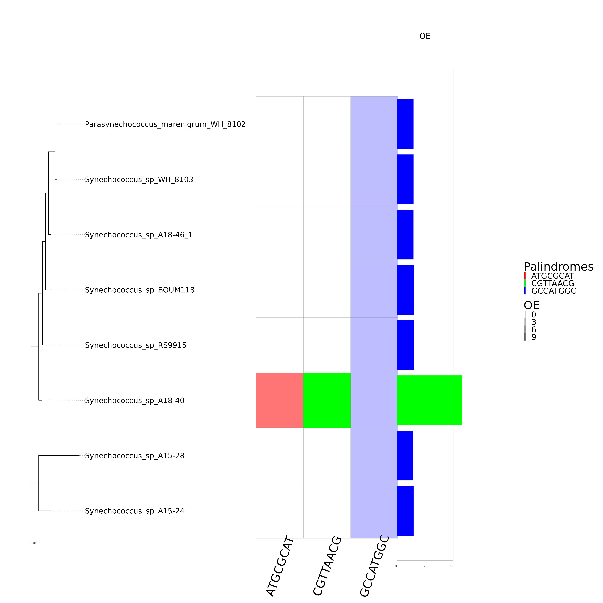
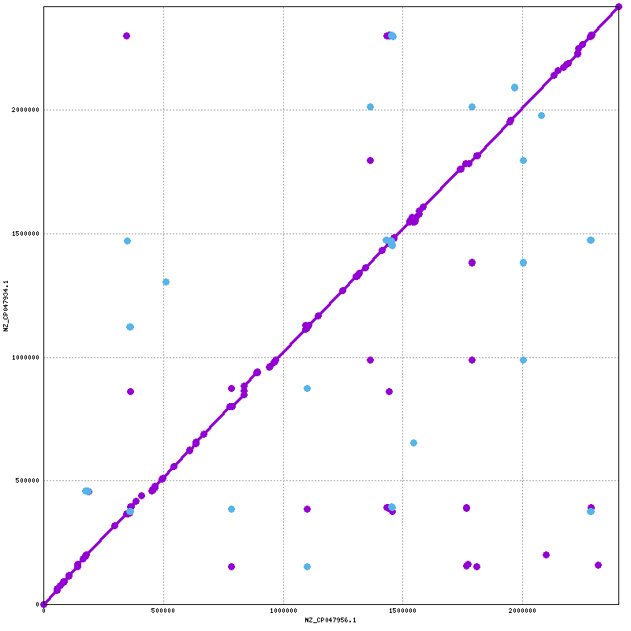

## Clado A18-40

El clado A18-40 fue de particular interés ya que entre las especies **Synechococcus_sp_A18−40** y **Synechococcus sp RS9915** hay un cambio abrupto del palíndromo con mayor OE. Más aun, los genomas de ambas especies son muy parecidos y ambas especias son cercanas segun la filogenia (Figura \@ref(fig:FIG7)).
```{r FIG7, echo=FALSE, fig.cap="**Filogenia anotada del clado A18-40.** En esta imagen se muestra un cambio abrupto en la tasa OE de la especie Synechococcus sp A18-40.", out.width="100%", fig.align='center'}

```

Para saber que tan parecidos eran los genomas hicimos dos análisis de sintenia, uno de enfocado en los ortólogos (Figura \@ref(fig:FIG8)) y otro enfocado en el genoma (Figura \@ref(fig:FIG9)).

```{r FIG8, echo=FALSE, fig.cap="**Sintenía de ortólogos entre las especies Synechococcus sp A18-40 y Synechococcus sp RS99150.** En esta imagen se hizo un análisis de sintenia de ortólogos para ver que tan parecidos eran los genomas. En azul se muestra la especie Synechococcus sp A18-40 y en verde Synechococcus sp RS99150.", out.width="75%",fig.align='center'}
knitr::include_graphics("figures/circos.png")
```

```{r FIG9, echo=FALSE, fig.cap="**Sintenia de DNA entre especies Synechococcus sp A18−40 y Synechococcus sp RS99150.** En esta imagen se hizo un análisis de sintenia de ortólogos para ver que tan parecidos eran los genomas. En el eje X se muestra la especie Synechococcus sp A18−40 y en el eje Y Synechococcus sp RS99150.",fig.align='center'}

```

### CGTTAACG

El palíndromo con la tasa OE mas alta es **CGTTAACG** y lo tiene la especie **Synechococcus sp A18−40** (Tabla \@ref(tab:TAB1)) con un conteo de 112 sitios para dicho palindromo mientras que en las demás especies oscila entre 3 y 15 sitios. 

```{r ,echo=FALSE, include=FALSE}
library(dplyr)
tabla = read.table(file="Clados/Clado_A18-40/Markov_count_pico_2022_gbff_2022-10-28_10hrs29mins_Octanuc_M3_.txt", header=TRUE, sep="\t")
tabla <- tabla%>%
  filter(spp=='Parasynechococcus_marenigrum_WH_8102'|spp=='Synechococcus_sp_WH_8103'|spp=='Synechococcus_sp_A18-46_1'|spp=='Synechococcus_sp_BOUM118'|spp=='Synechococcus_sp_RS9915'|spp=='Synechococcus_sp_A18-40'|spp=='Synechococcus_sp_A15-24'|spp=='Synechococcus_sp_A15-28')
tabla <- tabla%>%
  filter(palindrome=='CGTTAACG')
tabla = tabla[ , c(1,3,4,5)]
```
  
```{r TAB1, echo=FALSE}
knitr::kable(
  head(tabla[, 1:4], 10), booktabs = TRUE,
             caption = "Conteo del palíndromo **CGTTAACG** en el clado **A18-40**",
             digits = 2
)
```

#### Ubicación de sitios CGTTAACG en los genomas del clado A18-40
Para tratar de entender la distribución del palindromo en el genoma buscamos la ubicación de cada sitio y analizamos la distancia entre cada uno de ellos (Tabla \@ref(tab:TAB2)).
En dicho análisis pudimos observar que había 101 sitios que se encontraban entre repeticiones de 340 nuclótidos (columna 3 de la Tabla \@ref(tab:TAB2)).

```{r,echo=FALSE, include=FALSE}
library(dplyr)
tabla2 = read.table(file="Clados/Clado_A18-40/Orthologues_Palindrome_sites.txt", header=TRUE, sep="\t")
tabla2 = tabla2[ , c(1,4,5,6)]

```

```{r TAB2, echo=FALSE}
knitr::kable(
  head(tabla2[, 1:4], 15), booktabs = TRUE,
  caption = "**Ubicación de los sitios CGTTACG.** La tabla muestra las priemras 15 lineas de la tabla. La primera columna se muestra el numero de sitio. La segunda columna muestra el intervalo en el que se encuentra el palíndromo. La tercera columna muestra a cuantos nucléotidos se encuentra el ultimo sitio. La cuarta columna indica la diferencia entre la distancia del ultimo palindromo y la distancia del siguiente.",
  digits = 2,align = 'r')
```

Para entender un poco más esta secuencia hicimos un blast el cual arrojó que dicha repetcion de 340 nucleotidos era un motivo **SWM_repeat** el cual se encuentra aaltamente repetido en una proteína de la superficie celular requerida para la movilidad (**QNJ16559.1**). Además, segun la secuencia de aminoácidos, el palindromo esta segmentado en 2 partes. La primera mitad corresponde a **TTA ACG** en el primer y segundo codon  y **CG** en el ultimo codón del motivo **SWM_repeat** (Figure \@ref(fig:FIG10)).

```{r FIG10, echo=FALSE, fig.cap="**Traducción del motivo SWM\\_repeat.** En esta imagen se muestra la secuencia traducida del motivo SWM\\_repeat la cual se encuentra en la especie Synechococcus sp A18-40.", out.width="100%", fig.align='center'}
knitr::include_graphics("Clados/Clado_A18-40/SWM_repeat_AA.png")
```
Debido a que estos 101 sitios solo estaban presentes en la especie  **Synechococcus sp A18−40** se concluyo que la tasa elevada de OE solo se debia a que tenia presente dicha proteína, ya que si se omitía del conteo, las tasas OE eran homogeneas en todo el clado.

### ATGCGCAT

El segundo palíndromo con la tasa OE mas alta es **ATGCGCAT** en la misma especie **Synechococcus sp A18−40** (Tabla \@ref(tab:TAB3)) con un conteo de 135 sitios para dicho palindromo mientras que en las demás especies oscila entre 22 y 31 sitios. 

```{r,echo=FALSE, include=FALSE}
library(dplyr)
tabla = read.table(file="Clados/Clado_A18-40/Markov_count_pico_2022_gbff_2022-10-28_10hrs29mins_Octanuc_M3_.txt", header=TRUE, sep="\t")
tabla <- tabla%>%
  filter(spp=='Parasynechococcus_marenigrum_WH_8102'|spp=='Synechococcus_sp_WH_8103'|spp=='Synechococcus_sp_A18-46_1'|spp=='Synechococcus_sp_BOUM118'|spp=='Synechococcus_sp_RS9915'|spp=='Synechococcus_sp_A18-40'|spp=='Synechococcus_sp_A15-24'|spp=='Synechococcus_sp_A15-28')
tabla <- tabla%>%
  filter(palindrome=='ATGCGCAT')
tabla = tabla[ , c(1,3,4,5)]
```
  
```{r TAB3, echo=FALSE}
knitr::kable(tabla,
             caption = "Conteo del palíndromo ATGCGCAT en el clado A18-40",
             digits = 2)
```

#### Ubicación de sitios ATGCGCAT en los genomas del clado A18-40
Al analizar la distribución del palindromo en el genoma pudimos observar que, al igual que CGTTAACG, había 101 sitios que se encontraban entre repeticiones de 340 nuclótidos (columna 5 de la Tabla \@ref(tab:TAB4))
```{r,echo=FALSE, include=FALSE}
library(dplyr)
tabla3 = read.table(file="Clados/Clado_A18-40/[aA][-]*[tT][-]*[gG][-]*[cC][-]*[gG][-]*[cC][-]*[aA][-]*[tT].Orthologues_Palindrome_sites.txt", header=TRUE, sep="\t")
tabla3 = tabla3[ , c(1,4,5,6)]
```


```{r TAB4, echo=FALSE}
knitr::kable(
  head(tabla3[, 1:4], 15), booktabs = TRUE,
  caption = "**Ubicación de los sitios ATGCGCAT.** La primera columna se muestra el numero de sitio. La segunda columna muestra el intervalo en el que se encuentra el palíndromo. La tercera columna muestra a cuantos nucléotidos se encuentra el ultimo sitio. La cuarta columna indica la diferencia entre la distancia del ultimo palindromo y la distancia del siguiente.",
  digits = 2,align = 'r')
```

Al hacer un blast el cual arrojó que dicha repetcion de 340 nucleotidos era el mismo motivo **SWM_repeat** de la misma proteína de la superficie celular requerida para la movilidad (**QNJ16559.1**). Al revisar la ubicacion del palíndromo pudimos notar que las mismas cantidades de los palíndromos **ATGCGCAT** y **CGTTAAGC** se debe a que estan a un nucleótido de distancia el uno del otro (Figure \@ref(fig:FIG11)). 

```{r FIG11,fig.align='center',fig.cap="**Traducción del motivo SWM\\_repeat.** En esta imagen se muestra la secuencia traducida del motivo SWM\\_repeat. Subrayado en amarillo y rojo se señalan los palíndromos **CGTTAAGC** y **ATGCGCAT** respectivamente, los cuales se encuentran a un nucleotido de distancia.", echo=FALSE}
knitr::include_graphics("Clados/Clado_A18-40/SWM_3.png")
```

