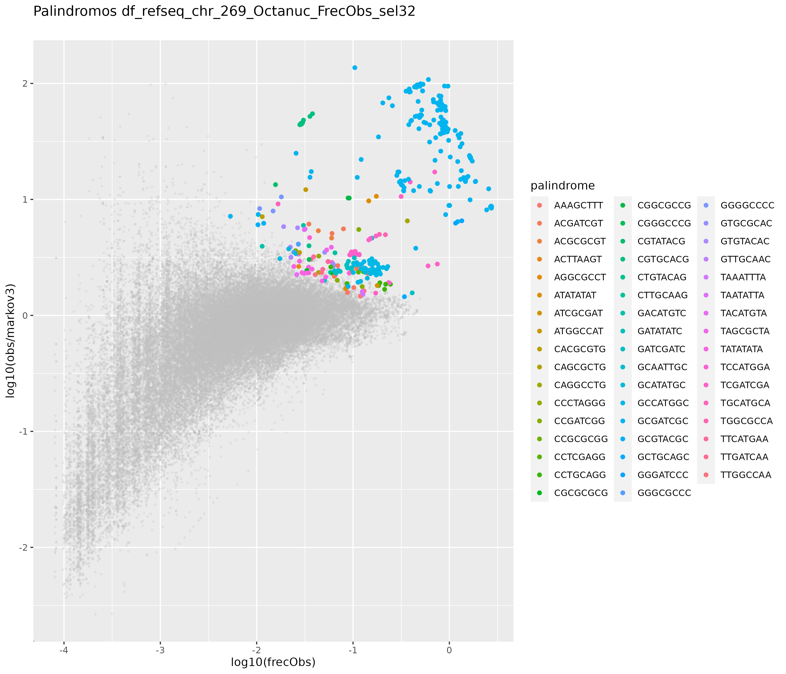
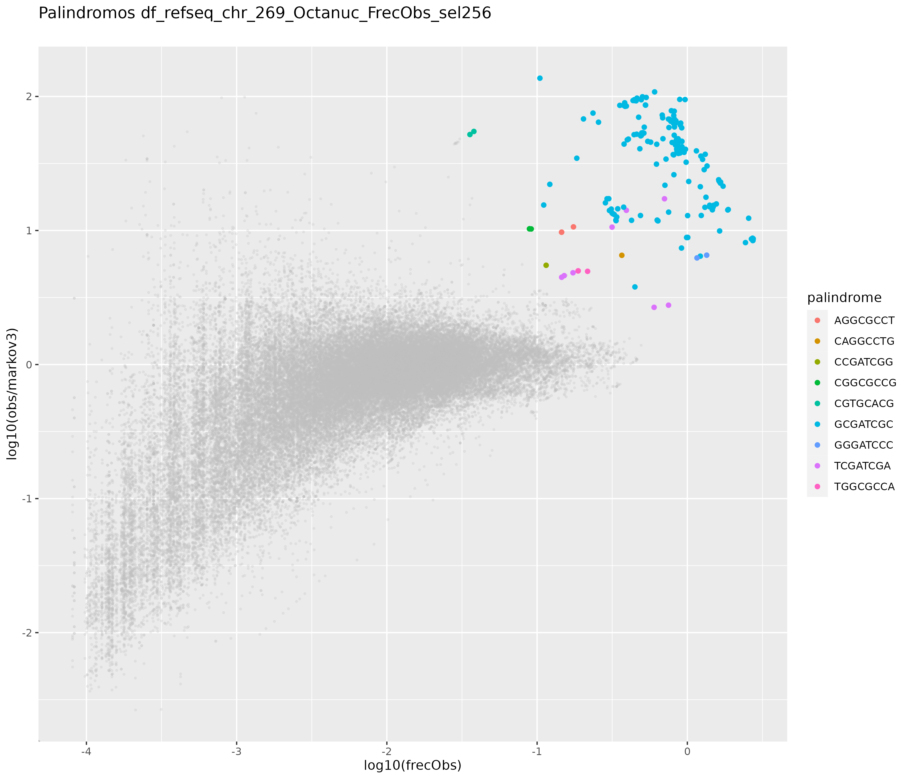
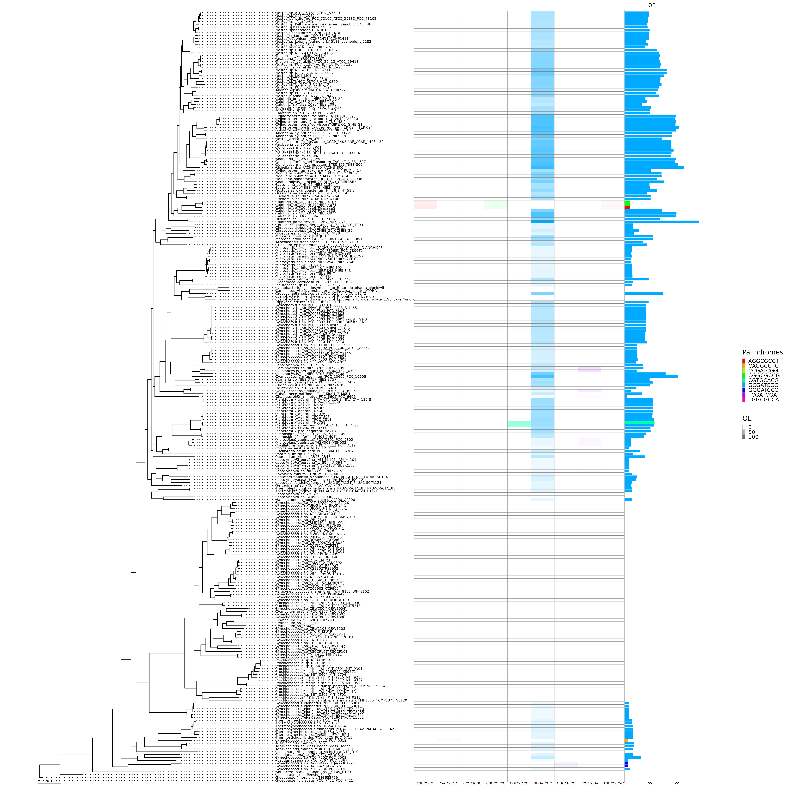
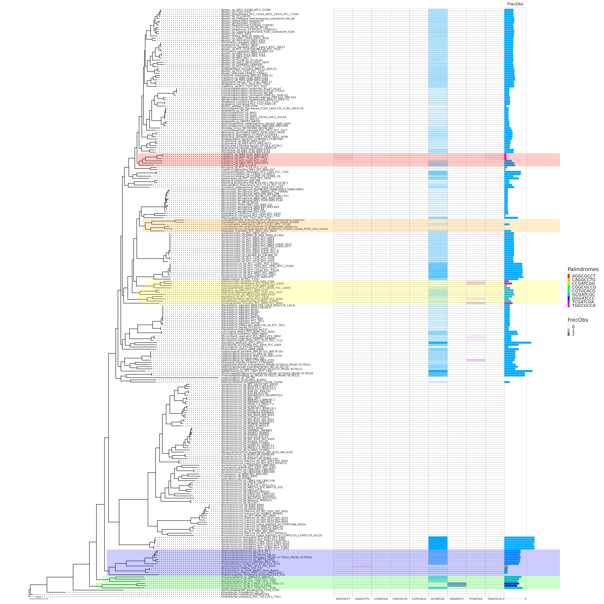
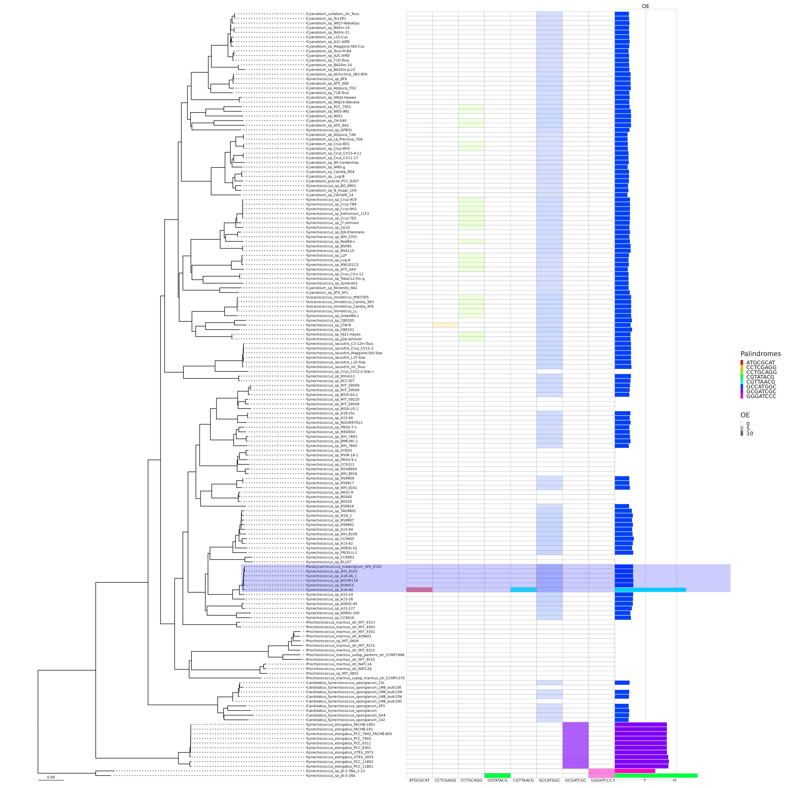

# Métodos

Se descargaron 2 conjuntos de genomas de cianobacterias del servidor del NCBI (https://www.ncbi.nlm.nih.gov/genome/browse/#!/prokaryotes).

Estos conjuntos corresponden a:

* 269 genomas completos y aquellos que solo contenian el cromosoma (**complete_chr**)
* 165 genomas nuevos usados en @{cabello2022elucidating} (**pico**)

Dichos genomas fueron descargados en formato Genebank (.gbk o gbff).

## Abundancia de palíndromos. 

Una vez descargados los genomas, el siguiente paso fue calcular el valor observado y esperado de repeticiones de todos los posibles octámeros palindrómicos de 8 nucleótidos. 

El valor observado es el número de veces que cada octámero palindrómico se repite a lo largo de cada genoma. 
El valor esperado se calculó mediante un **modelo de markov de 3er orden**.

### Modelos de Markov
En una cadena de Markov, el valor tomado por una variable aleatoria depende de los valores tomados por la variable aleatoria en un estado anterior. El número de estados históricos que influyen en el valor de la variable aleatoria en un lugar dado a lo largo de la secuencia también se conoce como el **grado del proceso de Markov**. El modelo de cadena de Markov de **primer grado** tiene parámetros $|\Sigma| + |\Sigma|^2$, correspondientes a las frecuencias de nucleótidos individuales así como a las frecuencias de dinucleótidos. De esta manera, este modelo permite que una posición sea dependiente de la posición anterior. Sin embargo, las frecuencias se modelan de manera invariable en la posición y, por lo tanto, pueden no ser adecuadas para modelar señales. Este modelo de secuencia $M$ se define sobre el espacio muestral $\Sigma^{*}$ y asigna una probabilidad a cada secuencia $x$ de longitud $n(x)$ sobre $\Sigma^{*}$:

\begin{equation}
P(x|M) = P_1(x_1) \prod_{i=2,...,n(x)} P_2(x_i|x_{i-1},...,x_{i-n})
(\#eq:markov)
\end{equation}

donde $P_1$ es una función de probabilidad en $\Sigma$ que modela la distribución de $\alpha$'s en la primera posición de la secuencia y $P_2$ es la función de probabilidad condicional en $\Sigma\times\Sigma$ que modela la distribución de $\beta$'s en la posición $i>1$ en el símbolo alfabético $\alpha$ en la posición $i-1$. La estimación de parámetros se hace utilizando el estimador de ***probabilidad máxima***. Las probabilidades de transición se estiman utilizando el teorema de Bayes, como se muestra a continuación:

\begin{equation}
P_2(\beta|\alpha)={P(\alpha\beta) \over P(\alpha)}
(\#eq:bayes)
\end{equation}

De esta manera, las probabilidades transicionales condicionales de encontrar una base $\beta$ en la posición ($i$) dado que la base $\alpha$ se encontró en la posición ($i-1$) se calculan encontrando la abundancia del dinucleótido $\alpha\beta$ como una fracción de la abundancia del nucleótido $\alpha$.

**Ejemplo:**

Considerando una la secuencia de 25 nucleótidos.
$$Seq = AACGT\space CTCTA\space TCATG\space CCAGG\space ATCTG$$

Al considerar los modelos de cadena de Markov de **primer grado**, es necesario calcular los $4-parámetros$ correspondientes a las **frecuencias de nucleótidos individuales** y los $4^2$ parámetros correspondientes a las **frecuencias de dinucleótidos**. Los parámetros de $\Sigma$ son:

\begin{equation} 
\begin{split}
\Sigma & = \{frec(A),frec(C),frec(G),frec(T),\}\\
 & =\{\frac{6}{25},\frac{7}{25},\frac{7}{25},\frac{5}{25}\}
\end{split}
(\#eq:EQ3)
\end{equation}

Para calcular $P_2$, los valores de probabilidad condicional $\Sigma \times \Sigma$, las frecuencias de dinucleótidos y las probabilidades se calculan a partir de los datos de secuencia. Las frecuencias de los dinucleótidos y las probabilidades se muestran a continuación (con los números entre paréntesis que representan las probabilidades):

\begin{equation}
\Sigma \times \Sigma = 
\begin{Bmatrix}
frec(AA)=\frac{1}{24} & frec(AC)=\frac{1}{24} & frec(AT)=\frac{3}{24} & frec(AG)=\frac{1}{24} \\
frec(CA)=\frac{2}{24} & frec(CC)=\frac{1}{24} & frec(CT)=\frac{3}{24} &frec(CG)=\frac{1}{24} \\
frec(TA)=\frac{1}{24} & frec(TC)=\frac{4}{24} & frec(TT)=\frac{0}{24} & frec(TG)=\frac{1}{24} \\
frec(GA)=\frac{1}{24} & frec(GC)=\frac{1}{24} & frec(GT)=\frac{1}{24} & frec(GG)=\frac{1}{24}
\end{Bmatrix}
(\#eq:EQ4)
\end{equation}

A continuación, las probabilidades condicionales se calculan utilizando el teorema de Bayes (consulte la Ecuación \@ref(eq:bayes) ). Por ejemplo, la probabilidad de encontrar $C$ en la posición $i+1$ dado que se ha encontrado una $A$ en la posición ($i$) es:

\begin{equation}
P(C|A)= \frac{P_{AC}}{P_A}=\frac{\frac{1}{24}}{\frac{6}{25}}
(\#eq:EQ5)
\end{equation}

Para secuencias grandes, la probabilidad condicional $P(S_i|S_{i-1})$ se aproxima a:

\begin{equation}
P(S_i|S_{i-1}) =\frac{frec(S_iS_{i-1})}{frec(S_{i-1})}
(\#eq:EQ6)
\end{equation}

Las probabilidades condicionales para la secuencia de ejemplo se muestran en \@ref(eq:EQ4). Usando estos parámetros del modelo, la probabilidad de encontrar el patrón $CAAT$ en esta secuencia usando el **modelo de Markov de primer orden** de la secuencia subyacente sería igual a:

\begin{equation}
\begin{split}
P(C)P(A|C)P(A|A)P(T|A) & = P(C)\cdot\frac{P(CA)}{P(C)}\cdot\frac{P(AA)}{P(A)}\cdot\frac{P(AT)}{P(A)} \\
& = (\frac{7}{25}) \cdot (\frac{50}{168}) \cdot (\frac{25}{144}) \cdot (\frac{75}{144})\\
& = 0.0075
\end{split}
(\#eq:EQ7)
\end{equation}

### Modelo de Markov de orden 1 para hallar octanucleótidos

Por ejemplo, para una octanucleótido de 8 letras, digamos HIP1:
$$W=GCGATCGC$$
Los parametros de $\Sigma$ corresponden a:
\begin{equation}
\Sigma= \{frec(A),frec(C),frec(G),frec(T)\}
\end{equation}

Los valores de probabilidad condicional de $\Sigma \times \Sigma$ son:
\begin{equation}
\Sigma \times \Sigma = 
\begin{Bmatrix}
  frec(AA) & frec(AC) & frec(AT) & frec(AG) \\ 
  frec(CA) & frec(CC) & frec(CT) & frec(CG) \\
  frec(TA) & frec(TC) & frec(TT) & frec(TG) \\
  frec(GA) & frec(GC) & frec(GT) & frec(GG)
\end{Bmatrix}
\end{equation}

Si queremos usar un **modelo de orden 1**, la probabilidad de hallar $W$ segun las ecuaciones \@ref(eq:markov) y\@ref(eq:bayes) es:
\begin{equation}
\begin{split}
P(W) & = P(G) \cdot P(C|G) \cdot P(G|C) \cdot P(A|G) \cdot P(T|A) \cdot P(C|T) \cdot P(G|C) \cdot P(C|G)\\
& = {P(G)} \cdot \frac{P(GC)}{P(G)} \cdot \frac{P(CG)}{P(C)} \cdot \frac{P(GA)}{P(G)} \cdot \frac{P(AT)}{P(A)} \cdot \frac{P(TC)}{P(T)} \cdot \frac{P(CG)}{P(C)} \cdot \frac{P(GC)}{P(G)}\\
& = P(GC) \cdot \frac{P(CG)}{P(C)} \cdot \frac{P(GA)}{P(G)} \cdot \frac{P(AT)}{P(A)} \cdot \frac{P(TC)}{P(T)} \cdot \frac{P(CG)}{P(C)} \cdot \frac{P(GC)}{P(G)}
\end{split}
\end{equation}

finalmente:
\begin{equation}
P(W) = \frac{P(GC) \cdot P(CG) \cdot P(GA) \cdot P(AT) \cdot P(TC) \cdot P(CG) \cdot P(GC)}{P(C) \cdot P(G) \cdot P(A) \cdot P(T) \cdot P(C) \cdot P(G)}
(\#eq:Markov1HIP)
\end{equation}

### Abundancia de acuerdo a la frecuencia observada y tasa OE

Adicionalmente se calculó una abundancia de acuerdo a la frecuencia observada cada 1000 nucleótidos (**FrecObs**) y otra en base a la tasa de sitios observados sobre esperados (**OE**).

## Significancia de los conteos observados

Para darle una significancia estadística al conteo se usó una **prueba binomial** y un test **FDR**. 

### Prueba binomial. 


Para calcular la probabilidad de que el **conteo esperado**, el cual sigue una distribución binomial, tome valores MAYORES O IGUALES al **conteo observado**, usamos la función ***pbinom***

```r
pbinom(q, size, prob, lower.tail = FALSE)  
```

Donde: 

* **q**: Cuantil o vector de cuantiles 
* **size**: Numero de experimentos (n>=0) 
* **prob**: Probabilidad de éxito en cada experimento 
* **lower.tail**: si es TRUE, las probabilidades son P(X<=x), o P(X>x) en otro caso.

Tomemos un caso particular del conteo:

|Spp   |Palindrome |Observed |Markov (Expected)   |GenomeSize |
|:------|:-----------|:---------|:----------------|:-----------|
|336-3 |GCGATCGC   | 6202    |65.396286071305 |6420126    |

La probabilidad de que se observen **6202** sitios $GCGATCGC$, O MAS, si el número de sitios posibles en el genoma es **6420119** ($6420126-8+1$, es decir $GenomeSize-k+1$) y la probabilidad de observar dicho sitio es de: **1.018615e-05** ($65.3962860713054 \over 6420126-8+1$, es decir $Expected \over GenomeSize-k+1$), es casi **0**.

En otras palabras, la probabilidad de que suceda lo que estoy observando es muy baja.

### FDR 

Para estudios en los que se realizan miles de test de forma simultánea, el resultado de estos métodos es demasiado conservativo e impide que se detecten diferencias reales. Una alternativa es controlar el false discovery rate o FDR. 

Para nuestros datos el FDR se calculó en R de usando los valores obtenidos de la prueba binomial:


```r
p.adjust(pval, method="fdr")
```

Donde **pval** es la probabilidad obtenida de la prueba binomial. 

### Conjuntos de conteos de acuerdo a la significancia
Se crearon 4 conjuntos de resultados de acuerdo a 4 valores mínimos de significancia de acuerdo al FDR:

* **sel32** ($1 \times 10^{-32}$)
* **sel64** ($1 \times 10^{-64}$)
* **sel128** ($1 \times 10^{-128}$)
* **sel256** ($1 \times 10^{-256}$)

El conjunto más laxo corresponde a **sel32** ya que su valor de corte de FDR es $1 \times 10^{-32}$, debido a esto, es el conjunto con más palíndromos (Figura \@ref(fig:FIG1)). Por otro lado, el conjunto **sel256** es el conjunto más restrictivo ya que su valor de corte de FDR es de $1 \times 10^{-256}$, y por lo tanto tiene menos palíndromos (Figura \@ref(fig:FIG2)).

En la tabla (Tabla \@ref(tab:SigSites)) se muestra el conjunto **sel256** el cual contiene 9 palindromos significativos.

## Visualización de la abundancia: OE vs Frecuencia Observada cada 1000nt 

Para visualizar la abundancia creamos un gráfico que muestra el enriquecimiento OE vs la abundancia por cada 1000 nucleótidos. Esto se hizo para cada conjunto de significancia y para cada conjunto de genomas.

<div class="figure" style="text-align: center">

<p class="caption">(\#fig:FIG1)**Enriquecimiento versus abundancia de palíndromos octámeros en el conjunto de genomas complete\_chr con un $FDR \leq 1 \times 10^{-32}$.** Enriquecimiento (**O/E**) en función de la frecuencia del motivo cada 1000 nt (**FrecObs**). Cada punto representa un palíndromo octámero de un genoma.</p>
</div>

<div class="figure" style="text-align: center">

<p class="caption">(\#fig:FIG2)**Enriquecimiento versus abundancia de palíndromos octámeros en el conjunto de genomas complete\_chr con un $FDR \leq 1 \times 10^{-256}$.** Enriquecimiento (**O/E**) en función de la frecuencia del motivo cada 1000 nt (**FrecObs**). Cada punto representa un palíndromo octámero de un genoma.</p>
</div>


<table class=" lightable-paper table table-striped table-condensed" style='font-family: "Arial Narrow", arial, helvetica, sans-serif; margin-left: auto; margin-right: auto; font-size: 11px; width: auto !important; margin-left: auto; margin-right: auto;'>
<caption style="font-size: initial !important;">(\#tab:SigSites)Genomas con un p-value &gt;= 10^-256</caption>
 <thead>
  <tr>
   <th style="text-align:left;position: sticky; top:0; background-color: #FFFFFF;"> Spp </th>
   <th style="text-align:left;position: sticky; top:0; background-color: #FFFFFF;"> Palindrome </th>
   <th style="text-align:left;position: sticky; top:0; background-color: #FFFFFF;"> Log10(FrecObs) </th>
   <th style="text-align:left;position: sticky; top:0; background-color: #FFFFFF;"> Log10(OE) </th>
  </tr>
 </thead>
<tbody>
  <tr>
   <td style="text-align:left;font-weight: bold;font-weight: bold;color: gray20 !important;background-color: #FFE4E1 !important;"> Calothrix_sp_NIES-4071_NIES-4071 </td>
   <td style="text-align:left;font-weight: bold;vertical-align: top !important;font-weight: bold;color: gray20 !important;background-color: #FFE4E1 !important;" rowspan="3"> AGGCGCCT </td>
   <td style="text-align:left;font-weight: bold;color: gray20 !important;background-color: #FFE4E1 !important;"> <span style="display: block; padding: 0 4px; border-radius: 4px; background-color: #ffe1ac">-1.927675803</span> </td>
   <td style="text-align:left;font-weight: bold;color: gray20 !important;background-color: #FFE4E1 !important;"> 2.2730148 </td>
  </tr>
  <tr>
   <td style="text-align:left;font-weight: bold;font-weight: bold;color: gray20 !important;background-color: #FFE4E1 !important;"> Calothrix_sp_NIES-4105_NIES-4105 </td>
   
   <td style="text-align:left;font-weight: bold;color: gray20 !important;background-color: #FFE4E1 !important;"> <span style="display: block; padding: 0 4px; border-radius: 4px; background-color: #ffe1ac">-1.926712958</span> </td>
   <td style="text-align:left;font-weight: bold;color: gray20 !important;background-color: #FFE4E1 !important;"> 2.2741416 </td>
  </tr>
  <tr>
   <td style="text-align:left;font-weight: bold;font-weight: bold;color: gray20 !important;background-color: #FFE4E1 !important;"> Calothrix_sp_PCC_7716_PCC_7716 </td>
   
   <td style="text-align:left;font-weight: bold;color: gray20 !important;background-color: #FFE4E1 !important;"> <span style="display: block; padding: 0 4px; border-radius: 4px; background-color: #ffdea1">-1.745391820</span> </td>
   <td style="text-align:left;font-weight: bold;color: gray20 !important;background-color: #FFE4E1 !important;"> 2.3651120 </td>
  </tr>
  <tr>
   <td style="text-align:left;font-weight: bold;"> Synechococcus_sp_PCC_6312_PCC_6312 </td>
   <td style="text-align:left;font-weight: bold;"> CAGGCCTG </td>
   <td style="text-align:left;"> <span style="display: block; padding: 0 4px; border-radius: 4px; background-color: #ffce76">-1.004169646</span> </td>
   <td style="text-align:left;"> 1.8766079 </td>
  </tr>
  <tr>
   <td style="text-align:left;font-weight: bold;font-weight: bold;color: gray20 !important;background-color: #FFE4E1 !important;"> Phormidium_sp_ETS-05_ETS-05 </td>
   <td style="text-align:left;font-weight: bold;font-weight: bold;color: gray20 !important;background-color: #FFE4E1 !important;"> CCGATCGG </td>
   <td style="text-align:left;font-weight: bold;color: gray20 !important;background-color: #FFE4E1 !important;"> <span style="display: block; padding: 0 4px; border-radius: 4px; background-color: #ffe6ba">-2.164179633</span> </td>
   <td style="text-align:left;font-weight: bold;color: gray20 !important;background-color: #FFE4E1 !important;"> 1.7053669 </td>
  </tr>
  <tr>
   <td style="text-align:left;font-weight: bold;"> Calothrix_sp_NIES-4105_NIES-4105 </td>
   <td style="text-align:left;font-weight: bold;vertical-align: top !important;" rowspan="3"> CGGCGCCG </td>
   <td style="text-align:left;"> <span style="display: block; padding: 0 4px; border-radius: 4px; background-color: #ffecc9">-2.419448773</span> </td>
   <td style="text-align:left;"> 2.3312189 </td>
  </tr>
  <tr>
   <td style="text-align:left;font-weight: bold;"> Calothrix_sp_NIES-4071_NIES-4071 </td>
   
   <td style="text-align:left;"> <span style="display: block; padding: 0 4px; border-radius: 4px; background-color: #ffecc9">-2.418545946</span> </td>
   <td style="text-align:left;"> 2.3316341 </td>
  </tr>
  <tr>
   <td style="text-align:left;font-weight: bold;"> Calothrix_sp_PCC_7716_PCC_7716 </td>
   
   <td style="text-align:left;"> <span style="display: block; padding: 0 4px; border-radius: 4px; background-color: #ffebc7">-2.392819339</span> </td>
   <td style="text-align:left;"> 2.3294982 </td>
  </tr>
  <tr>
   <td style="text-align:left;font-weight: bold;font-weight: bold;color: gray20 !important;background-color: #FFE4E1 !important;"> Planktothrix_rubescens_NIVA-CYA_18_PCC_7821 </td>
   <td style="text-align:left;font-weight: bold;vertical-align: top !important;font-weight: bold;color: gray20 !important;background-color: #FFE4E1 !important;" rowspan="2"> CGTGCACG </td>
   <td style="text-align:left;font-weight: bold;color: gray20 !important;background-color: #FFE4E1 !important;"> <span style="display: block; padding: 0 4px; border-radius: 4px; background-color: #ffffff">-3.332139476</span> </td>
   <td style="text-align:left;font-weight: bold;color: gray20 !important;background-color: #FFE4E1 !important;"> 3.9515690 </td>
  </tr>
  <tr>
   <td style="text-align:left;font-weight: bold;font-weight: bold;color: gray20 !important;background-color: #FFE4E1 !important;"> Planktothrix_agardhii_No758 </td>
   
   <td style="text-align:left;font-weight: bold;color: gray20 !important;background-color: #FFE4E1 !important;"> <span style="display: block; padding: 0 4px; border-radius: 4px; background-color: #fffdfb">-3.271775380</span> </td>
   <td style="text-align:left;font-weight: bold;color: gray20 !important;background-color: #FFE4E1 !important;"> 4.0041722 </td>
  </tr>
  <tr>
   <td style="text-align:left;font-weight: bold;font-weight: bold;color: gray20 !important;background-color: #54FF9F !important;"> Calothrix_parasitica_NIES-267_NIES-267 </td>
   <td style="text-align:left;font-weight: bold;vertical-align: top !important;font-weight: bold;color: gray20 !important;background-color: #54FF9F !important;" rowspan="182"> GCGATCGC </td>
   <td style="text-align:left;font-weight: bold;color: gray20 !important;background-color: #54FF9F !important;"> <span style="display: block; padding: 0 4px; border-radius: 4px; background-color: #ffe8bf">-2.259462797</span> </td>
   <td style="text-align:left;font-weight: bold;color: gray20 !important;background-color: #54FF9F !important;"> 4.9190709 </td>
  </tr>
  <tr>
   <td style="text-align:left;font-weight: bold;font-weight: bold;color: gray20 !important;background-color: #54FF9F !important;"> Gloeothece_verrucosa_PCC_7822_PCC_7822 </td>
   
   <td style="text-align:left;font-weight: bold;color: gray20 !important;background-color: #54FF9F !important;"> <span style="display: block; padding: 0 4px; border-radius: 4px; background-color: #ffe7bc">-2.201050837</span> </td>
   <td style="text-align:left;font-weight: bold;color: gray20 !important;background-color: #54FF9F !important;"> 2.7401299 </td>
  </tr>
  <tr>
   <td style="text-align:left;font-weight: bold;font-weight: bold;color: gray20 !important;background-color: #54FF9F !important;"> Geminocystis_herdmanii_PCC_6308_PCC_6308 </td>
   
   <td style="text-align:left;font-weight: bold;color: gray20 !important;background-color: #54FF9F !important;"> <span style="display: block; padding: 0 4px; border-radius: 4px; background-color: #ffe5b7">-2.107851223</span> </td>
   <td style="text-align:left;font-weight: bold;color: gray20 !important;background-color: #54FF9F !important;"> 3.0960140 </td>
  </tr>
  <tr>
   <td style="text-align:left;font-weight: bold;font-weight: bold;color: gray20 !important;background-color: #54FF9F !important;"> Geminocystis_sp_NIES-3709_NIES-3709 </td>
   
   <td style="text-align:left;font-weight: bold;color: gray20 !important;background-color: #54FF9F !important;"> <span style="display: block; padding: 0 4px; border-radius: 4px; background-color: #ffdd9e">-1.694533741</span> </td>
   <td style="text-align:left;font-weight: bold;color: gray20 !important;background-color: #54FF9F !important;"> 3.5442442 </td>
  </tr>
  <tr>
   <td style="text-align:left;font-weight: bold;font-weight: bold;color: gray20 !important;background-color: #54FF9F !important;"> Nostoc_azollae_0708_0708 </td>
   
   <td style="text-align:left;font-weight: bold;color: gray20 !important;background-color: #54FF9F !important;"> <span style="display: block; padding: 0 4px; border-radius: 4px; background-color: #ffda98">-1.591579303</span> </td>
   <td style="text-align:left;font-weight: bold;color: gray20 !important;background-color: #54FF9F !important;"> 4.2189544 </td>
  </tr>
  <tr>
   <td style="text-align:left;font-weight: bold;font-weight: bold;color: gray20 !important;background-color: #54FF9F !important;"> Geminocystis_sp_NIES-3708_NIES-3708 </td>
   
   <td style="text-align:left;font-weight: bold;color: gray20 !important;background-color: #54FF9F !important;"> <span style="display: block; padding: 0 4px; border-radius: 4px; background-color: #ffd790">-1.445949160</span> </td>
   <td style="text-align:left;font-weight: bold;color: gray20 !important;background-color: #54FF9F !important;"> 4.3195018 </td>
  </tr>
  <tr>
   <td style="text-align:left;font-weight: bold;font-weight: bold;color: gray20 !important;background-color: #54FF9F !important;"> Rivularia_sp_PCC_7116_PCC_7116 </td>
   
   <td style="text-align:left;font-weight: bold;color: gray20 !important;background-color: #54FF9F !important;"> <span style="display: block; padding: 0 4px; border-radius: 4px; background-color: #ffd68b">-1.361489128</span> </td>
   <td style="text-align:left;font-weight: bold;color: gray20 !important;background-color: #54FF9F !important;"> 4.1628789 </td>
  </tr>
  <tr>
   <td style="text-align:left;font-weight: bold;font-weight: bold;color: gray20 !important;background-color: #54FF9F !important;"> Acaryochloris_marina_MBIC11017_MBIC11017 </td>
   
   <td style="text-align:left;font-weight: bold;color: gray20 !important;background-color: #54FF9F !important;"> <span style="display: block; padding: 0 4px; border-radius: 4px; background-color: #ffd385">-1.255709206</span> </td>
   <td style="text-align:left;font-weight: bold;color: gray20 !important;background-color: #54FF9F !important;"> 2.7782270 </td>
  </tr>
  <tr>
   <td style="text-align:left;font-weight: bold;font-weight: bold;color: gray20 !important;background-color: #54FF9F !important;"> Acaryochloris_sp_Moss_Beach_Moss_Beach </td>
   
   <td style="text-align:left;font-weight: bold;color: gray20 !important;background-color: #54FF9F !important;"> <span style="display: block; padding: 0 4px; border-radius: 4px; background-color: #ffd383">-1.230705669</span> </td>
   <td style="text-align:left;font-weight: bold;color: gray20 !important;background-color: #54FF9F !important;"> 2.8478691 </td>
  </tr>
  <tr>
   <td style="text-align:left;font-weight: bold;font-weight: bold;color: gray20 !important;background-color: #54FF9F !important;"> Acaryochloris_marina_S15_S15 </td>
   
   <td style="text-align:left;font-weight: bold;color: gray20 !important;background-color: #54FF9F !important;"> <span style="display: block; padding: 0 4px; border-radius: 4px; background-color: #ffd281">-1.203893888</span> </td>
   <td style="text-align:left;font-weight: bold;color: gray20 !important;background-color: #54FF9F !important;"> 2.8485807 </td>
  </tr>
  <tr>
   <td style="text-align:left;font-weight: bold;font-weight: bold;color: gray20 !important;background-color: #54FF9F !important;"> Microcystis_viridis_NIES-102_NIES-102 </td>
   
   <td style="text-align:left;font-weight: bold;color: gray20 !important;background-color: #54FF9F !important;"> <span style="display: block; padding: 0 4px; border-radius: 4px; background-color: #ffd281">-1.193956006</span> </td>
   <td style="text-align:left;font-weight: bold;color: gray20 !important;background-color: #54FF9F !important;"> 2.6464304 </td>
  </tr>
  <tr>
   <td style="text-align:left;font-weight: bold;font-weight: bold;color: gray20 !important;background-color: #54FF9F !important;"> Microcystis_panniformis_FACHB-1757_FACHB-1757 </td>
   
   <td style="text-align:left;font-weight: bold;color: gray20 !important;background-color: #54FF9F !important;"> <span style="display: block; padding: 0 4px; border-radius: 4px; background-color: #ffd280">-1.173977758</span> </td>
   <td style="text-align:left;font-weight: bold;color: gray20 !important;background-color: #54FF9F !important;"> 2.6391086 </td>
  </tr>
  <tr>
   <td style="text-align:left;font-weight: bold;font-weight: bold;color: gray20 !important;background-color: #54FF9F !important;"> Microcystis_aeruginosa_NIES-843_NIES-843 </td>
   
   <td style="text-align:left;font-weight: bold;color: gray20 !important;background-color: #54FF9F !important;"> <span style="display: block; padding: 0 4px; border-radius: 4px; background-color: #ffd27f">-1.165823477</span> </td>
   <td style="text-align:left;font-weight: bold;color: gray20 !important;background-color: #54FF9F !important;"> 2.6706900 </td>
  </tr>
  <tr>
   <td style="text-align:left;font-weight: bold;font-weight: bold;color: gray20 !important;background-color: #54FF9F !important;"> Microcystis_aeruginosa_NIES-88 </td>
   
   <td style="text-align:left;font-weight: bold;color: gray20 !important;background-color: #54FF9F !important;"> <span style="display: block; padding: 0 4px; border-radius: 4px; background-color: #ffd17f">-1.153941568</span> </td>
   <td style="text-align:left;font-weight: bold;color: gray20 !important;background-color: #54FF9F !important;"> 2.6033092 </td>
  </tr>
  <tr>
   <td style="text-align:left;font-weight: bold;font-weight: bold;color: gray20 !important;background-color: #54FF9F !important;"> Microcystis_aeruginosa_PCC_7806SL_PCC_7806SL </td>
   
   <td style="text-align:left;font-weight: bold;color: gray20 !important;background-color: #54FF9F !important;"> <span style="display: block; padding: 0 4px; border-radius: 4px; background-color: #ffd17e">-1.143448487</span> </td>
   <td style="text-align:left;font-weight: bold;color: gray20 !important;background-color: #54FF9F !important;"> 2.5920887 </td>
  </tr>
  <tr>
   <td style="text-align:left;font-weight: bold;font-weight: bold;color: gray20 !important;background-color: #54FF9F !important;"> Microcystis_aeruginosa_FACHB-905_DIANCHI905_DIANCHI905 </td>
   
   <td style="text-align:left;font-weight: bold;color: gray20 !important;background-color: #54FF9F !important;"> <span style="display: block; padding: 0 4px; border-radius: 4px; background-color: #ffd17e">-1.143111154</span> </td>
   <td style="text-align:left;font-weight: bold;color: gray20 !important;background-color: #54FF9F !important;"> 2.5938171 </td>
  </tr>
  <tr>
   <td style="text-align:left;font-weight: bold;font-weight: bold;color: gray20 !important;background-color: #54FF9F !important;"> Microcystis_sp_MC19_MC19 </td>
   
   <td style="text-align:left;font-weight: bold;color: gray20 !important;background-color: #54FF9F !important;"> <span style="display: block; padding: 0 4px; border-radius: 4px; background-color: #ffd17d">-1.120002353</span> </td>
   <td style="text-align:left;font-weight: bold;color: gray20 !important;background-color: #54FF9F !important;"> 2.5774434 </td>
  </tr>
  <tr>
   <td style="text-align:left;font-weight: bold;font-weight: bold;color: gray20 !important;background-color: #54FF9F !important;"> Microcystis_aeruginosa_NIES-2481_NIES-2481 </td>
   
   <td style="text-align:left;font-weight: bold;color: gray20 !important;background-color: #54FF9F !important;"> <span style="display: block; padding: 0 4px; border-radius: 4px; background-color: #ffd07b">-1.096035972</span> </td>
   <td style="text-align:left;font-weight: bold;color: gray20 !important;background-color: #54FF9F !important;"> 2.4799661 </td>
  </tr>
  <tr>
   <td style="text-align:left;font-weight: bold;font-weight: bold;color: gray20 !important;background-color: #54FF9F !important;"> Microcystis_aeruginosa_NIES-2549_NIES-2549 </td>
   
   <td style="text-align:left;font-weight: bold;color: gray20 !important;background-color: #54FF9F !important;"> <span style="display: block; padding: 0 4px; border-radius: 4px; background-color: #ffd07b">-1.092169774</span> </td>
   <td style="text-align:left;font-weight: bold;color: gray20 !important;background-color: #54FF9F !important;"> 2.4714809 </td>
  </tr>
  <tr>
   <td style="text-align:left;font-weight: bold;font-weight: bold;color: gray20 !important;background-color: #54FF9F !important;"> Microcystis_aeruginosa_NIES-298_NIES-298 </td>
   
   <td style="text-align:left;font-weight: bold;color: gray20 !important;background-color: #54FF9F !important;"> <span style="display: block; padding: 0 4px; border-radius: 4px; background-color: #ffd07a">-1.081821322</span> </td>
   <td style="text-align:left;font-weight: bold;color: gray20 !important;background-color: #54FF9F !important;"> 2.5344980 </td>
  </tr>
  <tr>
   <td style="text-align:left;font-weight: bold;font-weight: bold;color: gray20 !important;background-color: #54FF9F !important;"> Microcystis_aeruginosa_FD4_FD4 </td>
   
   <td style="text-align:left;font-weight: bold;color: gray20 !important;background-color: #54FF9F !important;"> <span style="display: block; padding: 0 4px; border-radius: 4px; background-color: #ffd079">-1.066918115</span> </td>
   <td style="text-align:left;font-weight: bold;color: gray20 !important;background-color: #54FF9F !important;"> 2.6753759 </td>
  </tr>
  <tr>
   <td style="text-align:left;font-weight: bold;font-weight: bold;color: gray20 !important;background-color: #54FF9F !important;"> Dolichospermum_sp_BR01 </td>
   
   <td style="text-align:left;font-weight: bold;color: gray20 !important;background-color: #54FF9F !important;"> <span style="display: block; padding: 0 4px; border-radius: 4px; background-color: #ffcf78">-1.035367476</span> </td>
   <td style="text-align:left;font-weight: bold;color: gray20 !important;background-color: #54FF9F !important;"> 4.4521212 </td>
  </tr>
  <tr>
   <td style="text-align:left;font-weight: bold;font-weight: bold;color: gray20 !important;background-color: #54FF9F !important;"> Dolichospermum_sp_UHCC_0315A_UHCC_0315A </td>
   
   <td style="text-align:left;font-weight: bold;color: gray20 !important;background-color: #54FF9F !important;"> <span style="display: block; padding: 0 4px; border-radius: 4px; background-color: #ffce74">-0.978354836</span> </td>
   <td style="text-align:left;font-weight: bold;color: gray20 !important;background-color: #54FF9F !important;"> 4.4533627 </td>
  </tr>
  <tr>
   <td style="text-align:left;font-weight: bold;font-weight: bold;color: gray20 !important;background-color: #54FF9F !important;"> Phormidium_sp_ETS-05_ETS-05 </td>
   
   <td style="text-align:left;font-weight: bold;color: gray20 !important;background-color: #54FF9F !important;"> <span style="display: block; padding: 0 4px; border-radius: 4px; background-color: #ffce74">-0.975981568</span> </td>
   <td style="text-align:left;font-weight: bold;color: gray20 !important;background-color: #54FF9F !important;"> 2.7036315 </td>
  </tr>
  <tr>
   <td style="text-align:left;font-weight: bold;font-weight: bold;color: gray20 !important;background-color: #54FF9F !important;"> Gloeothece_citriformis_PCC_7424_PCC_7424 </td>
   
   <td style="text-align:left;font-weight: bold;color: gray20 !important;background-color: #54FF9F !important;"> <span style="display: block; padding: 0 4px; border-radius: 4px; background-color: #ffce74">-0.969828676</span> </td>
   <td style="text-align:left;font-weight: bold;color: gray20 !important;background-color: #54FF9F !important;"> 3.7868915 </td>
  </tr>
  <tr>
   <td style="text-align:left;font-weight: bold;font-weight: bold;color: gray20 !important;background-color: #54FF9F !important;"> Dolichospermum_sp_OL01 </td>
   
   <td style="text-align:left;font-weight: bold;color: gray20 !important;background-color: #54FF9F !important;"> <span style="display: block; padding: 0 4px; border-radius: 4px; background-color: #ffcd73">-0.960199263</span> </td>
   <td style="text-align:left;font-weight: bold;color: gray20 !important;background-color: #54FF9F !important;"> 4.4961586 </td>
  </tr>
  <tr>
   <td style="text-align:left;font-weight: bold;font-weight: bold;color: gray20 !important;background-color: #54FF9F !important;"> Anabaena_sp_90_90 </td>
   
   <td style="text-align:left;font-weight: bold;color: gray20 !important;background-color: #54FF9F !important;"> <span style="display: block; padding: 0 4px; border-radius: 4px; background-color: #ffcd73">-0.953868330</span> </td>
   <td style="text-align:left;font-weight: bold;color: gray20 !important;background-color: #54FF9F !important;"> 4.4355420 </td>
  </tr>
  <tr>
   <td style="text-align:left;font-weight: bold;font-weight: bold;color: gray20 !important;background-color: #54FF9F !important;"> Dolichospermum_sp_WA123 </td>
   
   <td style="text-align:left;font-weight: bold;color: gray20 !important;background-color: #54FF9F !important;"> <span style="display: block; padding: 0 4px; border-radius: 4px; background-color: #ffcd73">-0.949424247</span> </td>
   <td style="text-align:left;font-weight: bold;color: gray20 !important;background-color: #54FF9F !important;"> 4.4393733 </td>
  </tr>
  <tr>
   <td style="text-align:left;font-weight: bold;font-weight: bold;color: gray20 !important;background-color: #54FF9F !important;"> Dolichospermum_flos-aquae_CCAP_1403-13F_CCAP_1403-13f </td>
   
   <td style="text-align:left;font-weight: bold;color: gray20 !important;background-color: #54FF9F !important;"> <span style="display: block; padding: 0 4px; border-radius: 4px; background-color: #ffcd72">-0.934300949</span> </td>
   <td style="text-align:left;font-weight: bold;color: gray20 !important;background-color: #54FF9F !important;"> 4.4401022 </td>
  </tr>
  <tr>
   <td style="text-align:left;font-weight: bold;font-weight: bold;color: gray20 !important;background-color: #54FF9F !important;"> Planktothrix_tepida_PCC9214 </td>
   
   <td style="text-align:left;font-weight: bold;color: gray20 !important;background-color: #54FF9F !important;"> <span style="display: block; padding: 0 4px; border-radius: 4px; background-color: #ffcd71">-0.920631169</span> </td>
   <td style="text-align:left;font-weight: bold;color: gray20 !important;background-color: #54FF9F !important;"> 3.8603570 </td>
  </tr>
  <tr>
   <td style="text-align:left;font-weight: bold;font-weight: bold;color: gray20 !important;background-color: #54FF9F !important;"> Planktothrix_pseudagardhii_No713 </td>
   
   <td style="text-align:left;font-weight: bold;color: gray20 !important;background-color: #54FF9F !important;"> <span style="display: block; padding: 0 4px; border-radius: 4px; background-color: #ffcc70">-0.903559739</span> </td>
   <td style="text-align:left;font-weight: bold;color: gray20 !important;background-color: #54FF9F !important;"> 3.8725794 </td>
  </tr>
  <tr>
   <td style="text-align:left;font-weight: bold;font-weight: bold;color: gray20 !important;background-color: #54FF9F !important;"> Dactylococcopsis_salina_PCC_8305_PCC_8305 </td>
   
   <td style="text-align:left;font-weight: bold;color: gray20 !important;background-color: #54FF9F !important;"> <span style="display: block; padding: 0 4px; border-radius: 4px; background-color: #ffcb6d">-0.854999470</span> </td>
   <td style="text-align:left;font-weight: bold;color: gray20 !important;background-color: #54FF9F !important;"> 2.4775290 </td>
  </tr>
  <tr>
   <td style="text-align:left;font-weight: bold;font-weight: bold;color: gray20 !important;background-color: #54FF9F !important;"> Cylindrospermopsis_curvispora_GIHE-G1_GIHE-G1 </td>
   
   <td style="text-align:left;font-weight: bold;color: gray20 !important;background-color: #54FF9F !important;"> <span style="display: block; padding: 0 4px; border-radius: 4px; background-color: #ffcb6c">-0.832344855</span> </td>
   <td style="text-align:left;font-weight: bold;color: gray20 !important;background-color: #54FF9F !important;"> 4.5354855 </td>
  </tr>
  <tr>
   <td style="text-align:left;font-weight: bold;font-weight: bold;color: gray20 !important;background-color: #54FF9F !important;"> Moorena_producens_PAL-8-15-08-1_PAL-8-15-08-1 </td>
   
   <td style="text-align:left;font-weight: bold;color: gray20 !important;background-color: #54FF9F !important;"> <span style="display: block; padding: 0 4px; border-radius: 4px; background-color: #ffca6b">-0.816265034</span> </td>
   <td style="text-align:left;font-weight: bold;color: gray20 !important;background-color: #54FF9F !important;"> 3.9490066 </td>
  </tr>
  <tr>
   <td style="text-align:left;font-weight: bold;font-weight: bold;color: gray20 !important;background-color: #54FF9F !important;"> Anabaena_sp_WA102_WA102 </td>
   
   <td style="text-align:left;font-weight: bold;color: gray20 !important;background-color: #54FF9F !important;"> <span style="display: block; padding: 0 4px; border-radius: 4px; background-color: #ffca6b">-0.814748265</span> </td>
   <td style="text-align:left;font-weight: bold;color: gray20 !important;background-color: #54FF9F !important;"> 4.5442922 </td>
  </tr>
  <tr>
   <td style="text-align:left;font-weight: bold;font-weight: bold;color: gray20 !important;background-color: #54FF9F !important;"> Cylindrospermopsis_raciborskii_N8_N8 </td>
   
   <td style="text-align:left;font-weight: bold;color: gray20 !important;background-color: #54FF9F !important;"> <span style="display: block; padding: 0 4px; border-radius: 4px; background-color: #ffca6a">-0.811688572</span> </td>
   <td style="text-align:left;font-weight: bold;color: gray20 !important;background-color: #54FF9F !important;"> 4.5500150 </td>
  </tr>
  <tr>
   <td style="text-align:left;font-weight: bold;font-weight: bold;color: gray20 !important;background-color: #54FF9F !important;"> Cylindrospermopsis_raciborskii_Cr2010_Cr2010 </td>
   
   <td style="text-align:left;font-weight: bold;color: gray20 !important;background-color: #54FF9F !important;"> <span style="display: block; padding: 0 4px; border-radius: 4px; background-color: #ffca6a">-0.809227233</span> </td>
   <td style="text-align:left;font-weight: bold;color: gray20 !important;background-color: #54FF9F !important;"> 4.5344013 </td>
  </tr>
  <tr>
   <td style="text-align:left;font-weight: bold;font-weight: bold;color: gray20 !important;background-color: #54FF9F !important;"> Chamaesiphon_minutus_PCC_6605_PCC_6605 </td>
   
   <td style="text-align:left;font-weight: bold;color: gray20 !important;background-color: #54FF9F !important;"> <span style="display: block; padding: 0 4px; border-radius: 4px; background-color: #ffca6a">-0.803381615</span> </td>
   <td style="text-align:left;font-weight: bold;color: gray20 !important;background-color: #54FF9F !important;"> 1.3336814 </td>
  </tr>
  <tr>
   <td style="text-align:left;font-weight: bold;font-weight: bold;color: gray20 !important;background-color: #54FF9F !important;"> Cylindrospermopsis_raciborskii_KLL07_KLL07 </td>
   
   <td style="text-align:left;font-weight: bold;color: gray20 !important;background-color: #54FF9F !important;"> <span style="display: block; padding: 0 4px; border-radius: 4px; background-color: #ffca69">-0.786721294</span> </td>
   <td style="text-align:left;font-weight: bold;color: gray20 !important;background-color: #54FF9F !important;"> 4.5476832 </td>
  </tr>
  <tr>
   <td style="text-align:left;font-weight: bold;font-weight: bold;color: gray20 !important;background-color: #54FF9F !important;"> Dolichospermum_heterosporum_TAC447_NIES-1697 </td>
   
   <td style="text-align:left;font-weight: bold;color: gray20 !important;background-color: #54FF9F !important;"> <span style="display: block; padding: 0 4px; border-radius: 4px; background-color: #ffca69">-0.784518187</span> </td>
   <td style="text-align:left;font-weight: bold;color: gray20 !important;background-color: #54FF9F !important;"> 4.5304169 </td>
  </tr>
  <tr>
   <td style="text-align:left;font-weight: bold;font-weight: bold;color: gray20 !important;background-color: #54FF9F !important;"> Moorena_producens_JHB_JHB </td>
   
   <td style="text-align:left;font-weight: bold;color: gray20 !important;background-color: #54FF9F !important;"> <span style="display: block; padding: 0 4px; border-radius: 4px; background-color: #ffca68">-0.776758369</span> </td>
   <td style="text-align:left;font-weight: bold;color: gray20 !important;background-color: #54FF9F !important;"> 3.9569402 </td>
  </tr>
  <tr>
   <td style="text-align:left;font-weight: bold;font-weight: bold;color: gray20 !important;background-color: #54FF9F !important;"> Dolichospermum_compactum_NIES-806_NIES-806 </td>
   
   <td style="text-align:left;font-weight: bold;color: gray20 !important;background-color: #54FF9F !important;"> <span style="display: block; padding: 0 4px; border-radius: 4px; background-color: #ffc968">-0.771640176</span> </td>
   <td style="text-align:left;font-weight: bold;color: gray20 !important;background-color: #54FF9F !important;"> 4.5764283 </td>
  </tr>
  <tr>
   <td style="text-align:left;font-weight: bold;font-weight: bold;color: gray20 !important;background-color: #54FF9F !important;"> Crocosphaera_subtropica_ATCC_51142_ATCC_51142 </td>
   
   <td style="text-align:left;font-weight: bold;color: gray20 !important;background-color: #54FF9F !important;"> <span style="display: block; padding: 0 4px; border-radius: 4px; background-color: #ffc967">-0.746246134</span> </td>
   <td style="text-align:left;font-weight: bold;color: gray20 !important;background-color: #54FF9F !important;"> 4.2485302 </td>
  </tr>
  <tr>
   <td style="text-align:left;font-weight: bold;font-weight: bold;color: gray20 !important;background-color: #54FF9F !important;"> Brasilonema_sennae_CENA114_CENA114 </td>
   
   <td style="text-align:left;font-weight: bold;color: gray20 !important;background-color: #54FF9F !important;"> <span style="display: block; padding: 0 4px; border-radius: 4px; background-color: #ffc966">-0.727826775</span> </td>
   <td style="text-align:left;font-weight: bold;color: gray20 !important;background-color: #54FF9F !important;"> 3.7068130 </td>
  </tr>
  <tr>
   <td style="text-align:left;font-weight: bold;font-weight: bold;color: gray20 !important;background-color: #54FF9F !important;"> Halomicronema_hongdechloris_C2206_C2206 </td>
   
   <td style="text-align:left;font-weight: bold;color: gray20 !important;background-color: #54FF9F !important;"> <span style="display: block; padding: 0 4px; border-radius: 4px; background-color: #ffc865">-0.718170621</span> </td>
   <td style="text-align:left;font-weight: bold;color: gray20 !important;background-color: #54FF9F !important;"> 2.5599156 </td>
  </tr>
  <tr>
   <td style="text-align:left;font-weight: bold;font-weight: bold;color: gray20 !important;background-color: #54FF9F !important;"> Planktothrix_agardhii_No365 </td>
   
   <td style="text-align:left;font-weight: bold;color: gray20 !important;background-color: #54FF9F !important;"> <span style="display: block; padding: 0 4px; border-radius: 4px; background-color: #ffc865">-0.717356693</span> </td>
   <td style="text-align:left;font-weight: bold;color: gray20 !important;background-color: #54FF9F !important;"> 3.9422922 </td>
  </tr>
  <tr>
   <td style="text-align:left;font-weight: bold;font-weight: bold;color: gray20 !important;background-color: #54FF9F !important;"> Planktothrix_agardhii_No66 </td>
   
   <td style="text-align:left;font-weight: bold;color: gray20 !important;background-color: #54FF9F !important;"> <span style="display: block; padding: 0 4px; border-radius: 4px; background-color: #ffc865">-0.715150633</span> </td>
   <td style="text-align:left;font-weight: bold;color: gray20 !important;background-color: #54FF9F !important;"> 3.9463973 </td>
  </tr>
  <tr>
   <td style="text-align:left;font-weight: bold;font-weight: bold;color: gray20 !important;background-color: #54FF9F !important;"> Planktothrix_agardhii_PCC7805 </td>
   
   <td style="text-align:left;font-weight: bold;color: gray20 !important;background-color: #54FF9F !important;"> <span style="display: block; padding: 0 4px; border-radius: 4px; background-color: #ffc865">-0.713738871</span> </td>
   <td style="text-align:left;font-weight: bold;color: gray20 !important;background-color: #54FF9F !important;"> 3.9280350 </td>
  </tr>
  <tr>
   <td style="text-align:left;font-weight: bold;font-weight: bold;color: gray20 !important;background-color: #54FF9F !important;"> Sphaerospermopsis_kisseleviana_NIES-73_NIES-73 </td>
   
   <td style="text-align:left;font-weight: bold;color: gray20 !important;background-color: #54FF9F !important;"> <span style="display: block; padding: 0 4px; border-radius: 4px; background-color: #ffc864">-0.706062871</span> </td>
   <td style="text-align:left;font-weight: bold;color: gray20 !important;background-color: #54FF9F !important;"> 4.5486111 </td>
  </tr>
  <tr>
   <td style="text-align:left;font-weight: bold;font-weight: bold;color: gray20 !important;background-color: #54FF9F !important;"> Planktothrix_agardhii_No2A </td>
   
   <td style="text-align:left;font-weight: bold;color: gray20 !important;background-color: #54FF9F !important;"> <span style="display: block; padding: 0 4px; border-radius: 4px; background-color: #ffc864">-0.705757450</span> </td>
   <td style="text-align:left;font-weight: bold;color: gray20 !important;background-color: #54FF9F !important;"> 3.9447528 </td>
  </tr>
  <tr>
   <td style="text-align:left;font-weight: bold;font-weight: bold;color: gray20 !important;background-color: #54FF9F !important;"> Planktothrix_agardhii_No976 </td>
   
   <td style="text-align:left;font-weight: bold;color: gray20 !important;background-color: #54FF9F !important;"> <span style="display: block; padding: 0 4px; border-radius: 4px; background-color: #ffc864">-0.703853880</span> </td>
   <td style="text-align:left;font-weight: bold;color: gray20 !important;background-color: #54FF9F !important;"> 3.9364795 </td>
  </tr>
  <tr>
   <td style="text-align:left;font-weight: bold;font-weight: bold;color: gray20 !important;background-color: #54FF9F !important;"> Planktothrix_agardhii_NIVA-CYA126-8 </td>
   
   <td style="text-align:left;font-weight: bold;color: gray20 !important;background-color: #54FF9F !important;"> <span style="display: block; padding: 0 4px; border-radius: 4px; background-color: #ffc864">-0.702189868</span> </td>
   <td style="text-align:left;font-weight: bold;color: gray20 !important;background-color: #54FF9F !important;"> 3.9584686 </td>
  </tr>
  <tr>
   <td style="text-align:left;font-weight: bold;font-weight: bold;color: gray20 !important;background-color: #54FF9F !important;"> Planktothrix_agardhii_NIVA-CYA_126-8_NIVA-CYA_126-8 </td>
   
   <td style="text-align:left;font-weight: bold;color: gray20 !important;background-color: #54FF9F !important;"> <span style="display: block; padding: 0 4px; border-radius: 4px; background-color: #ffc864">-0.701079876</span> </td>
   <td style="text-align:left;font-weight: bold;color: gray20 !important;background-color: #54FF9F !important;"> 3.9496056 </td>
  </tr>
  <tr>
   <td style="text-align:left;font-weight: bold;font-weight: bold;color: gray20 !important;background-color: #54FF9F !important;"> Planktothrix_agardhii_PCC_7811 </td>
   
   <td style="text-align:left;font-weight: bold;color: gray20 !important;background-color: #54FF9F !important;"> <span style="display: block; padding: 0 4px; border-radius: 4px; background-color: #ffc864">-0.699139943</span> </td>
   <td style="text-align:left;font-weight: bold;color: gray20 !important;background-color: #54FF9F !important;"> 3.9786378 </td>
  </tr>
  <tr>
   <td style="text-align:left;font-weight: bold;font-weight: bold;color: gray20 !important;background-color: #54FF9F !important;"> Sphaerospermopsis_torques-reginae_ITEP-024_ITEP-024 </td>
   
   <td style="text-align:left;font-weight: bold;color: gray20 !important;background-color: #54FF9F !important;"> <span style="display: block; padding: 0 4px; border-radius: 4px; background-color: #ffc863">-0.688313928</span> </td>
   <td style="text-align:left;font-weight: bold;color: gray20 !important;background-color: #54FF9F !important;"> 4.5996086 </td>
  </tr>
  <tr>
   <td style="text-align:left;font-weight: bold;font-weight: bold;color: gray20 !important;background-color: #54FF9F !important;"> Planktothrix_rubescens_NIVA-CYA_18_PCC_7821 </td>
   
   <td style="text-align:left;font-weight: bold;color: gray20 !important;background-color: #54FF9F !important;"> <span style="display: block; padding: 0 4px; border-radius: 4px; background-color: #ffc863">-0.684237228</span> </td>
   <td style="text-align:left;font-weight: bold;color: gray20 !important;background-color: #54FF9F !important;"> 3.9820934 </td>
  </tr>
  <tr>
   <td style="text-align:left;font-weight: bold;font-weight: bold;color: gray20 !important;background-color: #54FF9F !important;"> Planktothrix_agardhii_No758 </td>
   
   <td style="text-align:left;font-weight: bold;color: gray20 !important;background-color: #54FF9F !important;"> <span style="display: block; padding: 0 4px; border-radius: 4px; background-color: #ffc762">-0.665975272</span> </td>
   <td style="text-align:left;font-weight: bold;color: gray20 !important;background-color: #54FF9F !important;"> 3.9753426 </td>
  </tr>
  <tr>
   <td style="text-align:left;font-weight: bold;font-weight: bold;color: gray20 !important;background-color: #54FF9F !important;"> Nostocales_cyanobacterium_HT-58-2_HT-58-2 </td>
   
   <td style="text-align:left;font-weight: bold;color: gray20 !important;background-color: #54FF9F !important;"> <span style="display: block; padding: 0 4px; border-radius: 4px; background-color: #ffc762">-0.660221010</span> </td>
   <td style="text-align:left;font-weight: bold;color: gray20 !important;background-color: #54FF9F !important;"> 4.0774634 </td>
  </tr>
  <tr>
   <td style="text-align:left;font-weight: bold;font-weight: bold;color: gray20 !important;background-color: #54FF9F !important;"> Anabaena_cylindrica_PCC_7122_PCC_7122 </td>
   
   <td style="text-align:left;font-weight: bold;color: gray20 !important;background-color: #54FF9F !important;"> <span style="display: block; padding: 0 4px; border-radius: 4px; background-color: #ffc761">-0.642800778</span> </td>
   <td style="text-align:left;font-weight: bold;color: gray20 !important;background-color: #54FF9F !important;"> 4.4582690 </td>
  </tr>
  <tr>
   <td style="text-align:left;font-weight: bold;font-weight: bold;color: gray20 !important;background-color: #54FF9F !important;"> Anabaena_cylindrica_PCC_7122_NIES-19 </td>
   
   <td style="text-align:left;font-weight: bold;color: gray20 !important;background-color: #54FF9F !important;"> <span style="display: block; padding: 0 4px; border-radius: 4px; background-color: #ffc760">-0.639612617</span> </td>
   <td style="text-align:left;font-weight: bold;color: gray20 !important;background-color: #54FF9F !important;"> 4.4558703 </td>
  </tr>
  <tr>
   <td style="text-align:left;font-weight: bold;font-weight: bold;color: gray20 !important;background-color: #54FF9F !important;"> Cyanobacterium_aponinum_PCC_10605_PCC_10605 </td>
   
   <td style="text-align:left;font-weight: bold;color: gray20 !important;background-color: #54FF9F !important;"> <span style="display: block; padding: 0 4px; border-radius: 4px; background-color: #ffc660">-0.630729187</span> </td>
   <td style="text-align:left;font-weight: bold;color: gray20 !important;background-color: #54FF9F !important;"> 4.5881072 </td>
  </tr>
  <tr>
   <td style="text-align:left;font-weight: bold;font-weight: bold;color: gray20 !important;background-color: #54FF9F !important;"> Scytonema_sp_NIES-4073_NIES-4073 </td>
   
   <td style="text-align:left;font-weight: bold;color: gray20 !important;background-color: #54FF9F !important;"> <span style="display: block; padding: 0 4px; border-radius: 4px; background-color: #ffc65e">-0.606815122</span> </td>
   <td style="text-align:left;font-weight: bold;color: gray20 !important;background-color: #54FF9F !important;"> 3.8339169 </td>
  </tr>
  <tr>
   <td style="text-align:left;font-weight: bold;font-weight: bold;color: gray20 !important;background-color: #54FF9F !important;"> Scytonema_sp_HK-05_NIES-2130 </td>
   
   <td style="text-align:left;font-weight: bold;color: gray20 !important;background-color: #54FF9F !important;"> <span style="display: block; padding: 0 4px; border-radius: 4px; background-color: #ffc55c">-0.562099263</span> </td>
   <td style="text-align:left;font-weight: bold;color: gray20 !important;background-color: #54FF9F !important;"> 3.8203349 </td>
  </tr>
  <tr>
   <td style="text-align:left;font-weight: bold;font-weight: bold;color: gray20 !important;background-color: #54FF9F !important;"> Richelia_sinica_FACHB-800_FACHB_800 </td>
   
   <td style="text-align:left;font-weight: bold;color: gray20 !important;background-color: #54FF9F !important;"> <span style="display: block; padding: 0 4px; border-radius: 4px; background-color: #ffc458">-0.501471404</span> </td>
   <td style="text-align:left;font-weight: bold;color: gray20 !important;background-color: #54FF9F !important;"> 4.6835684 </td>
  </tr>
  <tr>
   <td style="text-align:left;font-weight: bold;font-weight: bold;color: gray20 !important;background-color: #54FF9F !important;"> Euhalothece_natronophila_Z-M001_Z-M001 </td>
   
   <td style="text-align:left;font-weight: bold;color: gray20 !important;background-color: #54FF9F !important;"> <span style="display: block; padding: 0 4px; border-radius: 4px; background-color: #ffc357">-0.473046581</span> </td>
   <td style="text-align:left;font-weight: bold;color: gray20 !important;background-color: #54FF9F !important;"> 3.4426397 </td>
  </tr>
  <tr>
   <td style="text-align:left;font-weight: bold;font-weight: bold;color: gray20 !important;background-color: #54FF9F !important;"> Rippkaea_orientalis_PCC_8801_PCC_8801 </td>
   
   <td style="text-align:left;font-weight: bold;color: gray20 !important;background-color: #54FF9F !important;"> <span style="display: block; padding: 0 4px; border-radius: 4px; background-color: #ffc356">-0.469104644</span> </td>
   <td style="text-align:left;font-weight: bold;color: gray20 !important;background-color: #54FF9F !important;"> 3.7840433 </td>
  </tr>
  <tr>
   <td style="text-align:left;font-weight: bold;font-weight: bold;color: gray20 !important;background-color: #54FF9F !important;"> Oscillatoria_nigro-viridis_PCC_7112_PCC_7112 </td>
   
   <td style="text-align:left;font-weight: bold;color: gray20 !important;background-color: #54FF9F !important;"> <span style="display: block; padding: 0 4px; border-radius: 4px; background-color: #ffc356">-0.462519125</span> </td>
   <td style="text-align:left;font-weight: bold;color: gray20 !important;background-color: #54FF9F !important;"> 2.4814676 </td>
  </tr>
  <tr>
   <td style="text-align:left;font-weight: bold;font-weight: bold;color: gray20 !important;background-color: #54FF9F !important;"> Microcoleus_vaginatus_HSN003_HSN003 </td>
   
   <td style="text-align:left;font-weight: bold;color: gray20 !important;background-color: #54FF9F !important;"> <span style="display: block; padding: 0 4px; border-radius: 4px; background-color: #ffc356">-0.456524910</span> </td>
   <td style="text-align:left;font-weight: bold;color: gray20 !important;background-color: #54FF9F !important;"> 2.4715004 </td>
  </tr>
  <tr>
   <td style="text-align:left;font-weight: bold;font-weight: bold;color: gray20 !important;background-color: #54FF9F !important;"> Microcoleus_vaginatus_PCC_9802_PCC_9802 </td>
   
   <td style="text-align:left;font-weight: bold;color: gray20 !important;background-color: #54FF9F !important;"> <span style="display: block; padding: 0 4px; border-radius: 4px; background-color: #ffc355">-0.450016371</span> </td>
   <td style="text-align:left;font-weight: bold;color: gray20 !important;background-color: #54FF9F !important;"> 2.4680551 </td>
  </tr>
  <tr>
   <td style="text-align:left;font-weight: bold;font-weight: bold;color: gray20 !important;background-color: #54FF9F !important;"> Anabaenopsis_elenkinii_CCIBt3563_CCIBt3563 </td>
   
   <td style="text-align:left;font-weight: bold;color: gray20 !important;background-color: #54FF9F !important;"> <span style="display: block; padding: 0 4px; border-radius: 4px; background-color: #ffc151">-0.384588126</span> </td>
   <td style="text-align:left;font-weight: bold;color: gray20 !important;background-color: #54FF9F !important;"> 4.2850085 </td>
  </tr>
  <tr>
   <td style="text-align:left;font-weight: bold;font-weight: bold;color: gray20 !important;background-color: #54FF9F !important;"> Calothrix_sp_PCC_6303_PCC_6303 </td>
   
   <td style="text-align:left;font-weight: bold;color: gray20 !important;background-color: #54FF9F !important;"> <span style="display: block; padding: 0 4px; border-radius: 4px; background-color: #ffc151">-0.378099155</span> </td>
   <td style="text-align:left;font-weight: bold;color: gray20 !important;background-color: #54FF9F !important;"> 4.2380849 </td>
  </tr>
  <tr>
   <td style="text-align:left;font-weight: bold;font-weight: bold;color: gray20 !important;background-color: #54FF9F !important;"> Cylindrospermum_stagnale_PCC_7417_PCC_7417 </td>
   
   <td style="text-align:left;font-weight: bold;color: gray20 !important;background-color: #54FF9F !important;"> <span style="display: block; padding: 0 4px; border-radius: 4px; background-color: #ffc151">-0.373600821</span> </td>
   <td style="text-align:left;font-weight: bold;color: gray20 !important;background-color: #54FF9F !important;"> 3.8791484 </td>
  </tr>
  <tr>
   <td style="text-align:left;font-weight: bold;font-weight: bold;color: gray20 !important;background-color: #54FF9F !important;"> Halothece_sp_PCC_7418_PCC_7418 </td>
   
   <td style="text-align:left;font-weight: bold;color: gray20 !important;background-color: #54FF9F !important;"> <span style="display: block; padding: 0 4px; border-radius: 4px; background-color: #ffc14f">-0.343235630</span> </td>
   <td style="text-align:left;font-weight: bold;color: gray20 !important;background-color: #54FF9F !important;"> 3.0797538 </td>
  </tr>
  <tr>
   <td style="text-align:left;font-weight: bold;font-weight: bold;color: gray20 !important;background-color: #54FF9F !important;"> Allocoleopsis_franciscana_PCC_7113_PCC_7113 </td>
   
   <td style="text-align:left;font-weight: bold;color: gray20 !important;background-color: #54FF9F !important;"> <span style="display: block; padding: 0 4px; border-radius: 4px; background-color: #ffc04e">-0.326916594</span> </td>
   <td style="text-align:left;font-weight: bold;color: gray20 !important;background-color: #54FF9F !important;"> 3.5293668 </td>
  </tr>
  <tr>
   <td style="text-align:left;font-weight: bold;font-weight: bold;color: gray20 !important;background-color: #54FF9F !important;"> Nodularia_spumigena_CCY9414_CCY9414 </td>
   
   <td style="text-align:left;font-weight: bold;color: gray20 !important;background-color: #54FF9F !important;"> <span style="display: block; padding: 0 4px; border-radius: 4px; background-color: #ffbf4c">-0.289319667</span> </td>
   <td style="text-align:left;font-weight: bold;color: gray20 !important;background-color: #54FF9F !important;"> 4.2161250 </td>
  </tr>
  <tr>
   <td style="text-align:left;font-weight: bold;font-weight: bold;color: gray20 !important;background-color: #54FF9F !important;"> Kovacikia_minuta_CCNUW1_CCNU0001 </td>
   
   <td style="text-align:left;font-weight: bold;color: gray20 !important;background-color: #54FF9F !important;"> <span style="display: block; padding: 0 4px; border-radius: 4px; background-color: #ffbf4c">-0.286787599</span> </td>
   <td style="text-align:left;font-weight: bold;color: gray20 !important;background-color: #54FF9F !important;"> 2.6180854 </td>
  </tr>
  <tr>
   <td style="text-align:left;font-weight: bold;font-weight: bold;color: gray20 !important;background-color: #54FF9F !important;"> Nodularia_sphaerocarpa_UHCC_0038_UHCC_0038 </td>
   
   <td style="text-align:left;font-weight: bold;color: gray20 !important;background-color: #54FF9F !important;"> <span style="display: block; padding: 0 4px; border-radius: 4px; background-color: #ffbf4b">-0.282012822</span> </td>
   <td style="text-align:left;font-weight: bold;color: gray20 !important;background-color: #54FF9F !important;"> 4.0717922 </td>
  </tr>
  <tr>
   <td style="text-align:left;font-weight: bold;font-weight: bold;color: gray20 !important;background-color: #54FF9F !important;"> Nodularia_spumigena_UHCC_0039_UHCC_0039 </td>
   
   <td style="text-align:left;font-weight: bold;color: gray20 !important;background-color: #54FF9F !important;"> <span style="display: block; padding: 0 4px; border-radius: 4px; background-color: #ffbf4b">-0.275616174</span> </td>
   <td style="text-align:left;font-weight: bold;color: gray20 !important;background-color: #54FF9F !important;"> 4.2141161 </td>
  </tr>
  <tr>
   <td style="text-align:left;font-weight: bold;font-weight: bold;color: gray20 !important;background-color: #54FF9F !important;"> Nostoc_sp_UHCC_0870_UHCC_0870 </td>
   
   <td style="text-align:left;font-weight: bold;color: gray20 !important;background-color: #54FF9F !important;"> <span style="display: block; padding: 0 4px; border-radius: 4px; background-color: #ffbf4a">-0.253541495</span> </td>
   <td style="text-align:left;font-weight: bold;color: gray20 !important;background-color: #54FF9F !important;"> 4.1793375 </td>
  </tr>
  <tr>
   <td style="text-align:left;font-weight: bold;font-weight: bold;color: gray20 !important;background-color: #54FF9F !important;"> Nostoc_sp_NIES-2111_NIES-2111 </td>
   
   <td style="text-align:left;font-weight: bold;color: gray20 !important;background-color: #54FF9F !important;"> <span style="display: block; padding: 0 4px; border-radius: 4px; background-color: #ffbf49">-0.245027880</span> </td>
   <td style="text-align:left;font-weight: bold;color: gray20 !important;background-color: #54FF9F !important;"> 4.3601512 </td>
  </tr>
  <tr>
   <td style="text-align:left;font-weight: bold;font-weight: bold;color: gray20 !important;background-color: #54FF9F !important;"> Trichormus_variabilis_NIES-23_NIES-23 </td>
   
   <td style="text-align:left;font-weight: bold;color: gray20 !important;background-color: #54FF9F !important;"> <span style="display: block; padding: 0 4px; border-radius: 4px; background-color: #ffbe49">-0.242100136</span> </td>
   <td style="text-align:left;font-weight: bold;color: gray20 !important;background-color: #54FF9F !important;"> 4.1822166 </td>
  </tr>
  <tr>
   <td style="text-align:left;font-weight: bold;font-weight: bold;color: gray20 !important;background-color: #54FF9F !important;"> Nostoc_sp_PCC_7120_FACHB-418_PCC_7120 </td>
   
   <td style="text-align:left;font-weight: bold;color: gray20 !important;background-color: #54FF9F !important;"> <span style="display: block; padding: 0 4px; border-radius: 4px; background-color: #ffbe49">-0.236128451</span> </td>
   <td style="text-align:left;font-weight: bold;color: gray20 !important;background-color: #54FF9F !important;"> 4.1914964 </td>
  </tr>
  <tr>
   <td style="text-align:left;font-weight: bold;font-weight: bold;color: gray20 !important;background-color: #54FF9F !important;"> Nostoc_flagelliforme_CCNUN1_CCNUN1 </td>
   
   <td style="text-align:left;font-weight: bold;color: gray20 !important;background-color: #54FF9F !important;"> <span style="display: block; padding: 0 4px; border-radius: 4px; background-color: #ffbe48">-0.233087334</span> </td>
   <td style="text-align:left;font-weight: bold;color: gray20 !important;background-color: #54FF9F !important;"> 3.8147368 </td>
  </tr>
  <tr>
   <td style="text-align:left;font-weight: bold;font-weight: bold;color: gray20 !important;background-color: #54FF9F !important;"> Trichormus_variabilis_ATCC_29413_ATCC_29413 </td>
   
   <td style="text-align:left;font-weight: bold;color: gray20 !important;background-color: #54FF9F !important;"> <span style="display: block; padding: 0 4px; border-radius: 4px; background-color: #ffbe48">-0.218160317</span> </td>
   <td style="text-align:left;font-weight: bold;color: gray20 !important;background-color: #54FF9F !important;"> 4.1715005 </td>
  </tr>
  <tr>
   <td style="text-align:left;font-weight: bold;font-weight: bold;color: gray20 !important;background-color: #54FF9F !important;"> Synechocystis_sp_PCC_7339_PCC_7339 </td>
   
   <td style="text-align:left;font-weight: bold;color: gray20 !important;background-color: #54FF9F !important;"> <span style="display: block; padding: 0 4px; border-radius: 4px; background-color: #ffbe48">-0.216872858</span> </td>
   <td style="text-align:left;font-weight: bold;color: gray20 !important;background-color: #54FF9F !important;"> 3.6072246 </td>
  </tr>
  <tr>
   <td style="text-align:left;font-weight: bold;font-weight: bold;color: gray20 !important;background-color: #54FF9F !important;"> Trichormus_variabilis_0441_0441 </td>
   
   <td style="text-align:left;font-weight: bold;color: gray20 !important;background-color: #54FF9F !important;"> <span style="display: block; padding: 0 4px; border-radius: 4px; background-color: #ffbe47">-0.215039793</span> </td>
   <td style="text-align:left;font-weight: bold;color: gray20 !important;background-color: #54FF9F !important;"> 4.1700133 </td>
  </tr>
  <tr>
   <td style="text-align:left;font-weight: bold;font-weight: bold;color: gray20 !important;background-color: #54FF9F !important;"> Anabaena_sp_YBS01_YBS01 </td>
   
   <td style="text-align:left;font-weight: bold;color: gray20 !important;background-color: #54FF9F !important;"> <span style="display: block; padding: 0 4px; border-radius: 4px; background-color: #ffbe47">-0.212076009</span> </td>
   <td style="text-align:left;font-weight: bold;color: gray20 !important;background-color: #54FF9F !important;"> 4.1450782 </td>
  </tr>
  <tr>
   <td style="text-align:left;font-weight: bold;font-weight: bold;color: gray20 !important;background-color: #54FF9F !important;"> Synechocystis_sp_PCC_7338_PCC_7338 </td>
   
   <td style="text-align:left;font-weight: bold;color: gray20 !important;background-color: #54FF9F !important;"> <span style="display: block; padding: 0 4px; border-radius: 4px; background-color: #ffbe47">-0.208652171</span> </td>
   <td style="text-align:left;font-weight: bold;color: gray20 !important;background-color: #54FF9F !important;"> 3.6014195 </td>
  </tr>
  <tr>
   <td style="text-align:left;font-weight: bold;font-weight: bold;color: gray20 !important;background-color: #54FF9F !important;"> Nostoc_sp_MS1_MS1 </td>
   
   <td style="text-align:left;font-weight: bold;color: gray20 !important;background-color: #54FF9F !important;"> <span style="display: block; padding: 0 4px; border-radius: 4px; background-color: #ffbe47">-0.208524964</span> </td>
   <td style="text-align:left;font-weight: bold;color: gray20 !important;background-color: #54FF9F !important;"> 4.2774250 </td>
  </tr>
  <tr>
   <td style="text-align:left;font-weight: bold;font-weight: bold;color: gray20 !important;background-color: #54FF9F !important;"> Chroococcidiopsis_sp_CCMEE_29_CCMEE_29 </td>
   
   <td style="text-align:left;font-weight: bold;color: gray20 !important;background-color: #54FF9F !important;"> <span style="display: block; padding: 0 4px; border-radius: 4px; background-color: #ffbe47">-0.205863322</span> </td>
   <td style="text-align:left;font-weight: bold;color: gray20 !important;background-color: #54FF9F !important;"> 3.2608927 </td>
  </tr>
  <tr>
   <td style="text-align:left;font-weight: bold;font-weight: bold;color: gray20 !important;background-color: #54FF9F !important;"> Stanieria_cyanosphaera_PCC_7437_PCC_7437 </td>
   
   <td style="text-align:left;font-weight: bold;color: gray20 !important;background-color: #54FF9F !important;"> <span style="display: block; padding: 0 4px; border-radius: 4px; background-color: #ffbe47">-0.201069734</span> </td>
   <td style="text-align:left;font-weight: bold;color: gray20 !important;background-color: #54FF9F !important;"> 3.9390357 </td>
  </tr>
  <tr>
   <td style="text-align:left;font-weight: bold;font-weight: bold;color: gray20 !important;background-color: #54FF9F !important;"> Nostoc_sp_NIES-3756_NIES-3756 </td>
   
   <td style="text-align:left;font-weight: bold;color: gray20 !important;background-color: #54FF9F !important;"> <span style="display: block; padding: 0 4px; border-radius: 4px; background-color: #ffbe47">-0.200688807</span> </td>
   <td style="text-align:left;font-weight: bold;color: gray20 !important;background-color: #54FF9F !important;"> 4.3521443 </td>
  </tr>
  <tr>
   <td style="text-align:left;font-weight: bold;font-weight: bold;color: gray20 !important;background-color: #54FF9F !important;"> Nostoc_sp_NIES-4103_NIES-4103 </td>
   
   <td style="text-align:left;font-weight: bold;color: gray20 !important;background-color: #54FF9F !important;"> <span style="display: block; padding: 0 4px; border-radius: 4px; background-color: #ffbe46">-0.198635181</span> </td>
   <td style="text-align:left;font-weight: bold;color: gray20 !important;background-color: #54FF9F !important;"> 4.1415802 </td>
  </tr>
  <tr>
   <td style="text-align:left;font-weight: bold;font-weight: bold;color: gray20 !important;background-color: #54FF9F !important;"> Nostoc_sp_CENA543_CENA543 </td>
   
   <td style="text-align:left;font-weight: bold;color: gray20 !important;background-color: #54FF9F !important;"> <span style="display: block; padding: 0 4px; border-radius: 4px; background-color: #ffbe46">-0.197143021</span> </td>
   <td style="text-align:left;font-weight: bold;color: gray20 !important;background-color: #54FF9F !important;"> 4.2143223 </td>
  </tr>
  <tr>
   <td style="text-align:left;font-weight: bold;font-weight: bold;color: gray20 !important;background-color: #54FF9F !important;"> Nostoc_sp_UHCC_0702_UHCC_0702 </td>
   
   <td style="text-align:left;font-weight: bold;color: gray20 !important;background-color: #54FF9F !important;"> <span style="display: block; padding: 0 4px; border-radius: 4px; background-color: #ffbe46">-0.197127028</span> </td>
   <td style="text-align:left;font-weight: bold;color: gray20 !important;background-color: #54FF9F !important;"> 4.0811414 </td>
  </tr>
  <tr>
   <td style="text-align:left;font-weight: bold;font-weight: bold;color: gray20 !important;background-color: #54FF9F !important;"> Nostoc_sp_C057_C057 </td>
   
   <td style="text-align:left;font-weight: bold;color: gray20 !important;background-color: #54FF9F !important;"> <span style="display: block; padding: 0 4px; border-radius: 4px; background-color: #ffbd46">-0.190328885</span> </td>
   <td style="text-align:left;font-weight: bold;color: gray20 !important;background-color: #54FF9F !important;"> 3.8001488 </td>
  </tr>
  <tr>
   <td style="text-align:left;font-weight: bold;font-weight: bold;color: gray20 !important;background-color: #54FF9F !important;"> Stanieria_sp_NIES-3757_NIES-3757 </td>
   
   <td style="text-align:left;font-weight: bold;color: gray20 !important;background-color: #54FF9F !important;"> <span style="display: block; padding: 0 4px; border-radius: 4px; background-color: #ffbd46">-0.182707478</span> </td>
   <td style="text-align:left;font-weight: bold;color: gray20 !important;background-color: #54FF9F !important;"> 3.8229400 </td>
  </tr>
  <tr>
   <td style="text-align:left;font-weight: bold;font-weight: bold;color: gray20 !important;background-color: #54FF9F !important;"> Nostoc_punctiforme_PCC_73102_ATCC_29133_PCC_73102 </td>
   
   <td style="text-align:left;font-weight: bold;color: gray20 !important;background-color: #54FF9F !important;"> <span style="display: block; padding: 0 4px; border-radius: 4px; background-color: #ffbd46">-0.182497195</span> </td>
   <td style="text-align:left;font-weight: bold;color: gray20 !important;background-color: #54FF9F !important;"> 3.7722263 </td>
  </tr>
  <tr>
   <td style="text-align:left;font-weight: bold;font-weight: bold;color: gray20 !important;background-color: #54FF9F !important;"> Nostoc_sp_ATCC_53789_ATCC_53789 </td>
   
   <td style="text-align:left;font-weight: bold;color: gray20 !important;background-color: #54FF9F !important;"> <span style="display: block; padding: 0 4px; border-radius: 4px; background-color: #ffbd45">-0.181828250</span> </td>
   <td style="text-align:left;font-weight: bold;color: gray20 !important;background-color: #54FF9F !important;"> 3.8075209 </td>
  </tr>
  <tr>
   <td style="text-align:left;font-weight: bold;font-weight: bold;color: gray20 !important;background-color: #54FF9F !important;"> Nostoc_sp_PCC_7524_PCC_7524 </td>
   
   <td style="text-align:left;font-weight: bold;color: gray20 !important;background-color: #54FF9F !important;"> <span style="display: block; padding: 0 4px; border-radius: 4px; background-color: #ffbd45">-0.178232364</span> </td>
   <td style="text-align:left;font-weight: bold;color: gray20 !important;background-color: #54FF9F !important;"> 4.1505916 </td>
  </tr>
  <tr>
   <td style="text-align:left;font-weight: bold;font-weight: bold;color: gray20 !important;background-color: #54FF9F !important;"> Nostoc_sp_TCL26-01_TCL26-01 </td>
   
   <td style="text-align:left;font-weight: bold;color: gray20 !important;background-color: #54FF9F !important;"> <span style="display: block; padding: 0 4px; border-radius: 4px; background-color: #ffbd45">-0.174941386</span> </td>
   <td style="text-align:left;font-weight: bold;color: gray20 !important;background-color: #54FF9F !important;"> 4.1860962 </td>
  </tr>
  <tr>
   <td style="text-align:left;font-weight: bold;font-weight: bold;color: gray20 !important;background-color: #54FF9F !important;"> Fischerella_sp_NIES-4106_NIES-4106 </td>
   
   <td style="text-align:left;font-weight: bold;color: gray20 !important;background-color: #54FF9F !important;"> <span style="display: block; padding: 0 4px; border-radius: 4px; background-color: #ffbd45">-0.167107798</span> </td>
   <td style="text-align:left;font-weight: bold;color: gray20 !important;background-color: #54FF9F !important;"> 3.8631967 </td>
  </tr>
  <tr>
   <td style="text-align:left;font-weight: bold;font-weight: bold;color: gray20 !important;background-color: #54FF9F !important;"> Synechocystis_sp_PCC_6714_PCC_6714 </td>
   
   <td style="text-align:left;font-weight: bold;color: gray20 !important;background-color: #54FF9F !important;"> <span style="display: block; padding: 0 4px; border-radius: 4px; background-color: #ffbd44">-0.163795886</span> </td>
   <td style="text-align:left;font-weight: bold;color: gray20 !important;background-color: #54FF9F !important;"> 3.7013698 </td>
  </tr>
  <tr>
   <td style="text-align:left;font-weight: bold;font-weight: bold;color: gray20 !important;background-color: #54FF9F !important;"> Nostoc_cf_commune_SO-36_SO-36 </td>
   
   <td style="text-align:left;font-weight: bold;color: gray20 !important;background-color: #54FF9F !important;"> <span style="display: block; padding: 0 4px; border-radius: 4px; background-color: #ffbd44">-0.161252894</span> </td>
   <td style="text-align:left;font-weight: bold;color: gray20 !important;background-color: #54FF9F !important;"> 3.8158447 </td>
  </tr>
  <tr>
   <td style="text-align:left;font-weight: bold;font-weight: bold;color: gray20 !important;background-color: #54FF9F !important;"> Nostoc_sp_TCL240-02 </td>
   
   <td style="text-align:left;font-weight: bold;color: gray20 !important;background-color: #54FF9F !important;"> <span style="display: block; padding: 0 4px; border-radius: 4px; background-color: #ffbd44">-0.160754412</span> </td>
   <td style="text-align:left;font-weight: bold;color: gray20 !important;background-color: #54FF9F !important;"> 3.7542870 </td>
  </tr>
  <tr>
   <td style="text-align:left;font-weight: bold;font-weight: bold;color: gray20 !important;background-color: #54FF9F !important;"> Synechocystis_sp_IPPAS_B-1465_IPPAS_B-1465 </td>
   
   <td style="text-align:left;font-weight: bold;color: gray20 !important;background-color: #54FF9F !important;"> <span style="display: block; padding: 0 4px; border-radius: 4px; background-color: #ffbd44">-0.156979198</span> </td>
   <td style="text-align:left;font-weight: bold;color: gray20 !important;background-color: #54FF9F !important;"> 3.6607834 </td>
  </tr>
  <tr>
   <td style="text-align:left;font-weight: bold;vertical-align: top !important;font-weight: bold;color: gray20 !important;background-color: #54FF9F !important;" rowspan="3"> Synechocystis_sp_PCC_6803_PCC_6803 </td>
   
   <td style="text-align:left;font-weight: bold;color: gray20 !important;background-color: #54FF9F !important;"> <span style="display: block; padding: 0 4px; border-radius: 4px; background-color: #ffbd44">-0.156105872</span> </td>
   <td style="text-align:left;font-weight: bold;color: gray20 !important;background-color: #54FF9F !important;"> 3.6620223 </td>
  </tr>
  <tr>
   
   
   <td style="text-align:left;font-weight: bold;color: gray20 !important;background-color: #54FF9F !important;"> <span style="display: block; padding: 0 4px; border-radius: 4px; background-color: #ffbd44">-0.155972869</span> </td>
   <td style="text-align:left;font-weight: bold;color: gray20 !important;background-color: #54FF9F !important;"> 3.6620392 </td>
  </tr>
  <tr>
   
   
   <td style="text-align:left;font-weight: bold;color: gray20 !important;background-color: #54FF9F !important;"> <span style="display: block; padding: 0 4px; border-radius: 4px; background-color: #ffbd44">-0.154185961</span> </td>
   <td style="text-align:left;font-weight: bold;color: gray20 !important;background-color: #54FF9F !important;"> 3.6653920 </td>
  </tr>
  <tr>
   <td style="text-align:left;font-weight: bold;font-weight: bold;color: gray20 !important;background-color: #54FF9F !important;"> Tolypothrix_tenuis_PCC_7101_NIES-37 </td>
   
   <td style="text-align:left;font-weight: bold;color: gray20 !important;background-color: #54FF9F !important;"> <span style="display: block; padding: 0 4px; border-radius: 4px; background-color: #ffbc43">-0.148329443</span> </td>
   <td style="text-align:left;font-weight: bold;color: gray20 !important;background-color: #54FF9F !important;"> 3.8764551 </td>
  </tr>
  <tr>
   <td style="text-align:left;font-weight: bold;font-weight: bold;color: gray20 !important;background-color: #54FF9F !important;"> Nostoc_sphaeroides_CCNUC1 </td>
   
   <td style="text-align:left;font-weight: bold;color: gray20 !important;background-color: #54FF9F !important;"> <span style="display: block; padding: 0 4px; border-radius: 4px; background-color: #ffbc43">-0.148149771</span> </td>
   <td style="text-align:left;font-weight: bold;color: gray20 !important;background-color: #54FF9F !important;"> 3.8246100 </td>
  </tr>
  <tr>
   <td style="text-align:left;font-weight: bold;font-weight: bold;color: gray20 !important;background-color: #54FF9F !important;"> Nostoc_edaphicum_CCNP1411_CCNP1411 </td>
   
   <td style="text-align:left;font-weight: bold;color: gray20 !important;background-color: #54FF9F !important;"> <span style="display: block; padding: 0 4px; border-radius: 4px; background-color: #ffbc43">-0.143582941</span> </td>
   <td style="text-align:left;font-weight: bold;color: gray20 !important;background-color: #54FF9F !important;"> 3.8019071 </td>
  </tr>
  <tr>
   <td style="text-align:left;font-weight: bold;font-weight: bold;color: gray20 !important;background-color: #54FF9F !important;"> Fischerella_sp_NIES-3754_NIES-3754 </td>
   
   <td style="text-align:left;font-weight: bold;color: gray20 !important;background-color: #54FF9F !important;"> <span style="display: block; padding: 0 4px; border-radius: 4px; background-color: #ffbc43">-0.142100924</span> </td>
   <td style="text-align:left;font-weight: bold;color: gray20 !important;background-color: #54FF9F !important;"> 3.8783097 </td>
  </tr>
  <tr>
   <td style="text-align:left;font-weight: bold;font-weight: bold;color: gray20 !important;background-color: #54FF9F !important;"> Nostoc_sp_C052_C052 </td>
   
   <td style="text-align:left;font-weight: bold;color: gray20 !important;background-color: #54FF9F !important;"> <span style="display: block; padding: 0 4px; border-radius: 4px; background-color: #ffbc43">-0.137454951</span> </td>
   <td style="text-align:left;font-weight: bold;color: gray20 !important;background-color: #54FF9F !important;"> 3.7441720 </td>
  </tr>
  <tr>
   <td style="text-align:left;font-weight: bold;font-weight: bold;color: gray20 !important;background-color: #54FF9F !important;"> Nostoc_linckia_NIES-25_NIES-25 </td>
   
   <td style="text-align:left;font-weight: bold;color: gray20 !important;background-color: #54FF9F !important;"> <span style="display: block; padding: 0 4px; border-radius: 4px; background-color: #ffbc43">-0.137034595</span> </td>
   <td style="text-align:left;font-weight: bold;color: gray20 !important;background-color: #54FF9F !important;"> 3.6266095 </td>
  </tr>
  <tr>
   <td style="text-align:left;font-weight: bold;font-weight: bold;color: gray20 !important;background-color: #54FF9F !important;"> Tolypothrix_sp_PCC_7910_PCC_7910 </td>
   
   <td style="text-align:left;font-weight: bold;color: gray20 !important;background-color: #54FF9F !important;"> <span style="display: block; padding: 0 4px; border-radius: 4px; background-color: #ffbc42">-0.125779740</span> </td>
   <td style="text-align:left;font-weight: bold;color: gray20 !important;background-color: #54FF9F !important;"> 3.8489594 </td>
  </tr>
  <tr>
   <td style="text-align:left;font-weight: bold;font-weight: bold;color: gray20 !important;background-color: #54FF9F !important;"> Synechocystis_sp_PCC_6803_substr_PCC-P </td>
   
   <td style="text-align:left;font-weight: bold;color: gray20 !important;background-color: #54FF9F !important;"> <span style="display: block; padding: 0 4px; border-radius: 4px; background-color: #ffbc42">-0.122342006</span> </td>
   <td style="text-align:left;font-weight: bold;color: gray20 !important;background-color: #54FF9F !important;"> 3.6529606 </td>
  </tr>
  <tr>
   <td style="text-align:left;font-weight: bold;font-weight: bold;color: gray20 !important;background-color: #54FF9F !important;"> Synechocystis_sp_PCC_6803_substr_PCC-N </td>
   
   <td style="text-align:left;font-weight: bold;color: gray20 !important;background-color: #54FF9F !important;"> <span style="display: block; padding: 0 4px; border-radius: 4px; background-color: #ffbc42">-0.122338925</span> </td>
   <td style="text-align:left;font-weight: bold;color: gray20 !important;background-color: #54FF9F !important;"> 3.6529266 </td>
  </tr>
  <tr>
   <td style="text-align:left;font-weight: bold;font-weight: bold;color: gray20 !important;background-color: #54FF9F !important;"> Synechocystis_sp_PCC_6803_substr_GT-I </td>
   
   <td style="text-align:left;font-weight: bold;color: gray20 !important;background-color: #54FF9F !important;"> <span style="display: block; padding: 0 4px; border-radius: 4px; background-color: #ffbc42">-0.122311194</span> </td>
   <td style="text-align:left;font-weight: bold;color: gray20 !important;background-color: #54FF9F !important;"> 3.6529548 </td>
  </tr>
  <tr>
   <td style="text-align:left;font-weight: bold;font-weight: bold;color: gray20 !important;background-color: #54FF9F !important;"> Synechocystis_sp_PCC_6803_GT-S </td>
   
   <td style="text-align:left;font-weight: bold;color: gray20 !important;background-color: #54FF9F !important;"> <span style="display: block; padding: 0 4px; border-radius: 4px; background-color: #ffbc42">-0.122302484</span> </td>
   <td style="text-align:left;font-weight: bold;color: gray20 !important;background-color: #54FF9F !important;"> 3.6534445 </td>
  </tr>
  <tr>
   <td style="text-align:left;font-weight: bold;font-weight: bold;color: gray20 !important;background-color: #54FF9F !important;"> Synechocystis_sp_PCC_6803_PCC_6803_substr_GT-T </td>
   
   <td style="text-align:left;font-weight: bold;color: gray20 !important;background-color: #54FF9F !important;"> <span style="display: block; padding: 0 4px; border-radius: 4px; background-color: #ffbc42">-0.122290186</span> </td>
   <td style="text-align:left;font-weight: bold;color: gray20 !important;background-color: #54FF9F !important;"> 3.6528801 </td>
  </tr>
  <tr>
   <td style="text-align:left;font-weight: bold;font-weight: bold;color: gray20 !important;background-color: #54FF9F !important;"> Synechocystis_sp_PCC_6803_PCC_6803_substr_GT-G </td>
   
   <td style="text-align:left;font-weight: bold;color: gray20 !important;background-color: #54FF9F !important;"> <span style="display: block; padding: 0 4px; border-radius: 4px; background-color: #ffbc42">-0.122084839</span> </td>
   <td style="text-align:left;font-weight: bold;color: gray20 !important;background-color: #54FF9F !important;"> 3.6532221 </td>
  </tr>
  <tr>
   <td style="text-align:left;font-weight: bold;font-weight: bold;color: gray20 !important;background-color: #54FF9F !important;"> Calothrix_sp_NIES-3974_NIES-3974 </td>
   
   <td style="text-align:left;font-weight: bold;color: gray20 !important;background-color: #54FF9F !important;"> <span style="display: block; padding: 0 4px; border-radius: 4px; background-color: #ffbc42">-0.116426594</span> </td>
   <td style="text-align:left;font-weight: bold;color: gray20 !important;background-color: #54FF9F !important;"> 4.5547661 </td>
  </tr>
  <tr>
   <td style="text-align:left;font-weight: bold;font-weight: bold;color: gray20 !important;background-color: #54FF9F !important;"> Synechocystis_sp_CACIAM_05_CACIAM_05 </td>
   
   <td style="text-align:left;font-weight: bold;color: gray20 !important;background-color: #54FF9F !important;"> <span style="display: block; padding: 0 4px; border-radius: 4px; background-color: #ffbc41">-0.112489047</span> </td>
   <td style="text-align:left;font-weight: bold;color: gray20 !important;background-color: #54FF9F !important;"> 3.6334558 </td>
  </tr>
  <tr>
   <td style="text-align:left;font-weight: bold;font-weight: bold;color: gray20 !important;background-color: #54FF9F !important;"> Anabaenopsis_circularis_NIES-21_NIES-21 </td>
   
   <td style="text-align:left;font-weight: bold;color: gray20 !important;background-color: #54FF9F !important;"> <span style="display: block; padding: 0 4px; border-radius: 4px; background-color: #ffbc41">-0.107403545</span> </td>
   <td style="text-align:left;font-weight: bold;color: gray20 !important;background-color: #54FF9F !important;"> 4.1139778 </td>
  </tr>
  <tr>
   <td style="text-align:left;font-weight: bold;font-weight: bold;color: gray20 !important;background-color: #54FF9F !important;"> Nostoc_sp_Peltigera_membranacea_cyanobiont_N6_N6 </td>
   
   <td style="text-align:left;font-weight: bold;color: gray20 !important;background-color: #54FF9F !important;"> <span style="display: block; padding: 0 4px; border-radius: 4px; background-color: #ffbc41">-0.103206565</span> </td>
   <td style="text-align:left;font-weight: bold;color: gray20 !important;background-color: #54FF9F !important;"> 3.7282612 </td>
  </tr>
  <tr>
   <td style="text-align:left;font-weight: bold;font-weight: bold;color: gray20 !important;background-color: #54FF9F !important;"> Nostoc_piscinale_CENA21_CENA21 </td>
   
   <td style="text-align:left;font-weight: bold;color: gray20 !important;background-color: #54FF9F !important;"> <span style="display: block; padding: 0 4px; border-radius: 4px; background-color: #ffbc41">-0.101468458</span> </td>
   <td style="text-align:left;font-weight: bold;color: gray20 !important;background-color: #54FF9F !important;"> 4.1475080 </td>
  </tr>
  <tr>
   <td style="text-align:left;font-weight: bold;font-weight: bold;color: gray20 !important;background-color: #54FF9F !important;"> Crinalium_epipsammum_PCC_9333_PCC_9333 </td>
   
   <td style="text-align:left;font-weight: bold;color: gray20 !important;background-color: #54FF9F !important;"> <span style="display: block; padding: 0 4px; border-radius: 4px; background-color: #ffbb41">-0.098537033</span> </td>
   <td style="text-align:left;font-weight: bold;color: gray20 !important;background-color: #54FF9F !important;"> 3.7133600 </td>
  </tr>
  <tr>
   <td style="text-align:left;font-weight: bold;font-weight: bold;color: gray20 !important;background-color: #54FF9F !important;"> Nostoc_sp_Lobaria_pulmonaria_5183_cyanobiont_5183 </td>
   
   <td style="text-align:left;font-weight: bold;color: gray20 !important;background-color: #54FF9F !important;"> <span style="display: block; padding: 0 4px; border-radius: 4px; background-color: #ffbb41">-0.097507169</span> </td>
   <td style="text-align:left;font-weight: bold;color: gray20 !important;background-color: #54FF9F !important;"> 3.6649854 </td>
  </tr>
  <tr>
   <td style="text-align:left;font-weight: bold;font-weight: bold;color: gray20 !important;background-color: #54FF9F !important;"> Leptolyngbya_sp_NIES-3755_NIES-3755 </td>
   
   <td style="text-align:left;font-weight: bold;color: gray20 !important;background-color: #54FF9F !important;"> <span style="display: block; padding: 0 4px; border-radius: 4px; background-color: #ffbb40">-0.089302667</span> </td>
   <td style="text-align:left;font-weight: bold;color: gray20 !important;background-color: #54FF9F !important;"> 2.0013055 </td>
  </tr>
  <tr>
   <td style="text-align:left;font-weight: bold;font-weight: bold;color: gray20 !important;background-color: #54FF9F !important;"> Nostoc_sp_PCC_7107_PCC_7107 </td>
   
   <td style="text-align:left;font-weight: bold;color: gray20 !important;background-color: #54FF9F !important;"> <span style="display: block; padding: 0 4px; border-radius: 4px; background-color: #ffbb40">-0.085863835</span> </td>
   <td style="text-align:left;font-weight: bold;color: gray20 !important;background-color: #54FF9F !important;"> 4.0658896 </td>
  </tr>
  <tr>
   <td style="text-align:left;font-weight: bold;font-weight: bold;color: gray20 !important;background-color: #54FF9F !important;"> Calothrix_sp_PCC_7507_PCC_7507 </td>
   
   <td style="text-align:left;font-weight: bold;color: gray20 !important;background-color: #54FF9F !important;"> <span style="display: block; padding: 0 4px; border-radius: 4px; background-color: #ffbb40">-0.084211159</span> </td>
   <td style="text-align:left;font-weight: bold;color: gray20 !important;background-color: #54FF9F !important;"> 3.8351457 </td>
  </tr>
  <tr>
   <td style="text-align:left;font-weight: bold;font-weight: bold;color: gray20 !important;background-color: #54FF9F !important;"> Chondrocystis_sp_NIES-4102_NIES-4102 </td>
   
   <td style="text-align:left;font-weight: bold;color: gray20 !important;background-color: #54FF9F !important;"> <span style="display: block; padding: 0 4px; border-radius: 4px; background-color: #ffbb40">-0.083016295</span> </td>
   <td style="text-align:left;font-weight: bold;color: gray20 !important;background-color: #54FF9F !important;"> 3.8325767 </td>
  </tr>
  <tr>
   <td style="text-align:left;font-weight: bold;font-weight: bold;color: gray20 !important;background-color: #54FF9F !important;"> Nostoc_sphaeroides_Kutzing_En </td>
   
   <td style="text-align:left;font-weight: bold;color: gray20 !important;background-color: #54FF9F !important;"> <span style="display: block; padding: 0 4px; border-radius: 4px; background-color: #ffbb40">-0.082037868</span> </td>
   <td style="text-align:left;font-weight: bold;color: gray20 !important;background-color: #54FF9F !important;"> 3.7408528 </td>
  </tr>
  <tr>
   <td style="text-align:left;font-weight: bold;font-weight: bold;color: gray20 !important;background-color: #54FF9F !important;"> Calothrix_brevissima_NIES-22_NIES-22 </td>
   
   <td style="text-align:left;font-weight: bold;color: gray20 !important;background-color: #54FF9F !important;"> <span style="display: block; padding: 0 4px; border-radius: 4px; background-color: #ffba3e">-0.049203969</span> </td>
   <td style="text-align:left;font-weight: bold;color: gray20 !important;background-color: #54FF9F !important;"> 3.6454093 </td>
  </tr>
  <tr>
   <td style="text-align:left;font-weight: bold;font-weight: bold;color: gray20 !important;background-color: #54FF9F !important;"> Calothrix_sp_336-3_336-3 </td>
   
   <td style="text-align:left;font-weight: bold;color: gray20 !important;background-color: #54FF9F !important;"> <span style="display: block; padding: 0 4px; border-radius: 4px; background-color: #ffba3d">-0.034565923</span> </td>
   <td style="text-align:left;font-weight: bold;color: gray20 !important;background-color: #54FF9F !important;"> 4.5521616 </td>
  </tr>
  <tr>
   <td style="text-align:left;font-weight: bold;font-weight: bold;color: gray20 !important;background-color: #54FF9F !important;"> Calothrix_sp_NIES-2100_NIES-2100 </td>
   
   <td style="text-align:left;font-weight: bold;color: gray20 !important;background-color: #54FF9F !important;"> <span style="display: block; padding: 0 4px; border-radius: 4px; background-color: #ffba3c">-0.028723368</span> </td>
   <td style="text-align:left;font-weight: bold;color: gray20 !important;background-color: #54FF9F !important;"> 3.6979424 </td>
  </tr>
  <tr>
   <td style="text-align:left;font-weight: bold;font-weight: bold;color: gray20 !important;background-color: #54FF9F !important;"> Calothrix_sp_NIES-2098_NIES-2098 </td>
   
   <td style="text-align:left;font-weight: bold;color: gray20 !important;background-color: #54FF9F !important;"> <span style="display: block; padding: 0 4px; border-radius: 4px; background-color: #ffba3c">-0.018371899</span> </td>
   <td style="text-align:left;font-weight: bold;color: gray20 !important;background-color: #54FF9F !important;"> 3.4755474 </td>
  </tr>
  <tr>
   <td style="text-align:left;font-weight: bold;font-weight: bold;color: gray20 !important;background-color: #54FF9F !important;"> Leptolyngbya_boryana_IU_594_IU_594 </td>
   
   <td style="text-align:left;font-weight: bold;color: gray20 !important;background-color: #54FF9F !important;"> <span style="display: block; padding: 0 4px; border-radius: 4px; background-color: #ffba3b">-0.010734071</span> </td>
   <td style="text-align:left;font-weight: bold;color: gray20 !important;background-color: #54FF9F !important;"> 2.1825613 </td>
  </tr>
  <tr>
   <td style="text-align:left;font-weight: bold;font-weight: bold;color: gray20 !important;background-color: #54FF9F !important;"> Leptolyngbya_boryana_NIES-2135_NIES-2135 </td>
   
   <td style="text-align:left;font-weight: bold;color: gray20 !important;background-color: #54FF9F !important;"> <span style="display: block; padding: 0 4px; border-radius: 4px; background-color: #ffba3b">-0.010375932</span> </td>
   <td style="text-align:left;font-weight: bold;color: gray20 !important;background-color: #54FF9F !important;"> 2.1830687 </td>
  </tr>
  <tr>
   <td style="text-align:left;font-weight: bold;font-weight: bold;color: gray20 !important;background-color: #54FF9F !important;"> Leptodesmis_sichuanensis_PKUAC-SCTA121_PKUAC-SCTA121 </td>
   
   <td style="text-align:left;font-weight: bold;color: gray20 !important;background-color: #54FF9F !important;"> <span style="display: block; padding: 0 4px; border-radius: 4px; background-color: #ffb93b">0.004510997</span> </td>
   <td style="text-align:left;font-weight: bold;color: gray20 !important;background-color: #54FF9F !important;"> 2.5585311 </td>
  </tr>
  <tr>
   <td style="text-align:left;font-weight: bold;font-weight: bold;color: gray20 !important;background-color: #54FF9F !important;"> Leptolyngbya_boryana_dg5_dg5 </td>
   
   <td style="text-align:left;font-weight: bold;color: gray20 !important;background-color: #54FF9F !important;"> <span style="display: block; padding: 0 4px; border-radius: 4px; background-color: #ffb93a">0.006085830</span> </td>
   <td style="text-align:left;font-weight: bold;color: gray20 !important;background-color: #54FF9F !important;"> 2.1832574 </td>
  </tr>
  <tr>
   <td style="text-align:left;font-weight: bold;font-weight: bold;color: gray20 !important;background-color: #54FF9F !important;"> Leptolyngbya_boryana_IAM_M-101_IAM_M-101 </td>
   
   <td style="text-align:left;font-weight: bold;color: gray20 !important;background-color: #54FF9F !important;"> <span style="display: block; padding: 0 4px; border-radius: 4px; background-color: #ffb93a">0.006085977</span> </td>
   <td style="text-align:left;font-weight: bold;color: gray20 !important;background-color: #54FF9F !important;"> 2.1832730 </td>
  </tr>
  <tr>
   <td style="text-align:left;font-weight: bold;font-weight: bold;color: gray20 !important;background-color: #54FF9F !important;"> Leptothermofonsia_sichuanensis_PKUAC-SCTE412_PKUAC-SCTE412 </td>
   
   <td style="text-align:left;font-weight: bold;color: gray20 !important;background-color: #54FF9F !important;"> <span style="display: block; padding: 0 4px; border-radius: 4px; background-color: #ffb93a">0.020933681</span> </td>
   <td style="text-align:left;font-weight: bold;color: gray20 !important;background-color: #54FF9F !important;"> 3.1447888 </td>
  </tr>
  <tr>
   <td style="text-align:left;font-weight: bold;font-weight: bold;color: gray20 !important;background-color: #54FF9F !important;"> Limnospira_indica_PCC_8005_PCC_8005 </td>
   
   <td style="text-align:left;font-weight: bold;color: gray20 !important;background-color: #54FF9F !important;"> <span style="display: block; padding: 0 4px; border-radius: 4px; background-color: #ffb733">0.139011079</span> </td>
   <td style="text-align:left;font-weight: bold;color: gray20 !important;background-color: #54FF9F !important;"> 3.6705355 </td>
  </tr>
  <tr>
   <td style="text-align:left;font-weight: bold;font-weight: bold;color: gray20 !important;background-color: #54FF9F !important;"> Pseudanabaena_sp_PCC_7367_PCC_7367 </td>
   
   <td style="text-align:left;font-weight: bold;color: gray20 !important;background-color: #54FF9F !important;"> <span style="display: block; padding: 0 4px; border-radius: 4px; background-color: #ffb52f">0.199097518</span> </td>
   <td style="text-align:left;font-weight: bold;color: gray20 !important;background-color: #54FF9F !important;"> 1.8617504 </td>
  </tr>
  <tr>
   <td style="text-align:left;font-weight: bold;font-weight: bold;color: gray20 !important;background-color: #54FF9F !important;"> Leptolyngbyaceae_cyanobacterium_JSC-12_JSC-12 </td>
   
   <td style="text-align:left;font-weight: bold;color: gray20 !important;background-color: #54FF9F !important;"> <span style="display: block; padding: 0 4px; border-radius: 4px; background-color: #ffb52f">0.199117746</span> </td>
   <td style="text-align:left;font-weight: bold;color: gray20 !important;background-color: #54FF9F !important;"> 3.0546944 </td>
  </tr>
  <tr>
   <td style="text-align:left;font-weight: bold;font-weight: bold;color: gray20 !important;background-color: #54FF9F !important;"> Limnospira_fusiformis_KN01_KN01 </td>
   
   <td style="text-align:left;font-weight: bold;color: gray20 !important;background-color: #54FF9F !important;"> <span style="display: block; padding: 0 4px; border-radius: 4px; background-color: #ffb52f">0.207674021</span> </td>
   <td style="text-align:left;font-weight: bold;color: gray20 !important;background-color: #54FF9F !important;"> 3.5802884 </td>
  </tr>
  <tr>
   <td style="text-align:left;font-weight: bold;font-weight: bold;color: gray20 !important;background-color: #54FF9F !important;"> Pleurocapsa_sp_PCC_7327_PCC_7327 </td>
   
   <td style="text-align:left;font-weight: bold;color: gray20 !important;background-color: #54FF9F !important;"> <span style="display: block; padding: 0 4px; border-radius: 4px; background-color: #ffb52e">0.213549096</span> </td>
   <td style="text-align:left;font-weight: bold;color: gray20 !important;background-color: #54FF9F !important;"> 2.5605928 </td>
  </tr>
  <tr>
   <td style="text-align:left;font-weight: bold;font-weight: bold;color: gray20 !important;background-color: #54FF9F !important;"> Leptolyngbya_sp_PCC_7376 </td>
   
   <td style="text-align:left;font-weight: bold;color: gray20 !important;background-color: #54FF9F !important;"> <span style="display: block; padding: 0 4px; border-radius: 4px; background-color: #ffb52d">0.233787162</span> </td>
   <td style="text-align:left;font-weight: bold;color: gray20 !important;background-color: #54FF9F !important;"> 3.5246757 </td>
  </tr>
  <tr>
   <td style="text-align:left;font-weight: bold;font-weight: bold;color: gray20 !important;background-color: #54FF9F !important;"> Oscillatoria_acuminata_PCC_6304_PCC_6304 </td>
   
   <td style="text-align:left;font-weight: bold;color: gray20 !important;background-color: #54FF9F !important;"> <span style="display: block; padding: 0 4px; border-radius: 4px; background-color: #ffb42c">0.257963409</span> </td>
   <td style="text-align:left;font-weight: bold;color: gray20 !important;background-color: #54FF9F !important;"> 3.3476651 </td>
  </tr>
  <tr>
   <td style="text-align:left;font-weight: bold;font-weight: bold;color: gray20 !important;background-color: #54FF9F !important;"> Thermostichus_lividus_PCC_6715_PCC_6715 </td>
   
   <td style="text-align:left;font-weight: bold;color: gray20 !important;background-color: #54FF9F !important;"> <span style="display: block; padding: 0 4px; border-radius: 4px; background-color: #ffb42b">0.269378844</span> </td>
   <td style="text-align:left;font-weight: bold;color: gray20 !important;background-color: #54FF9F !important;"> 2.7009311 </td>
  </tr>
  <tr>
   <td style="text-align:left;font-weight: bold;font-weight: bold;color: gray20 !important;background-color: #54FF9F !important;"> Phormidium_yuhuli_AB48_AB48 </td>
   
   <td style="text-align:left;font-weight: bold;color: gray20 !important;background-color: #54FF9F !important;"> <span style="display: block; padding: 0 4px; border-radius: 4px; background-color: #ffb42b">0.274189267</span> </td>
   <td style="text-align:left;font-weight: bold;color: gray20 !important;background-color: #54FF9F !important;"> 3.6116027 </td>
  </tr>
  <tr>
   <td style="text-align:left;font-weight: bold;font-weight: bold;color: gray20 !important;background-color: #54FF9F !important;"> Gloeocapsa_sp_PCC_7428_PCC_7428 </td>
   
   <td style="text-align:left;font-weight: bold;color: gray20 !important;background-color: #54FF9F !important;"> <span style="display: block; padding: 0 4px; border-radius: 4px; background-color: #ffb42a">0.285433984</span> </td>
   <td style="text-align:left;font-weight: bold;color: gray20 !important;background-color: #54FF9F !important;"> 2.8739856 </td>
  </tr>
  <tr>
   <td style="text-align:left;font-weight: bold;font-weight: bold;color: gray20 !important;background-color: #54FF9F !important;"> Synechococcus_sp_PCC_7502_PCC_7502 </td>
   
   <td style="text-align:left;font-weight: bold;color: gray20 !important;background-color: #54FF9F !important;"> <span style="display: block; padding: 0 4px; border-radius: 4px; background-color: #ffb329">0.302160696</span> </td>
   <td style="text-align:left;font-weight: bold;color: gray20 !important;background-color: #54FF9F !important;"> 3.4106307 </td>
  </tr>
  <tr>
   <td style="text-align:left;font-weight: bold;font-weight: bold;color: gray20 !important;background-color: #54FF9F !important;"> Thermosynechococcus_sp_HN-54_HN-54 </td>
   
   <td style="text-align:left;font-weight: bold;color: gray20 !important;background-color: #54FF9F !important;"> <span style="display: block; padding: 0 4px; border-radius: 4px; background-color: #ffb227">0.341383621</span> </td>
   <td style="text-align:left;font-weight: bold;color: gray20 !important;background-color: #54FF9F !important;"> 2.7104950 </td>
  </tr>
  <tr>
   <td style="text-align:left;font-weight: bold;font-weight: bold;color: gray20 !important;background-color: #54FF9F !important;"> Thermosynechococcus_sp_NK55a_NK55 </td>
   
   <td style="text-align:left;font-weight: bold;color: gray20 !important;background-color: #54FF9F !important;"> <span style="display: block; padding: 0 4px; border-radius: 4px; background-color: #ffb227">0.342381576</span> </td>
   <td style="text-align:left;font-weight: bold;color: gray20 !important;background-color: #54FF9F !important;"> 2.7368755 </td>
  </tr>
  <tr>
   <td style="text-align:left;font-weight: bold;font-weight: bold;color: gray20 !important;background-color: #54FF9F !important;"> Thermosynechococcus_vestitus_BP-1_BP-1 </td>
   
   <td style="text-align:left;font-weight: bold;color: gray20 !important;background-color: #54FF9F !important;"> <span style="display: block; padding: 0 4px; border-radius: 4px; background-color: #ffb226">0.350038497</span> </td>
   <td style="text-align:left;font-weight: bold;color: gray20 !important;background-color: #54FF9F !important;"> 2.7264149 </td>
  </tr>
  <tr>
   <td style="text-align:left;font-weight: bold;font-weight: bold;color: gray20 !important;background-color: #54FF9F !important;"> Thermosynechococcus_sp_CL-1_CL-1 </td>
   
   <td style="text-align:left;font-weight: bold;color: gray20 !important;background-color: #54FF9F !important;"> <span style="display: block; padding: 0 4px; border-radius: 4px; background-color: #ffb224">0.382097361</span> </td>
   <td style="text-align:left;font-weight: bold;color: gray20 !important;background-color: #54FF9F !important;"> 2.6644232 </td>
  </tr>
  <tr>
   <td style="text-align:left;font-weight: bold;font-weight: bold;color: gray20 !important;background-color: #54FF9F !important;"> Thermosynechococcus_sp_TA-1_TA-1 </td>
   
   <td style="text-align:left;font-weight: bold;color: gray20 !important;background-color: #54FF9F !important;"> <span style="display: block; padding: 0 4px; border-radius: 4px; background-color: #ffb124">0.383901813</span> </td>
   <td style="text-align:left;font-weight: bold;color: gray20 !important;background-color: #54FF9F !important;"> 2.6575258 </td>
  </tr>
  <tr>
   <td style="text-align:left;font-weight: bold;font-weight: bold;color: gray20 !important;background-color: #54FF9F !important;"> Thermosynechococcus_elongatus_PKUAC-SCTE542_PKUAC-SCTE542 </td>
   
   <td style="text-align:left;font-weight: bold;color: gray20 !important;background-color: #54FF9F !important;"> <span style="display: block; padding: 0 4px; border-radius: 4px; background-color: #ffb124">0.396256307</span> </td>
   <td style="text-align:left;font-weight: bold;color: gray20 !important;background-color: #54FF9F !important;"> 2.7079877 </td>
  </tr>
  <tr>
   <td style="text-align:left;font-weight: bold;font-weight: bold;color: gray20 !important;background-color: #54FF9F !important;"> Chroococcidiopsis_sp_CCNUC1_CCNUC1 </td>
   
   <td style="text-align:left;font-weight: bold;color: gray20 !important;background-color: #54FF9F !important;"> <span style="display: block; padding: 0 4px; border-radius: 4px; background-color: #ffb123">0.400696067</span> </td>
   <td style="text-align:left;font-weight: bold;color: gray20 !important;background-color: #54FF9F !important;"> 2.7340230 </td>
  </tr>
  <tr>
   <td style="text-align:left;font-weight: bold;font-weight: bold;color: gray20 !important;background-color: #54FF9F !important;"> Chroococcidiopsis_thermalis_PCC_7203_PCC_7203 </td>
   
   <td style="text-align:left;font-weight: bold;color: gray20 !important;background-color: #54FF9F !important;"> <span style="display: block; padding: 0 4px; border-radius: 4px; background-color: #ffb123">0.407645138</span> </td>
   <td style="text-align:left;font-weight: bold;color: gray20 !important;background-color: #54FF9F !important;"> 2.7368626 </td>
  </tr>
  <tr>
   <td style="text-align:left;font-weight: bold;font-weight: bold;color: gray20 !important;background-color: #54FF9F !important;"> Pseudanabaena_sp_ABRG5-3_ABRG5-3 </td>
   
   <td style="text-align:left;font-weight: bold;color: gray20 !important;background-color: #54FF9F !important;"> <span style="display: block; padding: 0 4px; border-radius: 4px; background-color: #ffb021">0.444749682</span> </td>
   <td style="text-align:left;font-weight: bold;color: gray20 !important;background-color: #54FF9F !important;"> 2.7591875 </td>
  </tr>
  <tr>
   <td style="text-align:left;font-weight: bold;font-weight: bold;color: gray20 !important;background-color: #54FF9F !important;"> Synechococcus_sp_PCC_7003_PCC_7003 </td>
   
   <td style="text-align:left;font-weight: bold;color: gray20 !important;background-color: #54FF9F !important;"> <span style="display: block; padding: 0 4px; border-radius: 4px; background-color: #ffaf1f">0.480387234</span> </td>
   <td style="text-align:left;font-weight: bold;color: gray20 !important;background-color: #54FF9F !important;"> 3.1743109 </td>
  </tr>
  <tr>
   <td style="text-align:left;font-weight: bold;font-weight: bold;color: gray20 !important;background-color: #54FF9F !important;"> Synechococcus_sp_PCC_11901_PCC_11901 </td>
   
   <td style="text-align:left;font-weight: bold;color: gray20 !important;background-color: #54FF9F !important;"> <span style="display: block; padding: 0 4px; border-radius: 4px; background-color: #ffaf1e">0.484675073</span> </td>
   <td style="text-align:left;font-weight: bold;color: gray20 !important;background-color: #54FF9F !important;"> 3.1571370 </td>
  </tr>
  <tr>
   <td style="text-align:left;font-weight: bold;font-weight: bold;color: gray20 !important;background-color: #54FF9F !important;"> Synechococcus_sp_PCC_7117_PCC_7117 </td>
   
   <td style="text-align:left;font-weight: bold;color: gray20 !important;background-color: #54FF9F !important;"> <span style="display: block; padding: 0 4px; border-radius: 4px; background-color: #ffaf1e">0.485657679</span> </td>
   <td style="text-align:left;font-weight: bold;color: gray20 !important;background-color: #54FF9F !important;"> 3.1547010 </td>
  </tr>
  <tr>
   <td style="text-align:left;font-weight: bold;font-weight: bold;color: gray20 !important;background-color: #54FF9F !important;"> Synechococcus_sp_PCC_7002_PCC_7002_ATCC_27264 </td>
   
   <td style="text-align:left;font-weight: bold;color: gray20 !important;background-color: #54FF9F !important;"> <span style="display: block; padding: 0 4px; border-radius: 4px; background-color: #ffaf1e">0.493570238</span> </td>
   <td style="text-align:left;font-weight: bold;color: gray20 !important;background-color: #54FF9F !important;"> 3.1405441 </td>
  </tr>
  <tr>
   <td style="text-align:left;font-weight: bold;font-weight: bold;color: gray20 !important;background-color: #54FF9F !important;"> Synechococcus_sp_PCC_7336_PCC_7336 </td>
   
   <td style="text-align:left;font-weight: bold;color: gray20 !important;background-color: #54FF9F !important;"> <span style="display: block; padding: 0 4px; border-radius: 4px; background-color: #ffaf1e">0.495022970</span> </td>
   <td style="text-align:left;font-weight: bold;color: gray20 !important;background-color: #54FF9F !important;"> 2.2948643 </td>
  </tr>
  <tr>
   <td style="text-align:left;font-weight: bold;font-weight: bold;color: gray20 !important;background-color: #54FF9F !important;"> Synechococcus_sp_PCC_8807_PCC_8807 </td>
   
   <td style="text-align:left;font-weight: bold;color: gray20 !important;background-color: #54FF9F !important;"> <span style="display: block; padding: 0 4px; border-radius: 4px; background-color: #ffaf1d">0.507949899</span> </td>
   <td style="text-align:left;font-weight: bold;color: gray20 !important;background-color: #54FF9F !important;"> 3.1157839 </td>
  </tr>
  <tr>
   <td style="text-align:left;font-weight: bold;font-weight: bold;color: gray20 !important;background-color: #54FF9F !important;"> Synechococcus_sp_PCC_73109_PCC_73109 </td>
   
   <td style="text-align:left;font-weight: bold;color: gray20 !important;background-color: #54FF9F !important;"> <span style="display: block; padding: 0 4px; border-radius: 4px; background-color: #ffaf1d">0.509771312</span> </td>
   <td style="text-align:left;font-weight: bold;color: gray20 !important;background-color: #54FF9F !important;"> 3.1348691 </td>
  </tr>
  <tr>
   <td style="text-align:left;font-weight: bold;font-weight: bold;color: gray20 !important;background-color: #54FF9F !important;"> Synechococcus_sp_NIES-970_NIES-970 </td>
   
   <td style="text-align:left;font-weight: bold;color: gray20 !important;background-color: #54FF9F !important;"> <span style="display: block; padding: 0 4px; border-radius: 4px; background-color: #ffae1b">0.547700159</span> </td>
   <td style="text-align:left;font-weight: bold;color: gray20 !important;background-color: #54FF9F !important;"> 3.0639077 </td>
  </tr>
  <tr>
   <td style="text-align:left;font-weight: bold;font-weight: bold;color: gray20 !important;background-color: #54FF9F !important;"> Thermoleptolyngbya_sichuanensis_PKUAC-SCTA183_PKUAC-SCTA183 </td>
   
   <td style="text-align:left;font-weight: bold;color: gray20 !important;background-color: #54FF9F !important;"> <span style="display: block; padding: 0 4px; border-radius: 4px; background-color: #ffad16">0.619828301</span> </td>
   <td style="text-align:left;font-weight: bold;color: gray20 !important;background-color: #54FF9F !important;"> 2.6550284 </td>
  </tr>
  <tr>
   <td style="text-align:left;font-weight: bold;font-weight: bold;color: gray20 !important;background-color: #54FF9F !important;"> Thermoleptolyngbya_sp_PKUAC-SCTB121_PKUAC-SCTB121 </td>
   
   <td style="text-align:left;font-weight: bold;color: gray20 !important;background-color: #54FF9F !important;"> <span style="display: block; padding: 0 4px; border-radius: 4px; background-color: #ffac16">0.627007672</span> </td>
   <td style="text-align:left;font-weight: bold;color: gray20 !important;background-color: #54FF9F !important;"> 2.6630180 </td>
  </tr>
  <tr>
   <td style="text-align:left;font-weight: bold;font-weight: bold;color: gray20 !important;background-color: #54FF9F !important;"> Oxynema_aestuarii_AP17_AP17 </td>
   
   <td style="text-align:left;font-weight: bold;color: gray20 !important;background-color: #54FF9F !important;"> <span style="display: block; padding: 0 4px; border-radius: 4px; background-color: #ffa706">0.891100965</span> </td>
   <td style="text-align:left;font-weight: bold;color: gray20 !important;background-color: #54FF9F !important;"> 2.0948712 </td>
  </tr>
  <tr>
   <td style="text-align:left;font-weight: bold;font-weight: bold;color: gray20 !important;background-color: #54FF9F !important;"> Geitlerinema_sp_PCC_7407_PCC_7407 </td>
   
   <td style="text-align:left;font-weight: bold;color: gray20 !important;background-color: #54FF9F !important;"> <span style="display: block; padding: 0 4px; border-radius: 4px; background-color: #ffa604">0.939870049</span> </td>
   <td style="text-align:left;font-weight: bold;color: gray20 !important;background-color: #54FF9F !important;"> 2.5135510 </td>
  </tr>
  <tr>
   <td style="text-align:left;font-weight: bold;font-weight: bold;color: gray20 !important;background-color: #54FF9F !important;"> Synechococcus_elongatus_UTEX_3055_UTEX_3055 </td>
   
   <td style="text-align:left;font-weight: bold;color: gray20 !important;background-color: #54FF9F !important;"> <span style="display: block; padding: 0 4px; border-radius: 4px; background-color: #ffa501">0.981965971</span> </td>
   <td style="text-align:left;font-weight: bold;color: gray20 !important;background-color: #54FF9F !important;"> 2.1573158 </td>
  </tr>
  <tr>
   <td style="text-align:left;font-weight: bold;font-weight: bold;color: gray20 !important;background-color: #54FF9F !important;"> Synechococcus_elongatus_PCC_11802_PCC_11802 </td>
   
   <td style="text-align:left;font-weight: bold;color: gray20 !important;background-color: #54FF9F !important;"> <span style="display: block; padding: 0 4px; border-radius: 4px; background-color: #ffa500">0.999763625</span> </td>
   <td style="text-align:left;font-weight: bold;color: gray20 !important;background-color: #54FF9F !important;"> 2.1705446 </td>
  </tr>
  <tr>
   <td style="text-align:left;font-weight: bold;font-weight: bold;color: gray20 !important;background-color: #54FF9F !important;"> Synechococcus_elongatus_PCC_6301_PCC_6301 </td>
   
   <td style="text-align:left;font-weight: bold;color: gray20 !important;background-color: #54FF9F !important;"> <span style="display: block; padding: 0 4px; border-radius: 4px; background-color: #ffa500">1.003652534</span> </td>
   <td style="text-align:left;font-weight: bold;color: gray20 !important;background-color: #54FF9F !important;"> 2.1292953 </td>
  </tr>
  <tr>
   <td style="text-align:left;font-weight: bold;font-weight: bold;color: gray20 !important;background-color: #54FF9F !important;"> Synechococcus_elongatus_UTEX_2973_UTEX_2973 </td>
   
   <td style="text-align:left;font-weight: bold;color: gray20 !important;background-color: #54FF9F !important;"> <span style="display: block; padding: 0 4px; border-radius: 4px; background-color: #ffa500">1.005258203</span> </td>
   <td style="text-align:left;font-weight: bold;color: gray20 !important;background-color: #54FF9F !important;"> 2.1341377 </td>
  </tr>
  <tr>
   <td style="text-align:left;font-weight: bold;font-weight: bold;color: gray20 !important;background-color: #54FF9F !important;"> Synechococcus_elongatus_PCC_6301_PCC_6301 </td>
   
   <td style="text-align:left;font-weight: bold;color: gray20 !important;background-color: #54FF9F !important;"> <span style="display: block; padding: 0 4px; border-radius: 4px; background-color: #ffa500">1.005578999</span> </td>
   <td style="text-align:left;font-weight: bold;color: gray20 !important;background-color: #54FF9F !important;"> 2.1325638 </td>
  </tr>
  <tr>
   <td style="text-align:left;font-weight: bold;font-weight: bold;color: gray20 !important;background-color: #54FF9F !important;"> Synechococcus_elongatus_PCC_11801_PCC_11801 </td>
   
   <td style="text-align:left;font-weight: bold;color: gray20 !important;background-color: #54FF9F !important;"> <span style="display: block; padding: 0 4px; border-radius: 4px; background-color: #ffa500">1.009394450</span> </td>
   <td style="text-align:left;font-weight: bold;color: gray20 !important;background-color: #54FF9F !important;"> 2.1607501 </td>
  </tr>
  <tr>
   <td style="text-align:left;font-weight: bold;font-weight: bold;color: gray20 !important;background-color: #FFE4E1 !important;"> Synechococcus_sp_JA-3-3Ab_JA-3-3Ab </td>
   <td style="text-align:left;font-weight: bold;vertical-align: top !important;font-weight: bold;color: gray20 !important;background-color: #FFE4E1 !important;" rowspan="2"> GGGATCCC </td>
   <td style="text-align:left;font-weight: bold;color: gray20 !important;background-color: #FFE4E1 !important;"> <span style="display: block; padding: 0 4px; border-radius: 4px; background-color: #ffb632">0.148123501</span> </td>
   <td style="text-align:left;font-weight: bold;color: gray20 !important;background-color: #FFE4E1 !important;"> 1.8318215 </td>
  </tr>
  <tr>
   <td style="text-align:left;font-weight: bold;font-weight: bold;color: gray20 !important;background-color: #FFE4E1 !important;"> Synechococcus_sp_JA-2-3Ba2-13_JA-2-3Ba2-13 </td>
   
   <td style="text-align:left;font-weight: bold;color: gray20 !important;background-color: #FFE4E1 !important;"> <span style="display: block; padding: 0 4px; border-radius: 4px; background-color: #ffb329">0.296689912</span> </td>
   <td style="text-align:left;font-weight: bold;color: gray20 !important;background-color: #FFE4E1 !important;"> 1.8787650 </td>
  </tr>
  <tr>
   <td style="text-align:left;font-weight: bold;"> Microcoleus_vaginatus_PCC_9802_PCC_9802 </td>
   <td style="text-align:left;font-weight: bold;vertical-align: top !important;" rowspan="8"> TCGATCGA </td>
   <td style="text-align:left;"> <span style="display: block; padding: 0 4px; border-radius: 4px; background-color: #ffe1ac">-1.926157055</span> </td>
   <td style="text-align:left;"> 1.4993347 </td>
  </tr>
  <tr>
   <td style="text-align:left;font-weight: bold;"> Microcoleus_vaginatus_HSN003_HSN003 </td>
   
   <td style="text-align:left;"> <span style="display: block; padding: 0 4px; border-radius: 4px; background-color: #ffe1aa">-1.887738432</span> </td>
   <td style="text-align:left;"> 1.5270049 </td>
  </tr>
  <tr>
   <td style="text-align:left;font-weight: bold;"> Oscillatoria_nigro-viridis_PCC_7112_PCC_7112 </td>
   
   <td style="text-align:left;"> <span style="display: block; padding: 0 4px; border-radius: 4px; background-color: #ffdea2">-1.752439281</span> </td>
   <td style="text-align:left;"> 1.5766423 </td>
  </tr>
  <tr>
   <td style="text-align:left;font-weight: bold;"> Dactylococcopsis_salina_PCC_8305_PCC_8305 </td>
   
   <td style="text-align:left;"> <span style="display: block; padding: 0 4px; border-radius: 4px; background-color: #ffd17f">-1.153519498</span> </td>
   <td style="text-align:left;"> 2.3604102 </td>
  </tr>
  <tr>
   <td style="text-align:left;font-weight: bold;"> Geminocystis_sp_NIES-3709_NIES-3709 </td>
   
   <td style="text-align:left;"> <span style="display: block; padding: 0 4px; border-radius: 4px; background-color: #ffcd72">-0.934774545</span> </td>
   <td style="text-align:left;"> 2.6494880 </td>
  </tr>
  <tr>
   <td style="text-align:left;font-weight: bold;"> Leptolyngbya_sp_NIES-3755_NIES-3755 </td>
   
   <td style="text-align:left;"> <span style="display: block; padding: 0 4px; border-radius: 4px; background-color: #ffc459">-0.509346361</span> </td>
   <td style="text-align:left;"> 0.9826488 </td>
  </tr>
  <tr>
   <td style="text-align:left;font-weight: bold;"> Geminocystis_herdmanii_PCC_6308_PCC_6308 </td>
   
   <td style="text-align:left;"> <span style="display: block; padding: 0 4px; border-radius: 4px; background-color: #ffc14f">-0.350126452</span> </td>
   <td style="text-align:left;"> 2.8473855 </td>
  </tr>
  <tr>
   <td style="text-align:left;font-weight: bold;"> Chamaesiphon_minutus_PCC_6605_PCC_6605 </td>
   
   <td style="text-align:left;"> <span style="display: block; padding: 0 4px; border-radius: 4px; background-color: #ffbf4c">-0.288337688</span> </td>
   <td style="text-align:left;"> 1.0196863 </td>
  </tr>
  <tr>
   <td style="text-align:left;font-weight: bold;font-weight: bold;color: gray20 !important;background-color: #FFE4E1 !important;"> Calothrix_sp_NIES-4071_NIES-4071 </td>
   <td style="text-align:left;font-weight: bold;vertical-align: top !important;font-weight: bold;color: gray20 !important;background-color: #FFE4E1 !important;" rowspan="3"> TGGCGCCA </td>
   <td style="text-align:left;font-weight: bold;color: gray20 !important;background-color: #FFE4E1 !important;"> <span style="display: block; padding: 0 4px; border-radius: 4px; background-color: #ffdc9d">-1.674082172</span> </td>
   <td style="text-align:left;font-weight: bold;color: gray20 !important;background-color: #FFE4E1 !important;"> 1.6083027 </td>
  </tr>
  <tr>
   <td style="text-align:left;font-weight: bold;font-weight: bold;color: gray20 !important;background-color: #FFE4E1 !important;"> Calothrix_sp_NIES-4105_NIES-4105 </td>
   
   <td style="text-align:left;font-weight: bold;color: gray20 !important;background-color: #FFE4E1 !important;"> <span style="display: block; padding: 0 4px; border-radius: 4px; background-color: #ffdc9d">-1.673119327</span> </td>
   <td style="text-align:left;font-weight: bold;color: gray20 !important;background-color: #FFE4E1 !important;"> 1.6097086 </td>
  </tr>
  <tr>
   <td style="text-align:left;font-weight: bold;font-weight: bold;color: gray20 !important;background-color: #FFE4E1 !important;"> Calothrix_sp_PCC_7716_PCC_7716 </td>
   
   <td style="text-align:left;font-weight: bold;color: gray20 !important;background-color: #FFE4E1 !important;"> <span style="display: block; padding: 0 4px; border-radius: 4px; background-color: #ffd995">-1.528847112</span> </td>
   <td style="text-align:left;font-weight: bold;color: gray20 !important;background-color: #FFE4E1 !important;"> 1.6016610 </td>
  </tr>
</tbody>
</table>


## Filogenia

Se infirieron filogenias para los dos conjuntos de genomas. Para esto usamos el software **Orthofinder** (@{emms2019orthofinder}), el cual utiliza **FastME** para inferir la filogenia  (@{lefort2015fastme}). **FastME** proporciona algoritmos de distancia para inferir filogenias. FastME se basa en una evolución mínima equilibrada, que es el principio mismo de Neighbor Joining (NJ). 

El software se corrió en la línea de comandos de la siguiente manera: 

```bash
orthofinder –f genomas/ 
```

### Anotación de la filogenia

Para tener una forma de más visual de entender la distribución de los palíndromos en los genomas, anotamos las filogenias de acuerdo a su abundancia. Se anotaron 4 filogenias según la significancia (**sel32**, **sel64**, **sel128** y **sel256**) para los 2 conjuntos de genomas. Además, esta anotación se hizo para la abundancia de acuerdo a la Frecuencia Observada por cada 1000 nucleotidos ($FrecObs$) (Figura \@ref(fig:FIG3)) y a la tasa de Observados sobre esperados ($OE$) (Figura \@ref(fig:FIG4)). 

La anotación de las filogenias consistió en agregarles un heatmap que mostrara la abundancia de cada palíndromo y un diagrama de barras que indicara aquel palíndromo con mayor abundancia. 

<div class="figure" style="text-align: center">

<p class="caption">(\#fig:FIG3)**Filogenia del conjunto de genomas *complete\_chr* anotada de acuerdo a la Frecuencia observada cada 1000 nt (FrecObs).** La abundancia visualizada en esta filogenia es de acuerdo al conjunto **sel256**, es decir conteos con un $FDR \leq 1 \times 10^{-256}$. La filogenia muestra 269 especies, frente a la filogenia se muestra un heatmap que indica la abundancia de cada palíndromo. Frente al Heatmap se muestra un Diagrama de barras el cual indíca el palindromo mas abundante de entre todos.</p>
</div>

<div class="figure" style="text-align: center">

<p class="caption">(\#fig:FIG4)**Filogenia del conjunto de genomas *complete\_chr* anotada de acuerdo a la tasa de observados sobre esperados (OE).** La abundancia visualizada en esta filogenia es de acuerdo al conjunto **sel256**, es decir conteos con un $FDR \leq 1 \times 10^{-256}$. La filogenia muestra 269 especies, frente a la filogenia se muestra un heatmap que indica la abundancia de cada palíndromo. Frente al Heatmap se muestra un Diagrama de barras el cual indíca el palindromo mas abundante de entre todos.</p>
</div>

## Identificación de casos relevantes

De acuerdo a las filogenias anotadas, se buscaron aquellos casos en los que HIP1 o algún otro palíndromo se hubiera ganado o perdido abruptamente y en su lugar hubiese otro palíndromo abundante. Además, se buscó que en aquellos casos, las ramas en la filogenia no fueran tan largas. Esto se hizo de manera visual revisando el diagrama de barras que mostraba el palíndromo más abundante para cada especie. En total hubo 6 subclados que mostraban cambios abruptos en la abundancia de sus palíndromos (Figura \@ref(fig:FIG5)).
<div class="figure" style="text-align: center">

<p class="caption">(\#fig:FIG5)**Casos de interés.** En la figura se muestran remarcados los casos interesantes: **clado calothrix** (rojo), **clado cyanobacterium** (naranja), **clado geminocystis** (amarillo), **clado thermosynechococcus** (azul), **clado pseudoanabaena** (verde).</p>
</div>

También se hallo un caso interesante en el conjunto **pico** (**clado A18-40**) el cual sirvió como punto de partida para analisis posteriores. En este caso se muestra que la especie Synechococcus A18-40 muestra una tasa OE mucho mayor comparada con las demás especies del clado (Figura \@ref(fig:FIG6)).

<div class="figure" style="text-align: center">

<p class="caption">(\#fig:FIG6)**Casos de interés.** En la figura se muestra remarcado el **clado A18-40** (azul).</p>
</div>

## Reconstrucción Ancestral de sitios palindrómicos en ortólogos

Para tratar de entender como es que los sitios HIP1 han ido evolucionando, hicimos una reconstrucción de sitios ancestrales y posteriormente construimos varios conjuntos de redes para visualizar dicha evolución.

### Ortólogos

Para simplificar la reconstrucción de secuencias ancestrales usamos unicamente los ortólogos. Para obtener esto usamos el pipeline 	```get_homologues```:


```bash
get_homologues.pl -d gbff -t 0 -M -n PPN
```

Después de obtener los ortólgos filtramos:

* aquellos que no estuvieran en las 6 especies del clado
* aquellos que tuvieran mas de una copia (parálogos)
* aquellos sin sitios HIP1

### Reconstrucción

Para hacer la reconstrucción usamos la pagueteria de R ```phangorn```, la cual proporciona varios métodos para estimar estados de caracteres ancestrales con Máxima Parsimonia (MP) o Máxima Verosimilitud (ML). En este caso usamos ML. Adicionalmente podemos asignar los estados ancestrales según la máxima verosimilitud (“ml”):
$$P(x_r=A) = {{L(x_r=A)} \over {\sum\limits_{k\in \{A,C,G,T\}}} L(x_r= k) }$$

y el criterio de mayor probabilidad posterior (“bayes”):
$$P(x_r=A) = {{\pi_A L(x_r=A)} \over {\sum\limits_{k\in \{A,C,G,T\}}} \pi_k L(x_r= k) }$$

dónde $L(x_r)$ es la probabilidad conjunta de los estados en las puntas y el estado en la raíz $x_r$ y $\pi_i$ son las frecuencias base estimadas del estado $i$.

Toda la información de la reconstrucción fue guardada en dos tablas las cuales contienen listas de cada transicion entre cada estado. Estas tablas fueron creadas con la siguiente función:


```r
source("ASR_Orth_Functions/NodeAndEdges.R")

Create_Transition_Table (SitesTable = "Clados/Callothrix_clade/PALINDROMES/GCGATCGC/Orthologues_Palindrome_sites.txt",
                                EvolutionModel = "F81",
                                Method = "bayes",
                                Phylogeny = "Clados/Callothrix_clade/SpeciesTree_rooted.txt",
                                OrthoPath = "Clados/Callothrix_clade/PALINDROMES/GCGATCGC/Only_ORTHOLOGUES/")
```


