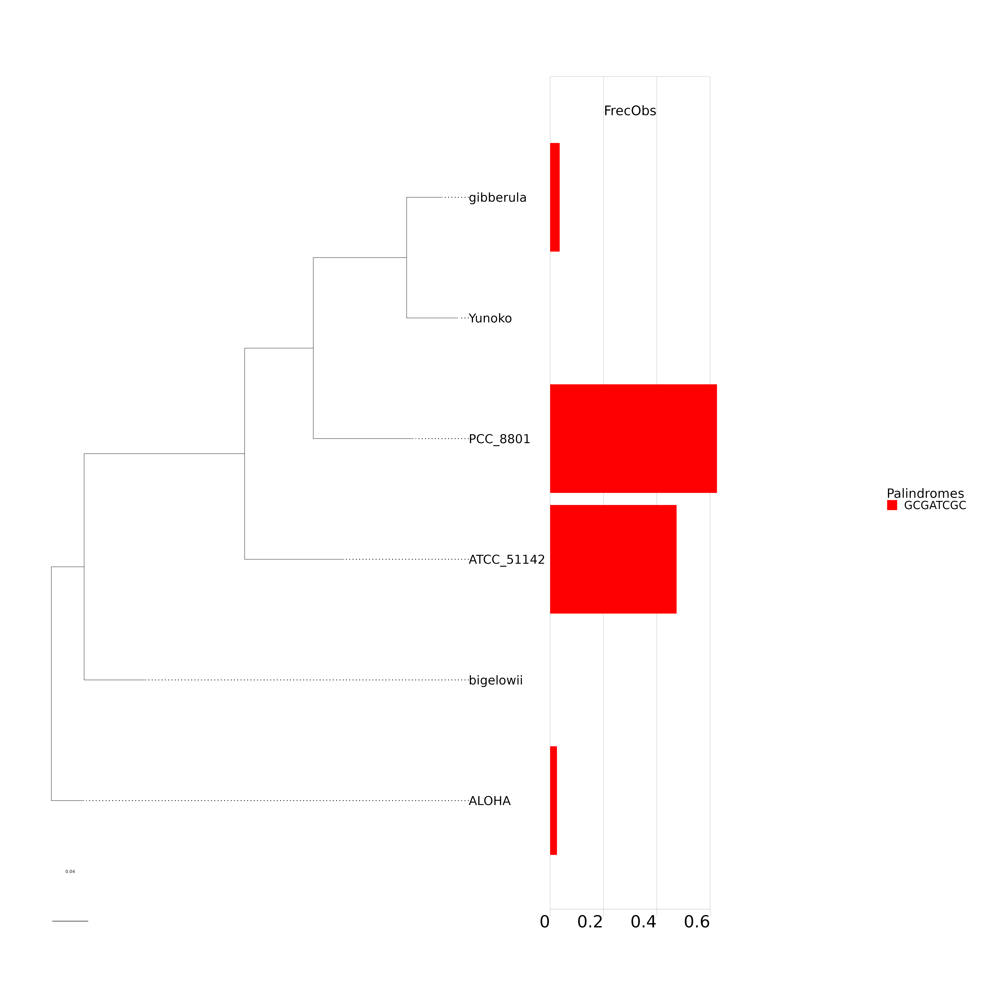
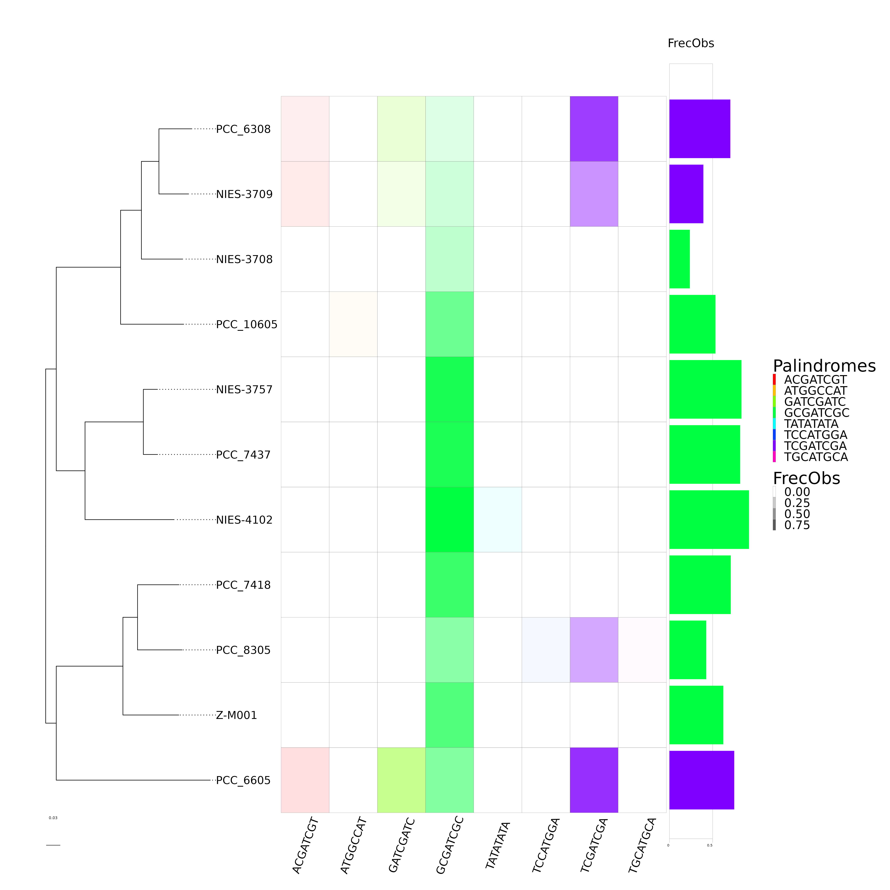
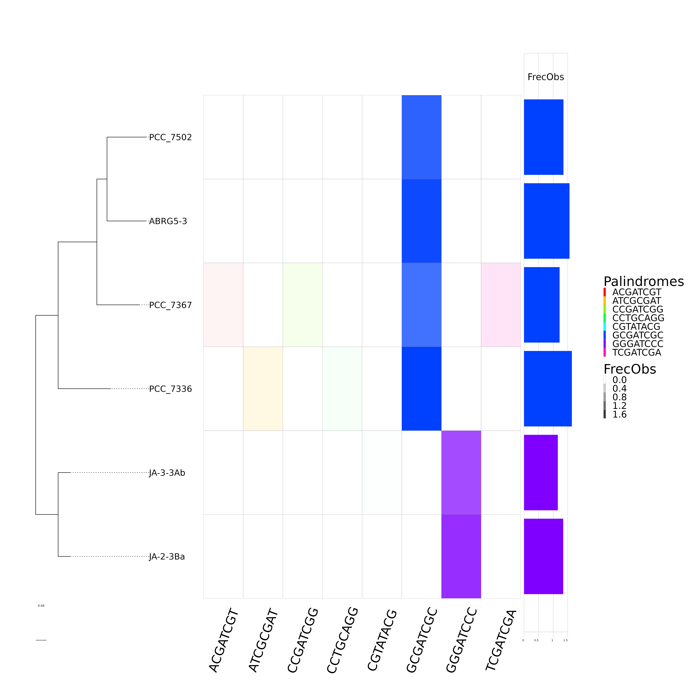
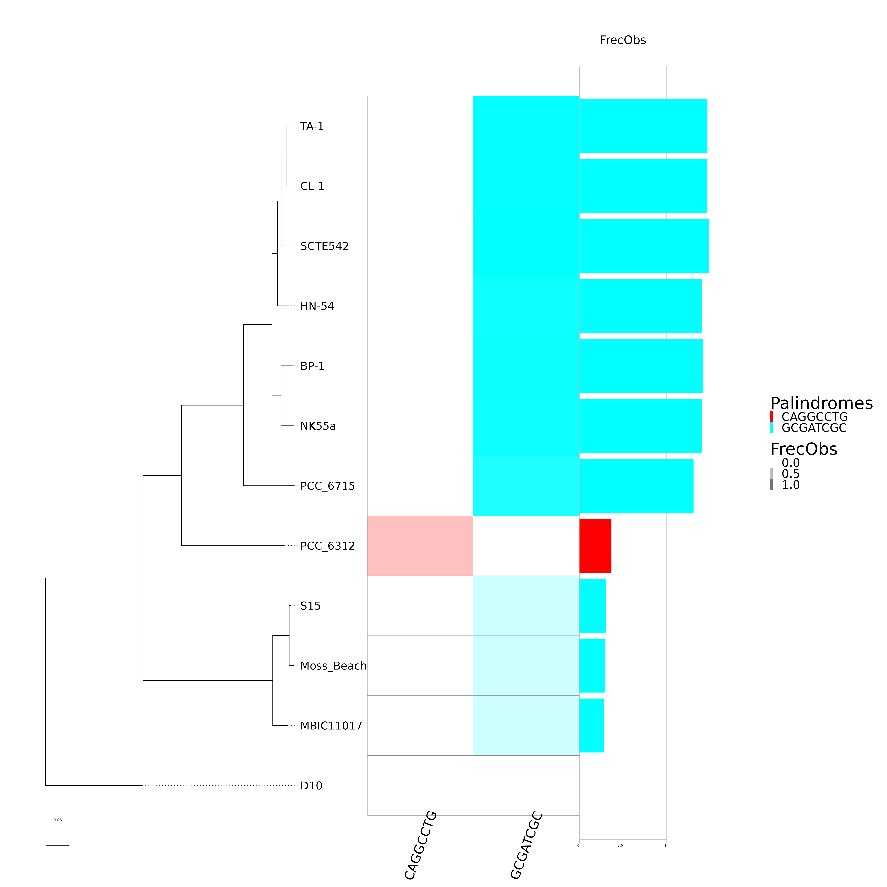
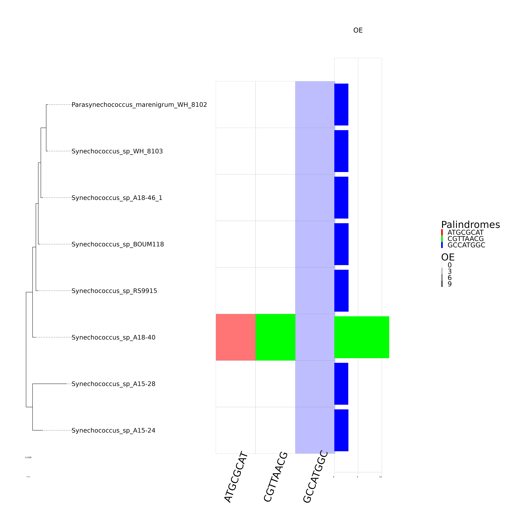
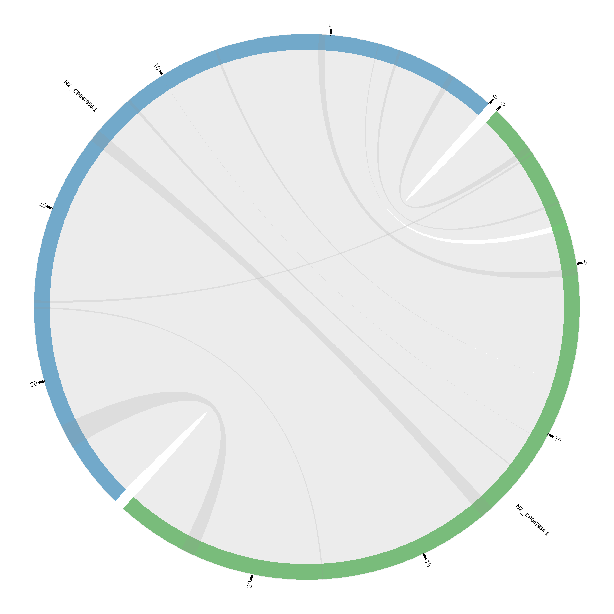
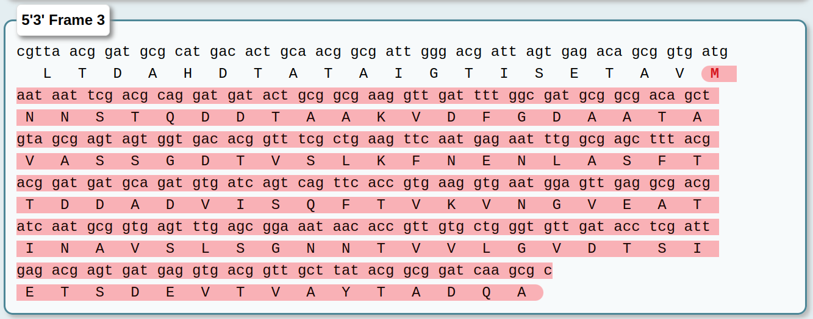
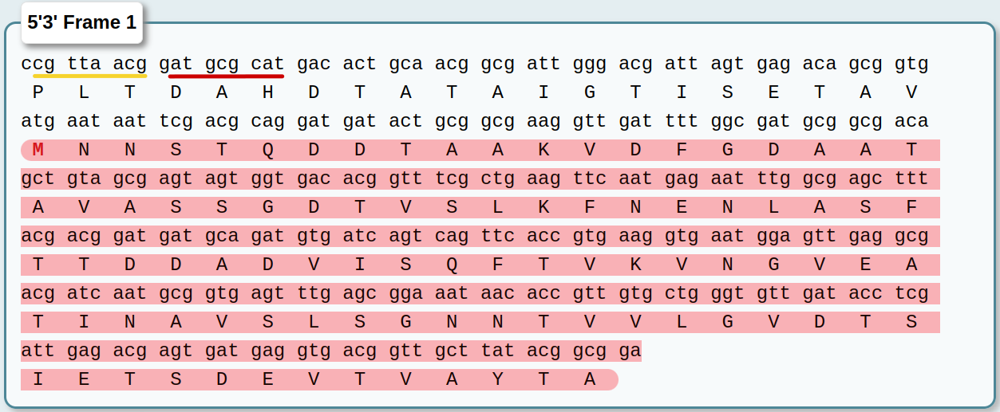

# Resultados

Para el analisis de los sitios palindrómicos primero se hizo un conteo de lo sitios en cada especie de cada clado para luego tomar aquella especie que tuviera la mayor cantidad de sitios posibles. Esto con el fin de tener mas sitios para analizar (Tabla \@ref(tab:HighestSites)).
<table class=" lightable-paper table table-striped table-condensed" style='font-family: "Arial Narrow", arial, helvetica, sans-serif; margin-left: auto; margin-right: auto; font-size: 11px; width: auto !important; margin-left: auto; margin-right: auto;'>
<caption style="font-size: initial !important;">(\#tab:HighestSites)Conteo de sitios en las especies de cada clado.</caption>
 <thead>
  <tr>
   <th style="text-align:left;position: sticky; top:0; background-color: #FFFFFF;"> Clade </th>
   <th style="text-align:left;position: sticky; top:0; background-color: #FFFFFF;"> Spp </th>
   <th style="text-align:left;position: sticky; top:0; background-color: #FFFFFF;"> SiteCounts </th>
  </tr>
 </thead>
<tbody>
  <tr>
   <td style="text-align:left;font-weight: bold;vertical-align: top !important;font-weight: bold;color: gray20 !important;background-color: #FFE4E1 !important;" rowspan="6"> Callothrix_clade </td>
   <td style="text-align:left;font-weight: bold;font-weight: bold;color: gray20 !important;background-color: #FFE4E1 !important;"> <span style="     border-radius: 4px; padding-right: 4px; padding-left: 4px; background-color: gray20 !important;">PCC_7716</span> </td>
   <td style="text-align:left;font-weight: bold;color: gray20 !important;background-color: #FFE4E1 !important;"> <span style="display: block; padding: 0 4px; border-radius: 4px; background-color: #fffefe">12  </span> </td>
  </tr>
  <tr>
   
   <td style="text-align:left;font-weight: bold;font-weight: bold;color: gray20 !important;background-color: #FFE4E1 !important;"> <span style="     border-radius: 4px; padding-right: 4px; padding-left: 4px; background-color: gray20 !important;">NIES-4071</span> </td>
   <td style="text-align:left;font-weight: bold;color: gray20 !important;background-color: #FFE4E1 !important;"> <span style="display: block; padding: 0 4px; border-radius: 4px; background-color: #fffefd">19  </span> </td>
  </tr>
  <tr>
   
   <td style="text-align:left;font-weight: bold;font-weight: bold;color: gray20 !important;background-color: #FFE4E1 !important;"> <span style="     border-radius: 4px; padding-right: 4px; padding-left: 4px; background-color: gray20 !important;">NIES-4105</span> </td>
   <td style="text-align:left;font-weight: bold;color: gray20 !important;background-color: #FFE4E1 !important;"> <span style="display: block; padding: 0 4px; border-radius: 4px; background-color: #fffefd">19  </span> </td>
  </tr>
  <tr>
   
   <td style="text-align:left;font-weight: bold;font-weight: bold;color: gray20 !important;background-color: #FFE4E1 !important;"> <span style="     border-radius: 4px; padding-right: 4px; padding-left: 4px; background-color: gray20 !important;">PCC_6303</span> </td>
   <td style="text-align:left;font-weight: bold;color: gray20 !important;background-color: #FFE4E1 !important;"> <span style="display: block; padding: 0 4px; border-radius: 4px; background-color: #ffb93a">2473</span> </td>
  </tr>
  <tr>
   
   <td style="text-align:left;font-weight: bold;font-weight: bold;color: gray20 !important;background-color: #FFE4E1 !important;"> <span style="     border-radius: 4px; padding-right: 4px; padding-left: 4px; background-color: gray20 !important;">NIES-3974</span> </td>
   <td style="text-align:left;font-weight: bold;color: gray20 !important;background-color: #FFE4E1 !important;"> <span style="display: block; padding: 0 4px; border-radius: 4px; background-color: #ffa80a">3078</span> </td>
  </tr>
  <tr>
   
   <td style="text-align:left;font-weight: bold;font-weight: bold;color: gray20 !important;background-color: #FFE4E1 !important;"> <span style="     border-radius: 4px; padding-right: 4px; padding-left: 4px; background-color: yellow !important;">336/3</span> </td>
   <td style="text-align:left;font-weight: bold;color: gray20 !important;background-color: #FFE4E1 !important;"> <span style="display: block; padding: 0 4px; border-radius: 4px; background-color: #ffa500">3216</span> </td>
  </tr>
  <tr>
   <td style="text-align:left;font-weight: bold;vertical-align: top !important;" rowspan="6"> Cyanobacterium_clade </td>
   <td style="text-align:left;font-weight: bold;"> <span style="     border-radius: 4px; padding-right: 4px; padding-left: 4px; background-color: gray20 !important;">bigelowii</span> </td>
   <td style="text-align:left;"> <span style="display: block; padding: 0 4px; border-radius: 4px; background-color: #fffefe">14  </span> </td>
  </tr>
  <tr>
   
   <td style="text-align:left;font-weight: bold;"> <span style="     border-radius: 4px; padding-right: 4px; padding-left: 4px; background-color: gray20 !important;">ALOHA</span> </td>
   <td style="text-align:left;"> <span style="display: block; padding: 0 4px; border-radius: 4px; background-color: #fffefc">30  </span> </td>
  </tr>
  <tr>
   
   <td style="text-align:left;font-weight: bold;"> <span style="     border-radius: 4px; padding-right: 4px; padding-left: 4px; background-color: gray20 !important;">ATCC_51142</span> </td>
   <td style="text-align:left;"> <span style="display: block; padding: 0 4px; border-radius: 4px; background-color: #ffeecf">600 </span> </td>
  </tr>
  <tr>
   
   <td style="text-align:left;font-weight: bold;"> <span style="     border-radius: 4px; padding-right: 4px; padding-left: 4px; background-color: gray20 !important;">Yunoko</span> </td>
   <td style="text-align:left;"> <span style="display: block; padding: 0 4px; border-radius: 4px; background-color: #fffdfa">63  </span> </td>
  </tr>
  <tr>
   
   <td style="text-align:left;font-weight: bold;"> <span style="     border-radius: 4px; padding-right: 4px; padding-left: 4px; background-color: gray20 !important;">gibberula</span> </td>
   <td style="text-align:left;"> <span style="display: block; padding: 0 4px; border-radius: 4px; background-color: #fffdfa">65  </span> </td>
  </tr>
  <tr>
   
   <td style="text-align:left;font-weight: bold;"> <span style="     border-radius: 4px; padding-right: 4px; padding-left: 4px; background-color: yellow !important;">PCC_8801</span> </td>
   <td style="text-align:left;"> <span style="display: block; padding: 0 4px; border-radius: 4px; background-color: #ffe9c0">785 </span> </td>
  </tr>
  <tr>
   <td style="text-align:left;font-weight: bold;vertical-align: top !important;font-weight: bold;color: gray20 !important;background-color: #FFE4E1 !important;" rowspan="11"> Geminocystis_clade </td>
   <td style="text-align:left;font-weight: bold;font-weight: bold;color: gray20 !important;background-color: #FFE4E1 !important;"> <span style="     border-radius: 4px; padding-right: 4px; padding-left: 4px; background-color: gray20 !important;">Z-M001</span> </td>
   <td style="text-align:left;font-weight: bold;color: gray20 !important;background-color: #FFE4E1 !important;"> <span style="display: block; padding: 0 4px; border-radius: 4px; background-color: #ffe2ad">1028</span> </td>
  </tr>
  <tr>
   
   <td style="text-align:left;font-weight: bold;font-weight: bold;color: gray20 !important;background-color: #FFE4E1 !important;"> <span style="     border-radius: 4px; padding-right: 4px; padding-left: 4px; background-color: gray20 !important;">PCC_10605</span> </td>
   <td style="text-align:left;font-weight: bold;color: gray20 !important;background-color: #FFE4E1 !important;"> <span style="display: block; padding: 0 4px; border-radius: 4px; background-color: #ffe1ab">1055</span> </td>
  </tr>
  <tr>
   
   <td style="text-align:left;font-weight: bold;font-weight: bold;color: gray20 !important;background-color: #FFE4E1 !important;"> <span style="     border-radius: 4px; padding-right: 4px; padding-left: 4px; background-color: gray20 !important;">PCC_7418</span> </td>
   <td style="text-align:left;font-weight: bold;color: gray20 !important;background-color: #FFE4E1 !important;"> <span style="display: block; padding: 0 4px; border-radius: 4px; background-color: #ffdda0">1198</span> </td>
  </tr>
  <tr>
   
   <td style="text-align:left;font-weight: bold;font-weight: bold;color: gray20 !important;background-color: #FFE4E1 !important;"> <span style="     border-radius: 4px; padding-right: 4px; padding-left: 4px; background-color: gray20 !important;">PCC_7437</span> </td>
   <td style="text-align:left;font-weight: bold;color: gray20 !important;background-color: #FFE4E1 !important;"> <span style="display: block; padding: 0 4px; border-radius: 4px; background-color: #ffd994">1341</span> </td>
  </tr>
  <tr>
   
   <td style="text-align:left;font-weight: bold;font-weight: bold;color: gray20 !important;background-color: #FFE4E1 !important;"> <span style="     border-radius: 4px; padding-right: 4px; padding-left: 4px; background-color: gray20 !important;">NIES-3757</span> </td>
   <td style="text-align:left;font-weight: bold;color: gray20 !important;background-color: #FFE4E1 !important;"> <span style="display: block; padding: 0 4px; border-radius: 4px; background-color: #ffd993">1354</span> </td>
  </tr>
  <tr>
   
   <td style="text-align:left;font-weight: bold;font-weight: bold;color: gray20 !important;background-color: #FFE4E1 !important;"> <span style="     border-radius: 4px; padding-right: 4px; padding-left: 4px; background-color: yellow !important;">NIES-4102</span> </td>
   <td style="text-align:left;font-weight: bold;color: gray20 !important;background-color: #FFE4E1 !important;"> <span style="display: block; padding: 0 4px; border-radius: 4px; background-color: #ffd281">1586</span> </td>
  </tr>
  <tr>
   
   <td style="text-align:left;font-weight: bold;font-weight: bold;color: gray20 !important;background-color: #FFE4E1 !important;"> <span style="     border-radius: 4px; padding-right: 4px; padding-left: 4px; background-color: gray20 !important;">PCC_6308</span> </td>
   <td style="text-align:left;font-weight: bold;color: gray20 !important;background-color: #FFE4E1 !important;"> <span style="display: block; padding: 0 4px; border-radius: 4px; background-color: #fff8ec">241 </span> </td>
  </tr>
  <tr>
   
   <td style="text-align:left;font-weight: bold;font-weight: bold;color: gray20 !important;background-color: #FFE4E1 !important;"> <span style="     border-radius: 4px; padding-right: 4px; padding-left: 4px; background-color: gray20 !important;">NIES-3709</span> </td>
   <td style="text-align:left;font-weight: bold;color: gray20 !important;background-color: #FFE4E1 !important;"> <span style="display: block; padding: 0 4px; border-radius: 4px; background-color: #fff4e1">374 </span> </td>
  </tr>
  <tr>
   
   <td style="text-align:left;font-weight: bold;font-weight: bold;color: gray20 !important;background-color: #FFE4E1 !important;"> <span style="     border-radius: 4px; padding-right: 4px; padding-left: 4px; background-color: gray20 !important;">NIES-3708</span> </td>
   <td style="text-align:left;font-weight: bold;color: gray20 !important;background-color: #FFE4E1 !important;"> <span style="display: block; padding: 0 4px; border-radius: 4px; background-color: #fff2da">457 </span> </td>
  </tr>
  <tr>
   
   <td style="text-align:left;font-weight: bold;font-weight: bold;color: gray20 !important;background-color: #FFE4E1 !important;"> <span style="     border-radius: 4px; padding-right: 4px; padding-left: 4px; background-color: gray20 !important;">PCC_8305</span> </td>
   <td style="text-align:left;font-weight: bold;color: gray20 !important;background-color: #FFE4E1 !important;"> <span style="display: block; padding: 0 4px; border-radius: 4px; background-color: #ffedce">612 </span> </td>
  </tr>
  <tr>
   
   <td style="text-align:left;font-weight: bold;font-weight: bold;color: gray20 !important;background-color: #FFE4E1 !important;"> <span style="     border-radius: 4px; padding-right: 4px; padding-left: 4px; background-color: gray20 !important;">PCC_6605</span> </td>
   <td style="text-align:left;font-weight: bold;color: gray20 !important;background-color: #FFE4E1 !important;"> <span style="display: block; padding: 0 4px; border-radius: 4px; background-color: #ffebc7">706 </span> </td>
  </tr>
  <tr>
   <td style="text-align:left;font-weight: bold;vertical-align: top !important;" rowspan="6"> Pseudoanabaena_clade </td>
   <td style="text-align:left;font-weight: bold;"> <span style="     border-radius: 4px; padding-right: 4px; padding-left: 4px; background-color: gray20 !important;">JA-2-3Ba</span> </td>
   <td style="text-align:left;"> <span style="display: block; padding: 0 4px; border-radius: 4px; background-color: #fffefd">15  </span> </td>
  </tr>
  <tr>
   
   <td style="text-align:left;font-weight: bold;"> <span style="     border-radius: 4px; padding-right: 4px; padding-left: 4px; background-color: gray20 !important;">PCC_7367</span> </td>
   <td style="text-align:left;"> <span style="display: block; padding: 0 4px; border-radius: 4px; background-color: #ffd27f">1608</span> </td>
  </tr>
  <tr>
   
   <td style="text-align:left;font-weight: bold;"> <span style="     border-radius: 4px; padding-right: 4px; padding-left: 4px; background-color: gray20 !important;">PCC_7502</span> </td>
   <td style="text-align:left;"> <span style="display: block; padding: 0 4px; border-radius: 4px; background-color: #ffc864">1949</span> </td>
  </tr>
  <tr>
   
   <td style="text-align:left;font-weight: bold;"> <span style="     border-radius: 4px; padding-right: 4px; padding-left: 4px; background-color: gray20 !important;">ABRG5-3</span> </td>
   <td style="text-align:left;"> <span style="display: block; padding: 0 4px; border-radius: 4px; background-color: #ffbf4a">2280</span> </td>
  </tr>
  <tr>
   
   <td style="text-align:left;font-weight: bold;"> <span style="     border-radius: 4px; padding-right: 4px; padding-left: 4px; background-color: yellow !important;">PCC_7336</span> </td>
   <td style="text-align:left;"> <span style="display: block; padding: 0 4px; border-radius: 4px; background-color: #ffbe48">2303</span> </td>
  </tr>
  <tr>
   
   <td style="text-align:left;font-weight: bold;"> <span style="     border-radius: 4px; padding-right: 4px; padding-left: 4px; background-color: gray20 !important;">JA-3-3Ab</span> </td>
   <td style="text-align:left;"> <span style="display: block; padding: 0 4px; border-radius: 4px; background-color: #fffefd">24  </span> </td>
  </tr>
  <tr>
   <td style="text-align:left;font-weight: bold;vertical-align: top !important;font-weight: bold;color: gray20 !important;background-color: #FFE4E1 !important;" rowspan="12"> Thermosynechococcus_clade </td>
   <td style="text-align:left;font-weight: bold;font-weight: bold;color: gray20 !important;background-color: #FFE4E1 !important;"> <span style="     border-radius: 4px; padding-right: 4px; padding-left: 4px; background-color: gray20 !important;">PCC_6715</span> </td>
   <td style="text-align:left;font-weight: bold;color: gray20 !important;background-color: #FFE4E1 !important;"> <span style="display: block; padding: 0 4px; border-radius: 4px; background-color: #ffd485">1531</span> </td>
  </tr>
  <tr>
   
   <td style="text-align:left;font-weight: bold;font-weight: bold;color: gray20 !important;background-color: #FFE4E1 !important;"> <span style="     border-radius: 4px; padding-right: 4px; padding-left: 4px; background-color: gray20 !important;">NK55a</span> </td>
   <td style="text-align:left;font-weight: bold;color: gray20 !important;background-color: #FFE4E1 !important;"> <span style="display: block; padding: 0 4px; border-radius: 4px; background-color: #ffd27f">1606</span> </td>
  </tr>
  <tr>
   
   <td style="text-align:left;font-weight: bold;font-weight: bold;color: gray20 !important;background-color: #FFE4E1 !important;"> <span style="     border-radius: 4px; padding-right: 4px; padding-left: 4px; background-color: gray20 !important;">HN-54</span> </td>
   <td style="text-align:left;font-weight: bold;color: gray20 !important;background-color: #FFE4E1 !important;"> <span style="display: block; padding: 0 4px; border-radius: 4px; background-color: #ffd17e">1621</span> </td>
  </tr>
  <tr>
   
   <td style="text-align:left;font-weight: bold;font-weight: bold;color: gray20 !important;background-color: #FFE4E1 !important;"> <span style="     border-radius: 4px; padding-right: 4px; padding-left: 4px; background-color: gray20 !important;">BP-1</span> </td>
   <td style="text-align:left;font-weight: bold;color: gray20 !important;background-color: #FFE4E1 !important;"> <span style="display: block; padding: 0 4px; border-radius: 4px; background-color: #ffd07b">1663</span> </td>
  </tr>
  <tr>
   
   <td style="text-align:left;font-weight: bold;font-weight: bold;color: gray20 !important;background-color: #FFE4E1 !important;"> <span style="     border-radius: 4px; padding-right: 4px; padding-left: 4px; background-color: gray20 !important;">CL-1</span> </td>
   <td style="text-align:left;font-weight: bold;color: gray20 !important;background-color: #FFE4E1 !important;"> <span style="display: block; padding: 0 4px; border-radius: 4px; background-color: #ffd07a">1674</span> </td>
  </tr>
  <tr>
   
   <td style="text-align:left;font-weight: bold;font-weight: bold;color: gray20 !important;background-color: #FFE4E1 !important;"> <span style="     border-radius: 4px; padding-right: 4px; padding-left: 4px; background-color: gray20 !important;">TA-1</span> </td>
   <td style="text-align:left;font-weight: bold;color: gray20 !important;background-color: #FFE4E1 !important;"> <span style="display: block; padding: 0 4px; border-radius: 4px; background-color: #ffcf78">1692</span> </td>
  </tr>
  <tr>
   
   <td style="text-align:left;font-weight: bold;font-weight: bold;color: gray20 !important;background-color: #FFE4E1 !important;"> <span style="     border-radius: 4px; padding-right: 4px; padding-left: 4px; background-color: yellow !important;">SCTE542</span> </td>
   <td style="text-align:left;font-weight: bold;color: gray20 !important;background-color: #FFE4E1 !important;"> <span style="display: block; padding: 0 4px; border-radius: 4px; background-color: #ffcf78">1694</span> </td>
  </tr>
  <tr>
   
   <td style="text-align:left;font-weight: bold;font-weight: bold;color: gray20 !important;background-color: #FFE4E1 !important;"> <span style="     border-radius: 4px; padding-right: 4px; padding-left: 4px; background-color: gray20 !important;">D10</span> </td>
   <td style="text-align:left;font-weight: bold;color: gray20 !important;background-color: #FFE4E1 !important;"> <span style="display: block; padding: 0 4px; border-radius: 4px; background-color: #ffffff">2   </span> </td>
  </tr>
  <tr>
   
   <td style="text-align:left;font-weight: bold;font-weight: bold;color: gray20 !important;background-color: #FFE4E1 !important;"> <span style="     border-radius: 4px; padding-right: 4px; padding-left: 4px; background-color: gray20 !important;">PCC_6312</span> </td>
   <td style="text-align:left;font-weight: bold;color: gray20 !important;background-color: #FFE4E1 !important;"> <span style="display: block; padding: 0 4px; border-radius: 4px; background-color: #ffffff">2   </span> </td>
  </tr>
  <tr>
   
   <td style="text-align:left;font-weight: bold;font-weight: bold;color: gray20 !important;background-color: #FFE4E1 !important;"> <span style="     border-radius: 4px; padding-right: 4px; padding-left: 4px; background-color: gray20 !important;">Moss_Beach</span> </td>
   <td style="text-align:left;font-weight: bold;color: gray20 !important;background-color: #FFE4E1 !important;"> <span style="display: block; padding: 0 4px; border-radius: 4px; background-color: #fff0d7">502 </span> </td>
  </tr>
  <tr>
   
   <td style="text-align:left;font-weight: bold;font-weight: bold;color: gray20 !important;background-color: #FFE4E1 !important;"> <span style="     border-radius: 4px; padding-right: 4px; padding-left: 4px; background-color: gray20 !important;">S15</span> </td>
   <td style="text-align:left;font-weight: bold;color: gray20 !important;background-color: #FFE4E1 !important;"> <span style="display: block; padding: 0 4px; border-radius: 4px; background-color: #fff0d6">516 </span> </td>
  </tr>
  <tr>
   
   <td style="text-align:left;font-weight: bold;font-weight: bold;color: gray20 !important;background-color: #FFE4E1 !important;"> <span style="     border-radius: 4px; padding-right: 4px; padding-left: 4px; background-color: gray20 !important;">MBIC11017</span> </td>
   <td style="text-align:left;font-weight: bold;color: gray20 !important;background-color: #FFE4E1 !important;"> <span style="display: block; padding: 0 4px; border-radius: 4px; background-color: #fff0d5">527 </span> </td>
  </tr>
</tbody>
</table>


## Distribución de HIP1 en los marcos de lectura

Para ver como es la distribución de los sitios HIP1 a traves del genoma hicimos un conteo de sitios en cada marco de lectura (Tabla \@ref(tab:TABMuts)).

<table class=" lightable-paper table table-striped table-condensed" style='font-family: "Arial Narrow", arial, helvetica, sans-serif; margin-left: auto; margin-right: auto; font-size: 11px; width: auto !important; margin-left: auto; margin-right: auto;'>
<caption style="font-size: initial !important;">(\#tab:TABMuts)Conteo de sitios por marco de lectura.</caption>
 <thead>
  <tr>
   <th style="text-align:left;position: sticky; top:0; background-color: #FFFFFF;"> Clade </th>
   <th style="text-align:left;position: sticky; top:0; background-color: #FFFFFF;"> Spp </th>
   <th style="text-align:left;position: sticky; top:0; background-color: #FFFFFF;"> RF1 </th>
   <th style="text-align:left;position: sticky; top:0; background-color: #FFFFFF;"> RF2 </th>
   <th style="text-align:left;position: sticky; top:0; background-color: #FFFFFF;"> RF3 </th>
   <th style="text-align:left;position: sticky; top:0; background-color: #FFFFFF;"> AllFrames </th>
  </tr>
 </thead>
<tbody>
  <tr>
   <td style="text-align:left;font-weight: bold;"> Callothrix_clade </td>
   <td style="text-align:left;font-weight: bold;"> 336-3 </td>
   <td style="text-align:left;"> 1396 </td>
   <td style="text-align:left;"> 831 </td>
   <td style="text-align:left;"> 364 </td>
   <td style="text-align:left;"> 2591 </td>
  </tr>
  <tr>
   <td style="text-align:left;font-weight: bold;"> Cyanobacterium_clade </td>
   <td style="text-align:left;font-weight: bold;"> PCC_8801 </td>
   <td style="text-align:left;"> 300 </td>
   <td style="text-align:left;"> 281 </td>
   <td style="text-align:left;"> 119 </td>
   <td style="text-align:left;"> 700 </td>
  </tr>
  <tr>
   <td style="text-align:left;font-weight: bold;"> Geminocystis_clade </td>
   <td style="text-align:left;font-weight: bold;"> NIES-4102 </td>
   <td style="text-align:left;"> 724 </td>
   <td style="text-align:left;"> 490 </td>
   <td style="text-align:left;"> 159 </td>
   <td style="text-align:left;"> 1373 </td>
  </tr>
  <tr>
   <td style="text-align:left;font-weight: bold;"> Pseudoanabaena_clade </td>
   <td style="text-align:left;font-weight: bold;"> PCC_7336 </td>
   <td style="text-align:left;"> 904 </td>
   <td style="text-align:left;"> 718 </td>
   <td style="text-align:left;"> 272 </td>
   <td style="text-align:left;"> 1894 </td>
  </tr>
  <tr>
   <td style="text-align:left;font-weight: bold;"> Thermosynechococcus_clade </td>
   <td style="text-align:left;font-weight: bold;"> SCTE542 </td>
   <td style="text-align:left;"> 500 </td>
   <td style="text-align:left;"> 741 </td>
   <td style="text-align:left;"> 204 </td>
   <td style="text-align:left;"> 1445 </td>
  </tr>
</tbody>
</table>


## Clado Calothrix

El clado calothrix contiene 6 especies  y es de interes ya que segun la filogenia estan estrechamente relacionadas y muestra un cambio en el palindromo mas abundante, pasando de **GCGATCGC** a **TGGCGCCA** (Figure \@ref(fig:FIG12)).
<div class="figure" style="text-align: center">

<p class="caption">(\#fig:FIG12)**Filogenia anotada del clado Calothrix.** En esta imagen se muestra un cambio abrupto en la Frecuencia observada de **GCGCATCGC** en las especies NIES-4105, NIES-4071 y PCC\_7716.</p>
</div>

### GCGATCGC

#### Red de transiciones

Para hacer mas visual la reconstrucción, construimos una red de las transiciones entre los estados ancestrales. Esto lo hicimos en r usando la función ```Create_Transition_Table()```:


```r
source("ASR_Orth_Functions/NodeAndEdges.R")
Nodes.Edges <- Create_Transition_Table(SitesTable = "Clados/Callothrix_clade/PALINDROMES/GCGATCGC/336-3/Orthologues_Palindrome_sites.txt",
                                EvolutionModel = "F81",
                                Method = "bayes",
                                Phylogeny = "Clados/Callothrix_clade/SpeciesTree_rooted.txt",
                                OrthoPath = "Clados/Callothrix_clade/PALINDROMES/GCGATCGC/336-3/Only_ORTHOLOGUES/")

```

Posteriormente creamos la red usando la función ```Create_Network()```:


y visualizamos dicha red .


Para visualizar la red usamos la paqueteria ```networkD3```. Hicimos 2 figuras, la (Figura \@ref(fig:FIG13)) muestra la red como una conexión de nodos a través de vertices con un grosor proporcional al numero de veces que ocurrió cada transición. En dicha red podemos ver algunos nodos con bordes muy gruesos como **GCGATTGC**, **GCAATTGC**, **GCTATCGC**, **GCTATTGC** (Tabla \@ref(tab:TAB6)).


<div class="figure" style="text-align: center">

<p class="caption">(\#fig:FIG13)**Red de todas las transiciones del clado Calothrix.** En esta imagen se muestra una red en la que cada nodo es un octanucleótido el cual esta unido a otro nodo por un vertice. Dicho vertice tiene un grosor proporcional al numero de veces que dicha transición ocurrió en la reconstrucción ancestral de sitios.</p>
</div>

En la (Figura \@ref(fig:FIG14)) podemos ver las transiciones de una forma mas ordenada, con el numero de ocurrencias y la dirección en la que ocurrieron.
<div class="figure" style="text-align: center">

<p class="caption">(\#fig:FIG14)**Red de todas las transiciones del clado Calothrix.** En esta imagen se muestra la red  de la Figura \@ref(fig:FIG13) de una forma mas visual y con el numero de veces que ocurrio cada transición, asi como la dirección en la que ocurrió.</p>
</div>

<table class=" lightable-paper table table-striped table-condensed" style='font-family: "Arial Narrow", arial, helvetica, sans-serif; margin-left: auto; margin-right: auto; font-size: 11px; width: auto !important; margin-left: auto; margin-right: auto;'>
<caption style="font-size: initial !important;">(\#tab:TAB6)Transiciones entre nodos.</caption>
 <thead>
  <tr>
   <th style="text-align:left;position: sticky; top:0; background-color: #FFFFFF;"> from </th>
   <th style="text-align:left;position: sticky; top:0; background-color: #FFFFFF;"> to </th>
   <th style="text-align:left;position: sticky; top:0; background-color: #FFFFFF;"> weight </th>
  </tr>
 </thead>
<tbody>
  <tr>
   <td style="text-align:left;font-weight: bold;"> <span style="     color: black !important;">GCGATTGC</span> </td>
   <td style="text-align:left;font-weight: bold;vertical-align: top !important;" rowspan="9"> <span style="     color: red !important;">GCGATCGC</span> </td>
   <td style="text-align:left;"> <span style="display: block; padding: 0 4px; border-radius: 4px; background-color: #ffa500">95</span> </td>
  </tr>
  <tr>
   <td style="text-align:left;font-weight: bold;"> <span style="     color: blue !important;">GCAATTGC</span> </td>
   
   <td style="text-align:left;"> <span style="display: block; padding: 0 4px; border-radius: 4px; background-color: #ffb01f">84</span> </td>
  </tr>
  <tr>
   <td style="text-align:left;font-weight: bold;"> <span style="     color: black !important;">GCTATCGC</span> </td>
   
   <td style="text-align:left;"> <span style="display: block; padding: 0 4px; border-radius: 4px; background-color: #ffc04e">68</span> </td>
  </tr>
  <tr>
   <td style="text-align:left;font-weight: bold;"> <span style="     color: black !important;">GCTATTGC</span> </td>
   
   <td style="text-align:left;"> <span style="display: block; padding: 0 4px; border-radius: 4px; background-color: #ffc151">67</span> </td>
  </tr>
  <tr>
   <td style="text-align:left;font-weight: bold;"> <span style="     color: black !important;">GCAATCGC</span> </td>
   
   <td style="text-align:left;"> <span style="display: block; padding: 0 4px; border-radius: 4px; background-color: #ffc65f">62</span> </td>
  </tr>
  <tr>
   <td style="text-align:left;font-weight: bold;"> <span style="     color: black !important;">--------</span> </td>
   
   <td style="text-align:left;"> <span style="display: block; padding: 0 4px; border-radius: 4px; background-color: #ffcc71">56</span> </td>
  </tr>
  <tr>
   <td style="text-align:left;font-weight: bold;"> <span style="     color: black !important;">GCGACCGC</span> </td>
   
   <td style="text-align:left;"> <span style="display: block; padding: 0 4px; border-radius: 4px; background-color: #ffcf79">53</span> </td>
  </tr>
  <tr>
   <td style="text-align:left;font-weight: bold;"> <span style="     color: black !important;">GCCATCGC</span> </td>
   
   <td style="text-align:left;"> <span style="display: block; padding: 0 4px; border-radius: 4px; background-color: #ffd588">48</span> </td>
  </tr>
  <tr>
   <td style="text-align:left;font-weight: bold;"> <span style="     color: black !important;">GCGACCGT</span> </td>
   
   <td style="text-align:left;"> <span style="display: block; padding: 0 4px; border-radius: 4px; background-color: #ffd68b">47</span> </td>
  </tr>
  <tr>
   <td style="text-align:left;font-weight: bold;"> <span style="     color: red !important;">GCGATCGC</span> </td>
   <td style="text-align:left;font-weight: bold;"> <span style="     color: black !important;">GCGATTGC</span> </td>
   <td style="text-align:left;"> <span style="display: block; padding: 0 4px; border-radius: 4px; background-color: #ffd890">45</span> </td>
  </tr>
  <tr>
   <td style="text-align:left;font-weight: bold;"> <span style="     color: black !important;">GCGATAGC</span> </td>
   <td style="text-align:left;font-weight: bold;"> <span style="     color: red !important;">GCGATCGC</span> </td>
   <td style="text-align:left;"> <span style="display: block; padding: 0 4px; border-radius: 4px; background-color: #ffd993">44</span> </td>
  </tr>
  <tr>
   <td style="text-align:left;font-weight: bold;"> <span style="     color: blue !important;">GCAATTGC</span> </td>
   <td style="text-align:left;font-weight: bold;"> <span style="     color: black !important;">GCGATTGC</span> </td>
   <td style="text-align:left;"> <span style="display: block; padding: 0 4px; border-radius: 4px; background-color: #ffda96">43</span> </td>
  </tr>
  <tr>
   <td style="text-align:left;font-weight: bold;"> <span style="     color: black !important;">GCCATTGC</span> </td>
   <td style="text-align:left;font-weight: bold;vertical-align: top !important;" rowspan="2"> <span style="     color: red !important;">GCGATCGC</span> </td>
   <td style="text-align:left;"> <span style="display: block; padding: 0 4px; border-radius: 4px; background-color: #ffdd9f">40</span> </td>
  </tr>
  <tr>
   <td style="text-align:left;font-weight: bold;"> <span style="     color: black !important;">GCAATAGC</span> </td>
   
   <td style="text-align:left;"> <span style="display: block; padding: 0 4px; border-radius: 4px; background-color: #ffdfa5">38</span> </td>
  </tr>
  <tr>
   <td style="text-align:left;font-weight: bold;"> <span style="     color: red !important;">GCGATCGC</span> </td>
   <td style="text-align:left;font-weight: bold;"> <span style="     color: black !important;">GCAATCGC</span> </td>
   <td style="text-align:left;"> <span style="display: block; padding: 0 4px; border-radius: 4px; background-color: #ffe3b0">34</span> </td>
  </tr>
  <tr>
   <td style="text-align:left;font-weight: bold;vertical-align: top !important;" rowspan="2"> <span style="     color: black !important;">GCTATTGC</span> </td>
   <td style="text-align:left;font-weight: bold;"> <span style="     color: black !important;">GCTATCGC</span> </td>
   <td style="text-align:left;"> <span style="display: block; padding: 0 4px; border-radius: 4px; background-color: #ffe5b6">32</span> </td>
  </tr>
  <tr>
   
   <td style="text-align:left;font-weight: bold;"> <span style="     color: black !important;">GCGATTGC</span> </td>
   <td style="text-align:left;"> <span style="display: block; padding: 0 4px; border-radius: 4px; background-color: #ffe6b9">31</span> </td>
  </tr>
  <tr>
   <td style="text-align:left;font-weight: bold;"> <span style="     color: black !important;">GTGATCGC</span> </td>
   <td style="text-align:left;font-weight: bold;vertical-align: top !important;" rowspan="3"> <span style="     color: red !important;">GCGATCGC</span> </td>
   <td style="text-align:left;"> <span style="display: block; padding: 0 4px; border-radius: 4px; background-color: #ffe8bf">29</span> </td>
  </tr>
  <tr>
   <td style="text-align:left;font-weight: bold;"> <span style="     color: black !important;">GTGACCGC</span> </td>
   
   <td style="text-align:left;"> <span style="display: block; padding: 0 4px; border-radius: 4px; background-color: #ffecca">25</span> </td>
  </tr>
  <tr>
   <td style="text-align:left;font-weight: bold;"> <span style="     color: black !important;">GTGACCGT</span> </td>
   
   <td style="text-align:left;"> <span style="display: block; padding: 0 4px; border-radius: 4px; background-color: #ffedcd">24</span> </td>
  </tr>
  <tr>
   <td style="text-align:left;font-weight: bold;"> <span style="     color: black !important;">GCGACCGT</span> </td>
   <td style="text-align:left;font-weight: bold;"> <span style="     color: black !important;">GCGACCGC</span> </td>
   <td style="text-align:left;"> <span style="display: block; padding: 0 4px; border-radius: 4px; background-color: #ffefd3">22</span> </td>
  </tr>
  <tr>
   <td style="text-align:left;font-weight: bold;"> <span style="     color: blue !important;">GCAATTGC</span> </td>
   <td style="text-align:left;font-weight: bold;"> <span style="     color: black !important;">GCAATCGC</span> </td>
   <td style="text-align:left;"> <span style="display: block; padding: 0 4px; border-radius: 4px; background-color: #ffefd3">22</span> </td>
  </tr>
  <tr>
   <td style="text-align:left;font-weight: bold;"> <span style="     color: black !important;">GCGATCGT</span> </td>
   <td style="text-align:left;font-weight: bold;"> <span style="     color: red !important;">GCGATCGC</span> </td>
   <td style="text-align:left;"> <span style="display: block; padding: 0 4px; border-radius: 4px; background-color: #ffefd3">22</span> </td>
  </tr>
  <tr>
   <td style="text-align:left;font-weight: bold;"> <span style="     color: red !important;">GCGATCGC</span> </td>
   <td style="text-align:left;font-weight: bold;"> <span style="     color: blue !important;">GCAATTGC</span> </td>
   <td style="text-align:left;"> <span style="display: block; padding: 0 4px; border-radius: 4px; background-color: #ffefd3">22</span> </td>
  </tr>
  <tr>
   <td style="text-align:left;font-weight: bold;"> <span style="     color: black !important;">GCTATAGC</span> </td>
   <td style="text-align:left;font-weight: bold;vertical-align: top !important;" rowspan="3"> <span style="     color: red !important;">GCGATCGC</span> </td>
   <td style="text-align:left;"> <span style="display: block; padding: 0 4px; border-radius: 4px; background-color: #fff0d6">21</span> </td>
  </tr>
  <tr>
   <td style="text-align:left;font-weight: bold;"> <span style="     color: black !important;">GCGTTCGC</span> </td>
   
   <td style="text-align:left;"> <span style="display: block; padding: 0 4px; border-radius: 4px; background-color: #fff0d6">21</span> </td>
  </tr>
  <tr>
   <td style="text-align:left;font-weight: bold;"> <span style="     color: black !important;">GCGATAGA</span> </td>
   
   <td style="text-align:left;"> <span style="display: block; padding: 0 4px; border-radius: 4px; background-color: #fff0d6">21</span> </td>
  </tr>
  <tr>
   <td style="text-align:left;font-weight: bold;"> <span style="     color: black !important;">GCTATTGC</span> </td>
   <td style="text-align:left;font-weight: bold;"> <span style="     color: blue !important;">GCAATTGC</span> </td>
   <td style="text-align:left;"> <span style="display: block; padding: 0 4px; border-radius: 4px; background-color: #fff2dc">19</span> </td>
  </tr>
  <tr>
   <td style="text-align:left;font-weight: bold;"> <span style="     color: black !important;">GCCATAGC</span> </td>
   <td style="text-align:left;font-weight: bold;vertical-align: top !important;" rowspan="2"> <span style="     color: red !important;">GCGATCGC</span> </td>
   <td style="text-align:left;"> <span style="display: block; padding: 0 4px; border-radius: 4px; background-color: #fff3df">18</span> </td>
  </tr>
  <tr>
   <td style="text-align:left;font-weight: bold;"> <span style="     color: black !important;">GTGATAGA</span> </td>
   
   <td style="text-align:left;"> <span style="display: block; padding: 0 4px; border-radius: 4px; background-color: #fff3df">18</span> </td>
  </tr>
  <tr>
   <td style="text-align:left;font-weight: bold;"> <span style="     color: blue !important;">GCAATTGC</span> </td>
   <td style="text-align:left;font-weight: bold;vertical-align: top !important;" rowspan="2"> <span style="     color: black !important;">GCTATTGC</span> </td>
   <td style="text-align:left;"> <span style="display: block; padding: 0 4px; border-radius: 4px; background-color: #fff3df">18</span> </td>
  </tr>
  <tr>
   <td style="text-align:left;font-weight: bold;vertical-align: top !important;" rowspan="4"> <span style="     color: red !important;">GCGATCGC</span> </td>
   
   <td style="text-align:left;"> <span style="display: block; padding: 0 4px; border-radius: 4px; background-color: #fff4e2">17</span> </td>
  </tr>
  <tr>
   
   <td style="text-align:left;font-weight: bold;"> <span style="     color: black !important;">GTGATCGC</span> </td>
   <td style="text-align:left;"> <span style="display: block; padding: 0 4px; border-radius: 4px; background-color: #fff4e2">17</span> </td>
  </tr>
  <tr>
   
   <td style="text-align:left;font-weight: bold;"> <span style="     color: black !important;">GCGATAGC</span> </td>
   <td style="text-align:left;"> <span style="display: block; padding: 0 4px; border-radius: 4px; background-color: #fff4e2">17</span> </td>
  </tr>
  <tr>
   
   <td style="text-align:left;font-weight: bold;"> <span style="     color: black !important;">GCGACCGC</span> </td>
   <td style="text-align:left;"> <span style="display: block; padding: 0 4px; border-radius: 4px; background-color: #fff4e2">17</span> </td>
  </tr>
  <tr>
   <td style="text-align:left;font-weight: bold;"> <span style="     color: black !important;">GCAATAGC</span> </td>
   <td style="text-align:left;font-weight: bold;"> <span style="     color: black !important;">GCAATCGC</span> </td>
   <td style="text-align:left;"> <span style="display: block; padding: 0 4px; border-radius: 4px; background-color: #fff5e4">16</span> </td>
  </tr>
  <tr>
   <td style="text-align:left;font-weight: bold;"> <span style="     color: black !important;">GCCATTGC</span> </td>
   <td style="text-align:left;font-weight: bold;"> <span style="     color: black !important;">GCGATTGC</span> </td>
   <td style="text-align:left;"> <span style="display: block; padding: 0 4px; border-radius: 4px; background-color: #fff6e7">15</span> </td>
  </tr>
  <tr>
   <td style="text-align:left;font-weight: bold;vertical-align: top !important;" rowspan="2"> <span style="     color: red !important;">GCGATCGC</span> </td>
   <td style="text-align:left;font-weight: bold;"> <span style="     color: black !important;">GCGATCGA</span> </td>
   <td style="text-align:left;"> <span style="display: block; padding: 0 4px; border-radius: 4px; background-color: #fff6e7">15</span> </td>
  </tr>
  <tr>
   
   <td style="text-align:left;font-weight: bold;"> <span style="     color: black !important;">GCGATCGT</span> </td>
   <td style="text-align:left;"> <span style="display: block; padding: 0 4px; border-radius: 4px; background-color: #fff6e7">15</span> </td>
  </tr>
  <tr>
   <td style="text-align:left;font-weight: bold;"> <span style="     color: black !important;">GTGACCGT</span> </td>
   <td style="text-align:left;font-weight: bold;"> <span style="     color: black !important;">GCGACCGT</span> </td>
   <td style="text-align:left;"> <span style="display: block; padding: 0 4px; border-radius: 4px; background-color: #fff7ea">14</span> </td>
  </tr>
  <tr>
   <td style="text-align:left;font-weight: bold;"> <span style="     color: black !important;">GCCATTGC</span> </td>
   <td style="text-align:left;font-weight: bold;"> <span style="     color: black !important;">GCCATCGC</span> </td>
   <td style="text-align:left;"> <span style="display: block; padding: 0 4px; border-radius: 4px; background-color: #fff7ea">14</span> </td>
  </tr>
  <tr>
   <td style="text-align:left;font-weight: bold;"> <span style="     color: red !important;">GCGATCGC</span> </td>
   <td style="text-align:left;font-weight: bold;"> <span style="     color: black !important;">GCGAACGC</span> </td>
   <td style="text-align:left;"> <span style="display: block; padding: 0 4px; border-radius: 4px; background-color: #fff7ea">14</span> </td>
  </tr>
  <tr>
   <td style="text-align:left;font-weight: bold;"> <span style="     color: black !important;">GCGGTCGC</span> </td>
   <td style="text-align:left;font-weight: bold;"> <span style="     color: red !important;">GCGATCGC</span> </td>
   <td style="text-align:left;"> <span style="display: block; padding: 0 4px; border-radius: 4px; background-color: #fff7ea">14</span> </td>
  </tr>
  <tr>
   <td style="text-align:left;font-weight: bold;"> <span style="     color: black !important;">GCAATAGC</span> </td>
   <td style="text-align:left;font-weight: bold;"> <span style="     color: blue !important;">GCAATTGC</span> </td>
   <td style="text-align:left;"> <span style="display: block; padding: 0 4px; border-radius: 4px; background-color: #fff8ed">13</span> </td>
  </tr>
  <tr>
   <td style="text-align:left;font-weight: bold;"> <span style="     color: red !important;">GCGATCGC</span> </td>
   <td style="text-align:left;font-weight: bold;"> <span style="     color: black !important;">GCTATCGC</span> </td>
   <td style="text-align:left;"> <span style="display: block; padding: 0 4px; border-radius: 4px; background-color: #fff8ed">13</span> </td>
  </tr>
  <tr>
   <td style="text-align:left;font-weight: bold;"> <span style="     color: black !important;">GCGATCGA</span> </td>
   <td style="text-align:left;font-weight: bold;"> <span style="     color: red !important;">GCGATCGC</span> </td>
   <td style="text-align:left;"> <span style="display: block; padding: 0 4px; border-radius: 4px; background-color: #fff8ed">13</span> </td>
  </tr>
  <tr>
   <td style="text-align:left;font-weight: bold;"> <span style="     color: black !important;">GTGACCGC</span> </td>
   <td style="text-align:left;font-weight: bold;"> <span style="     color: black !important;">GCGACCGC</span> </td>
   <td style="text-align:left;"> <span style="display: block; padding: 0 4px; border-radius: 4px; background-color: #fff9f0">12</span> </td>
  </tr>
  <tr>
   <td style="text-align:left;font-weight: bold;vertical-align: top !important;" rowspan="2"> <span style="     color: red !important;">GCGATCGC</span> </td>
   <td style="text-align:left;font-weight: bold;"> <span style="     color: black !important;">GCGTTCGC</span> </td>
   <td style="text-align:left;"> <span style="display: block; padding: 0 4px; border-radius: 4px; background-color: #fff9f0">12</span> </td>
  </tr>
  <tr>
   
   <td style="text-align:left;font-weight: bold;"> <span style="     color: black !important;">GCGGTCGC</span> </td>
   <td style="text-align:left;"> <span style="display: block; padding: 0 4px; border-radius: 4px; background-color: #fff9f0">12</span> </td>
  </tr>
  <tr>
   <td style="text-align:left;font-weight: bold;"> <span style="     color: black !important;">GCAATAGC</span> </td>
   <td style="text-align:left;font-weight: bold;"> <span style="     color: black !important;">GCGATAGC</span> </td>
   <td style="text-align:left;"> <span style="display: block; padding: 0 4px; border-radius: 4px; background-color: #fff9f0">12</span> </td>
  </tr>
  <tr>
   <td style="text-align:left;font-weight: bold;"> <span style="     color: black !important;">GCGGTTGC</span> </td>
   <td style="text-align:left;font-weight: bold;"> <span style="     color: red !important;">GCGATCGC</span> </td>
   <td style="text-align:left;"> <span style="display: block; padding: 0 4px; border-radius: 4px; background-color: #fffaf3">11</span> </td>
  </tr>
  <tr>
   <td style="text-align:left;font-weight: bold;"> <span style="     color: red !important;">GCGATCGC</span> </td>
   <td style="text-align:left;font-weight: bold;"> <span style="     color: black !important;">GCGAGCGC</span> </td>
   <td style="text-align:left;"> <span style="display: block; padding: 0 4px; border-radius: 4px; background-color: #fffaf3">11</span> </td>
  </tr>
  <tr>
   <td style="text-align:left;font-weight: bold;"> <span style="     color: black !important;">ACGTTCGC</span> </td>
   <td style="text-align:left;font-weight: bold;"> <span style="     color: red !important;">GCGATCGC</span> </td>
   <td style="text-align:left;"> <span style="display: block; padding: 0 4px; border-radius: 4px; background-color: #fffaf3">11</span> </td>
  </tr>
  <tr>
   <td style="text-align:left;font-weight: bold;"> <span style="     color: black !important;">GTGACCGT</span> </td>
   <td style="text-align:left;font-weight: bold;"> <span style="     color: black !important;">GTGACCGC</span> </td>
   <td style="text-align:left;"> <span style="display: block; padding: 0 4px; border-radius: 4px; background-color: #fffaf3">11</span> </td>
  </tr>
  <tr>
   <td style="text-align:left;font-weight: bold;"> <span style="     color: black !important;">GCTATAGC</span> </td>
   <td style="text-align:left;font-weight: bold;"> <span style="     color: black !important;">GCGATAGC</span> </td>
   <td style="text-align:left;"> <span style="display: block; padding: 0 4px; border-radius: 4px; background-color: #fffaf3">11</span> </td>
  </tr>
  <tr>
   <td style="text-align:left;font-weight: bold;"> <span style="     color: red !important;">GCGATCGC</span> </td>
   <td style="text-align:left;font-weight: bold;"> <span style="     color: black !important;">GCGCTCGC</span> </td>
   <td style="text-align:left;"> <span style="display: block; padding: 0 4px; border-radius: 4px; background-color: #fffaf3">11</span> </td>
  </tr>
  <tr>
   <td style="text-align:left;font-weight: bold;"> <span style="     color: black !important;">GCCATTGC</span> </td>
   <td style="text-align:left;font-weight: bold;"> <span style="     color: black !important;">GCTATTGC</span> </td>
   <td style="text-align:left;"> <span style="display: block; padding: 0 4px; border-radius: 4px; background-color: #fffbf6">10</span> </td>
  </tr>
  <tr>
   <td style="text-align:left;font-weight: bold;"> <span style="     color: black !important;">GCGAGCGC</span> </td>
   <td style="text-align:left;font-weight: bold;"> <span style="     color: red !important;">GCGATCGC</span> </td>
   <td style="text-align:left;"> <span style="display: block; padding: 0 4px; border-radius: 4px; background-color: #fffbf6">10</span> </td>
  </tr>
  <tr>
   <td style="text-align:left;font-weight: bold;vertical-align: top !important;" rowspan="3"> <span style="     color: red !important;">GCGATCGC</span> </td>
   <td style="text-align:left;font-weight: bold;"> <span style="     color: black !important;">GCGATCAC</span> </td>
   <td style="text-align:left;"> <span style="display: block; padding: 0 4px; border-radius: 4px; background-color: #fffbf6">10</span> </td>
  </tr>
  <tr>
   
   <td style="text-align:left;font-weight: bold;"> <span style="     color: black !important;">GCGTTAGC</span> </td>
   <td style="text-align:left;"> <span style="display: block; padding: 0 4px; border-radius: 4px; background-color: #fffbf6">10</span> </td>
  </tr>
  <tr>
   
   <td style="text-align:left;font-weight: bold;"> <span style="     color: black !important;">GTGATTGC</span> </td>
   <td style="text-align:left;"> <span style="display: block; padding: 0 4px; border-radius: 4px; background-color: #fffbf6">10</span> </td>
  </tr>
  <tr>
   <td style="text-align:left;font-weight: bold;"> <span style="     color: black !important;">GCAGTTGC</span> </td>
   <td style="text-align:left;font-weight: bold;"> <span style="     color: black !important;">GCGGTTGC</span> </td>
   <td style="text-align:left;"> <span style="display: block; padding: 0 4px; border-radius: 4px; background-color: #fffbf6">10</span> </td>
  </tr>
  <tr>
   <td style="text-align:left;font-weight: bold;"> <span style="     color: black !important;">GAGACCGC</span> </td>
   <td style="text-align:left;font-weight: bold;"> <span style="     color: red !important;">GCGATCGC</span> </td>
   <td style="text-align:left;"> <span style="display: block; padding: 0 4px; border-radius: 4px; background-color: #fffcf9">9</span> </td>
  </tr>
  <tr>
   <td style="text-align:left;font-weight: bold;"> <span style="     color: red !important;">GCGATCGC</span> </td>
   <td style="text-align:left;font-weight: bold;"> <span style="     color: black !important;">GCGATAAC</span> </td>
   <td style="text-align:left;"> <span style="display: block; padding: 0 4px; border-radius: 4px; background-color: #fffcf9">9</span> </td>
  </tr>
  <tr>
   <td style="text-align:left;font-weight: bold;"> <span style="     color: black !important;">GAGATAGA</span> </td>
   <td style="text-align:left;font-weight: bold;"> <span style="     color: red !important;">GCGATCGC</span> </td>
   <td style="text-align:left;"> <span style="display: block; padding: 0 4px; border-radius: 4px; background-color: #fffcf9">9</span> </td>
  </tr>
  <tr>
   <td style="text-align:left;font-weight: bold;"> <span style="     color: red !important;">GCGATCGC</span> </td>
   <td style="text-align:left;font-weight: bold;"> <span style="     color: black !important;">GCCATCGC</span> </td>
   <td style="text-align:left;"> <span style="display: block; padding: 0 4px; border-radius: 4px; background-color: #fffcf9">9</span> </td>
  </tr>
  <tr>
   <td style="text-align:left;font-weight: bold;"> <span style="     color: black !important;">GCGACAGA</span> </td>
   <td style="text-align:left;font-weight: bold;"> <span style="     color: black !important;">GCGATAGA</span> </td>
   <td style="text-align:left;"> <span style="display: block; padding: 0 4px; border-radius: 4px; background-color: #fffcf9">9</span> </td>
  </tr>
  <tr>
   <td style="text-align:left;font-weight: bold;"> <span style="     color: black !important;">GCTATAGC</span> </td>
   <td style="text-align:left;font-weight: bold;"> <span style="     color: black !important;">GCTATCGC</span> </td>
   <td style="text-align:left;"> <span style="display: block; padding: 0 4px; border-radius: 4px; background-color: #fffcf9">9</span> </td>
  </tr>
  <tr>
   <td style="text-align:left;font-weight: bold;"> <span style="     color: red !important;">GCGATCGC</span> </td>
   <td style="text-align:left;font-weight: bold;"> <span style="     color: black !important;">ACGATCGC</span> </td>
   <td style="text-align:left;"> <span style="display: block; padding: 0 4px; border-radius: 4px; background-color: #fffcf9">9</span> </td>
  </tr>
  <tr>
   <td style="text-align:left;font-weight: bold;"> <span style="     color: black !important;">GTGATAGA</span> </td>
   <td style="text-align:left;font-weight: bold;"> <span style="     color: black !important;">GCGATAGA</span> </td>
   <td style="text-align:left;"> <span style="display: block; padding: 0 4px; border-radius: 4px; background-color: #fffcf9">9</span> </td>
  </tr>
  <tr>
   <td style="text-align:left;font-weight: bold;"> <span style="     color: black !important;">GCGATAAA</span> </td>
   <td style="text-align:left;font-weight: bold;vertical-align: top !important;" rowspan="2"> <span style="     color: red !important;">GCGATCGC</span> </td>
   <td style="text-align:left;"> <span style="display: block; padding: 0 4px; border-radius: 4px; background-color: #fffcf9">9</span> </td>
  </tr>
  <tr>
   <td style="text-align:left;font-weight: bold;"> <span style="     color: black !important;">GCGCTCGC</span> </td>
   
   <td style="text-align:left;"> <span style="display: block; padding: 0 4px; border-radius: 4px; background-color: #fffcf9">9</span> </td>
  </tr>
  <tr>
   <td style="text-align:left;font-weight: bold;"> <span style="     color: red !important;">GCGATCGC</span> </td>
   <td style="text-align:left;font-weight: bold;"> <span style="     color: black !important;">GCGATTGT</span> </td>
   <td style="text-align:left;"> <span style="display: block; padding: 0 4px; border-radius: 4px; background-color: #fffcf9">9</span> </td>
  </tr>
  <tr>
   <td style="text-align:left;font-weight: bold;"> <span style="     color: black !important;">GCTGTTGC</span> </td>
   <td style="text-align:left;font-weight: bold;"> <span style="     color: red !important;">GCGATCGC</span> </td>
   <td style="text-align:left;"> <span style="display: block; padding: 0 4px; border-radius: 4px; background-color: #fffdfc">8</span> </td>
  </tr>
  <tr>
   <td style="text-align:left;font-weight: bold;"> <span style="     color: black !important;">GCCATCGC</span> </td>
   <td style="text-align:left;font-weight: bold;"> <span style="     color: black !important;">GCTATCGC</span> </td>
   <td style="text-align:left;"> <span style="display: block; padding: 0 4px; border-radius: 4px; background-color: #fffdfc">8</span> </td>
  </tr>
  <tr>
   <td style="text-align:left;font-weight: bold;"> <span style="     color: black !important;">GCTATCGC</span> </td>
   <td style="text-align:left;font-weight: bold;"> <span style="     color: black !important;">GCAATCGC</span> </td>
   <td style="text-align:left;"> <span style="display: block; padding: 0 4px; border-radius: 4px; background-color: #fffdfc">8</span> </td>
  </tr>
  <tr>
   <td style="text-align:left;font-weight: bold;"> <span style="     color: black !important;">GAGACCGT</span> </td>
   <td style="text-align:left;font-weight: bold;"> <span style="     color: red !important;">GCGATCGC</span> </td>
   <td style="text-align:left;"> <span style="display: block; padding: 0 4px; border-radius: 4px; background-color: #fffdfc">8</span> </td>
  </tr>
  <tr>
   <td style="text-align:left;font-weight: bold;"> <span style="     color: black !important;">GCTATAGC</span> </td>
   <td style="text-align:left;font-weight: bold;vertical-align: top !important;" rowspan="2"> <span style="     color: black !important;">GCTATTGC</span> </td>
   <td style="text-align:left;"> <span style="display: block; padding: 0 4px; border-radius: 4px; background-color: #fffdfc">8</span> </td>
  </tr>
  <tr>
   <td style="text-align:left;font-weight: bold;"> <span style="     color: black !important;">GCTGTTGC</span> </td>
   
   <td style="text-align:left;"> <span style="display: block; padding: 0 4px; border-radius: 4px; background-color: #fffdfc">8</span> </td>
  </tr>
  <tr>
   <td style="text-align:left;font-weight: bold;"> <span style="     color: black !important;">GCGAACGC</span> </td>
   <td style="text-align:left;font-weight: bold;vertical-align: top !important;" rowspan="3"> <span style="     color: red !important;">GCGATCGC</span> </td>
   <td style="text-align:left;"> <span style="display: block; padding: 0 4px; border-radius: 4px; background-color: #fffdfc">8</span> </td>
  </tr>
  <tr>
   <td style="text-align:left;font-weight: bold;"> <span style="     color: black !important;">ACGATCGC</span> </td>
   
   <td style="text-align:left;"> <span style="display: block; padding: 0 4px; border-radius: 4px; background-color: #fffdfc">8</span> </td>
  </tr>
  <tr>
   <td style="text-align:left;font-weight: bold;"> <span style="     color: black !important;">ACAATTGC</span> </td>
   
   <td style="text-align:left;"> <span style="display: block; padding: 0 4px; border-radius: 4px; background-color: #fffdfc">8</span> </td>
  </tr>
  <tr>
   <td style="text-align:left;font-weight: bold;"> <span style="     color: black !important;">GCCATAGC</span> </td>
   <td style="text-align:left;font-weight: bold;"> <span style="     color: black !important;">GCGATAGC</span> </td>
   <td style="text-align:left;"> <span style="display: block; padding: 0 4px; border-radius: 4px; background-color: #fffdfc">8</span> </td>
  </tr>
  <tr>
   <td style="text-align:left;font-weight: bold;"> <span style="     color: black !important;">GTGATTGC</span> </td>
   <td style="text-align:left;font-weight: bold;"> <span style="     color: red !important;">GCGATCGC</span> </td>
   <td style="text-align:left;"> <span style="display: block; padding: 0 4px; border-radius: 4px; background-color: #ffffff">7</span> </td>
  </tr>
  <tr>
   <td style="text-align:left;font-weight: bold;"> <span style="     color: black !important;">GCGGTTGC</span> </td>
   <td style="text-align:left;font-weight: bold;"> <span style="     color: black !important;">GCGATTGC</span> </td>
   <td style="text-align:left;"> <span style="display: block; padding: 0 4px; border-radius: 4px; background-color: #ffffff">7</span> </td>
  </tr>
  <tr>
   <td style="text-align:left;font-weight: bold;"> <span style="     color: black !important;">GCTTTAGC</span> </td>
   <td style="text-align:left;font-weight: bold;"> <span style="     color: red !important;">GCGATCGC</span> </td>
   <td style="text-align:left;"> <span style="display: block; padding: 0 4px; border-radius: 4px; background-color: #ffffff">7</span> </td>
  </tr>
  <tr>
   <td style="text-align:left;font-weight: bold;"> <span style="     color: red !important;">GCGATCGC</span> </td>
   <td style="text-align:left;font-weight: bold;"> <span style="     color: black !important;">GCAGTTGC</span> </td>
   <td style="text-align:left;"> <span style="display: block; padding: 0 4px; border-radius: 4px; background-color: #ffffff">7</span> </td>
  </tr>
  <tr>
   <td style="text-align:left;font-weight: bold;"> <span style="     color: black !important;">GCGATAGC</span> </td>
   <td style="text-align:left;font-weight: bold;"> <span style="     color: black !important;">GCGATTGC</span> </td>
   <td style="text-align:left;"> <span style="display: block; padding: 0 4px; border-radius: 4px; background-color: #ffffff">7</span> </td>
  </tr>
  <tr>
   <td style="text-align:left;font-weight: bold;"> <span style="     color: black !important;">GTAACCGC</span> </td>
   <td style="text-align:left;font-weight: bold;vertical-align: top !important;" rowspan="2"> <span style="     color: red !important;">GCGATCGC</span> </td>
   <td style="text-align:left;"> <span style="display: block; padding: 0 4px; border-radius: 4px; background-color: #ffffff">7</span> </td>
  </tr>
  <tr>
   <td style="text-align:left;font-weight: bold;"> <span style="     color: black !important;">GTGATAGC</span> </td>
   
   <td style="text-align:left;"> <span style="display: block; padding: 0 4px; border-radius: 4px; background-color: #ffffff">7</span> </td>
  </tr>
  <tr>
   <td style="text-align:left;font-weight: bold;"> <span style="     color: black !important;">GCAGTTGC</span> </td>
   <td style="text-align:left;font-weight: bold;"> <span style="     color: blue !important;">GCAATTGC</span> </td>
   <td style="text-align:left;"> <span style="display: block; padding: 0 4px; border-radius: 4px; background-color: #ffffff">7</span> </td>
  </tr>
  <tr>
   <td style="text-align:left;font-weight: bold;"> <span style="     color: black !important;">GCGACCGA</span> </td>
   <td style="text-align:left;font-weight: bold;"> <span style="     color: red !important;">GCGATCGC</span> </td>
   <td style="text-align:left;"> <span style="display: block; padding: 0 4px; border-radius: 4px; background-color: #ffffff">7</span> </td>
  </tr>
  <tr>
   <td style="text-align:left;font-weight: bold;vertical-align: top !important;" rowspan="3"> <span style="     color: red !important;">GCGATCGC</span> </td>
   <td style="text-align:left;font-weight: bold;"> <span style="     color: black !important;">GCCATTGC</span> </td>
   <td style="text-align:left;"> <span style="display: block; padding: 0 4px; border-radius: 4px; background-color: #ffffff">7</span> </td>
  </tr>
  <tr>
   
   <td style="text-align:left;font-weight: bold;"> <span style="     color: black !important;">CCGATCGC</span> </td>
   <td style="text-align:left;"> <span style="display: block; padding: 0 4px; border-radius: 4px; background-color: #ffffff">7</span> </td>
  </tr>
  <tr>
   
   <td style="text-align:left;font-weight: bold;"> <span style="     color: black !important;">GCGATTGG</span> </td>
   <td style="text-align:left;"> <span style="display: block; padding: 0 4px; border-radius: 4px; background-color: #ffffff">7</span> </td>
  </tr>
  <tr>
   <td style="text-align:left;font-weight: bold;"> <span style="     color: black !important;">GCAATTAC</span> </td>
   <td style="text-align:left;font-weight: bold;"> <span style="     color: blue !important;">GCAATTGC</span> </td>
   <td style="text-align:left;"> <span style="display: block; padding: 0 4px; border-radius: 4px; background-color: #ffffff">7</span> </td>
  </tr>
  <tr>
   <td style="text-align:left;font-weight: bold;"> <span style="     color: black !important;">GCGAACGT</span> </td>
   <td style="text-align:left;font-weight: bold;"> <span style="     color: red !important;">GCGATCGC</span> </td>
   <td style="text-align:left;"> <span style="display: block; padding: 0 4px; border-radius: 4px; background-color: #ffffff">7</span> </td>
  </tr>
  <tr>
   <td style="text-align:left;font-weight: bold;"> <span style="     color: black !important;">GCTATCGC</span> </td>
   <td style="text-align:left;font-weight: bold;"> <span style="     color: black !important;">GCCATCGC</span> </td>
   <td style="text-align:left;"> <span style="display: block; padding: 0 4px; border-radius: 4px; background-color: #ffffff">7</span> </td>
  </tr>
</tbody>
</table>


#### Transiciones entre Nodo 9 y Nodo 10
Para entender más como es que se gana o se pierden los sitios palindrómicos revisamos la transición en tre los nodos 9 y 10. Esto es porque es esta transicion de nodos la que separa a los dos subclados entre los que hay una repentino cambio de abundancia de sitios palindrómicos (Figura \@ref(fig:FIG15)).

<div class="figure">

<p class="caption">(\#fig:FIG15)**Filogenia del clado Calotrix**. En rojo y azul se muestran los subclados unidos (en verde) por la transición entre los nodos 9 y 10. </p>
</div>

Para hacer esto filtramos los datos de la red para mostrar unicamente las transiciones que se dieron entre los nodos 9 y 10 e hicimos las mismas figuras.
En la (Figura \@ref(fig:FIG16)) se muestra la red como una conexión de nodos a través de vertices con un grosor proporcional al numero de veces que ocurrió cada transición. En la (Figura \@ref(fig:FIG17)) podemos ver las transiciones de una forma mas ordenada, con el numero de ocurrencias y la dirección en la que ocurrieron.


<div class="figure" style="text-align: center">

<p class="caption">(\#fig:FIG16)**Red de las transiciones entre los Nodos 9 y 10 del clado Calothrix.** En esta imagen se muestra una red en la que cada nodo es un octanucleótido el cual esta unido a otro nodo por un vertice. Dicho vertice tiene un grosor proporcional al numero de veces que dicha transición ocurrió en la reconstrucción ancestral de sitios.</p>
</div>

<div class="figure" style="text-align: center">

<p class="caption">(\#fig:FIG17)**Red de las transiciones entre los nodos 9 y 10 del clado Calothrix.** En esta imagen se muestra la red  de la Figura \@ref(fig:FIG16) de una forma mas visual y con el numero de veces que ocurrio cada transición, asi como la dirección en la que ocurrió.</p>
</div>

#### Mutaciones en los codones

Para entender como es que se van ganando o perdiendo los sitios palindrómicos hicimos un análisis del tipo mutaciones de los sitios. Esto lo hicimos viendo en que marco de lectura se encontraba cada nodo y revisando la secuencia de aminoacidos que codificaban. En la (Figura \@ref(fig:FIG18)) mostramos 3 gráficos que indican la abundancia de los peptidos codificados por los sitios palindrómicos de acuerdo al marco de lectura en el que se encuentran. En esta figura podemos observar que el marco de lectura es el que contiene la mayoria de los sitios

<div class="figure" style="text-align: center">

<p class="caption">(\#fig:FIG18)**Abundancia de peptidos por cada nodo segun el marco de lectura.**.</p>
</div>

En la (Figura \@ref(fig:FIG19)) mostramos 3 gráficos que indican la abundancia del tipo de mutaciones que hay en cada nodo de acuerdo al marco de lectura. Lo sitios de mutaciones mostrados pueden ser de los siguientes tipos:

* Conservative (la secuencia de AA cambió pero tiene similitud de acuerdo al score de BLOSUM62)
* ConservativeNoSiteMut (la secuencia de AA cambió pero tiene similitud de acuerdo al score de BLOSUM62. Sin embargo, el sitio no sufrió mutaciones)
* Deletion (La secuencia de AA tiene sufrio 1 o mas deleciones)
* NoMutation (La secuencia de AA no sufrio mutaciones)
* NoSynonym (La secuencia de AA cambió)
* NoSynonymNoSiteMut (La secuencia de AA cambió. Sin embargo, el sitio no sufrió mutaciones.)
* Synonym (El sitio sufrió mutaciones. Sin embargo, la secuencia de AA no cambió.)

<div class="figure" style="text-align: center">

<p class="caption">(\#fig:FIG19)**Abundancia del tipo de sustitución por cada nodo segun el marco de lectura.**.</p>
</div>

#### Análisis de sitios en los cuales su ancestro era HIP1

Para tratar de entender como es que los sitios HIP1 se pierden hicimos un análisis unicamente en en las transiciones en las que el nodo ancestral tenia un sitio HIP1.

En la (Figura \@ref(fig:FIG20)) mostramos 3 gráficos que indican la frecuencia del tipo de sustituciones que hubo para estos casos para cada nodo en cada uno de los marcos de lectura.

<div class="figure" style="text-align: center">

<p class="caption">(\#fig:FIG20)**Abundancia del tipo de sustitución por cada nodo segun el marco de lectura. Unicamente para transiciones en los que el nodo ancestral era un sitio HIP1.**</p>
</div>

En la (Figura \@ref(fig:FIG21)) mostramos 3 gráficos (uno por cada marco de lectura) que indican la frecuencia de las mutaciones en cada uno de los 8 nucleótidos del sitio HIP.

<div class="figure" style="text-align: center">

<p class="caption">(\#fig:FIG21)**Frecuencia de las mutaciones de cada nucleótido del sitio HIP para cada nodo segun el marco de lectura.**.</p>
</div>

En la (Figura \@ref(fig:FIG22)) mostramos 3 gráficos (uno por cada marco de lectura) que indican la frecuencia del tipo sustitucion de bases.

<div class="figure" style="text-align: center">

<p class="caption">(\#fig:FIG22)**Frecuencia del tipo de sustituciónes de base en los sitios HIP para cada marco de lectura**.</p>
</div>

#### Análisis de sitios en los cuales solo el nodo actual tiene HIP1

Para tratar de entender como es que los sitios HIP se ganan, hicimos un analisis unicamente en las transiciones en las que el nodo actual tenia un sitio HIP1. 

En la Figura \@ref(fig:FIG23) mostramos 3 gráficos (uno por cada marco de lectura) que indican la frecuencia del tipo de sustituciones que hubo para estos casos para cada nodo en cada uno de los marcos de lectura.

<div class="figure" style="text-align: center">

<p class="caption">(\#fig:FIG23)**Abundancia del tipo de sustitución por cada nodo segun el marco de lectura. Unicamente para transiciones en los que el nodo actual era un sitio HIP1.**.</p>
</div>


### TGGCGCCA

#### Red de transiciones

Para hacer mas visual la reconstrucción, construimos una red de las transiciones entre los estados ancestrales. Esto lo hicimos en r usando la función ```Create_Transition_Table()```:


```r
source("ASR_Orth_Functions/NodeAndEdges.R")
Nodes.Edges <- Create_Transition_Table(SitesTable = "Clados/Callothrix_clade/PALINDROMES/TGGCGCCA/PCC_7716/Orthologues_Palindrome_sites.txt",
                                EvolutionModel = "F81",
                                Method = "bayes",
                                Phylogeny = "Clados/Callothrix_clade/SpeciesTree_rooted.txt",
                                OrthoPath = "Clados/Callothrix_clade/PALINDROMES/TGGCGCCA/PCC_7716/Only_ORTHOLOGUES/")

```

Posteriormente creamos la red usando la función ```Create_Network()```:


y visualizamos dicha red .


Para visualizar la red usamos la paqueteria ```networkD3```. Hicimos 2 figuras, la (Figura \@ref(fig:FIG24)) muestra la red como una conexión de nodos a través de vertices con un grosor proporcional al numero de veces que ocurrió cada transición. En dicha red podemos ver algunos nodos con bordes muy gruesos como **GCAATTGC**, **GCAATCGC**, **GCAATAGC**, **GCGATTGC** (Tabla \@ref(tab:TAB62)).


<div class="figure" style="text-align: center">

<p class="caption">(\#fig:FIG24)**Red de todas las transiciones del clado Calothrix.** En esta imagen se muestra una red en la que cada nodo es un octanucleótido el cual esta unido a otro nodo por un vertice. Dicho vertice tiene un grosor proporcional al numero de veces que dicha transición ocurrió en la reconstrucción ancestral de sitios.</p>
</div>

En la (Figura \@ref(fig:FIG25)) podemos ver las transiciones de una forma mas ordenada, con el numero de ocurrencias y la dirección en la que ocurrieron.
<div class="figure" style="text-align: center">

<p class="caption">(\#fig:FIG25)**Red de todas las transiciones del clado Calothrix.** En esta imagen se muestra la red  de la Figura \@ref(fig:FIG24) de una forma mas visual y con el numero de veces que ocurrio cada transición, asi como la dirección en la que ocurrió.</p>
</div>

<table class=" lightable-paper table table-striped table-condensed" style='font-family: "Arial Narrow", arial, helvetica, sans-serif; margin-left: auto; margin-right: auto; font-size: 11px; width: auto !important; margin-left: auto; margin-right: auto;'>
<caption style="font-size: initial !important;">(\#tab:TAB62)Transiciones entre nodos.</caption>
 <thead>
  <tr>
   <th style="text-align:left;position: sticky; top:0; background-color: #FFFFFF;"> from </th>
   <th style="text-align:left;position: sticky; top:0; background-color: #FFFFFF;"> to </th>
   <th style="text-align:left;position: sticky; top:0; background-color: #FFFFFF;"> weight </th>
  </tr>
 </thead>
<tbody>
  <tr>
   <td style="text-align:left;font-weight: bold;vertical-align: top !important;" rowspan="3"> <span style="     color: red !important;">TGGCGCCA</span> </td>
   <td style="text-align:left;font-weight: bold;"> <span style="     color: black !important;">TGGTGCCA</span> </td>
   <td style="text-align:left;"> <span style="display: block; padding: 0 4px; border-radius: 4px; background-color: #ffa500">51</span> </td>
  </tr>
  <tr>
   
   <td style="text-align:left;font-weight: bold;"> <span style="     color: black !important;">TGGCACCA</span> </td>
   <td style="text-align:left;"> <span style="display: block; padding: 0 4px; border-radius: 4px; background-color: #ffcb6e">32</span> </td>
  </tr>
  <tr>
   
   <td style="text-align:left;font-weight: bold;"> <span style="     color: black !important;">TGGAGCCA</span> </td>
   <td style="text-align:left;"> <span style="display: block; padding: 0 4px; border-radius: 4px; background-color: #ffd68b">27</span> </td>
  </tr>
  <tr>
   <td style="text-align:left;font-weight: bold;"> <span style="     color: black !important;">CGGCGCCA</span> </td>
   <td style="text-align:left;font-weight: bold;"> <span style="     color: red !important;">TGGCGCCA</span> </td>
   <td style="text-align:left;"> <span style="display: block; padding: 0 4px; border-radius: 4px; background-color: #ffd890">26</span> </td>
  </tr>
  <tr>
   <td style="text-align:left;font-weight: bold;vertical-align: top !important;" rowspan="3"> <span style="     color: red !important;">TGGCGCCA</span> </td>
   <td style="text-align:left;font-weight: bold;"> <span style="     color: black !important;">TGGCGACA</span> </td>
   <td style="text-align:left;"> <span style="display: block; padding: 0 4px; border-radius: 4px; background-color: #ffdc9c">24</span> </td>
  </tr>
  <tr>
   
   <td style="text-align:left;font-weight: bold;"> <span style="     color: black !important;">TGGCGCAA</span> </td>
   <td style="text-align:left;"> <span style="display: block; padding: 0 4px; border-radius: 4px; background-color: #ffdea2">23</span> </td>
  </tr>
  <tr>
   
   <td style="text-align:left;font-weight: bold;"> <span style="     color: black !important;">TGGTGCAA</span> </td>
   <td style="text-align:left;"> <span style="display: block; padding: 0 4px; border-radius: 4px; background-color: #ffe2ad">21</span> </td>
  </tr>
  <tr>
   <td style="text-align:left;font-weight: bold;"> <span style="     color: black !important;">TGGCGCCG</span> </td>
   <td style="text-align:left;font-weight: bold;"> <span style="     color: red !important;">TGGCGCCA</span> </td>
   <td style="text-align:left;"> <span style="display: block; padding: 0 4px; border-radius: 4px; background-color: #ffeac5">17</span> </td>
  </tr>
  <tr>
   <td style="text-align:left;font-weight: bold;vertical-align: top !important;" rowspan="5"> <span style="     color: red !important;">TGGCGCCA</span> </td>
   <td style="text-align:left;font-weight: bold;"> <span style="     color: black !important;">TGGCGCCG</span> </td>
   <td style="text-align:left;"> <span style="display: block; padding: 0 4px; border-radius: 4px; background-color: #ffeac5">17</span> </td>
  </tr>
  <tr>
   
   <td style="text-align:left;font-weight: bold;"> <span style="     color: black !important;">TAGCACCA</span> </td>
   <td style="text-align:left;"> <span style="display: block; padding: 0 4px; border-radius: 4px; background-color: #ffecca">16</span> </td>
  </tr>
  <tr>
   
   <td style="text-align:left;font-weight: bold;"> <span style="     color: black !important;">TGGTGCTA</span> </td>
   <td style="text-align:left;"> <span style="display: block; padding: 0 4px; border-radius: 4px; background-color: #ffecca">16</span> </td>
  </tr>
  <tr>
   
   <td style="text-align:left;font-weight: bold;"> <span style="     color: black !important;">CGGCGCCA</span> </td>
   <td style="text-align:left;"> <span style="display: block; padding: 0 4px; border-radius: 4px; background-color: #ffeed0">15</span> </td>
  </tr>
  <tr>
   
   <td style="text-align:left;font-weight: bold;"> <span style="     color: black !important;">AGGCGCCA</span> </td>
   <td style="text-align:left;"> <span style="display: block; padding: 0 4px; border-radius: 4px; background-color: #fff0d6">14</span> </td>
  </tr>
  <tr>
   <td style="text-align:left;font-weight: bold;"> <span style="     color: black !important;">TGGTGCTA</span> </td>
   <td style="text-align:left;font-weight: bold;"> <span style="     color: black !important;">TGGTGCCA</span> </td>
   <td style="text-align:left;"> <span style="display: block; padding: 0 4px; border-radius: 4px; background-color: #fff4e2">12</span> </td>
  </tr>
  <tr>
   <td style="text-align:left;font-weight: bold;"> <span style="     color: red !important;">TGGCGCCA</span> </td>
   <td style="text-align:left;font-weight: bold;"> <span style="     color: black !important;">TGGCGCTA</span> </td>
   <td style="text-align:left;"> <span style="display: block; padding: 0 4px; border-radius: 4px; background-color: #fff4e2">12</span> </td>
  </tr>
  <tr>
   <td style="text-align:left;font-weight: bold;"> <span style="     color: black !important;">AGGCGCCA</span> </td>
   <td style="text-align:left;font-weight: bold;vertical-align: top !important;" rowspan="2"> <span style="     color: red !important;">TGGCGCCA</span> </td>
   <td style="text-align:left;"> <span style="display: block; padding: 0 4px; border-radius: 4px; background-color: #fff6e7">11</span> </td>
  </tr>
  <tr>
   <td style="text-align:left;font-weight: bold;"> <span style="     color: black !important;">TGGCGCCT</span> </td>
   
   <td style="text-align:left;"> <span style="display: block; padding: 0 4px; border-radius: 4px; background-color: #fff6e7">11</span> </td>
  </tr>
  <tr>
   <td style="text-align:left;font-weight: bold;vertical-align: top !important;" rowspan="3"> <span style="     color: red !important;">TGGCGCCA</span> </td>
   <td style="text-align:left;font-weight: bold;"> <span style="     color: black !important;">TGGCTCCA</span> </td>
   <td style="text-align:left;"> <span style="display: block; padding: 0 4px; border-radius: 4px; background-color: #fff8ed">10</span> </td>
  </tr>
  <tr>
   
   <td style="text-align:left;font-weight: bold;"> <span style="     color: black !important;">TGGGGCAA</span> </td>
   <td style="text-align:left;"> <span style="display: block; padding: 0 4px; border-radius: 4px; background-color: #fffaf3">9</span> </td>
  </tr>
  <tr>
   
   <td style="text-align:left;font-weight: bold;"> <span style="     color: black !important;">TTGCACCA</span> </td>
   <td style="text-align:left;"> <span style="display: block; padding: 0 4px; border-radius: 4px; background-color: #fffaf3">9</span> </td>
  </tr>
  <tr>
   <td style="text-align:left;font-weight: bold;"> <span style="     color: black !important;">--------</span> </td>
   <td style="text-align:left;font-weight: bold;"> <span style="     color: red !important;">TGGCGCCA</span> </td>
   <td style="text-align:left;"> <span style="display: block; padding: 0 4px; border-radius: 4px; background-color: #fffcf9">8</span> </td>
  </tr>
  <tr>
   <td style="text-align:left;font-weight: bold;vertical-align: top !important;" rowspan="3"> <span style="     color: red !important;">TGGCGCCA</span> </td>
   <td style="text-align:left;font-weight: bold;"> <span style="     color: black !important;">TGGCGCCT</span> </td>
   <td style="text-align:left;"> <span style="display: block; padding: 0 4px; border-radius: 4px; background-color: #fffcf9">8</span> </td>
  </tr>
  <tr>
   
   <td style="text-align:left;font-weight: bold;"> <span style="     color: black !important;">TTGCGCCA</span> </td>
   <td style="text-align:left;"> <span style="display: block; padding: 0 4px; border-radius: 4px; background-color: #fffcf9">8</span> </td>
  </tr>
  <tr>
   
   <td style="text-align:left;font-weight: bold;"> <span style="     color: black !important;">TGGCGCGA</span> </td>
   <td style="text-align:left;"> <span style="display: block; padding: 0 4px; border-radius: 4px; background-color: #fffcf9">8</span> </td>
  </tr>
  <tr>
   <td style="text-align:left;font-weight: bold;"> <span style="     color: black !important;">TGGTGCAA</span> </td>
   <td style="text-align:left;font-weight: bold;"> <span style="     color: black !important;">TGGTGCCA</span> </td>
   <td style="text-align:left;"> <span style="display: block; padding: 0 4px; border-radius: 4px; background-color: #ffffff">7</span> </td>
  </tr>
  <tr>
   <td style="text-align:left;font-weight: bold;vertical-align: top !important;" rowspan="2"> <span style="     color: red !important;">TGGCGCCA</span> </td>
   <td style="text-align:left;font-weight: bold;"> <span style="     color: black !important;">TGGCGGCA</span> </td>
   <td style="text-align:left;"> <span style="display: block; padding: 0 4px; border-radius: 4px; background-color: #ffffff">7</span> </td>
  </tr>
  <tr>
   
   <td style="text-align:left;font-weight: bold;"> <span style="     color: black !important;">TGGCGTCA</span> </td>
   <td style="text-align:left;"> <span style="display: block; padding: 0 4px; border-radius: 4px; background-color: #ffffff">7</span> </td>
  </tr>
  <tr>
   <td style="text-align:left;font-weight: bold;"> <span style="     color: black !important;">TGGTGCCA</span> </td>
   <td style="text-align:left;font-weight: bold;"> <span style="     color: red !important;">TGGCGCCA</span> </td>
   <td style="text-align:left;"> <span style="display: block; padding: 0 4px; border-radius: 4px; background-color: #ffffff">7</span> </td>
  </tr>
</tbody>
</table>


#### Transiciones entre Nodo 9 y Nodo 10
Para entender más como es que se gana o se pierden los sitios palindrómicos revisamos la transición en tre los nodos 9 y 10. Esto es porque es esta transicion de nodos la que separa a los dos subclados entre los que hay una repentino cambio de abundancia de sitios palindrómicos (Figura \@ref(fig:FIG15)).


Para hacer esto filtramos los datos de la red para mostrar unicamente las transiciones que se dieron entre los nodos 9 y 10 e hicimos las mismas figuras.
En la (Figura \@ref(fig:FIG26)) se muestra la red como una conexión de nodos a través de vertices con un grosor proporcional al numero de veces que ocurrió cada transición. En la (Figura \@ref(fig:FIG27)) podemos ver las transiciones de una forma mas ordenada, con el numero de ocurrencias y la dirección en la que ocurrieron.


<div class="figure" style="text-align: center">

<p class="caption">(\#fig:FIG26)**Red de las transiciones entre los Nodos 9 y 10 del clado Calothrix.** En esta imagen se muestra una red en la que cada nodo es un octanucleótido el cual esta unido a otro nodo por un vertice. Dicho vertice tiene un grosor proporcional al numero de veces que dicha transición ocurrió en la reconstrucción ancestral de sitios.</p>
</div>

<div class="figure" style="text-align: center">

<p class="caption">(\#fig:FIG27)**Red de las transiciones entre los nodos 9 y 10 del clado Calothrix.** En esta imagen se muestra la red  de la Figura \@ref(fig:FIG26) de una forma mas visual y con el numero de veces que ocurrio cada transición, asi como la dirección en la que ocurrió.</p>
</div>

#### Mutaciones en los codones

Para entender como es que se van ganando o perdiendo los sitios palindrómicos hicimos un análisis del tipo mutaciones de los sitios. Esto lo hicimos viendo en que marco de lectura se encontraba cada nodo y revisando la secuencia de aminoacidos que codificaban. En la (Figura \@ref(fig:FIG28)) mostramos 3 gráficos que indican la abundancia de los peptidos codificados por los sitios palindrómicos de acuerdo al marco de lectura en el que se encuentran.

<div class="figure" style="text-align: center">

<p class="caption">(\#fig:FIG28)**Abundancia de peptidos por cada nodo segun el marco de lectura.**.</p>
</div>

En la (Figura \@ref(fig:FIG29)) mostramos 3 gráficos que indican la abundancia del tipo de mutaciones que hay en cada nodo de acuerdo al marco de lectura. Lo sitios de mutaciones mostrados pueden ser de los siguientes tipos:

* Conservative (la secuencia de AA cambió pero tiene similitud de acuerdo al score de BLOSUM62)
* ConservativeNoSiteMut (la secuencia de AA cambió pero tiene similitud de acuerdo al score de BLOSUM62. Sin embargo, el sitio no sufrió mutaciones)
* Deletion (La secuencia de AA tiene sufrio 1 o mas deleciones)
* NoMutation (La secuencia de AA no sufrio mutaciones)
* NoSynonym (La secuencia de AA cambió)
* NoSynonymNoSiteMut (La secuencia de AA cambió. Sin embargo, el sitio no sufrió mutaciones.)
* Synonym (El sitio sufrió mutaciones. Sin embargo, la secuencia de AA no cambió.)

<div class="figure" style="text-align: center">

<p class="caption">(\#fig:FIG29)**Abundancia del tipo de sustitución por cada nodo segun el marco de lectura.**.</p>
</div>

#### Análisis de sitios en los cuales su ancestro era TGGCGCCA

Para tratar de entender como es que los sitios HIP1 se pierden hicimos un análisis unicamente en en las transiciones en las que el nodo ancestral tenia un sitio TGGCGCCA.

En la (Figura \@ref(fig:FIG30)) mostramos 3 gráficos que indican la frecuencia del tipo de sustituciones que hubo para estos casos para cada nodo en cada uno de los marcos de lectura.

En la (Figura \@ref(fig:FIG31)) mostramos 3 gráficos (uno por cada marco de lectura) que indican la frecuencia de las mutaciones en cada uno de los 8 nucleótidos del sitio HIP.

En la (Figura \@ref(fig:FIG32)) mostramos 3 gráficos (uno por cada marco de lectura) que indican la frecuencia del tipo sustitucion de bases.

<div class="figure" style="text-align: center">

<p class="caption">(\#fig:FIG30)**Abundancia del tipo de sustitución por cada nodo segun el marco de lectura. Unicamente para transiciones en los que el nodo ancestral era un sitio TGGCGCCA.**</p>
</div>

<div class="figure" style="text-align: center">

<p class="caption">(\#fig:FIG31)**Frecuencia de las mutaciones de cada nucleótido del sitio TGGCGCCA para cada nodo segun el marco de lectura.**.</p>
</div>

<div class="figure" style="text-align: center">

<p class="caption">(\#fig:FIG32)**Frecuencia del tipo de sustituciónes de base en los sitios TGGCGCCA para cada marco de lectura**.</p>
</div>

#### Análisis de sitios en los cuales solo el nodo actual tiene TGGCGCCA

Para tratar de entender como es que los sitios TGGCGCCA se ganan, hicimos un analisis unicamente en las transiciones en las que el nodo actual tenia un sitio TGGCGCCA. 

En la Figura \@ref(fig:FIG33) mostramos 3 gráficos (uno por cada marco de lectura) que indican la frecuencia del tipo de sustituciones que hubo para estos casos para cada nodo en cada uno de los marcos de lectura.

<div class="figure" style="text-align: center">

<p class="caption">(\#fig:FIG33)**Abundancia del tipo de sustitución por cada nodo segun el marco de lectura. Unicamente para transiciones en los que el nodo actual era un sitio TGGCGCCA.**.</p>
</div>


## Clado Cyanobacterium

El clado Cyanobacterium contiene 6 especies  y es de interes ya que segun la filogenia estan estrechamente relacionadas y muestra un cambio en el palindromo mas abundante, pasando de **GCGATCGC** a **TGGCGCCA** (Figure \@ref(fig:FIG12C)).
<div class="figure" style="text-align: center">

<p class="caption">(\#fig:FIG12C)**Filogenia anotada del clado Calothrix.** En esta imagen se muestra un cambio abrupto en la Frecuencia observada de **GCGCATCGC** en las especies PCC\_6303, NIES-3974 y 336-3.</p>
</div>

### GCGATCGC

#### Red de transiciones

Para hacer mas visual la reconstrucción, construimos una red de las transiciones entre los estados ancestrales. Esto lo hicimos en r usando la función ```Create_Transition_Table()```:


```r
source("ASR_Orth_Functions/NodeAndEdges.R")
Nodes.Edges <- Create_Transition_Table(SitesTable = "Clados/Cyanobacterium_clade/PALINDROMES/GCGATCGC/PCC_8801/Orthologues_Palindrome_sites.txt",
                                EvolutionModel = "F81",
                                Method = "bayes",
                                Phylogeny = "Clados/Cyanobacterium_clade/SpeciesTree_rooted.txt",
                                OrthoPath = "Clados/Cyanobacterium_clade/PALINDROMES/GCGATCGC/PCC_8801/Only_ORTHOLOGUES/")

```

Posteriormente creamos la red usando la función ```Create_Network()```:


y visualizamos dicha red .


Para visualizar la red usamos la paqueteria ```networkD3```. Hicimos 2 figuras, la (Figura \@ref(fig:FIG13C)) muestra la red como una conexión de nodos a través de vertices con un grosor proporcional al numero de veces que ocurrió cada transición. En dicha red podemos ver algunos nodos con bordes muy gruesos como **GCAATTGC**, **GCAATCGC**, **GCAATAGC**, **GCGATTGC** (Tabla \@ref(tab:TAB6C)).


<div class="figure" style="text-align: center">

<p class="caption">(\#fig:FIG13C)**Red de todas las transiciones del clado Calothrix.** En esta imagen se muestra una red en la que cada nodo es un octanucleótido el cual esta unido a otro nodo por un vertice. Dicho vertice tiene un grosor proporcional al numero de veces que dicha transición ocurrió en la reconstrucción ancestral de sitios.</p>
</div>

En la (Figura \@ref(fig:FIG14C)) podemos ver las transiciones de una forma mas ordenada, con el numero de ocurrencias y la dirección en la que ocurrieron.
<div class="figure" style="text-align: center">

<p class="caption">(\#fig:FIG14C)**Red de todas las transiciones del clado Cyanobacterium.** En esta imagen se muestra la red  de la Figura \@ref(fig:FIG13C) de una forma mas visual y con el numero de veces que ocurrio cada transición, asi como la dirección en la que ocurrió.</p>
</div>

<table class=" lightable-paper table table-striped table-condensed" style='font-family: "Arial Narrow", arial, helvetica, sans-serif; margin-left: auto; margin-right: auto; font-size: 11px; width: auto !important; margin-left: auto; margin-right: auto;'>
<caption style="font-size: initial !important;">(\#tab:TAB6C)Transiciones entre nodos.</caption>
 <thead>
  <tr>
   <th style="text-align:left;position: sticky; top:0; background-color: #FFFFFF;"> from </th>
   <th style="text-align:left;position: sticky; top:0; background-color: #FFFFFF;"> to </th>
   <th style="text-align:left;position: sticky; top:0; background-color: #FFFFFF;"> weight </th>
  </tr>
 </thead>
<tbody>
  <tr>
   <td style="text-align:left;font-weight: bold;"> <span style="     color: black !important;">GTGATCGC</span> </td>
   <td style="text-align:left;font-weight: bold;vertical-align: top !important;" rowspan="3"> <span style="     color: red !important;">GCGATCGC</span> </td>
   <td style="text-align:left;"> <span style="display: block; padding: 0 4px; border-radius: 4px; background-color: #ffa500">88</span> </td>
  </tr>
  <tr>
   <td style="text-align:left;font-weight: bold;"> <span style="     color: black !important;">GCGATCAC</span> </td>
   
   <td style="text-align:left;"> <span style="display: block; padding: 0 4px; border-radius: 4px; background-color: #ffcd71">52</span> </td>
  </tr>
  <tr>
   <td style="text-align:left;font-weight: bold;"> <span style="     color: black !important;">GCGATTGC</span> </td>
   
   <td style="text-align:left;"> <span style="display: block; padding: 0 4px; border-radius: 4px; background-color: #ffd384">46</span> </td>
  </tr>
  <tr>
   <td style="text-align:left;font-weight: bold;"> <span style="     color: red !important;">GCGATCGC</span> </td>
   <td style="text-align:left;font-weight: bold;"> <span style="     color: black !important;">GTGATCGC</span> </td>
   <td style="text-align:left;"> <span style="display: block; padding: 0 4px; border-radius: 4px; background-color: #ffd890">42</span> </td>
  </tr>
  <tr>
   <td style="text-align:left;font-weight: bold;"> <span style="     color: black !important;">GCAATCGC</span> </td>
   <td style="text-align:left;font-weight: bold;"> <span style="     color: red !important;">GCGATCGC</span> </td>
   <td style="text-align:left;"> <span style="display: block; padding: 0 4px; border-radius: 4px; background-color: #ffda97">40</span> </td>
  </tr>
  <tr>
   <td style="text-align:left;font-weight: bold;"> <span style="     color: black !important;">GTGATCGT</span> </td>
   <td style="text-align:left;font-weight: bold;"> <span style="     color: black !important;">GTGATCGC</span> </td>
   <td style="text-align:left;"> <span style="display: block; padding: 0 4px; border-radius: 4px; background-color: #ffdea3">36</span> </td>
  </tr>
  <tr>
   <td style="text-align:left;font-weight: bold;vertical-align: top !important;" rowspan="4"> <span style="     color: red !important;">GCGATCGC</span> </td>
   <td style="text-align:left;font-weight: bold;"> <span style="     color: black !important;">GCGATTGC</span> </td>
   <td style="text-align:left;"> <span style="display: block; padding: 0 4px; border-radius: 4px; background-color: #ffe6b9">29</span> </td>
  </tr>
  <tr>
   
   <td style="text-align:left;font-weight: bold;"> <span style="     color: blue !important;">GCAATTGC</span> </td>
   <td style="text-align:left;"> <span style="display: block; padding: 0 4px; border-radius: 4px; background-color: #ffe8c0">27</span> </td>
  </tr>
  <tr>
   
   <td style="text-align:left;font-weight: bold;"> <span style="     color: black !important;">GCGATCGT</span> </td>
   <td style="text-align:left;"> <span style="display: block; padding: 0 4px; border-radius: 4px; background-color: #ffe9c3">26</span> </td>
  </tr>
  <tr>
   
   <td style="text-align:left;font-weight: bold;"> <span style="     color: black !important;">GCGATCAC</span> </td>
   <td style="text-align:left;"> <span style="display: block; padding: 0 4px; border-radius: 4px; background-color: #ffedcc">23</span> </td>
  </tr>
  <tr>
   <td style="text-align:left;font-weight: bold;"> <span style="     color: black !important;">GTGATCGT</span> </td>
   <td style="text-align:left;font-weight: bold;"> <span style="     color: red !important;">GCGATCGC</span> </td>
   <td style="text-align:left;"> <span style="display: block; padding: 0 4px; border-radius: 4px; background-color: #ffeecf">22</span> </td>
  </tr>
  <tr>
   <td style="text-align:left;font-weight: bold;vertical-align: top !important;" rowspan="2"> <span style="     color: red !important;">GCGATCGC</span> </td>
   <td style="text-align:left;font-weight: bold;"> <span style="     color: black !important;">GTGATCGT</span> </td>
   <td style="text-align:left;"> <span style="display: block; padding: 0 4px; border-radius: 4px; background-color: #fff1d9">19</span> </td>
  </tr>
  <tr>
   
   <td style="text-align:left;font-weight: bold;"> <span style="     color: black !important;">GCAATCGC</span> </td>
   <td style="text-align:left;"> <span style="display: block; padding: 0 4px; border-radius: 4px; background-color: #fff2dc">18</span> </td>
  </tr>
  <tr>
   <td style="text-align:left;font-weight: bold;"> <span style="     color: black !important;">GCGATCGT</span> </td>
   <td style="text-align:left;font-weight: bold;"> <span style="     color: red !important;">GCGATCGC</span> </td>
   <td style="text-align:left;"> <span style="display: block; padding: 0 4px; border-radius: 4px; background-color: #fff3df">17</span> </td>
  </tr>
  <tr>
   <td style="text-align:left;font-weight: bold;"> <span style="     color: blue !important;">GCAATTGC</span> </td>
   <td style="text-align:left;font-weight: bold;"> <span style="     color: black !important;">GCGATTGC</span> </td>
   <td style="text-align:left;"> <span style="display: block; padding: 0 4px; border-radius: 4px; background-color: #fff7e8">14</span> </td>
  </tr>
  <tr>
   <td style="text-align:left;font-weight: bold;"> <span style="     color: red !important;">GCGATCGC</span> </td>
   <td style="text-align:left;font-weight: bold;"> <span style="     color: black !important;">GCCATCGC</span> </td>
   <td style="text-align:left;"> <span style="display: block; padding: 0 4px; border-radius: 4px; background-color: #fff7e8">14</span> </td>
  </tr>
  <tr>
   <td style="text-align:left;font-weight: bold;"> <span style="     color: blue !important;">GCAATTGC</span> </td>
   <td style="text-align:left;font-weight: bold;"> <span style="     color: black !important;">GCAATCGC</span> </td>
   <td style="text-align:left;"> <span style="display: block; padding: 0 4px; border-radius: 4px; background-color: #fff9ef">12</span> </td>
  </tr>
  <tr>
   <td style="text-align:left;font-weight: bold;vertical-align: top !important;" rowspan="3"> <span style="     color: red !important;">GCGATCGC</span> </td>
   <td style="text-align:left;font-weight: bold;"> <span style="     color: black !important;">GCTATTGC</span> </td>
   <td style="text-align:left;"> <span style="display: block; padding: 0 4px; border-radius: 4px; background-color: #fffaf2">11</span> </td>
  </tr>
  <tr>
   
   <td style="text-align:left;font-weight: bold;"> <span style="     color: black !important;">GCAATAGC</span> </td>
   <td style="text-align:left;"> <span style="display: block; padding: 0 4px; border-radius: 4px; background-color: #fffaf2">11</span> </td>
  </tr>
  <tr>
   
   <td style="text-align:left;font-weight: bold;"> <span style="     color: black !important;">GCCATTGC</span> </td>
   <td style="text-align:left;"> <span style="display: block; padding: 0 4px; border-radius: 4px; background-color: #fffbf5">10</span> </td>
  </tr>
  <tr>
   <td style="text-align:left;font-weight: bold;"> <span style="     color: black !important;">GCGATAGC</span> </td>
   <td style="text-align:left;font-weight: bold;"> <span style="     color: red !important;">GCGATCGC</span> </td>
   <td style="text-align:left;"> <span style="display: block; padding: 0 4px; border-radius: 4px; background-color: #fffbf5">10</span> </td>
  </tr>
  <tr>
   <td style="text-align:left;font-weight: bold;vertical-align: top !important;" rowspan="2"> <span style="     color: red !important;">GCGATCGC</span> </td>
   <td style="text-align:left;font-weight: bold;"> <span style="     color: black !important;">GCTATCGC</span> </td>
   <td style="text-align:left;"> <span style="display: block; padding: 0 4px; border-radius: 4px; background-color: #fffbf5">10</span> </td>
  </tr>
  <tr>
   
   <td style="text-align:left;font-weight: bold;"> <span style="     color: black !important;">ACGATCGC</span> </td>
   <td style="text-align:left;"> <span style="display: block; padding: 0 4px; border-radius: 4px; background-color: #fffbf5">10</span> </td>
  </tr>
  <tr>
   <td style="text-align:left;font-weight: bold;"> <span style="     color: blue !important;">GCAATTGC</span> </td>
   <td style="text-align:left;font-weight: bold;vertical-align: top !important;" rowspan="2"> <span style="     color: red !important;">GCGATCGC</span> </td>
   <td style="text-align:left;"> <span style="display: block; padding: 0 4px; border-radius: 4px; background-color: #fffbf5">10</span> </td>
  </tr>
  <tr>
   <td style="text-align:left;font-weight: bold;"> <span style="     color: black !important;">GCTATTGC</span> </td>
   
   <td style="text-align:left;"> <span style="display: block; padding: 0 4px; border-radius: 4px; background-color: #fffcf8">9</span> </td>
  </tr>
  <tr>
   <td style="text-align:left;font-weight: bold;"> <span style="     color: red !important;">GCGATCGC</span> </td>
   <td style="text-align:left;font-weight: bold;"> <span style="     color: black !important;">GCGATCGA</span> </td>
   <td style="text-align:left;"> <span style="display: block; padding: 0 4px; border-radius: 4px; background-color: #fffcf8">9</span> </td>
  </tr>
  <tr>
   <td style="text-align:left;font-weight: bold;vertical-align: top !important;" rowspan="2"> <span style="     color: black !important;">GCTATTGC</span> </td>
   <td style="text-align:left;font-weight: bold;"> <span style="     color: black !important;">GCGATTGC</span> </td>
   <td style="text-align:left;"> <span style="display: block; padding: 0 4px; border-radius: 4px; background-color: #fffcf8">9</span> </td>
  </tr>
  <tr>
   
   <td style="text-align:left;font-weight: bold;"> <span style="     color: black !important;">GCCATTGC</span> </td>
   <td style="text-align:left;"> <span style="display: block; padding: 0 4px; border-radius: 4px; background-color: #fffdfb">8</span> </td>
  </tr>
  <tr>
   <td style="text-align:left;font-weight: bold;"> <span style="     color: black !important;">GCAATCAC</span> </td>
   <td style="text-align:left;font-weight: bold;"> <span style="     color: black !important;">GCGATCAC</span> </td>
   <td style="text-align:left;"> <span style="display: block; padding: 0 4px; border-radius: 4px; background-color: #fffdfb">8</span> </td>
  </tr>
  <tr>
   <td style="text-align:left;font-weight: bold;"> <span style="     color: black !important;">GCGATTAC</span> </td>
   <td style="text-align:left;font-weight: bold;vertical-align: top !important;" rowspan="2"> <span style="     color: red !important;">GCGATCGC</span> </td>
   <td style="text-align:left;"> <span style="display: block; padding: 0 4px; border-radius: 4px; background-color: #fffdfb">8</span> </td>
  </tr>
  <tr>
   <td style="text-align:left;font-weight: bold;"> <span style="     color: black !important;">ACGATCGC</span> </td>
   
   <td style="text-align:left;"> <span style="display: block; padding: 0 4px; border-radius: 4px; background-color: #fffdfb">8</span> </td>
  </tr>
  <tr>
   <td style="text-align:left;font-weight: bold;"> <span style="     color: red !important;">GCGATCGC</span> </td>
   <td style="text-align:left;font-weight: bold;"> <span style="     color: black !important;">GTGATCGA</span> </td>
   <td style="text-align:left;"> <span style="display: block; padding: 0 4px; border-radius: 4px; background-color: #ffffff">7</span> </td>
  </tr>
  <tr>
   <td style="text-align:left;font-weight: bold;"> <span style="     color: black !important;">GCCATCGC</span> </td>
   <td style="text-align:left;font-weight: bold;"> <span style="     color: red !important;">GCGATCGC</span> </td>
   <td style="text-align:left;"> <span style="display: block; padding: 0 4px; border-radius: 4px; background-color: #ffffff">7</span> </td>
  </tr>
  <tr>
   <td style="text-align:left;font-weight: bold;"> <span style="     color: black !important;">GTGATCGT</span> </td>
   <td style="text-align:left;font-weight: bold;"> <span style="     color: black !important;">GCGATCGT</span> </td>
   <td style="text-align:left;"> <span style="display: block; padding: 0 4px; border-radius: 4px; background-color: #ffffff">7</span> </td>
  </tr>
  <tr>
   <td style="text-align:left;font-weight: bold;"> <span style="     color: black !important;">GCGGTCGC</span> </td>
   <td style="text-align:left;font-weight: bold;"> <span style="     color: red !important;">GCGATCGC</span> </td>
   <td style="text-align:left;"> <span style="display: block; padding: 0 4px; border-radius: 4px; background-color: #ffffff">7</span> </td>
  </tr>
</tbody>
</table>


#### Transiciones entre Nodo 8 y Nodo 9
Para entender más como es que se gana o se pierden los sitios palindrómicos revisamos la transición en tre los nodos 8 y 9. Esto es porque es esta transicion de nodos la que separa a los dos subclados entre los que hay una repentino cambio de abundancia de sitios palindrómicos (Figura \@ref(fig:FIG15C)).

<div class="figure">

<p class="caption">(\#fig:FIG15C)**Filogenia del clado Calotrix**. En rojo y azul se muestran los subclados unidos (en verde) por la transición entre los nodos 9 y 10. </p>
</div>

Para hacer esto filtramos los datos de la red para mostrar unicamente las transiciones que se dieron entre los nodos 8 y 9 e hicimos las mismas figuras.
En la (Figura \@ref(fig:FIG16C)) se muestra la red como una conexión de nodos a través de vertices con un grosor proporcional al numero de veces que ocurrió cada transición. En la (Figura \@ref(fig:FIG17C)) podemos ver las transiciones de una forma mas ordenada, con el numero de ocurrencias y la dirección en la que ocurrieron.


<div class="figure" style="text-align: center">

<p class="caption">(\#fig:FIG16C)**Red de las transiciones entre los Nodos 8 y 9 del clado Cyanobacterium.** En esta imagen se muestra una red en la que cada nodo es un octanucleótido el cual esta unido a otro nodo por un vertice. Dicho vertice tiene un grosor proporcional al numero de veces que dicha transición ocurrió en la reconstrucción ancestral de sitios.</p>
</div>

<div class="figure" style="text-align: center">

<p class="caption">(\#fig:FIG17C)**Red de las transiciones entre los nodos 8 y 9 del clado Cyanobacterium.** En esta imagen se muestra la red  de la Figura \@ref(fig:FIG16C) de una forma mas visual y con el numero de veces que ocurrio cada transición, asi como la dirección en la que ocurrió.</p>
</div>

#### Mutaciones en los codones

Para entender como es que se van ganando o perdiendo los sitios palindrómicos hicimos un análisis del tipo mutaciones de los sitios. Esto lo hicimos viendo en que marco de lectura se encontraba cada nodo y revisando la secuencia de aminoacidos que codificaban. En la (Figura \@ref(fig:FIG18C)) mostramos 3 gráficos que indican la abundancia de los peptidos codificados por los sitios palindrómicos de acuerdo al marco de lectura en el que se encuentran.

<div class="figure" style="text-align: center">

<p class="caption">(\#fig:FIG18C)**Abundancia de peptidos por cada nodo segun el marco de lectura.**.</p>
</div>

En la (Figura \@ref(fig:FIG19C)) mostramos 3 gráficos que indican la abundancia del tipo de mutaciones que hay en cada nodo de acuerdo al marco de lectura. Lo sitios de mutaciones mostrados pueden ser de los siguientes tipos:

* Conservative (la secuencia de AA cambió pero tiene similitud de acuerdo al score de BLOSUM62)
* ConservativeNoSiteMut (la secuencia de AA cambió pero tiene similitud de acuerdo al score de BLOSUM62. Sin embargo, el sitio no sufrió mutaciones)
* Deletion (La secuencia de AA tiene sufrio 1 o mas deleciones)
* NoMutation (La secuencia de AA no sufrio mutaciones)
* NoSynonym (La secuencia de AA cambió)
* NoSynonymNoSiteMut (La secuencia de AA cambió. Sin embargo, el sitio no sufrió mutaciones.)
* Synonym (El sitio sufrió mutaciones. Sin embargo, la secuencia de AA no cambió.)

<div class="figure" style="text-align: center">

<p class="caption">(\#fig:FIG19C)**Abundancia del tipo de sustitución por cada nodo segun el marco de lectura.**.</p>
</div>

#### Análisis de sitios en los cuales su ancestro era HIP1

Para tratar de entender como es que los sitios HIP1 se pierden hicimos un análisis unicamente en en las transiciones en las que el nodo ancestral tenia un sitio HIP1.

En la (Figura \@ref(fig:FIG20C)) mostramos 3 gráficos que indican la frecuencia del tipo de sustituciones que hubo para estos casos para cada nodo en cada uno de los marcos de lectura.

En la (Figura \@ref(fig:FIG21C)) mostramos 3 gráficos (uno por cada marco de lectura) que indican la frecuencia de las mutaciones en cada uno de los 8 nucleótidos del sitio HIP.

En la (Figura \@ref(fig:FIG22C)) mostramos 3 gráficos (uno por cada marco de lectura) que indican la frecuencia del tipo sustitucion de bases.

<div class="figure" style="text-align: center">

<p class="caption">(\#fig:FIG20C)**Abundancia del tipo de sustitución por cada nodo segun el marco de lectura. Unicamente para transiciones en los que el nodo ancestral era un sitio HIP1.**</p>
</div>

<div class="figure" style="text-align: center">

<p class="caption">(\#fig:FIG21C)**Frecuencia de las mutaciones de cada nucleótido del sitio HIP para cada nodo segun el marco de lectura.**.</p>
</div>

<div class="figure" style="text-align: center">

<p class="caption">(\#fig:FIG22C)**Frecuencia del tipo de sustituciónes de base en los sitios HIP para cada marco de lectura**.</p>
</div>

#### Análisis de sitios en los cuales solo el nodo actual tiene HIP1

Para tratar de entender como es que los sitios HIP se ganan, hicimos un analisis unicamente en las transiciones en las que el nodo actual tenia un sitio HIP1. 

En la Figura \@ref(fig:FIG23C) mostramos 3 gráficos (uno por cada marco de lectura) que indican la frecuencia del tipo de sustituciones que hubo para estos casos para cada nodo en cada uno de los marcos de lectura.

<div class="figure" style="text-align: center">

<p class="caption">(\#fig:FIG23C)**Abundancia del tipo de sustitución por cada nodo segun el marco de lectura. Unicamente para transiciones en los que el nodo actual era un sitio HIP1.**.</p>
</div>


## Clado Geminocystis 

El clado Geminocystis contiene 11 especies  y es de interes ya que segun la filogenia estan estrechamente relacionadas y muestra un cambio en el palindromo mas abundante, pasando de **GCGATCGC** a **TCGATCGA** (Figure \@ref(fig:FIG12G)).
<div class="figure" style="text-align: center">

<p class="caption">(\#fig:FIG12G)**Filogenia anotada del clado Calothrix.** En esta imagen se muestra un cambio abrupto en la Frecuencia observada de **GCGCATCGC** en las especies PCC\_6308 y NIES-3709.</p>
</div>

### GCGATCGC

#### Red de transiciones

Para hacer mas visual la reconstrucción, construimos una red de las transiciones entre los estados ancestrales. Esto lo hicimos en r usando la función ```Create_Transition_Table()```:


```r
source("ASR_Orth_Functions/NodeAndEdges.R")
Nodes.Edges <- Create_Transition_Table(SitesTable = "Clados/Geminocystis_clade/PALINDROMES/GCGATCGC/NIES-4102/Orthologues_Palindrome_sites.txt",
                                EvolutionModel = "F81",
                                Method = "bayes",
                                Phylogeny = "Clados/Geminocystis_clade/SpeciesTree_rooted.txt",
                                OrthoPath = "Clados/Geminocystis_clade/PALINDROMES/GCGATCGC/NIES-4102/Only_ORTHOLOGUES/")

```

Posteriormente creamos la red usando la función ```Create_Network()```:


y visualizamos dicha red .


Para visualizar la red usamos la paqueteria ```networkD3```. Hicimos 2 figuras, la (Figura \@ref(fig:FIG13G)) muestra la red como una conexión de nodos a través de vertices con un grosor proporcional al numero de veces que ocurrió cada transición. En dicha red podemos ver algunos nodos con bordes muy gruesos como **GCAATTGC**, **GCAATCGC**, **GCAATAGC**, **GCGATTGC** (Tabla \@ref(tab:TAB6G)).


<div class="figure" style="text-align: center">

<p class="caption">(\#fig:FIG13G)**Red de todas las transiciones del clado Geminocystis.** En esta imagen se muestra una red en la que cada nodo es un octanucleótido el cual esta unido a otro nodo por un vertice. Dicho vertice tiene un grosor proporcional al numero de veces que dicha transición ocurrió en la reconstrucción ancestral de sitios.</p>
</div>

En la (Figura \@ref(fig:FIG14G)) podemos ver las transiciones de una forma mas ordenada, con el numero de ocurrencias y la dirección en la que ocurrieron.
<div class="figure" style="text-align: center">

<p class="caption">(\#fig:FIG14G)**Red de todas las transiciones del clado Calothrix.** En esta imagen se muestra la red  de la Figura \@ref(fig:FIG13G) de una forma mas visual y con el numero de veces que ocurrio cada transición, asi como la dirección en la que ocurrió.</p>
</div>

<table class=" lightable-paper table table-striped table-condensed" style='font-family: "Arial Narrow", arial, helvetica, sans-serif; margin-left: auto; margin-right: auto; font-size: 11px; width: auto !important; margin-left: auto; margin-right: auto;'>
<caption style="font-size: initial !important;">(\#tab:TAB6G)Transiciones entre nodos.</caption>
 <thead>
  <tr>
   <th style="text-align:left;position: sticky; top:0; background-color: #FFFFFF;"> from </th>
   <th style="text-align:left;position: sticky; top:0; background-color: #FFFFFF;"> to </th>
   <th style="text-align:left;position: sticky; top:0; background-color: #FFFFFF;"> weight </th>
  </tr>
 </thead>
<tbody>
  <tr>
   <td style="text-align:left;font-weight: bold;"> <span style="     color: black !important;">GCGATCGA</span> </td>
   <td style="text-align:left;font-weight: bold;vertical-align: top !important;" rowspan="3"> <span style="     color: red !important;">GCGATCGC</span> </td>
   <td style="text-align:left;"> <span style="display: block; padding: 0 4px; border-radius: 4px; background-color: #ffa500">294</span> </td>
  </tr>
  <tr>
   <td style="text-align:left;font-weight: bold;"> <span style="     color: black !important;">TCGATCGC</span> </td>
   
   <td style="text-align:left;"> <span style="display: block; padding: 0 4px; border-radius: 4px; background-color: #ffd892">129</span> </td>
  </tr>
  <tr>
   <td style="text-align:left;font-weight: bold;"> <span style="     color: black !important;">GCGATCGT</span> </td>
   
   <td style="text-align:left;"> <span style="display: block; padding: 0 4px; border-radius: 4px; background-color: #ffe6ba">84</span> </td>
  </tr>
  <tr>
   <td style="text-align:left;font-weight: bold;vertical-align: top !important;" rowspan="2"> <span style="     color: red !important;">GCGATCGC</span> </td>
   <td style="text-align:left;font-weight: bold;"> <span style="     color: black !important;">GCGATTGC</span> </td>
   <td style="text-align:left;"> <span style="display: block; padding: 0 4px; border-radius: 4px; background-color: #ffeac5">72</span> </td>
  </tr>
  <tr>
   
   <td style="text-align:left;font-weight: bold;"> <span style="     color: black !important;">GCGATCGA</span> </td>
   <td style="text-align:left;"> <span style="display: block; padding: 0 4px; border-radius: 4px; background-color: #ffebc8">68</span> </td>
  </tr>
  <tr>
   <td style="text-align:left;font-weight: bold;"> <span style="     color: black !important;">GCCATCGC</span> </td>
   <td style="text-align:left;font-weight: bold;vertical-align: top !important;" rowspan="6"> <span style="     color: red !important;">GCGATCGC</span> </td>
   <td style="text-align:left;"> <span style="display: block; padding: 0 4px; border-radius: 4px; background-color: #ffedcd">63</span> </td>
  </tr>
  <tr>
   <td style="text-align:left;font-weight: bold;"> <span style="     color: black !important;">GCGATTGC</span> </td>
   
   <td style="text-align:left;"> <span style="display: block; padding: 0 4px; border-radius: 4px; background-color: #fff1d7">51</span> </td>
  </tr>
  <tr>
   <td style="text-align:left;font-weight: bold;"> <span style="     color: black !important;">ACGATCGC</span> </td>
   
   <td style="text-align:left;"> <span style="display: block; padding: 0 4px; border-radius: 4px; background-color: #fff2da">48</span> </td>
  </tr>
  <tr>
   <td style="text-align:left;font-weight: bold;"> <span style="     color: black !important;">GCGATCGG</span> </td>
   
   <td style="text-align:left;"> <span style="display: block; padding: 0 4px; border-radius: 4px; background-color: #fff2da">48</span> </td>
  </tr>
  <tr>
   <td style="text-align:left;font-weight: bold;"> <span style="     color: black !important;">GCCATTGC</span> </td>
   
   <td style="text-align:left;"> <span style="display: block; padding: 0 4px; border-radius: 4px; background-color: #fff4e2">39</span> </td>
  </tr>
  <tr>
   <td style="text-align:left;font-weight: bold;"> <span style="     color: black !important;">GTGATCGC</span> </td>
   
   <td style="text-align:left;"> <span style="display: block; padding: 0 4px; border-radius: 4px; background-color: #fff6e7">33</span> </td>
  </tr>
  <tr>
   <td style="text-align:left;font-weight: bold;vertical-align: top !important;" rowspan="2"> <span style="     color: red !important;">GCGATCGC</span> </td>
   <td style="text-align:left;font-weight: bold;"> <span style="     color: black !important;">GCGATCGT</span> </td>
   <td style="text-align:left;"> <span style="display: block; padding: 0 4px; border-radius: 4px; background-color: #fff6e7">33</span> </td>
  </tr>
  <tr>
   
   <td style="text-align:left;font-weight: bold;"> <span style="     color: black !important;">ACGATCGC</span> </td>
   <td style="text-align:left;"> <span style="display: block; padding: 0 4px; border-radius: 4px; background-color: #fff7e8">32</span> </td>
  </tr>
  <tr>
   <td style="text-align:left;font-weight: bold;"> <span style="     color: black !important;">GCTATTGC</span> </td>
   <td style="text-align:left;font-weight: bold;"> <span style="     color: red !important;">GCGATCGC</span> </td>
   <td style="text-align:left;"> <span style="display: block; padding: 0 4px; border-radius: 4px; background-color: #fff7e9">31</span> </td>
  </tr>
  <tr>
   <td style="text-align:left;font-weight: bold;"> <span style="     color: red !important;">GCGATCGC</span> </td>
   <td style="text-align:left;font-weight: bold;"> <span style="     color: black !important;">TCGATCGC</span> </td>
   <td style="text-align:left;"> <span style="display: block; padding: 0 4px; border-radius: 4px; background-color: #fff8ec">28</span> </td>
  </tr>
  <tr>
   <td style="text-align:left;font-weight: bold;vertical-align: top !important;" rowspan="2"> <span style="     color: black !important;">TCGATCGA</span> </td>
   <td style="text-align:left;font-weight: bold;"> <span style="     color: black !important;">GCGATCGA</span> </td>
   <td style="text-align:left;"> <span style="display: block; padding: 0 4px; border-radius: 4px; background-color: #fff8ec">28</span> </td>
  </tr>
  <tr>
   
   <td style="text-align:left;font-weight: bold;"> <span style="     color: red !important;">GCGATCGC</span> </td>
   <td style="text-align:left;"> <span style="display: block; padding: 0 4px; border-radius: 4px; background-color: #fff8ed">27</span> </td>
  </tr>
  <tr>
   <td style="text-align:left;font-weight: bold;vertical-align: top !important;" rowspan="2"> <span style="     color: red !important;">GCGATCGC</span> </td>
   <td style="text-align:left;font-weight: bold;"> <span style="     color: black !important;">GAGATCGC</span> </td>
   <td style="text-align:left;"> <span style="display: block; padding: 0 4px; border-radius: 4px; background-color: #fff9ef">25</span> </td>
  </tr>
  <tr>
   
   <td style="text-align:left;font-weight: bold;"> <span style="     color: black !important;">CCGATCGC</span> </td>
   <td style="text-align:left;"> <span style="display: block; padding: 0 4px; border-radius: 4px; background-color: #fff9ef">24</span> </td>
  </tr>
  <tr>
   <td style="text-align:left;font-weight: bold;"> <span style="     color: blue !important;">GCAATTGC</span> </td>
   <td style="text-align:left;font-weight: bold;"> <span style="     color: red !important;">GCGATCGC</span> </td>
   <td style="text-align:left;"> <span style="display: block; padding: 0 4px; border-radius: 4px; background-color: #fff9f0">23</span> </td>
  </tr>
  <tr>
   <td style="text-align:left;font-weight: bold;"> <span style="     color: black !important;">GCCATTGC</span> </td>
   <td style="text-align:left;font-weight: bold;"> <span style="     color: black !important;">GCGATTGC</span> </td>
   <td style="text-align:left;"> <span style="display: block; padding: 0 4px; border-radius: 4px; background-color: #fff9f0">23</span> </td>
  </tr>
  <tr>
   <td style="text-align:left;font-weight: bold;"> <span style="     color: black !important;">GCGATCGA</span> </td>
   <td style="text-align:left;font-weight: bold;"> <span style="     color: black !important;">GCGATCGT</span> </td>
   <td style="text-align:left;"> <span style="display: block; padding: 0 4px; border-radius: 4px; background-color: #fff9f0">23</span> </td>
  </tr>
  <tr>
   <td style="text-align:left;font-weight: bold;"> <span style="     color: black !important;">GAGATCGC</span> </td>
   <td style="text-align:left;font-weight: bold;vertical-align: top !important;" rowspan="2"> <span style="     color: red !important;">GCGATCGC</span> </td>
   <td style="text-align:left;"> <span style="display: block; padding: 0 4px; border-radius: 4px; background-color: #fffaf2">21</span> </td>
  </tr>
  <tr>
   <td style="text-align:left;font-weight: bold;"> <span style="     color: black !important;">GCAATCGC</span> </td>
   
   <td style="text-align:left;"> <span style="display: block; padding: 0 4px; border-radius: 4px; background-color: #fffaf2">21</span> </td>
  </tr>
  <tr>
   <td style="text-align:left;font-weight: bold;"> <span style="     color: black !important;">GCGATCGT</span> </td>
   <td style="text-align:left;font-weight: bold;"> <span style="     color: black !important;">GCGATCGA</span> </td>
   <td style="text-align:left;"> <span style="display: block; padding: 0 4px; border-radius: 4px; background-color: #fffbf4">19</span> </td>
  </tr>
  <tr>
   <td style="text-align:left;font-weight: bold;"> <span style="     color: black !important;">CCGATCGC</span> </td>
   <td style="text-align:left;font-weight: bold;"> <span style="     color: red !important;">GCGATCGC</span> </td>
   <td style="text-align:left;"> <span style="display: block; padding: 0 4px; border-radius: 4px; background-color: #fffbf4">19</span> </td>
  </tr>
  <tr>
   <td style="text-align:left;font-weight: bold;"> <span style="     color: red !important;">GCGATCGC</span> </td>
   <td style="text-align:left;font-weight: bold;"> <span style="     color: black !important;">GCAATCGC</span> </td>
   <td style="text-align:left;"> <span style="display: block; padding: 0 4px; border-radius: 4px; background-color: #fffbf5">18</span> </td>
  </tr>
  <tr>
   <td style="text-align:left;font-weight: bold;"> <span style="     color: black !important;">GCTATCGC</span> </td>
   <td style="text-align:left;font-weight: bold;vertical-align: top !important;" rowspan="2"> <span style="     color: red !important;">GCGATCGC</span> </td>
   <td style="text-align:left;"> <span style="display: block; padding: 0 4px; border-radius: 4px; background-color: #fffbf5">18</span> </td>
  </tr>
  <tr>
   <td style="text-align:left;font-weight: bold;"> <span style="     color: black !important;">GCGATCTC</span> </td>
   
   <td style="text-align:left;"> <span style="display: block; padding: 0 4px; border-radius: 4px; background-color: #fffcf7">15</span> </td>
  </tr>
  <tr>
   <td style="text-align:left;font-weight: bold;"> <span style="     color: red !important;">GCGATCGC</span> </td>
   <td style="text-align:left;font-weight: bold;"> <span style="     color: black !important;">GCGATCAA</span> </td>
   <td style="text-align:left;"> <span style="display: block; padding: 0 4px; border-radius: 4px; background-color: #fffcf8">14</span> </td>
  </tr>
  <tr>
   <td style="text-align:left;font-weight: bold;"> <span style="     color: black !important;">TCGATCGA</span> </td>
   <td style="text-align:left;font-weight: bold;"> <span style="     color: black !important;">TCGATCGC</span> </td>
   <td style="text-align:left;"> <span style="display: block; padding: 0 4px; border-radius: 4px; background-color: #fffcf8">14</span> </td>
  </tr>
  <tr>
   <td style="text-align:left;font-weight: bold;vertical-align: top !important;" rowspan="3"> <span style="     color: red !important;">GCGATCGC</span> </td>
   <td style="text-align:left;font-weight: bold;"> <span style="     color: black !important;">GCCATCGC</span> </td>
   <td style="text-align:left;"> <span style="display: block; padding: 0 4px; border-radius: 4px; background-color: #fffcf8">14</span> </td>
  </tr>
  <tr>
   
   <td style="text-align:left;font-weight: bold;"> <span style="     color: black !important;">GCGATAGC</span> </td>
   <td style="text-align:left;"> <span style="display: block; padding: 0 4px; border-radius: 4px; background-color: #fffcf8">14</span> </td>
  </tr>
  <tr>
   
   <td style="text-align:left;font-weight: bold;"> <span style="     color: black !important;">GTGATCGC</span> </td>
   <td style="text-align:left;"> <span style="display: block; padding: 0 4px; border-radius: 4px; background-color: #fffcf8">14</span> </td>
  </tr>
  <tr>
   <td style="text-align:left;font-weight: bold;"> <span style="     color: black !important;">GAGATCGA</span> </td>
   <td style="text-align:left;font-weight: bold;"> <span style="     color: red !important;">GCGATCGC</span> </td>
   <td style="text-align:left;"> <span style="display: block; padding: 0 4px; border-radius: 4px; background-color: #fffdf9">13</span> </td>
  </tr>
  <tr>
   <td style="text-align:left;font-weight: bold;"> <span style="     color: black !important;">GTGATCGA</span> </td>
   <td style="text-align:left;font-weight: bold;"> <span style="     color: black !important;">GCGATCGA</span> </td>
   <td style="text-align:left;"> <span style="display: block; padding: 0 4px; border-radius: 4px; background-color: #fffdf9">13</span> </td>
  </tr>
  <tr>
   <td style="text-align:left;font-weight: bold;"> <span style="     color: black !important;">GCGGTCGC</span> </td>
   <td style="text-align:left;font-weight: bold;"> <span style="     color: red !important;">GCGATCGC</span> </td>
   <td style="text-align:left;"> <span style="display: block; padding: 0 4px; border-radius: 4px; background-color: #fffdf9">13</span> </td>
  </tr>
  <tr>
   <td style="text-align:left;font-weight: bold;"> <span style="     color: blue !important;">GCAATTGC</span> </td>
   <td style="text-align:left;font-weight: bold;"> <span style="     color: black !important;">GCGATTGC</span> </td>
   <td style="text-align:left;"> <span style="display: block; padding: 0 4px; border-radius: 4px; background-color: #fffdfa">12</span> </td>
  </tr>
  <tr>
   <td style="text-align:left;font-weight: bold;"> <span style="     color: red !important;">GCGATCGC</span> </td>
   <td style="text-align:left;font-weight: bold;"> <span style="     color: black !important;">GCGATCTC</span> </td>
   <td style="text-align:left;"> <span style="display: block; padding: 0 4px; border-radius: 4px; background-color: #fffdfa">12</span> </td>
  </tr>
  <tr>
   <td style="text-align:left;font-weight: bold;"> <span style="     color: black !important;">TCGATCGT</span> </td>
   <td style="text-align:left;font-weight: bold;"> <span style="     color: red !important;">GCGATCGC</span> </td>
   <td style="text-align:left;"> <span style="display: block; padding: 0 4px; border-radius: 4px; background-color: #fffdfb">11</span> </td>
  </tr>
  <tr>
   <td style="text-align:left;font-weight: bold;"> <span style="     color: black !important;">GCCATTGC</span> </td>
   <td style="text-align:left;font-weight: bold;"> <span style="     color: black !important;">GCCATCGC</span> </td>
   <td style="text-align:left;"> <span style="display: block; padding: 0 4px; border-radius: 4px; background-color: #fffdfb">11</span> </td>
  </tr>
  <tr>
   <td style="text-align:left;font-weight: bold;vertical-align: top !important;" rowspan="3"> <span style="     color: red !important;">GCGATCGC</span> </td>
   <td style="text-align:left;font-weight: bold;"> <span style="     color: black !important;">GCGATCAC</span> </td>
   <td style="text-align:left;"> <span style="display: block; padding: 0 4px; border-radius: 4px; background-color: #fffdfb">11</span> </td>
  </tr>
  <tr>
   
   <td style="text-align:left;font-weight: bold;"> <span style="     color: blue !important;">GCAATTGC</span> </td>
   <td style="text-align:left;"> <span style="display: block; padding: 0 4px; border-radius: 4px; background-color: #fffdfb">11</span> </td>
  </tr>
  <tr>
   
   <td style="text-align:left;font-weight: bold;"> <span style="     color: black !important;">GCGAACGC</span> </td>
   <td style="text-align:left;"> <span style="display: block; padding: 0 4px; border-radius: 4px; background-color: #fffdfb">11</span> </td>
  </tr>
  <tr>
   <td style="text-align:left;font-weight: bold;"> <span style="     color: black !important;">CCGATCGA</span> </td>
   <td style="text-align:left;font-weight: bold;"> <span style="     color: black !important;">CCGATCGC</span> </td>
   <td style="text-align:left;"> <span style="display: block; padding: 0 4px; border-radius: 4px; background-color: #fffdfb">11</span> </td>
  </tr>
  <tr>
   <td style="text-align:left;font-weight: bold;"> <span style="     color: red !important;">GCGATCGC</span> </td>
   <td style="text-align:left;font-weight: bold;"> <span style="     color: black !important;">GCTATCGC</span> </td>
   <td style="text-align:left;"> <span style="display: block; padding: 0 4px; border-radius: 4px; background-color: #fffdfb">11</span> </td>
  </tr>
  <tr>
   <td style="text-align:left;font-weight: bold;"> <span style="     color: black !important;">GTGATCGT</span> </td>
   <td style="text-align:left;font-weight: bold;"> <span style="     color: red !important;">GCGATCGC</span> </td>
   <td style="text-align:left;"> <span style="display: block; padding: 0 4px; border-radius: 4px; background-color: #fffdfb">11</span> </td>
  </tr>
  <tr>
   <td style="text-align:left;font-weight: bold;"> <span style="     color: red !important;">GCGATCGC</span> </td>
   <td style="text-align:left;font-weight: bold;"> <span style="     color: black !important;">GCGATCGG</span> </td>
   <td style="text-align:left;"> <span style="display: block; padding: 0 4px; border-radius: 4px; background-color: #fffdfb">11</span> </td>
  </tr>
  <tr>
   <td style="text-align:left;font-weight: bold;"> <span style="     color: black !important;">GCGATCAC</span> </td>
   <td style="text-align:left;font-weight: bold;"> <span style="     color: red !important;">GCGATCGC</span> </td>
   <td style="text-align:left;"> <span style="display: block; padding: 0 4px; border-radius: 4px; background-color: #fffdfb">11</span> </td>
  </tr>
  <tr>
   <td style="text-align:left;font-weight: bold;"> <span style="     color: black !important;">GCTATTGC</span> </td>
   <td style="text-align:left;font-weight: bold;"> <span style="     color: black !important;">GCGATTGC</span> </td>
   <td style="text-align:left;"> <span style="display: block; padding: 0 4px; border-radius: 4px; background-color: #fffdfb">11</span> </td>
  </tr>
  <tr>
   <td style="text-align:left;font-weight: bold;"> <span style="     color: black !important;">ACGATCGA</span> </td>
   <td style="text-align:left;font-weight: bold;"> <span style="     color: black !important;">GCGATCGA</span> </td>
   <td style="text-align:left;"> <span style="display: block; padding: 0 4px; border-radius: 4px; background-color: #fffdfb">11</span> </td>
  </tr>
  <tr>
   <td style="text-align:left;font-weight: bold;"> <span style="     color: red !important;">GCGATCGC</span> </td>
   <td style="text-align:left;font-weight: bold;"> <span style="     color: black !important;">GCCATTGC</span> </td>
   <td style="text-align:left;"> <span style="display: block; padding: 0 4px; border-radius: 4px; background-color: #fffefc">10</span> </td>
  </tr>
  <tr>
   <td style="text-align:left;font-weight: bold;"> <span style="     color: black !important;">GTGATCGT</span> </td>
   <td style="text-align:left;font-weight: bold;"> <span style="     color: black !important;">GCGATCGT</span> </td>
   <td style="text-align:left;"> <span style="display: block; padding: 0 4px; border-radius: 4px; background-color: #fffefc">10</span> </td>
  </tr>
  <tr>
   <td style="text-align:left;font-weight: bold;"> <span style="     color: black !important;">ACGATCGA</span> </td>
   <td style="text-align:left;font-weight: bold;"> <span style="     color: red !important;">GCGATCGC</span> </td>
   <td style="text-align:left;"> <span style="display: block; padding: 0 4px; border-radius: 4px; background-color: #fffefc">10</span> </td>
  </tr>
  <tr>
   <td style="text-align:left;font-weight: bold;"> <span style="     color: red !important;">GCGATCGC</span> </td>
   <td style="text-align:left;font-weight: bold;"> <span style="     color: black !important;">GCGATTGA</span> </td>
   <td style="text-align:left;"> <span style="display: block; padding: 0 4px; border-radius: 4px; background-color: #fffefd">9</span> </td>
  </tr>
  <tr>
   <td style="text-align:left;font-weight: bold;"> <span style="     color: black !important;">--------</span> </td>
   <td style="text-align:left;font-weight: bold;"> <span style="     color: red !important;">GCGATCGC</span> </td>
   <td style="text-align:left;"> <span style="display: block; padding: 0 4px; border-radius: 4px; background-color: #fffefd">9</span> </td>
  </tr>
  <tr>
   <td style="text-align:left;font-weight: bold;"> <span style="     color: black !important;">GTGATCGT</span> </td>
   <td style="text-align:left;font-weight: bold;"> <span style="     color: black !important;">GCGATCGA</span> </td>
   <td style="text-align:left;"> <span style="display: block; padding: 0 4px; border-radius: 4px; background-color: #fffefd">9</span> </td>
  </tr>
  <tr>
   <td style="text-align:left;font-weight: bold;"> <span style="     color: black !important;">GAGATCGT</span> </td>
   <td style="text-align:left;font-weight: bold;"> <span style="     color: black !important;">GCGATCGT</span> </td>
   <td style="text-align:left;"> <span style="display: block; padding: 0 4px; border-radius: 4px; background-color: #fffefd">9</span> </td>
  </tr>
  <tr>
   <td style="text-align:left;font-weight: bold;"> <span style="     color: black !important;">GCTATTTC</span> </td>
   <td style="text-align:left;font-weight: bold;"> <span style="     color: red !important;">GCGATCGC</span> </td>
   <td style="text-align:left;"> <span style="display: block; padding: 0 4px; border-radius: 4px; background-color: #fffefd">9</span> </td>
  </tr>
  <tr>
   <td style="text-align:left;font-weight: bold;"> <span style="     color: black !important;">GCGATTAA</span> </td>
   <td style="text-align:left;font-weight: bold;"> <span style="     color: black !important;">GCGATTGA</span> </td>
   <td style="text-align:left;"> <span style="display: block; padding: 0 4px; border-radius: 4px; background-color: #fffefe">8</span> </td>
  </tr>
  <tr>
   <td style="text-align:left;font-weight: bold;"> <span style="     color: black !important;">TCGATCGT</span> </td>
   <td style="text-align:left;font-weight: bold;"> <span style="     color: black !important;">TCGATCGC</span> </td>
   <td style="text-align:left;"> <span style="display: block; padding: 0 4px; border-radius: 4px; background-color: #fffefe">8</span> </td>
  </tr>
  <tr>
   <td style="text-align:left;font-weight: bold;vertical-align: top !important;" rowspan="2"> <span style="     color: red !important;">GCGATCGC</span> </td>
   <td style="text-align:left;font-weight: bold;"> <span style="     color: black !important;">GCGGTCGC</span> </td>
   <td style="text-align:left;"> <span style="display: block; padding: 0 4px; border-radius: 4px; background-color: #fffefe">8</span> </td>
  </tr>
  <tr>
   
   <td style="text-align:left;font-weight: bold;"> <span style="     color: black !important;">GCTATTGC</span> </td>
   <td style="text-align:left;"> <span style="display: block; padding: 0 4px; border-radius: 4px; background-color: #fffefe">8</span> </td>
  </tr>
  <tr>
   <td style="text-align:left;font-weight: bold;"> <span style="     color: black !important;">GCGATCAA</span> </td>
   <td style="text-align:left;font-weight: bold;vertical-align: top !important;" rowspan="3"> <span style="     color: red !important;">GCGATCGC</span> </td>
   <td style="text-align:left;"> <span style="display: block; padding: 0 4px; border-radius: 4px; background-color: #fffefe">8</span> </td>
  </tr>
  <tr>
   <td style="text-align:left;font-weight: bold;"> <span style="     color: black !important;">GCGGTAGC</span> </td>
   
   <td style="text-align:left;"> <span style="display: block; padding: 0 4px; border-radius: 4px; background-color: #fffefe">8</span> </td>
  </tr>
  <tr>
   <td style="text-align:left;font-weight: bold;"> <span style="     color: black !important;">TCGATCGG</span> </td>
   
   <td style="text-align:left;"> <span style="display: block; padding: 0 4px; border-radius: 4px; background-color: #fffefe">8</span> </td>
  </tr>
  <tr>
   <td style="text-align:left;font-weight: bold;"> <span style="     color: black !important;">GCTTTAGC</span> </td>
   <td style="text-align:left;font-weight: bold;"> <span style="     color: black !important;">GCGTTAGC</span> </td>
   <td style="text-align:left;"> <span style="display: block; padding: 0 4px; border-radius: 4px; background-color: #fffefe">8</span> </td>
  </tr>
  <tr>
   <td style="text-align:left;font-weight: bold;"> <span style="     color: black !important;">ACGATCGA</span> </td>
   <td style="text-align:left;font-weight: bold;"> <span style="     color: black !important;">ACGATCGC</span> </td>
   <td style="text-align:left;"> <span style="display: block; padding: 0 4px; border-radius: 4px; background-color: #fffefe">8</span> </td>
  </tr>
  <tr>
   <td style="text-align:left;font-weight: bold;"> <span style="     color: black !important;">GCGATAGC</span> </td>
   <td style="text-align:left;font-weight: bold;"> <span style="     color: red !important;">GCGATCGC</span> </td>
   <td style="text-align:left;"> <span style="display: block; padding: 0 4px; border-radius: 4px; background-color: #fffefe">8</span> </td>
  </tr>
  <tr>
   <td style="text-align:left;font-weight: bold;"> <span style="     color: black !important;">GCGATCGG</span> </td>
   <td style="text-align:left;font-weight: bold;"> <span style="     color: black !important;">GCGATCGA</span> </td>
   <td style="text-align:left;"> <span style="display: block; padding: 0 4px; border-radius: 4px; background-color: #fffefe">8</span> </td>
  </tr>
  <tr>
   <td style="text-align:left;font-weight: bold;"> <span style="     color: black !important;">CTGATCGC</span> </td>
   <td style="text-align:left;font-weight: bold;"> <span style="     color: black !important;">CCGATCGC</span> </td>
   <td style="text-align:left;"> <span style="display: block; padding: 0 4px; border-radius: 4px; background-color: #ffffff">7</span> </td>
  </tr>
  <tr>
   <td style="text-align:left;font-weight: bold;"> <span style="     color: red !important;">GCGATCGC</span> </td>
   <td style="text-align:left;font-weight: bold;"> <span style="     color: black !important;">GCTTTAGC</span> </td>
   <td style="text-align:left;"> <span style="display: block; padding: 0 4px; border-radius: 4px; background-color: #ffffff">7</span> </td>
  </tr>
  <tr>
   <td style="text-align:left;font-weight: bold;"> <span style="     color: black !important;">GCGATCAA</span> </td>
   <td style="text-align:left;font-weight: bold;"> <span style="     color: black !important;">GCGATCGA</span> </td>
   <td style="text-align:left;"> <span style="display: block; padding: 0 4px; border-radius: 4px; background-color: #ffffff">7</span> </td>
  </tr>
  <tr>
   <td style="text-align:left;font-weight: bold;"> <span style="     color: black !important;">GCGATCGA</span> </td>
   <td style="text-align:left;font-weight: bold;"> <span style="     color: black !important;">GCGATTGA</span> </td>
   <td style="text-align:left;"> <span style="display: block; padding: 0 4px; border-radius: 4px; background-color: #ffffff">7</span> </td>
  </tr>
  <tr>
   <td style="text-align:left;font-weight: bold;"> <span style="     color: black !important;">GCGCTCGC</span> </td>
   <td style="text-align:left;font-weight: bold;"> <span style="     color: red !important;">GCGATCGC</span> </td>
   <td style="text-align:left;"> <span style="display: block; padding: 0 4px; border-radius: 4px; background-color: #ffffff">7</span> </td>
  </tr>
  <tr>
   <td style="text-align:left;font-weight: bold;"> <span style="     color: red !important;">GCGATCGC</span> </td>
   <td style="text-align:left;font-weight: bold;"> <span style="     color: black !important;">GCAATTGA</span> </td>
   <td style="text-align:left;"> <span style="display: block; padding: 0 4px; border-radius: 4px; background-color: #ffffff">7</span> </td>
  </tr>
  <tr>
   <td style="text-align:left;font-weight: bold;"> <span style="     color: black !important;">GCGACCGC</span> </td>
   <td style="text-align:left;font-weight: bold;"> <span style="     color: red !important;">GCGATCGC</span> </td>
   <td style="text-align:left;"> <span style="display: block; padding: 0 4px; border-radius: 4px; background-color: #ffffff">7</span> </td>
  </tr>
  <tr>
   <td style="text-align:left;font-weight: bold;"> <span style="     color: red !important;">GCGATCGC</span> </td>
   <td style="text-align:left;font-weight: bold;"> <span style="     color: black !important;">GCAATAGC</span> </td>
   <td style="text-align:left;"> <span style="display: block; padding: 0 4px; border-radius: 4px; background-color: #ffffff">7</span> </td>
  </tr>
  <tr>
   <td style="text-align:left;font-weight: bold;"> <span style="     color: black !important;">GCTATTAA</span> </td>
   <td style="text-align:left;font-weight: bold;"> <span style="     color: black !important;">GCGATTAA</span> </td>
   <td style="text-align:left;"> <span style="display: block; padding: 0 4px; border-radius: 4px; background-color: #ffffff">7</span> </td>
  </tr>
  <tr>
   <td style="text-align:left;font-weight: bold;"> <span style="     color: black !important;">GCTTTAGC</span> </td>
   <td style="text-align:left;font-weight: bold;"> <span style="     color: red !important;">GCGATCGC</span> </td>
   <td style="text-align:left;"> <span style="display: block; padding: 0 4px; border-radius: 4px; background-color: #ffffff">7</span> </td>
  </tr>
  <tr>
   <td style="text-align:left;font-weight: bold;"> <span style="     color: red !important;">GCGATCGC</span> </td>
   <td style="text-align:left;font-weight: bold;"> <span style="     color: black !important;">GTTATCGC</span> </td>
   <td style="text-align:left;"> <span style="display: block; padding: 0 4px; border-radius: 4px; background-color: #ffffff">7</span> </td>
  </tr>
  <tr>
   <td style="text-align:left;font-weight: bold;"> <span style="     color: black !important;">GCGATCGA</span> </td>
   <td style="text-align:left;font-weight: bold;"> <span style="     color: black !important;">GCGATCAA</span> </td>
   <td style="text-align:left;"> <span style="display: block; padding: 0 4px; border-radius: 4px; background-color: #ffffff">7</span> </td>
  </tr>
  <tr>
   <td style="text-align:left;font-weight: bold;"> <span style="     color: black !important;">GCAATTTC</span> </td>
   <td style="text-align:left;font-weight: bold;"> <span style="     color: red !important;">GCGATCGC</span> </td>
   <td style="text-align:left;"> <span style="display: block; padding: 0 4px; border-radius: 4px; background-color: #ffffff">7</span> </td>
  </tr>
</tbody>
</table>


#### Transiciones entre Nodo 18 y Nodo 19
Para entender más como es que se gana o se pierden los sitios palindrómicos revisamos la transición en tre los nodos 18 y 19. Esto es porque es esta transicion de nodos la que separa a los dos subclados entre los que hay una repentino cambio de abundancia de sitios palindrómicos (Figura \@ref(fig:FIG15G)).

<div class="figure">

<p class="caption">(\#fig:FIG15G)**Filogenia del clado Calotrix**. En rojo y azul se muestran los subclados unidos (en verde) por la transición entre los nodos 18 y 19. </p>
</div>

Para hacer esto filtramos los datos de la red para mostrar unicamente las transiciones que se dieron entre los nodos 18 y 19 e hicimos las mismas figuras.
En la (Figura \@ref(fig:FIG16G)) se muestra la red como una conexión de nodos a través de vertices con un grosor proporcional al numero de veces que ocurrió cada transición. En la (Figura \@ref(fig:FIG17G)) podemos ver las transiciones de una forma mas ordenada, con el numero de ocurrencias y la dirección en la que ocurrieron.


<div class="figure" style="text-align: center">

<p class="caption">(\#fig:FIG16G)**Red de las transiciones entre los Nodos 18 y 19 del clado Geminocystis.** En esta imagen se muestra una red en la que cada nodo es un octanucleótido el cual esta unido a otro nodo por un vertice. Dicho vertice tiene un grosor proporcional al numero de veces que dicha transición ocurrió en la reconstrucción ancestral de sitios.</p>
</div>

<div class="figure" style="text-align: center">

<p class="caption">(\#fig:FIG17G)**Red de las transiciones entre los nodos 18 y 19 del clado Geminocystis.** En esta imagen se muestra la red  de la Figura \@ref(fig:FIG16G) de una forma mas visual y con el número de veces que ocurrio cada transición, asi como la dirección en la que ocurrió.</p>
</div>

#### Mutaciones en los codones

Para entender como es que se van ganando o perdiendo los sitios palindrómicos hicimos un análisis del tipo mutaciones de los sitios. Esto lo hicimos viendo en que marco de lectura se encontraba cada nodo y revisando la secuencia de aminoacidos que codificaban. En la (Figura \@ref(fig:FIG18G)) mostramos 3 gráficos que indican la abundancia de los peptidos codificados por los sitios palindrómicos de acuerdo al marco de lectura en el que se encuentran.

<div class="figure" style="text-align: center">

<p class="caption">(\#fig:FIG18G)**Abundancia de peptidos por cada nodo segun el marco de lectura.**.</p>
</div>

En la (Figura \@ref(fig:FIG19G)) mostramos 3 gráficos que indican la abundancia del tipo de mutaciones que hay en cada nodo de acuerdo al marco de lectura. Lo sitios de mutaciones mostrados pueden ser de los siguientes tipos:

* Conservative (la secuencia de AA cambió pero tiene similitud de acuerdo al score de BLOSUM62)
* ConservativeNoSiteMut (la secuencia de AA cambió pero tiene similitud de acuerdo al score de BLOSUM62. Sin embargo, el sitio no sufrió mutaciones)
* Deletion (La secuencia de AA tiene sufrio 1 o mas deleciones)
* NoMutation (La secuencia de AA no sufrio mutaciones)
* NoSynonym (La secuencia de AA cambió)
* NoSynonymNoSiteMut (La secuencia de AA cambió. Sin embargo, el sitio no sufrió mutaciones.)
* Synonym (El sitio sufrió mutaciones. Sin embargo, la secuencia de AA no cambió.)

<div class="figure" style="text-align: center">

<p class="caption">(\#fig:FIG19G)**Abundancia del tipo de sustitución por cada nodo segun el marco de lectura.**.</p>
</div>

#### Análisis de sitios en los cuales su ancestro era HIP1

Para tratar de entender como es que los sitios HIP1 se pierden hicimos un análisis unicamente en en las transiciones en las que el nodo ancestral tenia un sitio HIP1.

En la (Figura \@ref(fig:FIG20G)) mostramos 3 gráficos que indican la frecuencia del tipo de sustituciones que hubo para estos casos para cada nodo en cada uno de los marcos de lectura.

En la (Figura \@ref(fig:FIG21G)) mostramos 3 gráficos (uno por cada marco de lectura) que indican la frecuencia de las mutaciones en cada uno de los 8 nucleótidos del sitio HIP.

En la (Figura \@ref(fig:FIG22G)) mostramos 3 gráficos (uno por cada marco de lectura) que indican la frecuencia del tipo sustitucion de bases.

<div class="figure" style="text-align: center">

<p class="caption">(\#fig:FIG20G)**Abundancia del tipo de sustitución por cada nodo segun el marco de lectura. Unicamente para transiciones en los que el nodo ancestral era un sitio HIP1.**</p>
</div>

<div class="figure" style="text-align: center">

<p class="caption">(\#fig:FIG21G)**Frecuencia de las mutaciones de cada nucleótido del sitio HIP para cada nodo segun el marco de lectura.**.</p>
</div>

<div class="figure" style="text-align: center">

<p class="caption">(\#fig:FIG22G)**Frecuencia del tipo de sustituciónes de base en los sitios HIP para cada marco de lectura**.</p>
</div>

#### Análisis de sitios en los cuales solo el nodo actual tiene HIP1

Para tratar de entender como es que los sitios HIP se ganan, hicimos un analisis unicamente en las transiciones en las que el nodo actual tenia un sitio HIP1. 

En la Figura \@ref(fig:FIG23G) mostramos 3 gráficos (uno por cada marco de lectura) que indican la frecuencia del tipo de sustituciones que hubo para estos casos para cada nodo en cada uno de los marcos de lectura.

<div class="figure" style="text-align: center">

<p class="caption">(\#fig:FIG23G)**Abundancia del tipo de sustitución por cada nodo segun el marco de lectura. Unicamente para transiciones en los que el nodo actual era un sitio HIP1.**.</p>
</div>


### TGGCGCCA

#### Red de transiciones

Para hacer mas visual la reconstrucción, construimos una red de las transiciones entre los estados ancestrales. Esto lo hicimos en r usando la función ```Create_Transition_Table()```:


```r
source("ASR_Orth_Functions/NodeAndEdges.R")
Nodes.Edges <- Create_Transition_Table(SitesTable = "Clados/Geminocystis_clade/PALINDROMES/TCGATCGA/PCC_6308/Orthologues_Palindrome_sites.txt",
                                EvolutionModel = "F81",
                                Method = "bayes",
                                Phylogeny = "Clados/Geminocystis_clade/SpeciesTree_rooted.txt",
                                OrthoPath = "Clados/Geminocystis_clade/PALINDROMES/TCGATCGA/PCC_6308/Only_ORTHOLOGUES/")

```

Posteriormente creamos la red usando la función ```Create_Network()```:


y visualizamos dicha red .


Para visualizar la red usamos la paqueteria ```networkD3```. Hicimos 2 figuras, la (Figura \@ref(fig:FIG24G)) muestra la red como una conexión de nodos a través de vertices con un grosor proporcional al numero de veces que ocurrió cada transición. En dicha red podemos ver algunos nodos con bordes muy gruesos como **GCAATTGC**, **GCAATCGC**, **GCAATAGC**, **GCGATTGC** (Tabla \@ref(tab:TAB62G)).


<div class="figure" style="text-align: center">

<p class="caption">(\#fig:FIG24G)**Red de todas las transiciones del clado Geminocystis.** En esta imagen se muestra una red en la que cada nodo es un octanucleótido el cual esta unido a otro nodo por un vertice. Dicho vertice tiene un grosor proporcional al numero de veces que dicha transición ocurrió en la reconstrucción ancestral de sitios.</p>
</div>

En la (Figura \@ref(fig:FIG25G)) podemos ver las transiciones de una forma mas ordenada, con el numero de ocurrencias y la dirección en la que ocurrieron.
<div class="figure" style="text-align: center">

<p class="caption">(\#fig:FIG25G)**Red de todas las transiciones del clado Geminocystis.** En esta imagen se muestra la red  de la Figura \@ref(fig:FIG24G) de una forma mas visual y con el numero de veces que ocurrio cada transición, asi como la dirección en la que ocurrió.</p>
</div>

<table class=" lightable-paper table table-striped table-condensed" style='font-family: "Arial Narrow", arial, helvetica, sans-serif; margin-left: auto; margin-right: auto; font-size: 11px; width: auto !important; margin-left: auto; margin-right: auto;'>
<caption style="font-size: initial !important;">(\#tab:TAB62G)Transiciones entre nodos.</caption>
 <thead>
  <tr>
   <th style="text-align:left;position: sticky; top:0; background-color: #FFFFFF;"> from </th>
   <th style="text-align:left;position: sticky; top:0; background-color: #FFFFFF;"> to </th>
   <th style="text-align:left;position: sticky; top:0; background-color: #FFFFFF;"> weight </th>
  </tr>
 </thead>
<tbody>
  <tr>
   <td style="text-align:left;font-weight: bold;vertical-align: top !important;" rowspan="4"> <span style="     color: red !important;">TCGATCGA</span> </td>
   <td style="text-align:left;font-weight: bold;"> <span style="     color: black !important;">TCGATCGC</span> </td>
   <td style="text-align:left;"> <span style="display: block; padding: 0 4px; border-radius: 4px; background-color: #ffa500">91</span> </td>
  </tr>
  <tr>
   
   <td style="text-align:left;font-weight: bold;"> <span style="     color: black !important;">TTGATCGA</span> </td>
   <td style="text-align:left;"> <span style="display: block; padding: 0 4px; border-radius: 4px; background-color: #ffb939">72</span> </td>
  </tr>
  <tr>
   
   <td style="text-align:left;font-weight: bold;"> <span style="     color: black !important;">GCGATCGA</span> </td>
   <td style="text-align:left;"> <span style="display: block; padding: 0 4px; border-radius: 4px; background-color: #ffbb3f">70</span> </td>
  </tr>
  <tr>
   
   <td style="text-align:left;font-weight: bold;"> <span style="     color: black !important;">TCGATCGT</span> </td>
   <td style="text-align:left;"> <span style="display: block; padding: 0 4px; border-radius: 4px; background-color: #ffcc70">54</span> </td>
  </tr>
  <tr>
   <td style="text-align:left;font-weight: bold;"> <span style="     color: black !important;">GCGATCGA</span> </td>
   <td style="text-align:left;font-weight: bold;"> <span style="     color: orange !important;">GCGATCGC</span> </td>
   <td style="text-align:left;"> <span style="display: block; padding: 0 4px; border-radius: 4px; background-color: #ffd78e">44</span> </td>
  </tr>
  <tr>
   <td style="text-align:left;font-weight: bold;"> <span style="     color: red !important;">TCGATCGA</span> </td>
   <td style="text-align:left;font-weight: bold;"> <span style="     color: black !important;">ACGATCGA</span> </td>
   <td style="text-align:left;"> <span style="display: block; padding: 0 4px; border-radius: 4px; background-color: #ffda97">41</span> </td>
  </tr>
  <tr>
   <td style="text-align:left;font-weight: bold;"> <span style="     color: black !important;">TTGATCGC</span> </td>
   <td style="text-align:left;font-weight: bold;"> <span style="     color: black !important;">TCGATCGC</span> </td>
   <td style="text-align:left;"> <span style="display: block; padding: 0 4px; border-radius: 4px; background-color: #ffe1aa">35</span> </td>
  </tr>
  <tr>
   <td style="text-align:left;font-weight: bold;"> <span style="     color: red !important;">TCGATCGA</span> </td>
   <td style="text-align:left;font-weight: bold;"> <span style="     color: black !important;">TAGATCGA</span> </td>
   <td style="text-align:left;"> <span style="display: block; padding: 0 4px; border-radius: 4px; background-color: #ffe1aa">35</span> </td>
  </tr>
  <tr>
   <td style="text-align:left;font-weight: bold;vertical-align: top !important;" rowspan="2"> <span style="     color: black !important;">TCGATCGC</span> </td>
   <td style="text-align:left;font-weight: bold;"> <span style="     color: black !important;">TTGATCGC</span> </td>
   <td style="text-align:left;"> <span style="display: block; padding: 0 4px; border-radius: 4px; background-color: #ffe2ad">34</span> </td>
  </tr>
  <tr>
   
   <td style="text-align:left;font-weight: bold;"> <span style="     color: red !important;">TCGATCGA</span> </td>
   <td style="text-align:left;"> <span style="display: block; padding: 0 4px; border-radius: 4px; background-color: #ffe2ad">34</span> </td>
  </tr>
  <tr>
   <td style="text-align:left;font-weight: bold;vertical-align: top !important;" rowspan="3"> <span style="     color: red !important;">TCGATCGA</span> </td>
   <td style="text-align:left;font-weight: bold;"> <span style="     color: black !important;">TCGATCAA</span> </td>
   <td style="text-align:left;"> <span style="display: block; padding: 0 4px; border-radius: 4px; background-color: #ffe2ad">34</span> </td>
  </tr>
  <tr>
   
   <td style="text-align:left;font-weight: bold;"> <span style="     color: orange !important;">GCGATCGC</span> </td>
   <td style="text-align:left;"> <span style="display: block; padding: 0 4px; border-radius: 4px; background-color: #ffe3b0">33</span> </td>
  </tr>
  <tr>
   
   <td style="text-align:left;font-weight: bold;"> <span style="     color: black !important;">TCGATTGA</span> </td>
   <td style="text-align:left;"> <span style="display: block; padding: 0 4px; border-radius: 4px; background-color: #ffe3b0">33</span> </td>
  </tr>
  <tr>
   <td style="text-align:left;font-weight: bold;"> <span style="     color: orange !important;">GCGATCGC</span> </td>
   <td style="text-align:left;font-weight: bold;"> <span style="     color: black !important;">GCGATCGA</span> </td>
   <td style="text-align:left;"> <span style="display: block; padding: 0 4px; border-radius: 4px; background-color: #ffe7bc">29</span> </td>
  </tr>
  <tr>
   <td style="text-align:left;font-weight: bold;"> <span style="     color: black !important;">TTGATCGA</span> </td>
   <td style="text-align:left;font-weight: bold;"> <span style="     color: red !important;">TCGATCGA</span> </td>
   <td style="text-align:left;"> <span style="display: block; padding: 0 4px; border-radius: 4px; background-color: #ffe9c2">27</span> </td>
  </tr>
  <tr>
   <td style="text-align:left;font-weight: bold;"> <span style="     color: black !important;">TCGATCGC</span> </td>
   <td style="text-align:left;font-weight: bold;"> <span style="     color: orange !important;">GCGATCGC</span> </td>
   <td style="text-align:left;"> <span style="display: block; padding: 0 4px; border-radius: 4px; background-color: #ffeac5">26</span> </td>
  </tr>
  <tr>
   <td style="text-align:left;font-weight: bold;"> <span style="     color: black !important;">TTGACCGC</span> </td>
   <td style="text-align:left;font-weight: bold;"> <span style="     color: black !important;">TTGATCGC</span> </td>
   <td style="text-align:left;"> <span style="display: block; padding: 0 4px; border-radius: 4px; background-color: #fff2da">19</span> </td>
  </tr>
  <tr>
   <td style="text-align:left;font-weight: bold;"> <span style="     color: black !important;">--------</span> </td>
   <td style="text-align:left;font-weight: bold;"> <span style="     color: red !important;">TCGATCGA</span> </td>
   <td style="text-align:left;"> <span style="display: block; padding: 0 4px; border-radius: 4px; background-color: #fff2da">19</span> </td>
  </tr>
  <tr>
   <td style="text-align:left;font-weight: bold;"> <span style="     color: red !important;">TCGATCGA</span> </td>
   <td style="text-align:left;font-weight: bold;"> <span style="     color: black !important;">TCTATTGA</span> </td>
   <td style="text-align:left;"> <span style="display: block; padding: 0 4px; border-radius: 4px; background-color: #fff3dd">18</span> </td>
  </tr>
  <tr>
   <td style="text-align:left;font-weight: bold;"> <span style="     color: black !important;">TCGATCGT</span> </td>
   <td style="text-align:left;font-weight: bold;"> <span style="     color: black !important;">TTGATCGT</span> </td>
   <td style="text-align:left;"> <span style="display: block; padding: 0 4px; border-radius: 4px; background-color: #fff3dd">18</span> </td>
  </tr>
  <tr>
   <td style="text-align:left;font-weight: bold;"> <span style="     color: black !important;">TTGATCGT</span> </td>
   <td style="text-align:left;font-weight: bold;vertical-align: top !important;" rowspan="2"> <span style="     color: black !important;">TTGATCGA</span> </td>
   <td style="text-align:left;"> <span style="display: block; padding: 0 4px; border-radius: 4px; background-color: #fff3dd">18</span> </td>
  </tr>
  <tr>
   <td style="text-align:left;font-weight: bold;"> <span style="     color: black !important;">TTGATCGC</span> </td>
   
   <td style="text-align:left;"> <span style="display: block; padding: 0 4px; border-radius: 4px; background-color: #fff3dd">18</span> </td>
  </tr>
  <tr>
   <td style="text-align:left;font-weight: bold;"> <span style="     color: red !important;">TCGATCGA</span> </td>
   <td style="text-align:left;font-weight: bold;"> <span style="     color: black !important;">TTGATCGC</span> </td>
   <td style="text-align:left;"> <span style="display: block; padding: 0 4px; border-radius: 4px; background-color: #fff4e0">17</span> </td>
  </tr>
  <tr>
   <td style="text-align:left;font-weight: bold;"> <span style="     color: black !important;">TTGATCGT</span> </td>
   <td style="text-align:left;font-weight: bold;"> <span style="     color: black !important;">TCGATCGT</span> </td>
   <td style="text-align:left;"> <span style="display: block; padding: 0 4px; border-radius: 4px; background-color: #fff4e0">17</span> </td>
  </tr>
  <tr>
   <td style="text-align:left;font-weight: bold;"> <span style="     color: black !important;">TAGATCGA</span> </td>
   <td style="text-align:left;font-weight: bold;vertical-align: top !important;" rowspan="2"> <span style="     color: red !important;">TCGATCGA</span> </td>
   <td style="text-align:left;"> <span style="display: block; padding: 0 4px; border-radius: 4px; background-color: #fff5e3">16</span> </td>
  </tr>
  <tr>
   <td style="text-align:left;font-weight: bold;"> <span style="     color: black !important;">TTGATCGT</span> </td>
   
   <td style="text-align:left;"> <span style="display: block; padding: 0 4px; border-radius: 4px; background-color: #fff5e3">16</span> </td>
  </tr>
  <tr>
   <td style="text-align:left;font-weight: bold;"> <span style="     color: black !important;">TTGATCGC</span> </td>
   <td style="text-align:left;font-weight: bold;"> <span style="     color: black !important;">TTGATCGT</span> </td>
   <td style="text-align:left;"> <span style="display: block; padding: 0 4px; border-radius: 4px; background-color: #fff5e3">16</span> </td>
  </tr>
  <tr>
   <td style="text-align:left;font-weight: bold;"> <span style="     color: red !important;">TCGATCGA</span> </td>
   <td style="text-align:left;font-weight: bold;"> <span style="     color: black !important;">CCGATCGA</span> </td>
   <td style="text-align:left;"> <span style="display: block; padding: 0 4px; border-radius: 4px; background-color: #fff5e3">16</span> </td>
  </tr>
  <tr>
   <td style="text-align:left;font-weight: bold;"> <span style="     color: orange !important;">GCGATCGC</span> </td>
   <td style="text-align:left;font-weight: bold;"> <span style="     color: black !important;">TCGATCGC</span> </td>
   <td style="text-align:left;"> <span style="display: block; padding: 0 4px; border-radius: 4px; background-color: #fff5e3">16</span> </td>
  </tr>
  <tr>
   <td style="text-align:left;font-weight: bold;"> <span style="     color: red !important;">TCGATCGA</span> </td>
   <td style="text-align:left;font-weight: bold;"> <span style="     color: black !important;">TCAATCGA</span> </td>
   <td style="text-align:left;"> <span style="display: block; padding: 0 4px; border-radius: 4px; background-color: #fff6e6">15</span> </td>
  </tr>
  <tr>
   <td style="text-align:left;font-weight: bold;"> <span style="     color: black !important;">TTGACCGT</span> </td>
   <td style="text-align:left;font-weight: bold;"> <span style="     color: black !important;">TTGATCGT</span> </td>
   <td style="text-align:left;"> <span style="display: block; padding: 0 4px; border-radius: 4px; background-color: #fff6e6">15</span> </td>
  </tr>
  <tr>
   <td style="text-align:left;font-weight: bold;"> <span style="     color: black !important;">TTGATCGT</span> </td>
   <td style="text-align:left;font-weight: bold;"> <span style="     color: black !important;">TTGATCGC</span> </td>
   <td style="text-align:left;"> <span style="display: block; padding: 0 4px; border-radius: 4px; background-color: #fff6e6">15</span> </td>
  </tr>
  <tr>
   <td style="text-align:left;font-weight: bold;vertical-align: top !important;" rowspan="3"> <span style="     color: red !important;">TCGATCGA</span> </td>
   <td style="text-align:left;font-weight: bold;"> <span style="     color: black !important;">TTGATCGT</span> </td>
   <td style="text-align:left;"> <span style="display: block; padding: 0 4px; border-radius: 4px; background-color: #fff6e6">15</span> </td>
  </tr>
  <tr>
   
   <td style="text-align:left;font-weight: bold;"> <span style="     color: black !important;">TTGATCAA</span> </td>
   <td style="text-align:left;"> <span style="display: block; padding: 0 4px; border-radius: 4px; background-color: #fff7e9">14</span> </td>
  </tr>
  <tr>
   
   <td style="text-align:left;font-weight: bold;"> <span style="     color: black !important;">TCGATCTA</span> </td>
   <td style="text-align:left;"> <span style="display: block; padding: 0 4px; border-radius: 4px; background-color: #fff7e9">14</span> </td>
  </tr>
  <tr>
   <td style="text-align:left;font-weight: bold;"> <span style="     color: black !important;">TCCATTGA</span> </td>
   <td style="text-align:left;font-weight: bold;"> <span style="     color: black !important;">TCGATTGA</span> </td>
   <td style="text-align:left;"> <span style="display: block; padding: 0 4px; border-radius: 4px; background-color: #fff7e9">14</span> </td>
  </tr>
  <tr>
   <td style="text-align:left;font-weight: bold;"> <span style="     color: black !important;">TTGATCGA</span> </td>
   <td style="text-align:left;font-weight: bold;"> <span style="     color: black !important;">TTGATCGC</span> </td>
   <td style="text-align:left;"> <span style="display: block; padding: 0 4px; border-radius: 4px; background-color: #fff8ec">13</span> </td>
  </tr>
  <tr>
   <td style="text-align:left;font-weight: bold;"> <span style="     color: red !important;">TCGATCGA</span> </td>
   <td style="text-align:left;font-weight: bold;"> <span style="     color: black !important;">TCCATTGA</span> </td>
   <td style="text-align:left;"> <span style="display: block; padding: 0 4px; border-radius: 4px; background-color: #fff8ec">13</span> </td>
  </tr>
  <tr>
   <td style="text-align:left;font-weight: bold;"> <span style="     color: black !important;">TCGATCGT</span> </td>
   <td style="text-align:left;font-weight: bold;"> <span style="     color: black !important;">TCGATCGC</span> </td>
   <td style="text-align:left;"> <span style="display: block; padding: 0 4px; border-radius: 4px; background-color: #fff8ec">13</span> </td>
  </tr>
  <tr>
   <td style="text-align:left;font-weight: bold;"> <span style="     color: black !important;">TCTATTGA</span> </td>
   <td style="text-align:left;font-weight: bold;"> <span style="     color: black !important;">TCGATTGA</span> </td>
   <td style="text-align:left;"> <span style="display: block; padding: 0 4px; border-radius: 4px; background-color: #fff8ec">13</span> </td>
  </tr>
  <tr>
   <td style="text-align:left;font-weight: bold;"> <span style="     color: black !important;">TCGATCAA</span> </td>
   <td style="text-align:left;font-weight: bold;vertical-align: top !important;" rowspan="2"> <span style="     color: red !important;">TCGATCGA</span> </td>
   <td style="text-align:left;"> <span style="display: block; padding: 0 4px; border-radius: 4px; background-color: #fff9ef">12</span> </td>
  </tr>
  <tr>
   <td style="text-align:left;font-weight: bold;"> <span style="     color: orange !important;">GCGATCGC</span> </td>
   
   <td style="text-align:left;"> <span style="display: block; padding: 0 4px; border-radius: 4px; background-color: #fffaf2">11</span> </td>
  </tr>
  <tr>
   <td style="text-align:left;font-weight: bold;"> <span style="     color: black !important;">TCGATCGC</span> </td>
   <td style="text-align:left;font-weight: bold;"> <span style="     color: black !important;">TAGATCGC</span> </td>
   <td style="text-align:left;"> <span style="display: block; padding: 0 4px; border-radius: 4px; background-color: #fffaf2">11</span> </td>
  </tr>
  <tr>
   <td style="text-align:left;font-weight: bold;"> <span style="     color: black !important;">TAGACCGA</span> </td>
   <td style="text-align:left;font-weight: bold;"> <span style="     color: black !important;">TAGATCGA</span> </td>
   <td style="text-align:left;"> <span style="display: block; padding: 0 4px; border-radius: 4px; background-color: #fffaf2">11</span> </td>
  </tr>
  <tr>
   <td style="text-align:left;font-weight: bold;"> <span style="     color: black !important;">TCGATCGT</span> </td>
   <td style="text-align:left;font-weight: bold;"> <span style="     color: red !important;">TCGATCGA</span> </td>
   <td style="text-align:left;"> <span style="display: block; padding: 0 4px; border-radius: 4px; background-color: #fffaf2">11</span> </td>
  </tr>
  <tr>
   <td style="text-align:left;font-weight: bold;"> <span style="     color: black !important;">GCGATCGA</span> </td>
   <td style="text-align:left;font-weight: bold;"> <span style="     color: black !important;">GCGATTGA</span> </td>
   <td style="text-align:left;"> <span style="display: block; padding: 0 4px; border-radius: 4px; background-color: #fffbf5">10</span> </td>
  </tr>
  <tr>
   <td style="text-align:left;font-weight: bold;"> <span style="     color: black !important;">TAGATCGT</span> </td>
   <td style="text-align:left;font-weight: bold;"> <span style="     color: black !important;">TAGATCGA</span> </td>
   <td style="text-align:left;"> <span style="display: block; padding: 0 4px; border-radius: 4px; background-color: #fffbf5">10</span> </td>
  </tr>
  <tr>
   <td style="text-align:left;font-weight: bold;"> <span style="     color: black !important;">TTGATCAA</span> </td>
   <td style="text-align:left;font-weight: bold;"> <span style="     color: black !important;">TTGATCGA</span> </td>
   <td style="text-align:left;"> <span style="display: block; padding: 0 4px; border-radius: 4px; background-color: #fffbf5">10</span> </td>
  </tr>
  <tr>
   <td style="text-align:left;font-weight: bold;"> <span style="     color: black !important;">TCGTTCAA</span> </td>
   <td style="text-align:left;font-weight: bold;"> <span style="     color: black !important;">TCGTTCGA</span> </td>
   <td style="text-align:left;"> <span style="display: block; padding: 0 4px; border-radius: 4px; background-color: #fffbf5">10</span> </td>
  </tr>
  <tr>
   <td style="text-align:left;font-weight: bold;"> <span style="     color: black !important;">TTGACAGA</span> </td>
   <td style="text-align:left;font-weight: bold;vertical-align: top !important;" rowspan="2"> <span style="     color: black !important;">TTGATCGA</span> </td>
   <td style="text-align:left;"> <span style="display: block; padding: 0 4px; border-radius: 4px; background-color: #fffbf5">10</span> </td>
  </tr>
  <tr>
   <td style="text-align:left;font-weight: bold;"> <span style="     color: black !important;">TTGATCGG</span> </td>
   
   <td style="text-align:left;"> <span style="display: block; padding: 0 4px; border-radius: 4px; background-color: #fffbf5">10</span> </td>
  </tr>
  <tr>
   <td style="text-align:left;font-weight: bold;"> <span style="     color: black !important;">TAGATCGT</span> </td>
   <td style="text-align:left;font-weight: bold;"> <span style="     color: black !important;">TAGATCGC</span> </td>
   <td style="text-align:left;"> <span style="display: block; padding: 0 4px; border-radius: 4px; background-color: #fffcf8">9</span> </td>
  </tr>
  <tr>
   <td style="text-align:left;font-weight: bold;"> <span style="     color: black !important;">TAGATCGC</span> </td>
   <td style="text-align:left;font-weight: bold;"> <span style="     color: black !important;">TAGATCGA</span> </td>
   <td style="text-align:left;"> <span style="display: block; padding: 0 4px; border-radius: 4px; background-color: #fffcf8">9</span> </td>
  </tr>
  <tr>
   <td style="text-align:left;font-weight: bold;"> <span style="     color: black !important;">TAGACCGT</span> </td>
   <td style="text-align:left;font-weight: bold;"> <span style="     color: black !important;">TAGATCGT</span> </td>
   <td style="text-align:left;"> <span style="display: block; padding: 0 4px; border-radius: 4px; background-color: #fffcf8">9</span> </td>
  </tr>
  <tr>
   <td style="text-align:left;font-weight: bold;"> <span style="     color: red !important;">TCGATCGA</span> </td>
   <td style="text-align:left;font-weight: bold;"> <span style="     color: black !important;">TCGTTCGA</span> </td>
   <td style="text-align:left;"> <span style="display: block; padding: 0 4px; border-radius: 4px; background-color: #fffcf8">9</span> </td>
  </tr>
  <tr>
   <td style="text-align:left;font-weight: bold;"> <span style="     color: black !important;">TCGATTGA</span> </td>
   <td style="text-align:left;font-weight: bold;"> <span style="     color: red !important;">TCGATCGA</span> </td>
   <td style="text-align:left;"> <span style="display: block; padding: 0 4px; border-radius: 4px; background-color: #fffcf8">9</span> </td>
  </tr>
  <tr>
   <td style="text-align:left;font-weight: bold;"> <span style="     color: black !important;">TCCATCGA</span> </td>
   <td style="text-align:left;font-weight: bold;"> <span style="     color: black !important;">TCCATTGA</span> </td>
   <td style="text-align:left;"> <span style="display: block; padding: 0 4px; border-radius: 4px; background-color: #fffcf8">9</span> </td>
  </tr>
  <tr>
   <td style="text-align:left;font-weight: bold;"> <span style="     color: black !important;">TTGATAGA</span> </td>
   <td style="text-align:left;font-weight: bold;"> <span style="     color: black !important;">TTGATCGA</span> </td>
   <td style="text-align:left;"> <span style="display: block; padding: 0 4px; border-radius: 4px; background-color: #fffcf8">9</span> </td>
  </tr>
  <tr>
   <td style="text-align:left;font-weight: bold;"> <span style="     color: black !important;">TTGATCGA</span> </td>
   <td style="text-align:left;font-weight: bold;"> <span style="     color: black !important;">TTGATCGT</span> </td>
   <td style="text-align:left;"> <span style="display: block; padding: 0 4px; border-radius: 4px; background-color: #fffcf8">9</span> </td>
  </tr>
  <tr>
   <td style="text-align:left;font-weight: bold;vertical-align: top !important;" rowspan="2"> <span style="     color: red !important;">TCGATCGA</span> </td>
   <td style="text-align:left;font-weight: bold;"> <span style="     color: black !important;">TCGATCGG</span> </td>
   <td style="text-align:left;"> <span style="display: block; padding: 0 4px; border-radius: 4px; background-color: #fffcf8">9</span> </td>
  </tr>
  <tr>
   
   <td style="text-align:left;font-weight: bold;"> <span style="     color: black !important;">TCGAGCGA</span> </td>
   <td style="text-align:left;"> <span style="display: block; padding: 0 4px; border-radius: 4px; background-color: #fffcf8">9</span> </td>
  </tr>
  <tr>
   <td style="text-align:left;font-weight: bold;"> <span style="     color: black !important;">TCCATTGA</span> </td>
   <td style="text-align:left;font-weight: bold;"> <span style="     color: black !important;">TCTATTGA</span> </td>
   <td style="text-align:left;"> <span style="display: block; padding: 0 4px; border-radius: 4px; background-color: #fffcf8">9</span> </td>
  </tr>
  <tr>
   <td style="text-align:left;font-weight: bold;"> <span style="     color: black !important;">TTGACCAA</span> </td>
   <td style="text-align:left;font-weight: bold;"> <span style="     color: black !important;">TTGATCAA</span> </td>
   <td style="text-align:left;"> <span style="display: block; padding: 0 4px; border-radius: 4px; background-color: #fffcf8">9</span> </td>
  </tr>
  <tr>
   <td style="text-align:left;font-weight: bold;"> <span style="     color: black !important;">TAGATCGC</span> </td>
   <td style="text-align:left;font-weight: bold;"> <span style="     color: black !important;">TCGATCGC</span> </td>
   <td style="text-align:left;"> <span style="display: block; padding: 0 4px; border-radius: 4px; background-color: #fffcf8">9</span> </td>
  </tr>
  <tr>
   <td style="text-align:left;font-weight: bold;"> <span style="     color: black !important;">TCGATCGT</span> </td>
   <td style="text-align:left;font-weight: bold;"> <span style="     color: black !important;">TAGATCGT</span> </td>
   <td style="text-align:left;"> <span style="display: block; padding: 0 4px; border-radius: 4px; background-color: #fffcf8">9</span> </td>
  </tr>
  <tr>
   <td style="text-align:left;font-weight: bold;"> <span style="     color: black !important;">ACGATCGC</span> </td>
   <td style="text-align:left;font-weight: bold;"> <span style="     color: orange !important;">GCGATCGC</span> </td>
   <td style="text-align:left;"> <span style="display: block; padding: 0 4px; border-radius: 4px; background-color: #fffdfb">8</span> </td>
  </tr>
  <tr>
   <td style="text-align:left;font-weight: bold;"> <span style="     color: black !important;">TAGATAGA</span> </td>
   <td style="text-align:left;font-weight: bold;"> <span style="     color: black !important;">TAGATCGA</span> </td>
   <td style="text-align:left;"> <span style="display: block; padding: 0 4px; border-radius: 4px; background-color: #fffdfb">8</span> </td>
  </tr>
  <tr>
   <td style="text-align:left;font-weight: bold;"> <span style="     color: black !important;">TCAATCGA</span> </td>
   <td style="text-align:left;font-weight: bold;"> <span style="     color: red !important;">TCGATCGA</span> </td>
   <td style="text-align:left;"> <span style="display: block; padding: 0 4px; border-radius: 4px; background-color: #fffdfb">8</span> </td>
  </tr>
  <tr>
   <td style="text-align:left;font-weight: bold;"> <span style="     color: red !important;">TCGATCGA</span> </td>
   <td style="text-align:left;font-weight: bold;"> <span style="     color: black !important;">ACGATCGC</span> </td>
   <td style="text-align:left;"> <span style="display: block; padding: 0 4px; border-radius: 4px; background-color: #fffdfb">8</span> </td>
  </tr>
  <tr>
   <td style="text-align:left;font-weight: bold;"> <span style="     color: black !important;">TCGATCGC</span> </td>
   <td style="text-align:left;font-weight: bold;"> <span style="     color: black !important;">TTGATCGA</span> </td>
   <td style="text-align:left;"> <span style="display: block; padding: 0 4px; border-radius: 4px; background-color: #fffdfb">8</span> </td>
  </tr>
  <tr>
   <td style="text-align:left;font-weight: bold;"> <span style="     color: red !important;">TCGATCGA</span> </td>
   <td style="text-align:left;font-weight: bold;"> <span style="     color: black !important;">TCGCTCGA</span> </td>
   <td style="text-align:left;"> <span style="display: block; padding: 0 4px; border-radius: 4px; background-color: #fffdfb">8</span> </td>
  </tr>
  <tr>
   <td style="text-align:left;font-weight: bold;"> <span style="     color: black !important;">GCGATCGT</span> </td>
   <td style="text-align:left;font-weight: bold;"> <span style="     color: orange !important;">GCGATCGC</span> </td>
   <td style="text-align:left;"> <span style="display: block; padding: 0 4px; border-radius: 4px; background-color: #fffdfb">8</span> </td>
  </tr>
  <tr>
   <td style="text-align:left;font-weight: bold;"> <span style="     color: black !important;">ACGATCGA</span> </td>
   <td style="text-align:left;font-weight: bold;"> <span style="     color: black !important;">GCGATCGA</span> </td>
   <td style="text-align:left;"> <span style="display: block; padding: 0 4px; border-radius: 4px; background-color: #fffdfb">8</span> </td>
  </tr>
  <tr>
   <td style="text-align:left;font-weight: bold;"> <span style="     color: black !important;">TA------</span> </td>
   <td style="text-align:left;font-weight: bold;"> <span style="     color: black !important;">TAGATCGA</span> </td>
   <td style="text-align:left;"> <span style="display: block; padding: 0 4px; border-radius: 4px; background-color: #fffdfb">8</span> </td>
  </tr>
  <tr>
   <td style="text-align:left;font-weight: bold;"> <span style="     color: black !important;">TCGATCGC</span> </td>
   <td style="text-align:left;font-weight: bold;"> <span style="     color: black !important;">TCGATCGT</span> </td>
   <td style="text-align:left;"> <span style="display: block; padding: 0 4px; border-radius: 4px; background-color: #fffdfb">8</span> </td>
  </tr>
  <tr>
   <td style="text-align:left;font-weight: bold;"> <span style="     color: black !important;">TTGATAGA</span> </td>
   <td style="text-align:left;font-weight: bold;"> <span style="     color: red !important;">TCGATCGA</span> </td>
   <td style="text-align:left;"> <span style="display: block; padding: 0 4px; border-radius: 4px; background-color: #fffdfb">8</span> </td>
  </tr>
  <tr>
   <td style="text-align:left;font-weight: bold;"> <span style="     color: black !important;">--------</span> </td>
   <td style="text-align:left;font-weight: bold;"> <span style="     color: black !important;">TCGAAATA</span> </td>
   <td style="text-align:left;"> <span style="display: block; padding: 0 4px; border-radius: 4px; background-color: #fffdfb">8</span> </td>
  </tr>
  <tr>
   <td style="text-align:left;font-weight: bold;"> <span style="     color: black !important;">TTGACCGT</span> </td>
   <td style="text-align:left;font-weight: bold;"> <span style="     color: black !important;">TTGACCGC</span> </td>
   <td style="text-align:left;"> <span style="display: block; padding: 0 4px; border-radius: 4px; background-color: #ffffff">7</span> </td>
  </tr>
  <tr>
   <td style="text-align:left;font-weight: bold;"> <span style="     color: black !important;">GCGATCGA</span> </td>
   <td style="text-align:left;font-weight: bold;"> <span style="     color: red !important;">TCGATCGA</span> </td>
   <td style="text-align:left;"> <span style="display: block; padding: 0 4px; border-radius: 4px; background-color: #ffffff">7</span> </td>
  </tr>
  <tr>
   <td style="text-align:left;font-weight: bold;"> <span style="     color: red !important;">TCGATCGA</span> </td>
   <td style="text-align:left;font-weight: bold;"> <span style="     color: black !important;">TCCATCGA</span> </td>
   <td style="text-align:left;"> <span style="display: block; padding: 0 4px; border-radius: 4px; background-color: #ffffff">7</span> </td>
  </tr>
  <tr>
   <td style="text-align:left;font-weight: bold;"> <span style="     color: black !important;">TCGATAGA</span> </td>
   <td style="text-align:left;font-weight: bold;"> <span style="     color: red !important;">TCGATCGA</span> </td>
   <td style="text-align:left;"> <span style="display: block; padding: 0 4px; border-radius: 4px; background-color: #ffffff">7</span> </td>
  </tr>
  <tr>
   <td style="text-align:left;font-weight: bold;"> <span style="     color: orange !important;">GCGATCGC</span> </td>
   <td style="text-align:left;font-weight: bold;"> <span style="     color: black !important;">GCGATTGC</span> </td>
   <td style="text-align:left;"> <span style="display: block; padding: 0 4px; border-radius: 4px; background-color: #ffffff">7</span> </td>
  </tr>
  <tr>
   <td style="text-align:left;font-weight: bold;"> <span style="     color: black !important;">TCCATCGA</span> </td>
   <td style="text-align:left;font-weight: bold;"> <span style="     color: red !important;">TCGATCGA</span> </td>
   <td style="text-align:left;"> <span style="display: block; padding: 0 4px; border-radius: 4px; background-color: #ffffff">7</span> </td>
  </tr>
  <tr>
   <td style="text-align:left;font-weight: bold;vertical-align: top !important;" rowspan="2"> <span style="     color: red !important;">TCGATCGA</span> </td>
   <td style="text-align:left;font-weight: bold;"> <span style="     color: black !important;">TCTATCGA</span> </td>
   <td style="text-align:left;"> <span style="display: block; padding: 0 4px; border-radius: 4px; background-color: #ffffff">7</span> </td>
  </tr>
  <tr>
   
   <td style="text-align:left;font-weight: bold;"> <span style="     color: black !important;">TAGATCAA</span> </td>
   <td style="text-align:left;"> <span style="display: block; padding: 0 4px; border-radius: 4px; background-color: #ffffff">7</span> </td>
  </tr>
  <tr>
   <td style="text-align:left;font-weight: bold;"> <span style="     color: black !important;">TAGATCGT</span> </td>
   <td style="text-align:left;font-weight: bold;"> <span style="     color: black !important;">TTGATCGT</span> </td>
   <td style="text-align:left;"> <span style="display: block; padding: 0 4px; border-radius: 4px; background-color: #ffffff">7</span> </td>
  </tr>
  <tr>
   <td style="text-align:left;font-weight: bold;"> <span style="     color: black !important;">GTGATCGC</span> </td>
   <td style="text-align:left;font-weight: bold;"> <span style="     color: orange !important;">GCGATCGC</span> </td>
   <td style="text-align:left;"> <span style="display: block; padding: 0 4px; border-radius: 4px; background-color: #ffffff">7</span> </td>
  </tr>
</tbody>
</table>


#### Transiciones entre Nodo 18 y Nodo 19
Para entender más como es que se gana o se pierden los sitios palindrómicos revisamos la transición en tre los nodos 18 y 19. Esto es porque es esta transicion de nodos la que separa a los dos subclados entre los que hay una repentino cambio de abundancia de sitios palindrómicos (Figura \@ref(fig:FIG15G)).


Para hacer esto filtramos los datos de la red para mostrar unicamente las transiciones que se dieron entre los nodos 18 y 19 e hicimos las mismas figuras.
En la (Figura \@ref(fig:FIG26G)) se muestra la red como una conexión de nodos a través de vertices con un grosor proporcional al numero de veces que ocurrió cada transición. En la (Figura \@ref(fig:FIG27G)) podemos ver las transiciones de una forma mas ordenada, con el numero de ocurrencias y la dirección en la que ocurrieron.


<div class="figure" style="text-align: center">

<p class="caption">(\#fig:FIG26G)**Red de las transiciones entre los Nodos 18 y 19 del clado Geminocystis.** En esta imagen se muestra una red en la que cada nodo es un octanucleótido el cual esta unido a otro nodo por un vertice. Dicho vertice tiene un grosor proporcional al numero de veces que dicha transición ocurrió en la reconstrucción ancestral de sitios.</p>
</div>

<div class="figure" style="text-align: center">

<p class="caption">(\#fig:FIG27G)**Red de las transiciones entre los nodos 18 y 19 del clado Geminocystis.** En esta imagen se muestra la red  de la Figura \@ref(fig:FIG26G) de una forma mas visual y con el numero de veces que ocurrio cada transición, asi como la dirección en la que ocurrió.</p>
</div>

#### Mutaciones en los codones

Para entender como es que se van ganando o perdiendo los sitios palindrómicos hicimos un análisis del tipo mutaciones de los sitios. Esto lo hicimos viendo en que marco de lectura se encontraba cada nodo y revisando la secuencia de aminoacidos que codificaban. En la (Figura \@ref(fig:FIG28G)) mostramos 3 gráficos que indican la abundancia de los peptidos codificados por los sitios palindrómicos de acuerdo al marco de lectura en el que se encuentran.

<div class="figure" style="text-align: center">

<p class="caption">(\#fig:FIG28G)**Abundancia de peptidos por cada nodo segun el marco de lectura.**.</p>
</div>

En la (Figura \@ref(fig:FIG29G)) mostramos 3 gráficos que indican la abundancia del tipo de mutaciones que hay en cada nodo de acuerdo al marco de lectura. Lo sitios de mutaciones mostrados pueden ser de los siguientes tipos:

* Conservative (la secuencia de AA cambió pero tiene similitud de acuerdo al score de BLOSUM62)
* ConservativeNoSiteMut (la secuencia de AA cambió pero tiene similitud de acuerdo al score de BLOSUM62. Sin embargo, el sitio no sufrió mutaciones)
* Deletion (La secuencia de AA tiene sufrio 1 o mas deleciones)
* NoMutation (La secuencia de AA no sufrio mutaciones)
* NoSynonym (La secuencia de AA cambió)
* NoSynonymNoSiteMut (La secuencia de AA cambió. Sin embargo, el sitio no sufrió mutaciones.)
* Synonym (El sitio sufrió mutaciones. Sin embargo, la secuencia de AA no cambió.)

<div class="figure" style="text-align: center">

<p class="caption">(\#fig:FIG29G)**Abundancia del tipo de sustitución por cada nodo segun el marco de lectura.**.</p>
</div>

#### Análisis de sitios en los cuales su ancestro era TCGATCGA

Para tratar de entender como es que los sitios HIP1 se pierden hicimos un análisis unicamente en en las transiciones en las que el nodo ancestral tenia un sitio TCGATCGA.

En la (Figura \@ref(fig:FIG30G)) mostramos 3 gráficos que indican la frecuencia del tipo de sustituciones que hubo para estos casos para cada nodo en cada uno de los marcos de lectura.

En la (Figura \@ref(fig:FIG31G)) mostramos 3 gráficos (uno por cada marco de lectura) que indican la frecuencia de las mutaciones en cada uno de los 8 nucleótidos del sitio TCGATCGA.

En la (Figura \@ref(fig:FIG32G)) mostramos 3 gráficos (uno por cada marco de lectura) que indican la frecuencia del tipo sustitucion de bases.

<div class="figure" style="text-align: center">

<p class="caption">(\#fig:FIG30G)**Abundancia del tipo de sustitución por cada nodo segun el marco de lectura. Unicamente para transiciones en los que el nodo ancestral era un sitio TCGATCGA.**</p>
</div>

<div class="figure" style="text-align: center">

<p class="caption">(\#fig:FIG31G)**Frecuencia de las mutaciones de cada nucleótido del sitio TCGATCGA para cada nodo segun el marco de lectura.**.</p>
</div>

<div class="figure" style="text-align: center">

<p class="caption">(\#fig:FIG32G)**Frecuencia del tipo de sustituciónes de base en los sitios TCGATCGA para cada marco de lectura**.</p>
</div>

#### Análisis de sitios en los cuales solo el nodo actual tiene TCGATCGA

Para tratar de entender como es que los sitios TCGATCGA se ganan, hicimos un analisis unicamente en las transiciones en las que el nodo actual tenia un sitio TCGATCGA. 

En la Figura \@ref(fig:FIG33G) mostramos 3 gráficos (uno por cada marco de lectura) que indican la frecuencia del tipo de sustituciones que hubo para estos casos para cada nodo en cada uno de los marcos de lectura.

<div class="figure" style="text-align: center">

<p class="caption">(\#fig:FIG33G)**Abundancia del tipo de sustitución por cada nodo segun el marco de lectura. Unicamente para transiciones en los que el nodo actual era un sitio TCGATCGA.**.</p>
</div>


## Clado Pseudoanabaena

El clado Pseudoanabaena contiene 6 especies  y es de interes ya que segun la filogenia estan estrechamente relacionadas y muestra un cambio en el palindromo mas abundante, pasando de **GCGATCGC** a **GCTGCAGC** (Figure \@ref(fig:FIG12P)).
<div class="figure" style="text-align: center">

<p class="caption">(\#fig:FIG12P)**Filogenia anotada del clado Pseudoanabaena.** En esta imagen se muestra un cambio abrupto en la Frecuencia observada de **GCGCATCGC** en la especie CBW1004.</p>
</div>

### GCGATCGC

#### Red de transiciones

Para hacer mas visual la reconstrucción, construimos una red de las transiciones entre los estados ancestrales. Esto lo hicimos en r usando la función ```Create_Transition_Table()```:


```r
source("ASR_Orth_Functions/NodeAndEdges.R")
Nodes.Edges <- Create_Transition_Table(SitesTable = "Clados/Pseudoanabaena_clade/PALINDROMES/GCGATCGC/PCC_7336/Orthologues_Palindrome_sites.txt",
                                EvolutionModel = "F81",
                                Method = "bayes",
                                Phylogeny = "Clados/Pseudoanabaena_clade/SpeciesTree_rooted.txt",
                                OrthoPath = "Clados/Pseudoanabaena_clade/PALINDROMES/GCGATCGC/PCC_7336/Only_ORTHOLOGUES/")

```

Posteriormente creamos la red usando la función ```Create_Network()```:


y visualizamos dicha red .


Para visualizar la red usamos la paqueteria ```networkD3```. Hicimos 2 figuras, la (Figura \@ref(fig:FIG13P)) muestra la red como una conexión de nodos a través de vertices con un grosor proporcional al numero de veces que ocurrió cada transición. En dicha red podemos ver algunos nodos con bordes muy gruesos como **GCAATTGC**, **GCAATCGC**, **GCAATAGC**, **GCGATTGC** (Tabla \@ref(tab:TAB6P)).


<div class="figure" style="text-align: center">

<p class="caption">(\#fig:FIG13P)**Red de todas las transiciones del clado Pseudoanabaena.** En esta imagen se muestra una red en la que cada nodo es un octanucleótido el cual esta unido a otro nodo por un vertice. Dicho vertice tiene un grosor proporcional al numero de veces que dicha transición ocurrió en la reconstrucción ancestral de sitios.</p>
</div>

En la (Figura \@ref(fig:FIG14P)) podemos ver las transiciones de una forma mas ordenada, con el numero de ocurrencias y la dirección en la que ocurrieron.
<div class="figure" style="text-align: center">

<p class="caption">(\#fig:FIG14P)**Red de todas las transiciones del clado Pseudoanabaena.** En esta imagen se muestra la red  de la Figura \@ref(fig:FIG13P) de una forma mas visual y con el numero de veces que ocurrio cada transición, asi como la dirección en la que ocurrió.</p>
</div>

<table class=" lightable-paper table table-striped table-condensed" style='font-family: "Arial Narrow", arial, helvetica, sans-serif; margin-left: auto; margin-right: auto; font-size: 11px; width: auto !important; margin-left: auto; margin-right: auto;'>
<caption style="font-size: initial !important;">(\#tab:TAB6P)Transiciones entre nodos.</caption>
 <thead>
  <tr>
   <th style="text-align:left;position: sticky; top:0; background-color: #FFFFFF;"> from </th>
   <th style="text-align:left;position: sticky; top:0; background-color: #FFFFFF;"> to </th>
   <th style="text-align:left;position: sticky; top:0; background-color: #FFFFFF;"> weight </th>
  </tr>
 </thead>
<tbody>
  <tr>
   <td style="text-align:left;font-weight: bold;"> <span style="     color: black !important;">--------</span> </td>
   <td style="text-align:left;font-weight: bold;"> <span style="     color: red !important;">GCGATCGC</span> </td>
   <td style="text-align:left;"> <span style="display: block; padding: 0 4px; border-radius: 4px; background-color: #ffa500">167</span> </td>
  </tr>
  <tr>
   <td style="text-align:left;font-weight: bold;"> <span style="     color: red !important;">GCGATCGC</span> </td>
   <td style="text-align:left;font-weight: bold;"> <span style="     color: black !important;">GCGATCGG</span> </td>
   <td style="text-align:left;"> <span style="display: block; padding: 0 4px; border-radius: 4px; background-color: #ffe1aa">60</span> </td>
  </tr>
  <tr>
   <td style="text-align:left;font-weight: bold;"> <span style="     color: black !important;">GCGATCGG</span> </td>
   <td style="text-align:left;font-weight: bold;"> <span style="     color: red !important;">GCGATCGC</span> </td>
   <td style="text-align:left;"> <span style="display: block; padding: 0 4px; border-radius: 4px; background-color: #ffe2af">57</span> </td>
  </tr>
  <tr>
   <td style="text-align:left;font-weight: bold;vertical-align: top !important;" rowspan="6"> <span style="     color: red !important;">GCGATCGC</span> </td>
   <td style="text-align:left;font-weight: bold;"> <span style="     color: black !important;">GGGATCGC</span> </td>
   <td style="text-align:left;"> <span style="display: block; padding: 0 4px; border-radius: 4px; background-color: #ffe5b7">52</span> </td>
  </tr>
  <tr>
   
   <td style="text-align:left;font-weight: bold;"> <span style="     color: black !important;">GCCATTGC</span> </td>
   <td style="text-align:left;"> <span style="display: block; padding: 0 4px; border-radius: 4px; background-color: #ffe5b7">52</span> </td>
  </tr>
  <tr>
   
   <td style="text-align:left;font-weight: bold;"> <span style="     color: black !important;">GCCATCGC</span> </td>
   <td style="text-align:left;"> <span style="display: block; padding: 0 4px; border-radius: 4px; background-color: #ffe7bd">48</span> </td>
  </tr>
  <tr>
   
   <td style="text-align:left;font-weight: bold;"> <span style="     color: black !important;">GCGATTGC</span> </td>
   <td style="text-align:left;"> <span style="display: block; padding: 0 4px; border-radius: 4px; background-color: #ffedcc">39</span> </td>
  </tr>
  <tr>
   
   <td style="text-align:left;font-weight: bold;"> <span style="     color: black !important;">CCGATCGC</span> </td>
   <td style="text-align:left;"> <span style="display: block; padding: 0 4px; border-radius: 4px; background-color: #ffedcc">39</span> </td>
  </tr>
  <tr>
   
   <td style="text-align:left;font-weight: bold;"> <span style="     color: black !important;">GTGATCGC</span> </td>
   <td style="text-align:left;"> <span style="display: block; padding: 0 4px; border-radius: 4px; background-color: #ffedcd">38</span> </td>
  </tr>
  <tr>
   <td style="text-align:left;font-weight: bold;"> <span style="     color: black !important;">GCGATCGT</span> </td>
   <td style="text-align:left;font-weight: bold;"> <span style="     color: red !important;">GCGATCGC</span> </td>
   <td style="text-align:left;"> <span style="display: block; padding: 0 4px; border-radius: 4px; background-color: #fff0d7">32</span> </td>
  </tr>
  <tr>
   <td style="text-align:left;font-weight: bold;vertical-align: top !important;" rowspan="2"> <span style="     color: red !important;">GCGATCGC</span> </td>
   <td style="text-align:left;font-weight: bold;"> <span style="     color: black !important;">GCGATGGC</span> </td>
   <td style="text-align:left;"> <span style="display: block; padding: 0 4px; border-radius: 4px; background-color: #fff1d8">31</span> </td>
  </tr>
  <tr>
   
   <td style="text-align:left;font-weight: bold;"> <span style="     color: black !important;">GCGATCGA</span> </td>
   <td style="text-align:left;"> <span style="display: block; padding: 0 4px; border-radius: 4px; background-color: #fff2da">30</span> </td>
  </tr>
  <tr>
   <td style="text-align:left;font-weight: bold;"> <span style="     color: black !important;">GCCATTGC</span> </td>
   <td style="text-align:left;font-weight: bold;"> <span style="     color: black !important;">GCCATCGC</span> </td>
   <td style="text-align:left;"> <span style="display: block; padding: 0 4px; border-radius: 4px; background-color: #fff3dd">28</span> </td>
  </tr>
  <tr>
   <td style="text-align:left;font-weight: bold;"> <span style="     color: black !important;">GCGATCGA</span> </td>
   <td style="text-align:left;font-weight: bold;"> <span style="     color: red !important;">GCGATCGC</span> </td>
   <td style="text-align:left;"> <span style="display: block; padding: 0 4px; border-radius: 4px; background-color: #fff3dd">28</span> </td>
  </tr>
  <tr>
   <td style="text-align:left;font-weight: bold;vertical-align: top !important;" rowspan="3"> <span style="     color: red !important;">GCGATCGC</span> </td>
   <td style="text-align:left;font-weight: bold;"> <span style="     color: black !important;">GCGACCGC</span> </td>
   <td style="text-align:left;"> <span style="display: block; padding: 0 4px; border-radius: 4px; background-color: #fff4e0">26</span> </td>
  </tr>
  <tr>
   
   <td style="text-align:left;font-weight: bold;"> <span style="     color: black !important;">GCGGTGGC</span> </td>
   <td style="text-align:left;"> <span style="display: block; padding: 0 4px; border-radius: 4px; background-color: #fff4e0">26</span> </td>
  </tr>
  <tr>
   
   <td style="text-align:left;font-weight: bold;"> <span style="     color: black !important;">GCGATCCC</span> </td>
   <td style="text-align:left;"> <span style="display: block; padding: 0 4px; border-radius: 4px; background-color: #fff4e0">26</span> </td>
  </tr>
  <tr>
   <td style="text-align:left;font-weight: bold;"> <span style="     color: black !important;">GTGATCGC</span> </td>
   <td style="text-align:left;font-weight: bold;vertical-align: top !important;" rowspan="2"> <span style="     color: red !important;">GCGATCGC</span> </td>
   <td style="text-align:left;"> <span style="display: block; padding: 0 4px; border-radius: 4px; background-color: #fff4e2">25</span> </td>
  </tr>
  <tr>
   <td style="text-align:left;font-weight: bold;"> <span style="     color: black !important;">ACGATCGC</span> </td>
   
   <td style="text-align:left;"> <span style="display: block; padding: 0 4px; border-radius: 4px; background-color: #fff4e2">25</span> </td>
  </tr>
  <tr>
   <td style="text-align:left;font-weight: bold;vertical-align: top !important;" rowspan="5"> <span style="     color: red !important;">GCGATCGC</span> </td>
   <td style="text-align:left;font-weight: bold;"> <span style="     color: black !important;">ACGATCGC</span> </td>
   <td style="text-align:left;"> <span style="display: block; padding: 0 4px; border-radius: 4px; background-color: #fff6e5">23</span> </td>
  </tr>
  <tr>
   
   <td style="text-align:left;font-weight: bold;"> <span style="     color: black !important;">GCGATCAC</span> </td>
   <td style="text-align:left;"> <span style="display: block; padding: 0 4px; border-radius: 4px; background-color: #fff6e7">22</span> </td>
  </tr>
  <tr>
   
   <td style="text-align:left;font-weight: bold;"> <span style="     color: black !important;">GCGGTCGC</span> </td>
   <td style="text-align:left;"> <span style="display: block; padding: 0 4px; border-radius: 4px; background-color: #fff7e8">21</span> </td>
  </tr>
  <tr>
   
   <td style="text-align:left;font-weight: bold;"> <span style="     color: black !important;">GCAATCGC</span> </td>
   <td style="text-align:left;"> <span style="display: block; padding: 0 4px; border-radius: 4px; background-color: #fff8ed">18</span> </td>
  </tr>
  <tr>
   
   <td style="text-align:left;font-weight: bold;"> <span style="     color: black !important;">GGGATCGG</span> </td>
   <td style="text-align:left;"> <span style="display: block; padding: 0 4px; border-radius: 4px; background-color: #fff8ed">18</span> </td>
  </tr>
  <tr>
   <td style="text-align:left;font-weight: bold;"> <span style="     color: black !important;">TCGATCGC</span> </td>
   <td style="text-align:left;font-weight: bold;"> <span style="     color: red !important;">GCGATCGC</span> </td>
   <td style="text-align:left;"> <span style="display: block; padding: 0 4px; border-radius: 4px; background-color: #fff9ef">17</span> </td>
  </tr>
  <tr>
   <td style="text-align:left;font-weight: bold;vertical-align: top !important;" rowspan="2"> <span style="     color: red !important;">GCGATCGC</span> </td>
   <td style="text-align:left;font-weight: bold;"> <span style="     color: black !important;">GCGAGCGC</span> </td>
   <td style="text-align:left;"> <span style="display: block; padding: 0 4px; border-radius: 4px; background-color: #fff9ef">17</span> </td>
  </tr>
  <tr>
   
   <td style="text-align:left;font-weight: bold;"> <span style="     color: black !important;">GAGATCGC</span> </td>
   <td style="text-align:left;"> <span style="display: block; padding: 0 4px; border-radius: 4px; background-color: #fff9ef">17</span> </td>
  </tr>
  <tr>
   <td style="text-align:left;font-weight: bold;"> <span style="     color: black !important;">CCGATCGC</span> </td>
   <td style="text-align:left;font-weight: bold;vertical-align: top !important;" rowspan="2"> <span style="     color: red !important;">GCGATCGC</span> </td>
   <td style="text-align:left;"> <span style="display: block; padding: 0 4px; border-radius: 4px; background-color: #fff9f0">16</span> </td>
  </tr>
  <tr>
   <td style="text-align:left;font-weight: bold;"> <span style="     color: black !important;">GCAATCGC</span> </td>
   
   <td style="text-align:left;"> <span style="display: block; padding: 0 4px; border-radius: 4px; background-color: #fff9f0">16</span> </td>
  </tr>
  <tr>
   <td style="text-align:left;font-weight: bold;vertical-align: top !important;" rowspan="5"> <span style="     color: red !important;">GCGATCGC</span> </td>
   <td style="text-align:left;font-weight: bold;"> <span style="     color: black !important;">GCTATCGC</span> </td>
   <td style="text-align:left;"> <span style="display: block; padding: 0 4px; border-radius: 4px; background-color: #fffaf2">15</span> </td>
  </tr>
  <tr>
   
   <td style="text-align:left;font-weight: bold;"> <span style="     color: black !important;">GCGATCTC</span> </td>
   <td style="text-align:left;"> <span style="display: block; padding: 0 4px; border-radius: 4px; background-color: #fffaf2">15</span> </td>
  </tr>
  <tr>
   
   <td style="text-align:left;font-weight: bold;"> <span style="     color: black !important;">GCGCTGGC</span> </td>
   <td style="text-align:left;"> <span style="display: block; padding: 0 4px; border-radius: 4px; background-color: #fffbf3">14</span> </td>
  </tr>
  <tr>
   
   <td style="text-align:left;font-weight: bold;"> <span style="     color: black !important;">GCGATAGC</span> </td>
   <td style="text-align:left;"> <span style="display: block; padding: 0 4px; border-radius: 4px; background-color: #fffbf3">14</span> </td>
  </tr>
  <tr>
   
   <td style="text-align:left;font-weight: bold;"> <span style="     color: black !important;">GCGATCGT</span> </td>
   <td style="text-align:left;"> <span style="display: block; padding: 0 4px; border-radius: 4px; background-color: #fffbf3">14</span> </td>
  </tr>
  <tr>
   <td style="text-align:left;font-weight: bold;"> <span style="     color: black !important;">GCGATCAC</span> </td>
   <td style="text-align:left;font-weight: bold;"> <span style="     color: red !important;">GCGATCGC</span> </td>
   <td style="text-align:left;"> <span style="display: block; padding: 0 4px; border-radius: 4px; background-color: #fffbf3">14</span> </td>
  </tr>
  <tr>
   <td style="text-align:left;font-weight: bold;vertical-align: top !important;" rowspan="2"> <span style="     color: red !important;">GCGATCGC</span> </td>
   <td style="text-align:left;font-weight: bold;"> <span style="     color: black !important;">GCGATCAA</span> </td>
   <td style="text-align:left;"> <span style="display: block; padding: 0 4px; border-radius: 4px; background-color: #fffbf5">13</span> </td>
  </tr>
  <tr>
   
   <td style="text-align:left;font-weight: bold;"> <span style="     color: black !important;">GCGATCAG</span> </td>
   <td style="text-align:left;"> <span style="display: block; padding: 0 4px; border-radius: 4px; background-color: #fffbf5">13</span> </td>
  </tr>
  <tr>
   <td style="text-align:left;font-weight: bold;"> <span style="     color: black !important;">GTGATTGC</span> </td>
   <td style="text-align:left;font-weight: bold;"> <span style="     color: black !important;">GTGATCGC</span> </td>
   <td style="text-align:left;"> <span style="display: block; padding: 0 4px; border-radius: 4px; background-color: #fffcf7">12</span> </td>
  </tr>
  <tr>
   <td style="text-align:left;font-weight: bold;"> <span style="     color: red !important;">GCGATCGC</span> </td>
   <td style="text-align:left;font-weight: bold;"> <span style="     color: black !important;">GCGCTCGC</span> </td>
   <td style="text-align:left;"> <span style="display: block; padding: 0 4px; border-radius: 4px; background-color: #fffcf7">12</span> </td>
  </tr>
  <tr>
   <td style="text-align:left;font-weight: bold;"> <span style="     color: black !important;">GCGATTGC</span> </td>
   <td style="text-align:left;font-weight: bold;vertical-align: top !important;" rowspan="2"> <span style="     color: red !important;">GCGATCGC</span> </td>
   <td style="text-align:left;"> <span style="display: block; padding: 0 4px; border-radius: 4px; background-color: #fffcf8">11</span> </td>
  </tr>
  <tr>
   <td style="text-align:left;font-weight: bold;"> <span style="     color: black !important;">GCGATCTC</span> </td>
   
   <td style="text-align:left;"> <span style="display: block; padding: 0 4px; border-radius: 4px; background-color: #fffdfa">10</span> </td>
  </tr>
  <tr>
   <td style="text-align:left;font-weight: bold;vertical-align: top !important;" rowspan="9"> <span style="     color: red !important;">GCGATCGC</span> </td>
   <td style="text-align:left;font-weight: bold;"> <span style="     color: black !important;">AGGATCGC</span> </td>
   <td style="text-align:left;"> <span style="display: block; padding: 0 4px; border-radius: 4px; background-color: #fffdfa">10</span> </td>
  </tr>
  <tr>
   
   <td style="text-align:left;font-weight: bold;"> <span style="     color: black !important;">GCGATCCA</span> </td>
   <td style="text-align:left;"> <span style="display: block; padding: 0 4px; border-radius: 4px; background-color: #fffdfa">10</span> </td>
  </tr>
  <tr>
   
   <td style="text-align:left;font-weight: bold;"> <span style="     color: black !important;">GTGATTGC</span> </td>
   <td style="text-align:left;"> <span style="display: block; padding: 0 4px; border-radius: 4px; background-color: #fffdfa">10</span> </td>
  </tr>
  <tr>
   
   <td style="text-align:left;font-weight: bold;"> <span style="     color: black !important;">TCGATCGC</span> </td>
   <td style="text-align:left;"> <span style="display: block; padding: 0 4px; border-radius: 4px; background-color: #fffdfa">10</span> </td>
  </tr>
  <tr>
   
   <td style="text-align:left;font-weight: bold;"> <span style="     color: black !important;">GCCATGGC</span> </td>
   <td style="text-align:left;"> <span style="display: block; padding: 0 4px; border-radius: 4px; background-color: #fffdfb">9</span> </td>
  </tr>
  <tr>
   
   <td style="text-align:left;font-weight: bold;"> <span style="     color: black !important;">GCGTTGGC</span> </td>
   <td style="text-align:left;"> <span style="display: block; padding: 0 4px; border-radius: 4px; background-color: #fffdfb">9</span> </td>
  </tr>
  <tr>
   
   <td style="text-align:left;font-weight: bold;"> <span style="     color: black !important;">CCGCTCGC</span> </td>
   <td style="text-align:left;"> <span style="display: block; padding: 0 4px; border-radius: 4px; background-color: #fffdfb">9</span> </td>
  </tr>
  <tr>
   
   <td style="text-align:left;font-weight: bold;"> <span style="     color: black !important;">GCCATCGA</span> </td>
   <td style="text-align:left;"> <span style="display: block; padding: 0 4px; border-radius: 4px; background-color: #fffefd">8</span> </td>
  </tr>
  <tr>
   
   <td style="text-align:left;font-weight: bold;"> <span style="     color: black !important;">GCTCTGGC</span> </td>
   <td style="text-align:left;"> <span style="display: block; padding: 0 4px; border-radius: 4px; background-color: #fffefd">8</span> </td>
  </tr>
  <tr>
   <td style="text-align:left;font-weight: bold;"> <span style="     color: black !important;">GAGATCGC</span> </td>
   <td style="text-align:left;font-weight: bold;"> <span style="     color: red !important;">GCGATCGC</span> </td>
   <td style="text-align:left;"> <span style="display: block; padding: 0 4px; border-radius: 4px; background-color: #fffefd">8</span> </td>
  </tr>
  <tr>
   <td style="text-align:left;font-weight: bold;"> <span style="     color: black !important;">GCAGTGGC</span> </td>
   <td style="text-align:left;font-weight: bold;"> <span style="     color: black !important;">GCGGTGGC</span> </td>
   <td style="text-align:left;"> <span style="display: block; padding: 0 4px; border-radius: 4px; background-color: #fffefd">8</span> </td>
  </tr>
  <tr>
   <td style="text-align:left;font-weight: bold;"> <span style="     color: black !important;">GCGATTGC</span> </td>
   <td style="text-align:left;font-weight: bold;"> <span style="     color: black !important;">GCCATTGC</span> </td>
   <td style="text-align:left;"> <span style="display: block; padding: 0 4px; border-radius: 4px; background-color: #fffefd">8</span> </td>
  </tr>
  <tr>
   <td style="text-align:left;font-weight: bold;vertical-align: top !important;" rowspan="3"> <span style="     color: red !important;">GCGATCGC</span> </td>
   <td style="text-align:left;font-weight: bold;"> <span style="     color: black !important;">GTGATCAC</span> </td>
   <td style="text-align:left;"> <span style="display: block; padding: 0 4px; border-radius: 4px; background-color: #fffefd">8</span> </td>
  </tr>
  <tr>
   
   <td style="text-align:left;font-weight: bold;"> <span style="     color: black !important;">GCGCTCCC</span> </td>
   <td style="text-align:left;"> <span style="display: block; padding: 0 4px; border-radius: 4px; background-color: #fffefd">8</span> </td>
  </tr>
  <tr>
   
   <td style="text-align:left;font-weight: bold;"> <span style="     color: black !important;">GCGCTCTC</span> </td>
   <td style="text-align:left;"> <span style="display: block; padding: 0 4px; border-radius: 4px; background-color: #ffffff">7</span> </td>
  </tr>
  <tr>
   <td style="text-align:left;font-weight: bold;"> <span style="     color: black !important;">GCGATTAC</span> </td>
   <td style="text-align:left;font-weight: bold;"> <span style="     color: red !important;">GCGATCGC</span> </td>
   <td style="text-align:left;"> <span style="display: block; padding: 0 4px; border-radius: 4px; background-color: #ffffff">7</span> </td>
  </tr>
  <tr>
   <td style="text-align:left;font-weight: bold;vertical-align: top !important;" rowspan="3"> <span style="     color: red !important;">GCGATCGC</span> </td>
   <td style="text-align:left;font-weight: bold;"> <span style="     color: black !important;">GCCATCAC</span> </td>
   <td style="text-align:left;"> <span style="display: block; padding: 0 4px; border-radius: 4px; background-color: #ffffff">7</span> </td>
  </tr>
  <tr>
   
   <td style="text-align:left;font-weight: bold;"> <span style="     color: black !important;">CGGATCGC</span> </td>
   <td style="text-align:left;"> <span style="display: block; padding: 0 4px; border-radius: 4px; background-color: #ffffff">7</span> </td>
  </tr>
  <tr>
   
   <td style="text-align:left;font-weight: bold;"> <span style="     color: black !important;">GGGAGCGC</span> </td>
   <td style="text-align:left;"> <span style="display: block; padding: 0 4px; border-radius: 4px; background-color: #ffffff">7</span> </td>
  </tr>
  <tr>
   <td style="text-align:left;font-weight: bold;"> <span style="     color: black !important;">GTAATTGC</span> </td>
   <td style="text-align:left;font-weight: bold;"> <span style="     color: black !important;">GTGATCGC</span> </td>
   <td style="text-align:left;"> <span style="display: block; padding: 0 4px; border-radius: 4px; background-color: #ffffff">7</span> </td>
  </tr>
  <tr>
   <td style="text-align:left;font-weight: bold;vertical-align: top !important;" rowspan="2"> <span style="     color: red !important;">GCGATCGC</span> </td>
   <td style="text-align:left;font-weight: bold;"> <span style="     color: black !important;">CAGATCGC</span> </td>
   <td style="text-align:left;"> <span style="display: block; padding: 0 4px; border-radius: 4px; background-color: #ffffff">7</span> </td>
  </tr>
  <tr>
   
   <td style="text-align:left;font-weight: bold;"> <span style="     color: black !important;">GCGATCTG</span> </td>
   <td style="text-align:left;"> <span style="display: block; padding: 0 4px; border-radius: 4px; background-color: #ffffff">7</span> </td>
  </tr>
</tbody>
</table>


#### Transiciones entre Nodo 7 y Nodo 8
Para entender más como es que se gana o se pierden los sitios palindrómicos revisamos la transición en tre los nodos 7 y 8. Esto es porque es esta transicion de nodos la que separa a los dos subclados entre los que hay una repentino cambio de abundancia de sitios palindrómicos (Figura \@ref(fig:FIG15P)).

<div class="figure">

<p class="caption">(\#fig:FIG15P)**Filogenia del clado PSeudoanabaena**. En rojo y azul se muestran los subclados unidos (en verde) por la transición entre los nodos 7 y 9. </p>
</div>

Para hacer esto filtramos los datos de la red para mostrar unicamente las transiciones que se dieron entre los nodos 7 y 8 e hicimos las mismas figuras.
En la (Figura \@ref(fig:FIG16P)) se muestra la red como una conexión de nodos a través de vertices con un grosor proporcional al numero de veces que ocurrió cada transición. En la (Figura \@ref(fig:FIG17P)) podemos ver las transiciones de una forma mas ordenada, con el numero de ocurrencias y la dirección en la que ocurrieron.


<div class="figure" style="text-align: center">

<p class="caption">(\#fig:FIG16P)**Red de las transiciones entre los Nodos 7 y 8 del clado Pseudoanabaena.** En esta imagen se muestra una red en la que cada nodo es un octanucleótido el cual esta unido a otro nodo por un vertice. Dicho vertice tiene un grosor proporcional al numero de veces que dicha transición ocurrió en la reconstrucción ancestral de sitios.</p>
</div>

<div class="figure" style="text-align: center">

<p class="caption">(\#fig:FIG17P)**Red de las transiciones entre los nodos 7 y 8 del clado Pseudoanabaena.** En esta imagen se muestra la red  de la Figura \@ref(fig:FIG16P) de una forma mas visual y con el numero de veces que ocurrio cada transición, asi como la dirección en la que ocurrió.</p>
</div>

#### Mutaciones en los codones

Para entender como es que se van ganando o perdiendo los sitios palindrómicos hicimos un análisis del tipo mutaciones de los sitios. Esto lo hicimos viendo en que marco de lectura se encontraba cada nodo y revisando la secuencia de aminoacidos que codificaban. En la (Figura \@ref(fig:FIG18P)) mostramos 3 gráficos que indican la abundancia de los peptidos codificados por los sitios palindrómicos de acuerdo al marco de lectura en el que se encuentran.

<div class="figure" style="text-align: center">

<p class="caption">(\#fig:FIG18P)**Abundancia de peptidos por cada nodo segun el marco de lectura.**.</p>
</div>

En la (Figura \@ref(fig:FIG19P)) mostramos 3 gráficos que indican la abundancia del tipo de mutaciones que hay en cada nodo de acuerdo al marco de lectura. Lo sitios de mutaciones mostrados pueden ser de los siguientes tipos:

* Conservative (la secuencia de AA cambió pero tiene similitud de acuerdo al score de BLOSUM62)
* ConservativeNoSiteMut (la secuencia de AA cambió pero tiene similitud de acuerdo al score de BLOSUM62. Sin embargo, el sitio no sufrió mutaciones)
* Deletion (La secuencia de AA tiene sufrio 1 o mas deleciones)
* NoMutation (La secuencia de AA no sufrio mutaciones)
* NoSynonym (La secuencia de AA cambió)
* NoSynonymNoSiteMut (La secuencia de AA cambió. Sin embargo, el sitio no sufrió mutaciones.)
* Synonym (El sitio sufrió mutaciones. Sin embargo, la secuencia de AA no cambió.)

<div class="figure" style="text-align: center">

<p class="caption">(\#fig:FIG19P)**Abundancia del tipo de sustitución por cada nodo segun el marco de lectura.**.</p>
</div>

#### Análisis de sitios en los cuales su ancestro era HIP1

Para tratar de entender como es que los sitios HIP1 se pierden hicimos un análisis unicamente en en las transiciones en las que el nodo ancestral tenia un sitio HIP1.

En la (Figura \@ref(fig:FIG20P)) mostramos 3 gráficos que indican la frecuencia del tipo de sustituciones que hubo para estos casos para cada nodo en cada uno de los marcos de lectura.

En la (Figura \@ref(fig:FIG21P)) mostramos 3 gráficos (uno por cada marco de lectura) que indican la frecuencia de las mutaciones en cada uno de los 8 nucleótidos del sitio HIP.

En la (Figura \@ref(fig:FIG22P)) mostramos 3 gráficos (uno por cada marco de lectura) que indican la frecuencia del tipo sustitucion de bases.

<div class="figure" style="text-align: center">

<p class="caption">(\#fig:FIG20P)**Abundancia del tipo de sustitución por cada nodo segun el marco de lectura. Unicamente para transiciones en los que el nodo ancestral era un sitio HIP1.**</p>
</div>

<div class="figure" style="text-align: center">

<p class="caption">(\#fig:FIG21P)**Frecuencia de las mutaciones de cada nucleótido del sitio HIP para cada nodo segun el marco de lectura.**.</p>
</div>

<div class="figure" style="text-align: center">

<p class="caption">(\#fig:FIG22P)**Frecuencia del tipo de sustituciónes de base en los sitios HIP para cada marco de lectura**.</p>
</div>

#### Análisis de sitios en los cuales solo el nodo actual tiene HIP1

Para tratar de entender como es que los sitios HIP se ganan, hicimos un analisis unicamente en las transiciones en las que el nodo actual tenia un sitio HIP1. 

En la Figura \@ref(fig:FIG23P) mostramos 3 gráficos (uno por cada marco de lectura) que indican la frecuencia del tipo de sustituciones que hubo para estos casos para cada nodo en cada uno de los marcos de lectura.

<div class="figure" style="text-align: center">

<p class="caption">(\#fig:FIG23P)**Abundancia del tipo de sustitución por cada nodo segun el marco de lectura. Unicamente para transiciones en los que el nodo actual era un sitio HIP1.**.</p>
</div>


### GGGATCCC

#### Red de transiciones

Para hacer mas visual la reconstrucción, construimos una red de las transiciones entre los estados ancestrales. Esto lo hicimos en r usando la función ```Create_Transition_Table()```:


```r
source("ASR_Orth_Functions/NodeAndEdges.R")
Nodes.Edges <- Create_Transition_Table(SitesTable = "Clados/Pseudoanabaena_clade/PALINDROMES/GGGATCCC/JA-2-3Ba/Orthologues_Palindrome_sites.txt",
                                EvolutionModel = "F81",
                                Method = "bayes",
                                Phylogeny = "Clados/Pseudoanabaena_clade/SpeciesTree_rooted.txt",
                                OrthoPath = "Clados/Pseudoanabaena_clade/PALINDROMES/GGGATCCC/JA-2-3Ba/Only_ORTHOLOGUES/")

```

Posteriormente creamos la red usando la función ```Create_Network()```:


y visualizamos dicha red .


Para visualizar la red usamos la paqueteria ```networkD3```. Hicimos 2 figuras, la (Figura \@ref(fig:FIG24P)) muestra la red como una conexión de nodos a través de vertices con un grosor proporcional al numero de veces que ocurrió cada transición. En dicha red podemos ver algunos nodos con bordes muy gruesos como **GCAATTGC**, **GCAATCGC**, **GCAATAGC**, **GCGATTGC** (Tabla \@ref(tab:TAB62P)).


<div class="figure" style="text-align: center">

<p class="caption">(\#fig:FIG24P)**Red de todas las transiciones del clado Pseudoanabaena.** En esta imagen se muestra una red en la que cada nodo es un octanucleótido el cual esta unido a otro nodo por un vertice. Dicho vertice tiene un grosor proporcional al numero de veces que dicha transición ocurrió en la reconstrucción ancestral de sitios.</p>
</div>

En la (Figura \@ref(fig:FIG25P)) podemos ver las transiciones de una forma mas ordenada, con el numero de ocurrencias y la dirección en la que ocurrieron.
<div class="figure" style="text-align: center">

<p class="caption">(\#fig:FIG25P)**Red de todas las transiciones del clado Pseudoanabaena.** En esta imagen se muestra la red  de la Figura \@ref(fig:FIG24P) de una forma mas visual y con el numero de veces que ocurrio cada transición, asi como la dirección en la que ocurrió.</p>
</div>

<table class=" lightable-paper table table-striped table-condensed" style='font-family: "Arial Narrow", arial, helvetica, sans-serif; margin-left: auto; margin-right: auto; font-size: 11px; width: auto !important; margin-left: auto; margin-right: auto;'>
<caption style="font-size: initial !important;">(\#tab:TAB62P)Transiciones entre nodos.</caption>
 <thead>
  <tr>
   <th style="text-align:left;position: sticky; top:0; background-color: #FFFFFF;"> from </th>
   <th style="text-align:left;position: sticky; top:0; background-color: #FFFFFF;"> to </th>
   <th style="text-align:left;position: sticky; top:0; background-color: #FFFFFF;"> weight </th>
  </tr>
 </thead>
<tbody>
  <tr>
   <td style="text-align:left;font-weight: bold;"> <span style="     color: black !important;">--------</span> </td>
   <td style="text-align:left;font-weight: bold;vertical-align: top !important;" rowspan="9"> <span style="     color: red !important;">GGGATCCC</span> </td>
   <td style="text-align:left;"> <span style="display: block; padding: 0 4px; border-radius: 4px; background-color: #ffa500">166</span> </td>
  </tr>
  <tr>
   <td style="text-align:left;font-weight: bold;"> <span style="     color: black !important;">GCGATCCC</span> </td>
   
   <td style="text-align:left;"> <span style="display: block; padding: 0 4px; border-radius: 4px; background-color: #ffe7bb">49</span> </td>
  </tr>
  <tr>
   <td style="text-align:left;font-weight: bold;"> <span style="     color: black !important;">GGGATTCC</span> </td>
   
   <td style="text-align:left;"> <span style="display: block; padding: 0 4px; border-radius: 4px; background-color: #ffe9c2">45</span> </td>
  </tr>
  <tr>
   <td style="text-align:left;font-weight: bold;"> <span style="     color: black !important;">GGGATCCG</span> </td>
   
   <td style="text-align:left;"> <span style="display: block; padding: 0 4px; border-radius: 4px; background-color: #ffeed0">36</span> </td>
  </tr>
  <tr>
   <td style="text-align:left;font-weight: bold;"> <span style="     color: black !important;">GGGATCGC</span> </td>
   
   <td style="text-align:left;"> <span style="display: block; padding: 0 4px; border-radius: 4px; background-color: #fff3dd">28</span> </td>
  </tr>
  <tr>
   <td style="text-align:left;font-weight: bold;"> <span style="     color: black !important;">GGCATCCC</span> </td>
   
   <td style="text-align:left;"> <span style="display: block; padding: 0 4px; border-radius: 4px; background-color: #fff4e0">26</span> </td>
  </tr>
  <tr>
   <td style="text-align:left;font-weight: bold;"> <span style="     color: black !important;">GGGAACCC</span> </td>
   
   <td style="text-align:left;"> <span style="display: block; padding: 0 4px; border-radius: 4px; background-color: #fff6e6">22</span> </td>
  </tr>
  <tr>
   <td style="text-align:left;font-weight: bold;"> <span style="     color: black !important;">GGCATTCC</span> </td>
   
   <td style="text-align:left;"> <span style="display: block; padding: 0 4px; border-radius: 4px; background-color: #fff7e8">21</span> </td>
  </tr>
  <tr>
   <td style="text-align:left;font-weight: bold;"> <span style="     color: black !important;">AGGATCCC</span> </td>
   
   <td style="text-align:left;"> <span style="display: block; padding: 0 4px; border-radius: 4px; background-color: #fff7e8">21</span> </td>
  </tr>
  <tr>
   <td style="text-align:left;font-weight: bold;"> <span style="     color: black !important;">GGCATTCC</span> </td>
   <td style="text-align:left;font-weight: bold;"> <span style="     color: black !important;">GGGATTCC</span> </td>
   <td style="text-align:left;"> <span style="display: block; padding: 0 4px; border-radius: 4px; background-color: #fff7ea">20</span> </td>
  </tr>
  <tr>
   <td style="text-align:left;font-weight: bold;"> <span style="     color: black !important;">GGGATGCC</span> </td>
   <td style="text-align:left;font-weight: bold;vertical-align: top !important;" rowspan="2"> <span style="     color: red !important;">GGGATCCC</span> </td>
   <td style="text-align:left;"> <span style="display: block; padding: 0 4px; border-radius: 4px; background-color: #fff8eb">19</span> </td>
  </tr>
  <tr>
   <td style="text-align:left;font-weight: bold;"> <span style="     color: black !important;">GAGATCCC</span> </td>
   
   <td style="text-align:left;"> <span style="display: block; padding: 0 4px; border-radius: 4px; background-color: #fff8eb">19</span> </td>
  </tr>
  <tr>
   <td style="text-align:left;font-weight: bold;"> <span style="     color: black !important;">GGTATTCC</span> </td>
   <td style="text-align:left;font-weight: bold;"> <span style="     color: black !important;">GGGATTCC</span> </td>
   <td style="text-align:left;"> <span style="display: block; padding: 0 4px; border-radius: 4px; background-color: #fff8ed">18</span> </td>
  </tr>
  <tr>
   <td style="text-align:left;font-weight: bold;"> <span style="     color: red !important;">GGGATCCC</span> </td>
   <td style="text-align:left;font-weight: bold;"> <span style="     color: black !important;">GGGATCCG</span> </td>
   <td style="text-align:left;"> <span style="display: block; padding: 0 4px; border-radius: 4px; background-color: #fff9ee">17</span> </td>
  </tr>
  <tr>
   <td style="text-align:left;font-weight: bold;"> <span style="     color: black !important;">GGAATCCC</span> </td>
   <td style="text-align:left;font-weight: bold;"> <span style="     color: red !important;">GGGATCCC</span> </td>
   <td style="text-align:left;"> <span style="display: block; padding: 0 4px; border-radius: 4px; background-color: #fff9ee">17</span> </td>
  </tr>
  <tr>
   <td style="text-align:left;font-weight: bold;"> <span style="     color: red !important;">GGGATCCC</span> </td>
   <td style="text-align:left;font-weight: bold;"> <span style="     color: black !important;">GGCATCCC</span> </td>
   <td style="text-align:left;"> <span style="display: block; padding: 0 4px; border-radius: 4px; background-color: #fff9f0">16</span> </td>
  </tr>
  <tr>
   <td style="text-align:left;font-weight: bold;"> <span style="     color: black !important;">GGGATCTC</span> </td>
   <td style="text-align:left;font-weight: bold;vertical-align: top !important;" rowspan="5"> <span style="     color: red !important;">GGGATCCC</span> </td>
   <td style="text-align:left;"> <span style="display: block; padding: 0 4px; border-radius: 4px; background-color: #fff9f0">16</span> </td>
  </tr>
  <tr>
   <td style="text-align:left;font-weight: bold;"> <span style="     color: black !important;">GGGATCCA</span> </td>
   
   <td style="text-align:left;"> <span style="display: block; padding: 0 4px; border-radius: 4px; background-color: #fffaf2">15</span> </td>
  </tr>
  <tr>
   <td style="text-align:left;font-weight: bold;"> <span style="     color: black !important;">GGGAGCCC</span> </td>
   
   <td style="text-align:left;"> <span style="display: block; padding: 0 4px; border-radius: 4px; background-color: #fffbf3">14</span> </td>
  </tr>
  <tr>
   <td style="text-align:left;font-weight: bold;"> <span style="     color: black !important;">CGGATCCC</span> </td>
   
   <td style="text-align:left;"> <span style="display: block; padding: 0 4px; border-radius: 4px; background-color: #fffbf3">14</span> </td>
  </tr>
  <tr>
   <td style="text-align:left;font-weight: bold;"> <span style="     color: black !important;">GGGCTCCC</span> </td>
   
   <td style="text-align:left;"> <span style="display: block; padding: 0 4px; border-radius: 4px; background-color: #fffbf3">14</span> </td>
  </tr>
  <tr>
   <td style="text-align:left;font-weight: bold;"> <span style="     color: red !important;">GGGATCCC</span> </td>
   <td style="text-align:left;font-weight: bold;"> <span style="     color: black !important;">GAGATCCC</span> </td>
   <td style="text-align:left;"> <span style="display: block; padding: 0 4px; border-radius: 4px; background-color: #fffbf5">13</span> </td>
  </tr>
  <tr>
   <td style="text-align:left;font-weight: bold;"> <span style="     color: black !important;">GGTATCCC</span> </td>
   <td style="text-align:left;font-weight: bold;vertical-align: top !important;" rowspan="2"> <span style="     color: red !important;">GGGATCCC</span> </td>
   <td style="text-align:left;"> <span style="display: block; padding: 0 4px; border-radius: 4px; background-color: #fffbf5">13</span> </td>
  </tr>
  <tr>
   <td style="text-align:left;font-weight: bold;"> <span style="     color: black !important;">GGGTTCCC</span> </td>
   
   <td style="text-align:left;"> <span style="display: block; padding: 0 4px; border-radius: 4px; background-color: #fffbf5">13</span> </td>
  </tr>
  <tr>
   <td style="text-align:left;font-weight: bold;"> <span style="     color: red !important;">GGGATCCC</span> </td>
   <td style="text-align:left;font-weight: bold;"> <span style="     color: black !important;">GCGATCCC</span> </td>
   <td style="text-align:left;"> <span style="display: block; padding: 0 4px; border-radius: 4px; background-color: #fffcf6">12</span> </td>
  </tr>
  <tr>
   <td style="text-align:left;font-weight: bold;"> <span style="     color: black !important;">GGGGTCCC</span> </td>
   <td style="text-align:left;font-weight: bold;vertical-align: top !important;" rowspan="2"> <span style="     color: red !important;">GGGATCCC</span> </td>
   <td style="text-align:left;"> <span style="display: block; padding: 0 4px; border-radius: 4px; background-color: #fffcf6">12</span> </td>
  </tr>
  <tr>
   <td style="text-align:left;font-weight: bold;"> <span style="     color: black !important;">GGGATCCT</span> </td>
   
   <td style="text-align:left;"> <span style="display: block; padding: 0 4px; border-radius: 4px; background-color: #fffcf6">12</span> </td>
  </tr>
  <tr>
   <td style="text-align:left;font-weight: bold;"> <span style="     color: red !important;">GGGATCCC</span> </td>
   <td style="text-align:left;font-weight: bold;"> <span style="     color: black !important;">AGGATCCC</span> </td>
   <td style="text-align:left;"> <span style="display: block; padding: 0 4px; border-radius: 4px; background-color: #fffcf8">11</span> </td>
  </tr>
  <tr>
   <td style="text-align:left;font-weight: bold;"> <span style="     color: black !important;">GGCATTCC</span> </td>
   <td style="text-align:left;font-weight: bold;"> <span style="     color: black !important;">GGCATCCC</span> </td>
   <td style="text-align:left;"> <span style="display: block; padding: 0 4px; border-radius: 4px; background-color: #fffcf8">11</span> </td>
  </tr>
  <tr>
   <td style="text-align:left;font-weight: bold;vertical-align: top !important;" rowspan="2"> <span style="     color: red !important;">GGGATCCC</span> </td>
   <td style="text-align:left;font-weight: bold;"> <span style="     color: black !important;">GGGATTCC</span> </td>
   <td style="text-align:left;"> <span style="display: block; padding: 0 4px; border-radius: 4px; background-color: #fffcf8">11</span> </td>
  </tr>
  <tr>
   
   <td style="text-align:left;font-weight: bold;"> <span style="     color: black !important;">GGGATCTC</span> </td>
   <td style="text-align:left;"> <span style="display: block; padding: 0 4px; border-radius: 4px; background-color: #fffdfa">10</span> </td>
  </tr>
  <tr>
   <td style="text-align:left;font-weight: bold;"> <span style="     color: black !important;">GCGATCCT</span> </td>
   <td style="text-align:left;font-weight: bold;"> <span style="     color: black !important;">GCGATCCC</span> </td>
   <td style="text-align:left;"> <span style="display: block; padding: 0 4px; border-radius: 4px; background-color: #fffdfa">10</span> </td>
  </tr>
  <tr>
   <td style="text-align:left;font-weight: bold;vertical-align: top !important;" rowspan="2"> <span style="     color: red !important;">GGGATCCC</span> </td>
   <td style="text-align:left;font-weight: bold;"> <span style="     color: black !important;">CGGATCCC</span> </td>
   <td style="text-align:left;"> <span style="display: block; padding: 0 4px; border-radius: 4px; background-color: #fffdfa">10</span> </td>
  </tr>
  <tr>
   
   <td style="text-align:left;font-weight: bold;"> <span style="     color: black !important;">GGGCTCCC</span> </td>
   <td style="text-align:left;"> <span style="display: block; padding: 0 4px; border-radius: 4px; background-color: #fffdfa">10</span> </td>
  </tr>
  <tr>
   <td style="text-align:left;font-weight: bold;"> <span style="     color: black !important;">GGGATTGC</span> </td>
   <td style="text-align:left;font-weight: bold;vertical-align: top !important;" rowspan="2"> <span style="     color: red !important;">GGGATCCC</span> </td>
   <td style="text-align:left;"> <span style="display: block; padding: 0 4px; border-radius: 4px; background-color: #fffdfa">10</span> </td>
  </tr>
  <tr>
   <td style="text-align:left;font-weight: bold;"> <span style="     color: black !important;">GGTATTCC</span> </td>
   
   <td style="text-align:left;"> <span style="display: block; padding: 0 4px; border-radius: 4px; background-color: #fffdfb">9</span> </td>
  </tr>
  <tr>
   <td style="text-align:left;font-weight: bold;"> <span style="     color: red !important;">GGGATCCC</span> </td>
   <td style="text-align:left;font-weight: bold;"> <span style="     color: black !important;">GGGATCGC</span> </td>
   <td style="text-align:left;"> <span style="display: block; padding: 0 4px; border-radius: 4px; background-color: #fffdfb">9</span> </td>
  </tr>
  <tr>
   <td style="text-align:left;font-weight: bold;"> <span style="     color: black !important;">GTGATCCC</span> </td>
   <td style="text-align:left;font-weight: bold;"> <span style="     color: red !important;">GGGATCCC</span> </td>
   <td style="text-align:left;"> <span style="display: block; padding: 0 4px; border-radius: 4px; background-color: #fffdfb">9</span> </td>
  </tr>
  <tr>
   <td style="text-align:left;font-weight: bold;"> <span style="     color: black !important;">GGTATTCC</span> </td>
   <td style="text-align:left;font-weight: bold;"> <span style="     color: black !important;">GGCATTCC</span> </td>
   <td style="text-align:left;"> <span style="display: block; padding: 0 4px; border-radius: 4px; background-color: #fffefd">8</span> </td>
  </tr>
  <tr>
   <td style="text-align:left;font-weight: bold;"> <span style="     color: black !important;">AAGATCCC</span> </td>
   <td style="text-align:left;font-weight: bold;vertical-align: top !important;" rowspan="2"> <span style="     color: red !important;">GGGATCCC</span> </td>
   <td style="text-align:left;"> <span style="display: block; padding: 0 4px; border-radius: 4px; background-color: #fffefd">8</span> </td>
  </tr>
  <tr>
   <td style="text-align:left;font-weight: bold;"> <span style="     color: orange !important;">GCGATCGC</span> </td>
   
   <td style="text-align:left;"> <span style="display: block; padding: 0 4px; border-radius: 4px; background-color: #fffefd">8</span> </td>
  </tr>
  <tr>
   <td style="text-align:left;font-weight: bold;"> <span style="     color: black !important;">GCGATCCG</span> </td>
   <td style="text-align:left;font-weight: bold;"> <span style="     color: black !important;">GCGATCCC</span> </td>
   <td style="text-align:left;"> <span style="display: block; padding: 0 4px; border-radius: 4px; background-color: #fffefd">8</span> </td>
  </tr>
  <tr>
   <td style="text-align:left;font-weight: bold;"> <span style="     color: black !important;">GGAATTCC</span> </td>
   <td style="text-align:left;font-weight: bold;"> <span style="     color: black !important;">GGGATTCC</span> </td>
   <td style="text-align:left;"> <span style="display: block; padding: 0 4px; border-radius: 4px; background-color: #fffefd">8</span> </td>
  </tr>
  <tr>
   <td style="text-align:left;font-weight: bold;"> <span style="     color: black !important;">--------</span> </td>
   <td style="text-align:left;font-weight: bold;"> <span style="     color: black !important;">GCGATCCC</span> </td>
   <td style="text-align:left;"> <span style="display: block; padding: 0 4px; border-radius: 4px; background-color: #fffefd">8</span> </td>
  </tr>
  <tr>
   <td style="text-align:left;font-weight: bold;"> <span style="     color: red !important;">GGGATCCC</span> </td>
   <td style="text-align:left;font-weight: bold;"> <span style="     color: black !important;">GGGATCCT</span> </td>
   <td style="text-align:left;"> <span style="display: block; padding: 0 4px; border-radius: 4px; background-color: #fffefd">8</span> </td>
  </tr>
  <tr>
   <td style="text-align:left;font-weight: bold;"> <span style="     color: black !important;">GGGATACC</span> </td>
   <td style="text-align:left;font-weight: bold;"> <span style="     color: red !important;">GGGATCCC</span> </td>
   <td style="text-align:left;"> <span style="display: block; padding: 0 4px; border-radius: 4px; background-color: #ffffff">7</span> </td>
  </tr>
  <tr>
   <td style="text-align:left;font-weight: bold;"> <span style="     color: black !important;">GGGATTCC</span> </td>
   <td style="text-align:left;font-weight: bold;"> <span style="     color: black !important;">GGCATTCC</span> </td>
   <td style="text-align:left;"> <span style="display: block; padding: 0 4px; border-radius: 4px; background-color: #ffffff">7</span> </td>
  </tr>
  <tr>
   <td style="text-align:left;font-weight: bold;"> <span style="     color: black !important;">GGGGTTCC</span> </td>
   <td style="text-align:left;font-weight: bold;"> <span style="     color: black !important;">GGGATTCC</span> </td>
   <td style="text-align:left;"> <span style="display: block; padding: 0 4px; border-radius: 4px; background-color: #ffffff">7</span> </td>
  </tr>
  <tr>
   <td style="text-align:left;font-weight: bold;"> <span style="     color: black !important;">GGTATCCC</span> </td>
   <td style="text-align:left;font-weight: bold;"> <span style="     color: black !important;">GGTATTCC</span> </td>
   <td style="text-align:left;"> <span style="display: block; padding: 0 4px; border-radius: 4px; background-color: #ffffff">7</span> </td>
  </tr>
  <tr>
   <td style="text-align:left;font-weight: bold;"> <span style="     color: black !important;">GCAATCCC</span> </td>
   <td style="text-align:left;font-weight: bold;vertical-align: top !important;" rowspan="2"> <span style="     color: red !important;">GGGATCCC</span> </td>
   <td style="text-align:left;"> <span style="display: block; padding: 0 4px; border-radius: 4px; background-color: #ffffff">7</span> </td>
  </tr>
  <tr>
   <td style="text-align:left;font-weight: bold;"> <span style="     color: black !important;">-------C</span> </td>
   
   <td style="text-align:left;"> <span style="display: block; padding: 0 4px; border-radius: 4px; background-color: #ffffff">7</span> </td>
  </tr>
  <tr>
   <td style="text-align:left;font-weight: bold;"> <span style="     color: black !important;">-------G</span> </td>
   <td style="text-align:left;font-weight: bold;"> <span style="     color: black !important;">GGGATCCG</span> </td>
   <td style="text-align:left;"> <span style="display: block; padding: 0 4px; border-radius: 4px; background-color: #ffffff">7</span> </td>
  </tr>
</tbody>
</table>


#### Transiciones entre Nodo 7 y Nodo 8
Para entender más como es que se gana o se pierden los sitios palindrómicos revisamos la transición en tre los nodos 7 y 8. Esto es porque es esta transicion de nodos la que separa a los dos subclados entre los que hay una repentino cambio de abundancia de sitios palindrómicos (Figura \@ref(fig:FIG15P)).


Para hacer esto filtramos los datos de la red para mostrar unicamente las transiciones que se dieron entre los nodos 7 y 8 e hicimos las mismas figuras.
En la (Figura \@ref(fig:FIG26P)) se muestra la red como una conexión de nodos a través de vertices con un grosor proporcional al numero de veces que ocurrió cada transición. En la (Figura \@ref(fig:FIG27P)) podemos ver las transiciones de una forma mas ordenada, con el numero de ocurrencias y la dirección en la que ocurrieron.


<div class="figure" style="text-align: center">

<p class="caption">(\#fig:FIG26P)**Red de las transiciones entre los Nodos 7 y 8 del clado Pseudoanabaena.** En esta imagen se muestra una red en la que cada nodo es un octanucleótido el cual esta unido a otro nodo por un vertice. Dicho vertice tiene un grosor proporcional al numero de veces que dicha transición ocurrió en la reconstrucción ancestral de sitios.</p>
</div>

<div class="figure" style="text-align: center">

<p class="caption">(\#fig:FIG27P)**Red de las transiciones entre los nodos 7 y 0 del clado Pseudoanabaena.** En esta imagen se muestra la red  de la Figura \@ref(fig:FIG26) de una forma mas visual y con el numero de veces que ocurrio cada transición, asi como la dirección en la que ocurrió.</p>
</div>

#### Mutaciones en los codones

Para entender como es que se van ganando o perdiendo los sitios palindrómicos hicimos un análisis del tipo mutaciones de los sitios. Esto lo hicimos viendo en que marco de lectura se encontraba cada nodo y revisando la secuencia de aminoacidos que codificaban. En la (Figura \@ref(fig:FIG28P)) mostramos 3 gráficos que indican la abundancia de los peptidos codificados por los sitios palindrómicos de acuerdo al marco de lectura en el que se encuentran.

<div class="figure" style="text-align: center">

<p class="caption">(\#fig:FIG28P)**Abundancia de peptidos por cada nodo segun el marco de lectura.**.</p>
</div>

En la (Figura \@ref(fig:FIG29P)) mostramos 3 gráficos que indican la abundancia del tipo de mutaciones que hay en cada nodo de acuerdo al marco de lectura. Lo sitios de mutaciones mostrados pueden ser de los siguientes tipos:

* Conservative (la secuencia de AA cambió pero tiene similitud de acuerdo al score de BLOSUM62)
* ConservativeNoSiteMut (la secuencia de AA cambió pero tiene similitud de acuerdo al score de BLOSUM62. Sin embargo, el sitio no sufrió mutaciones)
* Deletion (La secuencia de AA tiene sufrio 1 o mas deleciones)
* NoMutation (La secuencia de AA no sufrio mutaciones)
* NoSynonym (La secuencia de AA cambió)
* NoSynonymNoSiteMut (La secuencia de AA cambió. Sin embargo, el sitio no sufrió mutaciones.)
* Synonym (El sitio sufrió mutaciones. Sin embargo, la secuencia de AA no cambió.)

<div class="figure" style="text-align: center">

<p class="caption">(\#fig:FIG29P)**Abundancia del tipo de sustitución por cada nodo segun el marco de lectura.**.</p>
</div>

#### Análisis de sitios en los cuales su ancestro era GGGATCCC

Para tratar de entender como es que los sitios HIP1 se pierden hicimos un análisis unicamente en en las transiciones en las que el nodo ancestral tenia un sitio GGGATCCC.

En la (Figura \@ref(fig:FIG30P)) mostramos 3 gráficos que indican la frecuencia del tipo de sustituciones que hubo para estos casos para cada nodo en cada uno de los marcos de lectura.

En la (Figura \@ref(fig:FIG31P)) mostramos 3 gráficos (uno por cada marco de lectura) que indican la frecuencia de las mutaciones en cada uno de los 8 nucleótidos del sitio GGGATCCC.

En la (Figura \@ref(fig:FIG32P)) mostramos 3 gráficos (uno por cada marco de lectura) que indican la frecuencia del tipo sustitucion de bases.

<div class="figure" style="text-align: center">

<p class="caption">(\#fig:FIG30P)**Abundancia del tipo de sustitución por cada nodo segun el marco de lectura. Unicamente para transiciones en los que el nodo ancestral era un sitio GGGATCCC.**</p>
</div>

<div class="figure" style="text-align: center">

<p class="caption">(\#fig:FIG31P)**Frecuencia de las mutaciones de cada nucleótido del sitio GGGATCCC para cada nodo segun el marco de lectura.**.</p>
</div>

<div class="figure" style="text-align: center">

<p class="caption">(\#fig:FIG32P)**Frecuencia del tipo de sustituciónes de base en los sitios GGGATCCC para cada marco de lectura**.</p>
</div>

#### Análisis de sitios en los cuales solo el nodo actual tiene GGGATCCC

Para tratar de entender como es que los sitios GGGATCCC se ganan, hicimos un analisis unicamente en las transiciones en las que el nodo actual tenia un sitio GGGATCCC. 

En la Figura \@ref(fig:FIG33P) mostramos 3 gráficos (uno por cada marco de lectura) que indican la frecuencia del tipo de sustituciones que hubo para estos casos para cada nodo en cada uno de los marcos de lectura.

<div class="figure" style="text-align: center">

<p class="caption">(\#fig:FIG33P)**Abundancia del tipo de sustitución por cada nodo segun el marco de lectura. Unicamente para transiciones en los que el nodo actual era un sitio GGGATCCC.**.</p>
</div>


## Clado Thermosynechococcus

El clado Thermosynechococcus contiene 12 especies  y es de interes ya que segun la filogenia estan estrechamente relacionadas y muestra un cambio en el palindromo mas abundante, pasando de **GCGATCGC** a **CAGGCCTG** (Figure \@ref(fig:FIG12T)).
<div class="figure" style="text-align: center">

<p class="caption">(\#fig:FIG12T)**Filogenia anotada del clado Thermosynechococcus.** En esta imagen se muestra un cambio abrupto en la Frecuencia observada de **GCGCATCGC** en las especie PCC\_6312.</p>
</div>

### GCGATCGC

#### Red de transiciones

Para hacer mas visual la reconstrucción, construimos una red de las transiciones entre los estados ancestrales. Esto lo hicimos en r usando la función ```Create_Transition_Table()```:


```r
source("ASR_Orth_Functions/NodeAndEdges.R")
Nodes.Edges <- Create_Transition_Table(SitesTable = "Clados/Thermosynechococcus_clade/PALINDROMES/GCGATCGC/SCTE542/Orthologues_Palindrome_sites.txt",
                                EvolutionModel = "F81",
                                Method = "bayes",
                                Phylogeny = "Clados/Thermosynechococcus_clade/SpeciesTree_rooted.txt",
                                OrthoPath = "Clados/Thermosynechococcus_clade/PALINDROMES/GCGATCGC/SCTE542/Only_ORTHOLOGUES/")

```

Posteriormente creamos la red usando la función ```Create_Network()```:


y visualizamos dicha red .


Para visualizar la red usamos la paqueteria ```networkD3```. Hicimos 2 figuras, la (Figura \@ref(fig:FIG13T)) muestra la red como una conexión de nodos a través de vertices con un grosor proporcional al numero de veces que ocurrió cada transición. En dicha red podemos ver algunos nodos con bordes muy gruesos como **GCAATTGC**, **GCAATCGC**, **GCAATAGC**, **GCGATTGC** (Tabla \@ref(tab:TAB6T)).


<div class="figure" style="text-align: center">

<p class="caption">(\#fig:FIG13T)**Red de todas las transiciones del clado Pseudoanabaena.** En esta imagen se muestra una red en la que cada nodo es un octanucleótido el cual esta unido a otro nodo por un vertice. Dicho vertice tiene un grosor proporcional al numero de veces que dicha transición ocurrió en la reconstrucción ancestral de sitios.</p>
</div>

En la (Figura \@ref(fig:FIG14T)) podemos ver las transiciones de una forma mas ordenada, con el numero de ocurrencias y la dirección en la que ocurrieron.
<div class="figure" style="text-align: center">

<p class="caption">(\#fig:FIG14T)**Red de todas las transiciones del clado Calothrix.** En esta imagen se muestra la red  de la Figura \@ref(fig:FIG13T) de una forma mas visual y con el numero de veces que ocurrio cada transición, asi como la dirección en la que ocurrió.</p>
</div>

<table class=" lightable-paper table table-striped table-condensed" style='font-family: "Arial Narrow", arial, helvetica, sans-serif; margin-left: auto; margin-right: auto; font-size: 11px; width: auto !important; margin-left: auto; margin-right: auto;'>
<caption style="font-size: initial !important;">(\#tab:TAB6T)Transiciones entre nodos.</caption>
 <thead>
  <tr>
   <th style="text-align:left;position: sticky; top:0; background-color: #FFFFFF;"> from </th>
   <th style="text-align:left;position: sticky; top:0; background-color: #FFFFFF;"> to </th>
   <th style="text-align:left;position: sticky; top:0; background-color: #FFFFFF;"> weight </th>
  </tr>
 </thead>
<tbody>
  <tr>
   <td style="text-align:left;font-weight: bold;"> <span style="     color: black !important;">--------</span> </td>
   <td style="text-align:left;font-weight: bold;"> <span style="     color: red !important;">GCGATCGC</span> </td>
   <td style="text-align:left;"> <span style="display: block; padding: 0 4px; border-radius: 4px; background-color: #ffa500">88</span> </td>
  </tr>
  <tr>
   <td style="text-align:left;font-weight: bold;"> <span style="     color: red !important;">GCGATCGC</span> </td>
   <td style="text-align:left;font-weight: bold;"> <span style="     color: black !important;">GCGATTGC</span> </td>
   <td style="text-align:left;"> <span style="display: block; padding: 0 4px; border-radius: 4px; background-color: #ffb225">76</span> </td>
  </tr>
  <tr>
   <td style="text-align:left;font-weight: bold;"> <span style="     color: black !important;">GCGATTGC</span> </td>
   <td style="text-align:left;font-weight: bold;"> <span style="     color: red !important;">GCGATCGC</span> </td>
   <td style="text-align:left;"> <span style="display: block; padding: 0 4px; border-radius: 4px; background-color: #ffbe48">65</span> </td>
  </tr>
  <tr>
   <td style="text-align:left;font-weight: bold;vertical-align: top !important;" rowspan="2"> <span style="     color: red !important;">GCGATCGC</span> </td>
   <td style="text-align:left;font-weight: bold;"> <span style="     color: black !important;">CCGATCGC</span> </td>
   <td style="text-align:left;"> <span style="display: block; padding: 0 4px; border-radius: 4px; background-color: #ffc967">55</span> </td>
  </tr>
  <tr>
   
   <td style="text-align:left;font-weight: bold;"> <span style="     color: black !important;">GCGATCGG</span> </td>
   <td style="text-align:left;"> <span style="display: block; padding: 0 4px; border-radius: 4px; background-color: #ffce74">51</span> </td>
  </tr>
  <tr>
   <td style="text-align:left;font-weight: bold;vertical-align: top !important;" rowspan="2"> <span style="     color: black !important;">GCCATTGC</span> </td>
   <td style="text-align:left;font-weight: bold;"> <span style="     color: black !important;">GCGATTGC</span> </td>
   <td style="text-align:left;"> <span style="display: block; padding: 0 4px; border-radius: 4px; background-color: #ffcf77">50</span> </td>
  </tr>
  <tr>
   
   <td style="text-align:left;font-weight: bold;"> <span style="     color: red !important;">GCGATCGC</span> </td>
   <td style="text-align:left;"> <span style="display: block; padding: 0 4px; border-radius: 4px; background-color: #ffd07a">49</span> </td>
  </tr>
  <tr>
   <td style="text-align:left;font-weight: bold;"> <span style="     color: red !important;">GCGATCGC</span> </td>
   <td style="text-align:left;font-weight: bold;"> <span style="     color: black !important;">GCCATCGC</span> </td>
   <td style="text-align:left;"> <span style="display: block; padding: 0 4px; border-radius: 4px; background-color: #ffd993">41</span> </td>
  </tr>
  <tr>
   <td style="text-align:left;font-weight: bold;"> <span style="     color: black !important;">GGGATCGC</span> </td>
   <td style="text-align:left;font-weight: bold;vertical-align: top !important;" rowspan="2"> <span style="     color: red !important;">GCGATCGC</span> </td>
   <td style="text-align:left;"> <span style="display: block; padding: 0 4px; border-radius: 4px; background-color: #ffda97">40</span> </td>
  </tr>
  <tr>
   <td style="text-align:left;font-weight: bold;"> <span style="     color: black !important;">GTGATCGC</span> </td>
   
   <td style="text-align:left;"> <span style="display: block; padding: 0 4px; border-radius: 4px; background-color: #ffda97">40</span> </td>
  </tr>
  <tr>
   <td style="text-align:left;font-weight: bold;"> <span style="     color: red !important;">GCGATCGC</span> </td>
   <td style="text-align:left;font-weight: bold;"> <span style="     color: black !important;">GCCATTGC</span> </td>
   <td style="text-align:left;"> <span style="display: block; padding: 0 4px; border-radius: 4px; background-color: #ffdb9a">39</span> </td>
  </tr>
  <tr>
   <td style="text-align:left;font-weight: bold;"> <span style="     color: black !important;">GCAATCGC</span> </td>
   <td style="text-align:left;font-weight: bold;vertical-align: top !important;" rowspan="2"> <span style="     color: red !important;">GCGATCGC</span> </td>
   <td style="text-align:left;"> <span style="display: block; padding: 0 4px; border-radius: 4px; background-color: #ffdb9a">39</span> </td>
  </tr>
  <tr>
   <td style="text-align:left;font-weight: bold;"> <span style="     color: black !important;">GCGATCGT</span> </td>
   
   <td style="text-align:left;"> <span style="display: block; padding: 0 4px; border-radius: 4px; background-color: #ffdda0">37</span> </td>
  </tr>
  <tr>
   <td style="text-align:left;font-weight: bold;vertical-align: top !important;" rowspan="3"> <span style="     color: red !important;">GCGATCGC</span> </td>
   <td style="text-align:left;font-weight: bold;"> <span style="     color: black !important;">GTGATCGC</span> </td>
   <td style="text-align:left;"> <span style="display: block; padding: 0 4px; border-radius: 4px; background-color: #ffe1aa">34</span> </td>
  </tr>
  <tr>
   
   <td style="text-align:left;font-weight: bold;"> <span style="     color: black !important;">GCGATGGC</span> </td>
   <td style="text-align:left;"> <span style="display: block; padding: 0 4px; border-radius: 4px; background-color: #ffe2ad">33</span> </td>
  </tr>
  <tr>
   
   <td style="text-align:left;font-weight: bold;"> <span style="     color: black !important;">GGGATCGC</span> </td>
   <td style="text-align:left;"> <span style="display: block; padding: 0 4px; border-radius: 4px; background-color: #ffe7bc">28</span> </td>
  </tr>
  <tr>
   <td style="text-align:left;font-weight: bold;"> <span style="     color: black !important;">GAGATCGC</span> </td>
   <td style="text-align:left;font-weight: bold;"> <span style="     color: red !important;">GCGATCGC</span> </td>
   <td style="text-align:left;"> <span style="display: block; padding: 0 4px; border-radius: 4px; background-color: #ffebc6">25</span> </td>
  </tr>
  <tr>
   <td style="text-align:left;font-weight: bold;"> <span style="     color: red !important;">GCGATCGC</span> </td>
   <td style="text-align:left;font-weight: bold;"> <span style="     color: black !important;">GCGATCCC</span> </td>
   <td style="text-align:left;"> <span style="display: block; padding: 0 4px; border-radius: 4px; background-color: #ffebc6">25</span> </td>
  </tr>
  <tr>
   <td style="text-align:left;font-weight: bold;"> <span style="     color: black !important;">ACGATCGC</span> </td>
   <td style="text-align:left;font-weight: bold;vertical-align: top !important;" rowspan="2"> <span style="     color: red !important;">GCGATCGC</span> </td>
   <td style="text-align:left;"> <span style="display: block; padding: 0 4px; border-radius: 4px; background-color: #ffebc6">25</span> </td>
  </tr>
  <tr>
   <td style="text-align:left;font-weight: bold;"> <span style="     color: black !important;">GCGATCGG</span> </td>
   
   <td style="text-align:left;"> <span style="display: block; padding: 0 4px; border-radius: 4px; background-color: #ffecc9">24</span> </td>
  </tr>
  <tr>
   <td style="text-align:left;font-weight: bold;"> <span style="     color: red !important;">GCGATCGC</span> </td>
   <td style="text-align:left;font-weight: bold;"> <span style="     color: black !important;">GAGATCGC</span> </td>
   <td style="text-align:left;"> <span style="display: block; padding: 0 4px; border-radius: 4px; background-color: #ffedcc">23</span> </td>
  </tr>
  <tr>
   <td style="text-align:left;font-weight: bold;"> <span style="     color: black !important;">GCCATCGC</span> </td>
   <td style="text-align:left;font-weight: bold;"> <span style="     color: red !important;">GCGATCGC</span> </td>
   <td style="text-align:left;"> <span style="display: block; padding: 0 4px; border-radius: 4px; background-color: #ffedcc">23</span> </td>
  </tr>
  <tr>
   <td style="text-align:left;font-weight: bold;"> <span style="     color: black !important;">GCCATTGC</span> </td>
   <td style="text-align:left;font-weight: bold;"> <span style="     color: black !important;">GCCATCGC</span> </td>
   <td style="text-align:left;"> <span style="display: block; padding: 0 4px; border-radius: 4px; background-color: #ffeecf">22</span> </td>
  </tr>
  <tr>
   <td style="text-align:left;font-weight: bold;"> <span style="     color: red !important;">GCGATCGC</span> </td>
   <td style="text-align:left;font-weight: bold;"> <span style="     color: black !important;">ACGATCGC</span> </td>
   <td style="text-align:left;"> <span style="display: block; padding: 0 4px; border-radius: 4px; background-color: #ffeecf">22</span> </td>
  </tr>
  <tr>
   <td style="text-align:left;font-weight: bold;"> <span style="     color: blue !important;">GCAATTGC</span> </td>
   <td style="text-align:left;font-weight: bold;vertical-align: top !important;" rowspan="2"> <span style="     color: red !important;">GCGATCGC</span> </td>
   <td style="text-align:left;"> <span style="display: block; padding: 0 4px; border-radius: 4px; background-color: #fff0d6">20</span> </td>
  </tr>
  <tr>
   <td style="text-align:left;font-weight: bold;"> <span style="     color: black !important;">GCGATCCC</span> </td>
   
   <td style="text-align:left;"> <span style="display: block; padding: 0 4px; border-radius: 4px; background-color: #fff0d6">20</span> </td>
  </tr>
  <tr>
   <td style="text-align:left;font-weight: bold;vertical-align: top !important;" rowspan="4"> <span style="     color: red !important;">GCGATCGC</span> </td>
   <td style="text-align:left;font-weight: bold;"> <span style="     color: black !important;">GCGATCGT</span> </td>
   <td style="text-align:left;"> <span style="display: block; padding: 0 4px; border-radius: 4px; background-color: #fff3df">17</span> </td>
  </tr>
  <tr>
   
   <td style="text-align:left;font-weight: bold;"> <span style="     color: black !important;">GCGATCTC</span> </td>
   <td style="text-align:left;"> <span style="display: block; padding: 0 4px; border-radius: 4px; background-color: #fff3df">17</span> </td>
  </tr>
  <tr>
   
   <td style="text-align:left;font-weight: bold;"> <span style="     color: black !important;">GCGATCAC</span> </td>
   <td style="text-align:left;"> <span style="display: block; padding: 0 4px; border-radius: 4px; background-color: #fff5e2">16</span> </td>
  </tr>
  <tr>
   
   <td style="text-align:left;font-weight: bold;"> <span style="     color: black !important;">GCGACCGC</span> </td>
   <td style="text-align:left;"> <span style="display: block; padding: 0 4px; border-radius: 4px; background-color: #fff5e2">16</span> </td>
  </tr>
  <tr>
   <td style="text-align:left;font-weight: bold;"> <span style="     color: black !important;">GCGATCAC</span> </td>
   <td style="text-align:left;font-weight: bold;"> <span style="     color: red !important;">GCGATCGC</span> </td>
   <td style="text-align:left;"> <span style="display: block; padding: 0 4px; border-radius: 4px; background-color: #fff5e2">16</span> </td>
  </tr>
  <tr>
   <td style="text-align:left;font-weight: bold;"> <span style="     color: red !important;">GCGATCGC</span> </td>
   <td style="text-align:left;font-weight: bold;"> <span style="     color: black !important;">GCAATCGC</span> </td>
   <td style="text-align:left;"> <span style="display: block; padding: 0 4px; border-radius: 4px; background-color: #fff5e2">16</span> </td>
  </tr>
  <tr>
   <td style="text-align:left;font-weight: bold;"> <span style="     color: black !important;">GCGATCTC</span> </td>
   <td style="text-align:left;font-weight: bold;"> <span style="     color: red !important;">GCGATCGC</span> </td>
   <td style="text-align:left;"> <span style="display: block; padding: 0 4px; border-radius: 4px; background-color: #fff7e8">14</span> </td>
  </tr>
  <tr>
   <td style="text-align:left;font-weight: bold;vertical-align: top !important;" rowspan="3"> <span style="     color: red !important;">GCGATCGC</span> </td>
   <td style="text-align:left;font-weight: bold;"> <span style="     color: black !important;">GCGGTCGC</span> </td>
   <td style="text-align:left;"> <span style="display: block; padding: 0 4px; border-radius: 4px; background-color: #fff7e8">14</span> </td>
  </tr>
  <tr>
   
   <td style="text-align:left;font-weight: bold;"> <span style="     color: black !important;">GCGAACGC</span> </td>
   <td style="text-align:left;"> <span style="display: block; padding: 0 4px; border-radius: 4px; background-color: #fff7e8">14</span> </td>
  </tr>
  <tr>
   
   <td style="text-align:left;font-weight: bold;"> <span style="     color: black !important;">GCGATCGA</span> </td>
   <td style="text-align:left;"> <span style="display: block; padding: 0 4px; border-radius: 4px; background-color: #fff7e8">14</span> </td>
  </tr>
  <tr>
   <td style="text-align:left;font-weight: bold;"> <span style="     color: black !important;">CCGATCGC</span> </td>
   <td style="text-align:left;font-weight: bold;"> <span style="     color: red !important;">GCGATCGC</span> </td>
   <td style="text-align:left;"> <span style="display: block; padding: 0 4px; border-radius: 4px; background-color: #fff8ec">13</span> </td>
  </tr>
  <tr>
   <td style="text-align:left;font-weight: bold;"> <span style="     color: red !important;">GCGATCGC</span> </td>
   <td style="text-align:left;font-weight: bold;"> <span style="     color: black !important;">TCGATCGC</span> </td>
   <td style="text-align:left;"> <span style="display: block; padding: 0 4px; border-radius: 4px; background-color: #fff8ec">13</span> </td>
  </tr>
  <tr>
   <td style="text-align:left;font-weight: bold;"> <span style="     color: black !important;">GGGATCGG</span> </td>
   <td style="text-align:left;font-weight: bold;"> <span style="     color: red !important;">GCGATCGC</span> </td>
   <td style="text-align:left;"> <span style="display: block; padding: 0 4px; border-radius: 4px; background-color: #fff9ef">12</span> </td>
  </tr>
  <tr>
   <td style="text-align:left;font-weight: bold;"> <span style="     color: blue !important;">GCAATTGC</span> </td>
   <td style="text-align:left;font-weight: bold;"> <span style="     color: black !important;">GCGATTGC</span> </td>
   <td style="text-align:left;"> <span style="display: block; padding: 0 4px; border-radius: 4px; background-color: #fffaf2">11</span> </td>
  </tr>
  <tr>
   <td style="text-align:left;font-weight: bold;"> <span style="     color: black !important;">GAGATCGG</span> </td>
   <td style="text-align:left;font-weight: bold;"> <span style="     color: red !important;">GCGATCGC</span> </td>
   <td style="text-align:left;"> <span style="display: block; padding: 0 4px; border-radius: 4px; background-color: #fffaf2">11</span> </td>
  </tr>
  <tr>
   <td style="text-align:left;font-weight: bold;"> <span style="     color: black !important;">GTGATCGG</span> </td>
   <td style="text-align:left;font-weight: bold;"> <span style="     color: black !important;">GCGATCGG</span> </td>
   <td style="text-align:left;"> <span style="display: block; padding: 0 4px; border-radius: 4px; background-color: #fffbf5">10</span> </td>
  </tr>
  <tr>
   <td style="text-align:left;font-weight: bold;"> <span style="     color: black !important;">GCGACCGG</span> </td>
   <td style="text-align:left;font-weight: bold;vertical-align: top !important;" rowspan="2"> <span style="     color: red !important;">GCGATCGC</span> </td>
   <td style="text-align:left;"> <span style="display: block; padding: 0 4px; border-radius: 4px; background-color: #fffbf5">10</span> </td>
  </tr>
  <tr>
   <td style="text-align:left;font-weight: bold;"> <span style="     color: black !important;">GTGACCGG</span> </td>
   
   <td style="text-align:left;"> <span style="display: block; padding: 0 4px; border-radius: 4px; background-color: #fffbf5">10</span> </td>
  </tr>
  <tr>
   <td style="text-align:left;font-weight: bold;vertical-align: top !important;" rowspan="2"> <span style="     color: red !important;">GCGATCGC</span> </td>
   <td style="text-align:left;font-weight: bold;"> <span style="     color: black !important;">CCGATCGG</span> </td>
   <td style="text-align:left;"> <span style="display: block; padding: 0 4px; border-radius: 4px; background-color: #fffbf5">10</span> </td>
  </tr>
  <tr>
   
   <td style="text-align:left;font-weight: bold;"> <span style="     color: black !important;">GCGATCAA</span> </td>
   <td style="text-align:left;"> <span style="display: block; padding: 0 4px; border-radius: 4px; background-color: #fffcf8">9</span> </td>
  </tr>
  <tr>
   <td style="text-align:left;font-weight: bold;"> <span style="     color: black !important;">GCGGTGGC</span> </td>
   <td style="text-align:left;font-weight: bold;vertical-align: top !important;" rowspan="3"> <span style="     color: red !important;">GCGATCGC</span> </td>
   <td style="text-align:left;"> <span style="display: block; padding: 0 4px; border-radius: 4px; background-color: #fffcf8">9</span> </td>
  </tr>
  <tr>
   <td style="text-align:left;font-weight: bold;"> <span style="     color: black !important;">GTGATCGG</span> </td>
   
   <td style="text-align:left;"> <span style="display: block; padding: 0 4px; border-radius: 4px; background-color: #fffcf8">9</span> </td>
  </tr>
  <tr>
   <td style="text-align:left;font-weight: bold;"> <span style="     color: black !important;">GCGACCGC</span> </td>
   
   <td style="text-align:left;"> <span style="display: block; padding: 0 4px; border-radius: 4px; background-color: #fffcf8">9</span> </td>
  </tr>
  <tr>
   <td style="text-align:left;font-weight: bold;"> <span style="     color: black !important;">GCGACCGG</span> </td>
   <td style="text-align:left;font-weight: bold;"> <span style="     color: black !important;">GCGATCGG</span> </td>
   <td style="text-align:left;"> <span style="display: block; padding: 0 4px; border-radius: 4px; background-color: #fffdfb">8</span> </td>
  </tr>
  <tr>
   <td style="text-align:left;font-weight: bold;"> <span style="     color: black !important;">GTGATCGT</span> </td>
   <td style="text-align:left;font-weight: bold;"> <span style="     color: red !important;">GCGATCGC</span> </td>
   <td style="text-align:left;"> <span style="display: block; padding: 0 4px; border-radius: 4px; background-color: #fffdfb">8</span> </td>
  </tr>
  <tr>
   <td style="text-align:left;font-weight: bold;"> <span style="     color: red !important;">GCGATCGC</span> </td>
   <td style="text-align:left;font-weight: bold;"> <span style="     color: black !important;">GCGCTCGC</span> </td>
   <td style="text-align:left;"> <span style="display: block; padding: 0 4px; border-radius: 4px; background-color: #fffdfb">8</span> </td>
  </tr>
  <tr>
   <td style="text-align:left;font-weight: bold;"> <span style="     color: black !important;">GCGATCGT</span> </td>
   <td style="text-align:left;font-weight: bold;"> <span style="     color: black !important;">GCGATCGG</span> </td>
   <td style="text-align:left;"> <span style="display: block; padding: 0 4px; border-radius: 4px; background-color: #ffffff">7</span> </td>
  </tr>
  <tr>
   <td style="text-align:left;font-weight: bold;"> <span style="     color: red !important;">GCGATCGC</span> </td>
   <td style="text-align:left;font-weight: bold;"> <span style="     color: black !important;">GCTATCGC</span> </td>
   <td style="text-align:left;"> <span style="display: block; padding: 0 4px; border-radius: 4px; background-color: #ffffff">7</span> </td>
  </tr>
  <tr>
   <td style="text-align:left;font-weight: bold;"> <span style="     color: black !important;">CAGATCGC</span> </td>
   <td style="text-align:left;font-weight: bold;"> <span style="     color: black !important;">CCGATCGC</span> </td>
   <td style="text-align:left;"> <span style="display: block; padding: 0 4px; border-radius: 4px; background-color: #ffffff">7</span> </td>
  </tr>
  <tr>
   <td style="text-align:left;font-weight: bold;"> <span style="     color: black !important;">GCTATTGC</span> </td>
   <td style="text-align:left;font-weight: bold;"> <span style="     color: black !important;">GCGATTGC</span> </td>
   <td style="text-align:left;"> <span style="display: block; padding: 0 4px; border-radius: 4px; background-color: #ffffff">7</span> </td>
  </tr>
  <tr>
   <td style="text-align:left;font-weight: bold;vertical-align: top !important;" rowspan="2"> <span style="     color: red !important;">GCGATCGC</span> </td>
   <td style="text-align:left;font-weight: bold;"> <span style="     color: black !important;">GCGATAGC</span> </td>
   <td style="text-align:left;"> <span style="display: block; padding: 0 4px; border-radius: 4px; background-color: #ffffff">7</span> </td>
  </tr>
  <tr>
   
   <td style="text-align:left;font-weight: bold;"> <span style="     color: black !important;">GCGGTGGC</span> </td>
   <td style="text-align:left;"> <span style="display: block; padding: 0 4px; border-radius: 4px; background-color: #ffffff">7</span> </td>
  </tr>
  <tr>
   <td style="text-align:left;font-weight: bold;"> <span style="     color: black !important;">GTGATTGC</span> </td>
   <td style="text-align:left;font-weight: bold;"> <span style="     color: red !important;">GCGATCGC</span> </td>
   <td style="text-align:left;"> <span style="display: block; padding: 0 4px; border-radius: 4px; background-color: #ffffff">7</span> </td>
  </tr>
</tbody>
</table>


#### Transiciones entre Nodo 14 y Nodo 15
Para entender más como es que se gana o se pierden los sitios palindrómicos revisamos la transición en tre los nodos 14 y 15. Esto es porque es esta transicion de nodos la que separa a los dos subclados entre los que hay una repentino cambio de abundancia de sitios palindrómicos (Figura \@ref(fig:FIG15T)).

<div class="figure">

<p class="caption">(\#fig:FIG15T)**Filogenia del clado Calotrix**. En rojo y azul se muestran los subclados unidos (en verde) por la transición entre los nodos 14 y 15. </p>
</div>

Para hacer esto filtramos los datos de la red para mostrar unicamente las transiciones que se dieron entre los nodos 14 y 15 e hicimos las mismas figuras.
En la (Figura \@ref(fig:FIG16T)) se muestra la red como una conexión de nodos a través de vertices con un grosor proporcional al numero de veces que ocurrió cada transición. En la (Figura \@ref(fig:FIG17T)) podemos ver las transiciones de una forma mas ordenada, con el numero de ocurrencias y la dirección en la que ocurrieron.


<div class="figure" style="text-align: center">

<p class="caption">(\#fig:FIG16T)**Red de las transiciones entre los Nodos 14 y 15 del clado Pseudoanabaena.** En esta imagen se muestra una red en la que cada nodo es un octanucleótido el cual esta unido a otro nodo por un vertice. Dicho vertice tiene un grosor proporcional al numero de veces que dicha transición ocurrió en la reconstrucción ancestral de sitios.</p>
</div>

<div class="figure" style="text-align: center">

<p class="caption">(\#fig:FIG17T)**Red de las transiciones entre los nodos 14 y 15 del clado Pseudoanabaena.** En esta imagen se muestra la red  de la Figura \@ref(fig:FIG16T) de una forma mas visual y con el numero de veces que ocurrio cada transición, asi como la dirección en la que ocurrió.</p>
</div>

#### Mutaciones en los codones

Para entender como es que se van ganando o perdiendo los sitios palindrómicos hicimos un análisis del tipo mutaciones de los sitios. Esto lo hicimos viendo en que marco de lectura se encontraba cada nodo y revisando la secuencia de aminoacidos que codificaban. En la (Figura \@ref(fig:FIG18T)) mostramos 3 gráficos que indican la abundancia de los peptidos codificados por los sitios palindrómicos de acuerdo al marco de lectura en el que se encuentran.

<div class="figure" style="text-align: center">

<p class="caption">(\#fig:FIG18T)**Abundancia de peptidos por cada nodo segun el marco de lectura.**.</p>
</div>

En la (Figura \@ref(fig:FIG19T)) mostramos 3 gráficos que indican la abundancia del tipo de mutaciones que hay en cada nodo de acuerdo al marco de lectura. Lo sitios de mutaciones mostrados pueden ser de los siguientes tipos:

* Conservative (la secuencia de AA cambió pero tiene similitud de acuerdo al score de BLOSUM62)
* ConservativeNoSiteMut (la secuencia de AA cambió pero tiene similitud de acuerdo al score de BLOSUM62. Sin embargo, el sitio no sufrió mutaciones)
* Deletion (La secuencia de AA tiene sufrio 1 o mas deleciones)
* NoMutation (La secuencia de AA no sufrio mutaciones)
* NoSynonym (La secuencia de AA cambió)
* NoSynonymNoSiteMut (La secuencia de AA cambió. Sin embargo, el sitio no sufrió mutaciones.)
* Synonym (El sitio sufrió mutaciones. Sin embargo, la secuencia de AA no cambió.)

<div class="figure" style="text-align: center">

<p class="caption">(\#fig:FIG19T)**Abundancia del tipo de sustitución por cada nodo segun el marco de lectura.**.</p>
</div>

#### Análisis de sitios en los cuales su ancestro era HIP1

Para tratar de entender como es que los sitios HIP1 se pierden hicimos un análisis unicamente en en las transiciones en las que el nodo ancestral tenia un sitio HIP1.

En la (Figura \@ref(fig:FIG20T)) mostramos 3 gráficos que indican la frecuencia del tipo de sustituciones que hubo para estos casos para cada nodo en cada uno de los marcos de lectura.

En la (Figura \@ref(fig:FIG21T)) mostramos 3 gráficos (uno por cada marco de lectura) que indican la frecuencia de las mutaciones en cada uno de los 8 nucleótidos del sitio HIP.

En la (Figura \@ref(fig:FIG22T)) mostramos 3 gráficos (uno por cada marco de lectura) que indican la frecuencia del tipo sustitucion de bases.

<div class="figure" style="text-align: center">

<p class="caption">(\#fig:FIG20T)**Abundancia del tipo de sustitución por cada nodo segun el marco de lectura. Unicamente para transiciones en los que el nodo ancestral era un sitio HIP1.**</p>
</div>

<div class="figure" style="text-align: center">

<p class="caption">(\#fig:FIG21T)**Frecuencia de las mutaciones de cada nucleótido del sitio HIP para cada nodo segun el marco de lectura.**.</p>
</div>

<div class="figure" style="text-align: center">

<p class="caption">(\#fig:FIG22T)**Frecuencia del tipo de sustituciónes de base en los sitios HIP para cada marco de lectura**.</p>
</div>

#### Análisis de sitios en los cuales solo el nodo actual tiene HIP1

Para tratar de entender como es que los sitios HIP se ganan, hicimos un analisis unicamente en las transiciones en las que el nodo actual tenia un sitio HIP1. 

En la Figura \@ref(fig:FIG23T) mostramos 3 gráficos (uno por cada marco de lectura) que indican la frecuencia del tipo de sustituciones que hubo para estos casos para cada nodo en cada uno de los marcos de lectura.

<div class="figure" style="text-align: center">

<p class="caption">(\#fig:FIG23T)**Abundancia del tipo de sustitución por cada nodo segun el marco de lectura. Unicamente para transiciones en los que el nodo actual era un sitio HIP1.**.</p>
</div>


### CAGGCCTG

#### Red de transiciones

Para hacer mas visual la reconstrucción, construimos una red de las transiciones entre los estados ancestrales. Esto lo hicimos en r usando la función ```Create_Transition_Table()```:


```r
source("ASR_Orth_Functions/NodeAndEdges.R")
Nodes.Edges <- Create_Transition_Table(SitesTable = "Clados/Thermosynechococcus_clade/PALINDROMES/CAGGCCTG/PCC_6312/Orthologues_Palindrome_sites.txt",
                                EvolutionModel = "F81",
                                Method = "bayes",
                                Phylogeny = "Clados/Thermosynechococcus_clade/SpeciesTree_rooted.txt",
                                OrthoPath = "Clados/Thermosynechococcus_clade/PALINDROMES/CAGGCCTG/PCC_6312/Only_ORTHOLOGUES/")

```

Posteriormente creamos la red usando la función ```Create_Network()```:


y visualizamos dicha red .


Para visualizar la red usamos la paqueteria ```networkD3```. Hicimos 2 figuras, la (Figura \@ref(fig:FIG24T)) muestra la red como una conexión de nodos a través de vertices con un grosor proporcional al numero de veces que ocurrió cada transición. En dicha red podemos ver algunos nodos con bordes muy gruesos como **GCAATTGC**, **GCAATCGC**, **GCAATAGC**, **GCGATTGC** (Tabla \@ref(tab:TAB62T)).


<div class="figure" style="text-align: center">

<p class="caption">(\#fig:FIG24T)**Red de todas las transiciones del clado Thermosynechococcus.** En esta imagen se muestra una red en la que cada nodo es un octanucleótido el cual esta unido a otro nodo por un vertice. Dicho vertice tiene un grosor proporcional al numero de veces que dicha transición ocurrió en la reconstrucción ancestral de sitios.</p>
</div>

En la (Figura \@ref(fig:FIG25T)) podemos ver las transiciones de una forma mas ordenada, con el numero de ocurrencias y la dirección en la que ocurrieron.
<div class="figure" style="text-align: center">

<p class="caption">(\#fig:FIG25T)**Red de todas las transiciones del clado Thermosynechococcus.** En esta imagen se muestra la red  de la Figura \@ref(fig:FIG24) de una forma mas visual y con el numero de veces que ocurrio cada transición, asi como la dirección en la que ocurrió.</p>
</div>

<table class=" lightable-paper table table-striped table-condensed" style='font-family: "Arial Narrow", arial, helvetica, sans-serif; margin-left: auto; margin-right: auto; font-size: 11px; width: auto !important; margin-left: auto; margin-right: auto;'>
<caption style="font-size: initial !important;">(\#tab:TAB62T)Transiciones entre nodos.</caption>
 <thead>
  <tr>
   <th style="text-align:left;position: sticky; top:0; background-color: #FFFFFF;"> from </th>
   <th style="text-align:left;position: sticky; top:0; background-color: #FFFFFF;"> to </th>
   <th style="text-align:left;position: sticky; top:0; background-color: #FFFFFF;"> weight </th>
  </tr>
 </thead>
<tbody>
  <tr>
   <td style="text-align:left;font-weight: bold;"> <span style="     color: black !important;">--------</span> </td>
   <td style="text-align:left;font-weight: bold;"> <span style="     color: red !important;">CAGGCCTG</span> </td>
   <td style="text-align:left;"> <span style="display: block; padding: 0 4px; border-radius: 4px; background-color: #ffa500">38</span> </td>
  </tr>
  <tr>
   <td style="text-align:left;font-weight: bold;"> <span style="     color: red !important;">CAGGCCTG</span> </td>
   <td style="text-align:left;font-weight: bold;"> <span style="     color: black !important;">CAAGCCTG</span> </td>
   <td style="text-align:left;"> <span style="display: block; padding: 0 4px; border-radius: 4px; background-color: #ffd68b">21</span> </td>
  </tr>
  <tr>
   <td style="text-align:left;font-weight: bold;"> <span style="     color: black !important;">CAAGCCTG</span> </td>
   <td style="text-align:left;font-weight: bold;"> <span style="     color: red !important;">CAGGCCTG</span> </td>
   <td style="text-align:left;"> <span style="display: block; padding: 0 4px; border-radius: 4px; background-color: #fff0d5">12</span> </td>
  </tr>
  <tr>
   <td style="text-align:left;font-weight: bold;vertical-align: top !important;" rowspan="2"> <span style="     color: red !important;">CAGGCCTG</span> </td>
   <td style="text-align:left;font-weight: bold;"> <span style="     color: black !important;">CAGGCTTG</span> </td>
   <td style="text-align:left;"> <span style="display: block; padding: 0 4px; border-radius: 4px; background-color: #fff6e6">10</span> </td>
  </tr>
  <tr>
   
   <td style="text-align:left;font-weight: bold;vertical-align: top !important;" rowspan="2"> <span style="     color: black !important;">CAGGCATG</span> </td>
   <td style="text-align:left;"> <span style="display: block; padding: 0 4px; border-radius: 4px; background-color: #fff6e6">10</span> </td>
  </tr>
  <tr>
   <td style="text-align:left;font-weight: bold;"> <span style="     color: black !important;">CAAGCATG</span> </td>
   
   <td style="text-align:left;"> <span style="display: block; padding: 0 4px; border-radius: 4px; background-color: #fff9ee">9</span> </td>
  </tr>
  <tr>
   <td style="text-align:left;font-weight: bold;"> <span style="     color: red !important;">CAGGCCTG</span> </td>
   <td style="text-align:left;font-weight: bold;"> <span style="     color: black !important;">CAGGACTG</span> </td>
   <td style="text-align:left;"> <span style="display: block; padding: 0 4px; border-radius: 4px; background-color: #fff9ee">9</span> </td>
  </tr>
  <tr>
   <td style="text-align:left;font-weight: bold;"> <span style="     color: black !important;">CAGGCTTG</span> </td>
   <td style="text-align:left;font-weight: bold;"> <span style="     color: red !important;">CAGGCCTG</span> </td>
   <td style="text-align:left;"> <span style="display: block; padding: 0 4px; border-radius: 4px; background-color: #fffcf6">8</span> </td>
  </tr>
  <tr>
   <td style="text-align:left;font-weight: bold;vertical-align: top !important;" rowspan="2"> <span style="     color: red !important;">CAGGCCTG</span> </td>
   <td style="text-align:left;font-weight: bold;"> <span style="     color: black !important;">GAGGCCTG</span> </td>
   <td style="text-align:left;"> <span style="display: block; padding: 0 4px; border-radius: 4px; background-color: #ffffff">7</span> </td>
  </tr>
  <tr>
   
   <td style="text-align:left;font-weight: bold;"> <span style="     color: black !important;">CCGGCCTG</span> </td>
   <td style="text-align:left;"> <span style="display: block; padding: 0 4px; border-radius: 4px; background-color: #ffffff">7</span> </td>
  </tr>
  <tr>
   <td style="text-align:left;font-weight: bold;"> <span style="     color: black !important;">AGT-----</span> </td>
   <td style="text-align:left;font-weight: bold;"> <span style="     color: black !important;">AGTGCCTG</span> </td>
   <td style="text-align:left;"> <span style="display: block; padding: 0 4px; border-radius: 4px; background-color: #ffffff">7</span> </td>
  </tr>
  <tr>
   <td style="text-align:left;font-weight: bold;"> <span style="     color: red !important;">CAGGCCTG</span> </td>
   <td style="text-align:left;font-weight: bold;"> <span style="     color: black !important;">CAGGCGTG</span> </td>
   <td style="text-align:left;"> <span style="display: block; padding: 0 4px; border-radius: 4px; background-color: #ffffff">7</span> </td>
  </tr>
  <tr>
   <td style="text-align:left;font-weight: bold;"> <span style="     color: black !important;">CAGGCATG</span> </td>
   <td style="text-align:left;font-weight: bold;vertical-align: top !important;" rowspan="2"> <span style="     color: red !important;">CAGGCCTG</span> </td>
   <td style="text-align:left;"> <span style="display: block; padding: 0 4px; border-radius: 4px; background-color: #ffffff">7</span> </td>
  </tr>
  <tr>
   <td style="text-align:left;font-weight: bold;"> <span style="     color: black !important;">------TG</span> </td>
   
   <td style="text-align:left;"> <span style="display: block; padding: 0 4px; border-radius: 4px; background-color: #ffffff">7</span> </td>
  </tr>
</tbody>
</table>


#### Transiciones entre Nodo 14 y Nodo 15
Para entender más como es que se gana o se pierden los sitios palindrómicos revisamos la transición en tre los nodos 14 y 15. Esto es porque es esta transicion de nodos la que separa a los dos subclados entre los que hay una repentino cambio de abundancia de sitios palindrómicos (Figura \@ref(fig:FIG15T)).


Para hacer esto filtramos los datos de la red para mostrar unicamente las transiciones que se dieron entre los nodos 14 y 15 e hicimos las mismas figuras.
En la (Figura \@ref(fig:FIG26T)) se muestra la red como una conexión de nodos a través de vertices con un grosor proporcional al numero de veces que ocurrió cada transición. En la (Figura \@ref(fig:FIG27T)) podemos ver las transiciones de una forma mas ordenada, con el numero de ocurrencias y la dirección en la que ocurrieron.


<div class="figure" style="text-align: center">

<p class="caption">(\#fig:FIG26T)**Red de las transiciones entre los Nodos 14 y 15 del clado Thermosynechococcus.** En esta imagen se muestra una red en la que cada nodo es un octanucleótido el cual esta unido a otro nodo por un vertice. Dicho vertice tiene un grosor proporcional al numero de veces que dicha transición ocurrió en la reconstrucción ancestral de sitios.</p>
</div>

<div class="figure" style="text-align: center">

<p class="caption">(\#fig:FIG27T)**Red de las transiciones entre los nodos 14 y 15 del clado Thermosynechococcus.** En esta imagen se muestra la red  de la Figura \@ref(fig:FIG26T) de una forma mas visual y con el numero de veces que ocurrio cada transición, asi como la dirección en la que ocurrió.</p>
</div>

#### Mutaciones en los codones

Para entender como es que se van ganando o perdiendo los sitios palindrómicos hicimos un análisis del tipo mutaciones de los sitios. Esto lo hicimos viendo en que marco de lectura se encontraba cada nodo y revisando la secuencia de aminoacidos que codificaban. En la (Figura \@ref(fig:FIG28T)) mostramos 3 gráficos que indican la abundancia de los peptidos codificados por los sitios palindrómicos de acuerdo al marco de lectura en el que se encuentran.

<div class="figure" style="text-align: center">

<p class="caption">(\#fig:FIG28T)**Abundancia de peptidos por cada nodo segun el marco de lectura.**.</p>
</div>

En la (Figura \@ref(fig:FIG29T)) mostramos 3 gráficos que indican la abundancia del tipo de mutaciones que hay en cada nodo de acuerdo al marco de lectura. Lo sitios de mutaciones mostrados pueden ser de los siguientes tipos:

* Conservative (la secuencia de AA cambió pero tiene similitud de acuerdo al score de BLOSUM62)
* ConservativeNoSiteMut (la secuencia de AA cambió pero tiene similitud de acuerdo al score de BLOSUM62. Sin embargo, el sitio no sufrió mutaciones)
* Deletion (La secuencia de AA tiene sufrio 1 o mas deleciones)
* NoMutation (La secuencia de AA no sufrio mutaciones)
* NoSynonym (La secuencia de AA cambió)
* NoSynonymNoSiteMut (La secuencia de AA cambió. Sin embargo, el sitio no sufrió mutaciones.)
* Synonym (El sitio sufrió mutaciones. Sin embargo, la secuencia de AA no cambió.)

<div class="figure" style="text-align: center">

<p class="caption">(\#fig:FIG29T)**Abundancia del tipo de sustitución por cada nodo segun el marco de lectura.**.</p>
</div>

#### Análisis de sitios en los cuales su ancestro era CAGGCCTG

Para tratar de entender como es que los sitios HIP1 se pierden hicimos un análisis unicamente en en las transiciones en las que el nodo ancestral tenia un sitio CAGGCCTG.

En la (Figura \@ref(fig:FIG30T)) mostramos 3 gráficos que indican la frecuencia del tipo de sustituciones que hubo para estos casos para cada nodo en cada uno de los marcos de lectura.

En la (Figura \@ref(fig:FIG31T)) mostramos 3 gráficos (uno por cada marco de lectura) que indican la frecuencia de las mutaciones en cada uno de los 8 nucleótidos del sitio CAGGCCTG.

En la (Figura \@ref(fig:FIG32T)) mostramos 3 gráficos (uno por cada marco de lectura) que indican la frecuencia del tipo sustitucion de bases.

<div class="figure" style="text-align: center">

<p class="caption">(\#fig:FIG30T)**Abundancia del tipo de sustitución por cada nodo segun el marco de lectura. Unicamente para transiciones en los que el nodo ancestral era un sitio CAGGCCTG.**</p>
</div>

<div class="figure" style="text-align: center">

<p class="caption">(\#fig:FIG31T)**Frecuencia de las mutaciones de cada nucleótido del sitio CAGGCCTG para cada nodo segun el marco de lectura.**.</p>
</div>

<div class="figure" style="text-align: center">

<p class="caption">(\#fig:FIG32T)**Frecuencia del tipo de sustituciónes de base en los sitios CAGGCCTG para cada marco de lectura**.</p>
</div>

#### Análisis de sitios en los cuales solo el nodo actual tiene CAGGCCTG

Para tratar de entender como es que los sitios CAGGCCTG se ganan, hicimos un analisis unicamente en las transiciones en las que el nodo actual tenia un sitio CAGGCCTG. 

En la Figura \@ref(fig:FIG33T) mostramos 3 gráficos (uno por cada marco de lectura) que indican la frecuencia del tipo de sustituciones que hubo para estos casos para cada nodo en cada uno de los marcos de lectura.

<div class="figure" style="text-align: center">

<p class="caption">(\#fig:FIG33T)**Abundancia del tipo de sustitución por cada nodo segun el marco de lectura. Unicamente para transiciones en los que el nodo actual era un sitio CAGGCCTG.**.</p>
</div>


## Clado A18-40

El clado A18-40 fue de particular interés ya que entre las especies **Synechococcus_sp_A18−40** y **Synechococcus sp RS9915** hay un cambio abrupto del palíndromo con mayor OE. Más aun, los genomas de ambas especies son muy parecidos y ambas especias son cercanas segun la filogenia (Figura \@ref(fig:FIG7)).
<div class="figure" style="text-align: center">

<p class="caption">(\#fig:FIG7)**Filogenia anotada del clado A18-40.** En esta imagen se muestra un cambio abrupto en la tasa OE de la especie Synechococcus sp A18-40.</p>
</div>

Para saber que tan parecidos eran los genomas hicimos dos análisis de sintenia, uno de enfocado en los ortólogos (Figura \@ref(fig:FIG8)) y otro enfocado en el genoma (Figura \@ref(fig:FIG9)).

<div class="figure" style="text-align: center">

<p class="caption">(\#fig:FIG8)**Sintenía de ortólogos entre las especies Synechococcus sp A18-40 y Synechococcus sp RS99150.** En esta imagen se hizo un análisis de sintenia de ortólogos para ver que tan parecidos eran los genomas. En azul se muestra la especie Synechococcus sp A18-40 y en verde Synechococcus sp RS99150.</p>
</div>

<div class="figure" style="text-align: center">

<p class="caption">(\#fig:FIG9)**Sintenia de DNA entre especies Synechococcus sp A18−40 y Synechococcus sp RS99150.** En esta imagen se hizo un análisis de sintenia de ortólogos para ver que tan parecidos eran los genomas. En el eje X se muestra la especie Synechococcus sp A18−40 y en el eje Y Synechococcus sp RS99150.</p>
</div>

### CGTTAACG

El palíndromo con la tasa OE mas alta es **CGTTAACG** y lo tiene la especie **Synechococcus sp A18−40** (Tabla \@ref(tab:TAB1)) con un conteo de 112 sitios para dicho palindromo mientras que en las demás especies oscila entre 3 y 15 sitios. 


  
<table>
<caption>(\#tab:TAB1)Conteo del palíndromo **CGTTAACG** en el clado **A18-40**</caption>
 <thead>
  <tr>
   <th style="text-align:left;"> spp </th>
   <th style="text-align:left;"> palindrome </th>
   <th style="text-align:right;"> obs </th>
   <th style="text-align:right;"> markov3 </th>
  </tr>
 </thead>
<tbody>
  <tr>
   <td style="text-align:left;"> Synechococcus_sp_A18-46_1 </td>
   <td style="text-align:left;"> CGTTAACG </td>
   <td style="text-align:right;"> 10 </td>
   <td style="text-align:right;"> 9.19 </td>
  </tr>
  <tr>
   <td style="text-align:left;"> Synechococcus_sp_A18-40 </td>
   <td style="text-align:left;"> CGTTAACG </td>
   <td style="text-align:right;"> 112 </td>
   <td style="text-align:right;"> 9.71 </td>
  </tr>
  <tr>
   <td style="text-align:left;"> Synechococcus_sp_WH_8103 </td>
   <td style="text-align:left;"> CGTTAACG </td>
   <td style="text-align:right;"> 9 </td>
   <td style="text-align:right;"> 9.14 </td>
  </tr>
  <tr>
   <td style="text-align:left;"> Synechococcus_sp_RS9915 </td>
   <td style="text-align:left;"> CGTTAACG </td>
   <td style="text-align:right;"> 10 </td>
   <td style="text-align:right;"> 8.58 </td>
  </tr>
  <tr>
   <td style="text-align:left;"> Synechococcus_sp_A15-28 </td>
   <td style="text-align:left;"> CGTTAACG </td>
   <td style="text-align:right;"> 3 </td>
   <td style="text-align:right;"> 7.58 </td>
  </tr>
  <tr>
   <td style="text-align:left;"> Parasynechococcus_marenigrum_WH_8102 </td>
   <td style="text-align:left;"> CGTTAACG </td>
   <td style="text-align:right;"> 15 </td>
   <td style="text-align:right;"> 9.35 </td>
  </tr>
  <tr>
   <td style="text-align:left;"> Synechococcus_sp_A15-24 </td>
   <td style="text-align:left;"> CGTTAACG </td>
   <td style="text-align:right;"> 11 </td>
   <td style="text-align:right;"> 7.99 </td>
  </tr>
  <tr>
   <td style="text-align:left;"> Synechococcus_sp_BOUM118 </td>
   <td style="text-align:left;"> CGTTAACG </td>
   <td style="text-align:right;"> 11 </td>
   <td style="text-align:right;"> 8.24 </td>
  </tr>
</tbody>
</table>


#### Ubicación de sitios CGTTAACG en los genomas del clado A18-40
Para tratar de entender la distribución del palindromo en el genoma buscamos la ubicación de cada sitio y analizamos la distancia entre cada uno de ellos (Tabla \@ref(tab:TAB2)).
En dicho análisis pudimos observar que había 101 sitios que se encontraban entre repeticiones de 340 nuclótidos (columna 3 de la Tabla \@ref(tab:TAB2)).


<table>
<caption>(\#tab:TAB2)**Ubicación de los sitios CGTTACG.** La tabla muestra las priemras 15 lineas de la tabla. La primera columna se muestra el numero de sitio. La segunda columna muestra el intervalo en el que se encuentra el palíndromo. La tercera columna muestra a cuantos nucléotidos se encuentra el ultimo sitio. La cuarta columna indica la diferencia entre la distancia del ultimo palindromo y la distancia del siguiente.</caption>
 <thead>
  <tr>
   <th style="text-align:right;"> SiteNumber </th>
   <th style="text-align:right;"> Interval </th>
   <th style="text-align:right;"> Dist2NextPal </th>
   <th style="text-align:right;"> DifBetDist </th>
  </tr>
 </thead>
<tbody>
  <tr>
   <td style="text-align:right;"> 1 </td>
   <td style="text-align:right;"> 315323:315331 </td>
   <td style="text-align:right;"> 315323 </td>
   <td style="text-align:right;"> -315323 </td>
  </tr>
  <tr>
   <td style="text-align:right;"> 2 </td>
   <td style="text-align:right;"> 522737:522745 </td>
   <td style="text-align:right;"> 207406 </td>
   <td style="text-align:right;"> 107917 </td>
  </tr>
  <tr>
   <td style="text-align:right;"> 3 </td>
   <td style="text-align:right;"> 594946:594954 </td>
   <td style="text-align:right;"> 72201 </td>
   <td style="text-align:right;"> 135205 </td>
  </tr>
  <tr>
   <td style="text-align:right;"> 4 </td>
   <td style="text-align:right;"> 683860:683868 </td>
   <td style="text-align:right;"> 88906 </td>
   <td style="text-align:right;"> -16705 </td>
  </tr>
  <tr>
   <td style="text-align:right;"> 5 </td>
   <td style="text-align:right;"> 893774:893782 </td>
   <td style="text-align:right;"> 209906 </td>
   <td style="text-align:right;"> -121000 </td>
  </tr>
  <tr>
   <td style="text-align:right;"> 6 </td>
   <td style="text-align:right;"> 894122:894130 </td>
   <td style="text-align:right;"> 340 </td>
   <td style="text-align:right;"> 209566 </td>
  </tr>
  <tr>
   <td style="text-align:right;"> 7 </td>
   <td style="text-align:right;"> 894470:894478 </td>
   <td style="text-align:right;"> 340 </td>
   <td style="text-align:right;"> 0 </td>
  </tr>
  <tr>
   <td style="text-align:right;"> 8 </td>
   <td style="text-align:right;"> 894818:894826 </td>
   <td style="text-align:right;"> 340 </td>
   <td style="text-align:right;"> 0 </td>
  </tr>
  <tr>
   <td style="text-align:right;"> 9 </td>
   <td style="text-align:right;"> 895166:895174 </td>
   <td style="text-align:right;"> 340 </td>
   <td style="text-align:right;"> 0 </td>
  </tr>
  <tr>
   <td style="text-align:right;"> 10 </td>
   <td style="text-align:right;"> 895514:895522 </td>
   <td style="text-align:right;"> 340 </td>
   <td style="text-align:right;"> 0 </td>
  </tr>
  <tr>
   <td style="text-align:right;"> 11 </td>
   <td style="text-align:right;"> 895862:895870 </td>
   <td style="text-align:right;"> 340 </td>
   <td style="text-align:right;"> 0 </td>
  </tr>
  <tr>
   <td style="text-align:right;"> 12 </td>
   <td style="text-align:right;"> 896210:896218 </td>
   <td style="text-align:right;"> 340 </td>
   <td style="text-align:right;"> 0 </td>
  </tr>
  <tr>
   <td style="text-align:right;"> 13 </td>
   <td style="text-align:right;"> 896558:896566 </td>
   <td style="text-align:right;"> 340 </td>
   <td style="text-align:right;"> 0 </td>
  </tr>
  <tr>
   <td style="text-align:right;"> 14 </td>
   <td style="text-align:right;"> 896906:896914 </td>
   <td style="text-align:right;"> 340 </td>
   <td style="text-align:right;"> 0 </td>
  </tr>
  <tr>
   <td style="text-align:right;"> 15 </td>
   <td style="text-align:right;"> 897254:897262 </td>
   <td style="text-align:right;"> 340 </td>
   <td style="text-align:right;"> 0 </td>
  </tr>
</tbody>
</table>


Para entender un poco más esta secuencia hicimos un blast el cual arrojó que dicha repetcion de 340 nucleotidos era un motivo **SWM_repeat** el cual se encuentra aaltamente repetido en una proteína de la superficie celular requerida para la movilidad (**QNJ16559.1**). Además, segun la secuencia de aminoácidos, el palindromo esta segmentado en 2 partes. La primera mitad corresponde a **TTA ACG** en el primer y segundo codon  y **CG** en el ultimo codón del motivo **SWM_repeat** (Figure \@ref(fig:FIG10)).

<div class="figure" style="text-align: center">

<p class="caption">(\#fig:FIG10)**Traducción del motivo SWM\_repeat.** En esta imagen se muestra la secuencia traducida del motivo SWM\_repeat la cual se encuentra en la especie Synechococcus sp A18-40.</p>
</div>
Debido a que estos 101 sitios solo estaban presentes en la especie  **Synechococcus sp A18−40** se concluyo que la tasa elevada de OE solo se debia a que tenia presente dicha proteína, ya que si se omitía del conteo, las tasas OE eran homogeneas en todo el clado.

### ATGCGCAT

El segundo palíndromo con la tasa OE mas alta es **ATGCGCAT** en la misma especie **Synechococcus sp A18−40** (Tabla \@ref(tab:TAB3)) con un conteo de 135 sitios para dicho palindromo mientras que en las demás especies oscila entre 22 y 31 sitios. 


  
<table>
<caption>(\#tab:TAB3)Conteo del palíndromo ATGCGCAT en el clado A18-40</caption>
 <thead>
  <tr>
   <th style="text-align:left;"> spp </th>
   <th style="text-align:left;"> palindrome </th>
   <th style="text-align:right;"> obs </th>
   <th style="text-align:right;"> markov3 </th>
  </tr>
 </thead>
<tbody>
  <tr>
   <td style="text-align:left;"> Synechococcus_sp_A18-46_1 </td>
   <td style="text-align:left;"> ATGCGCAT </td>
   <td style="text-align:right;"> 31 </td>
   <td style="text-align:right;"> 21.14 </td>
  </tr>
  <tr>
   <td style="text-align:left;"> Synechococcus_sp_A18-40 </td>
   <td style="text-align:left;"> ATGCGCAT </td>
   <td style="text-align:right;"> 135 </td>
   <td style="text-align:right;"> 21.67 </td>
  </tr>
  <tr>
   <td style="text-align:left;"> Synechococcus_sp_WH_8103 </td>
   <td style="text-align:left;"> ATGCGCAT </td>
   <td style="text-align:right;"> 28 </td>
   <td style="text-align:right;"> 20.73 </td>
  </tr>
  <tr>
   <td style="text-align:left;"> Synechococcus_sp_RS9915 </td>
   <td style="text-align:left;"> ATGCGCAT </td>
   <td style="text-align:right;"> 31 </td>
   <td style="text-align:right;"> 20.50 </td>
  </tr>
  <tr>
   <td style="text-align:left;"> Synechococcus_sp_A15-28 </td>
   <td style="text-align:left;"> ATGCGCAT </td>
   <td style="text-align:right;"> 22 </td>
   <td style="text-align:right;"> 19.56 </td>
  </tr>
  <tr>
   <td style="text-align:left;"> Parasynechococcus_marenigrum_WH_8102 </td>
   <td style="text-align:left;"> ATGCGCAT </td>
   <td style="text-align:right;"> 28 </td>
   <td style="text-align:right;"> 20.60 </td>
  </tr>
  <tr>
   <td style="text-align:left;"> Synechococcus_sp_A15-24 </td>
   <td style="text-align:left;"> ATGCGCAT </td>
   <td style="text-align:right;"> 30 </td>
   <td style="text-align:right;"> 19.93 </td>
  </tr>
  <tr>
   <td style="text-align:left;"> Synechococcus_sp_BOUM118 </td>
   <td style="text-align:left;"> ATGCGCAT </td>
   <td style="text-align:right;"> 29 </td>
   <td style="text-align:right;"> 19.87 </td>
  </tr>
</tbody>
</table>


#### Ubicación de sitios ATGCGCAT en los genomas del clado A18-40
Al analizar la distribución del palindromo en el genoma pudimos observar que, al igual que CGTTAACG, había 101 sitios que se encontraban entre repeticiones de 340 nuclótidos (columna 5 de la Tabla \@ref(tab:TAB4))


<table>
<caption>(\#tab:TAB4)**Ubicación de los sitios ATGCGCAT.** La primera columna se muestra el numero de sitio. La segunda columna muestra el intervalo en el que se encuentra el palíndromo. La tercera columna muestra a cuantos nucléotidos se encuentra el ultimo sitio. La cuarta columna indica la diferencia entre la distancia del ultimo palindromo y la distancia del siguiente.</caption>
 <thead>
  <tr>
   <th style="text-align:right;"> SiteNumber </th>
   <th style="text-align:right;"> Interval </th>
   <th style="text-align:right;"> Dist2NextPal </th>
   <th style="text-align:right;"> DifBetDist </th>
  </tr>
 </thead>
<tbody>
  <tr>
   <td style="text-align:right;"> 1 </td>
   <td style="text-align:right;"> 24777:24785 </td>
   <td style="text-align:right;"> 24777 </td>
   <td style="text-align:right;"> -24777 </td>
  </tr>
  <tr>
   <td style="text-align:right;"> 2 </td>
   <td style="text-align:right;"> 91754:91762 </td>
   <td style="text-align:right;"> 66969 </td>
   <td style="text-align:right;"> -42192 </td>
  </tr>
  <tr>
   <td style="text-align:right;"> 3 </td>
   <td style="text-align:right;"> 106816:106824 </td>
   <td style="text-align:right;"> 15054 </td>
   <td style="text-align:right;"> 51915 </td>
  </tr>
  <tr>
   <td style="text-align:right;"> 4 </td>
   <td style="text-align:right;"> 303729:303737 </td>
   <td style="text-align:right;"> 196905 </td>
   <td style="text-align:right;"> -181851 </td>
  </tr>
  <tr>
   <td style="text-align:right;"> 5 </td>
   <td style="text-align:right;"> 415357:415365 </td>
   <td style="text-align:right;"> 111620 </td>
   <td style="text-align:right;"> 85285 </td>
  </tr>
  <tr>
   <td style="text-align:right;"> 6 </td>
   <td style="text-align:right;"> 420623:420631 </td>
   <td style="text-align:right;"> 5258 </td>
   <td style="text-align:right;"> 106362 </td>
  </tr>
  <tr>
   <td style="text-align:right;"> 7 </td>
   <td style="text-align:right;"> 540975:540983 </td>
   <td style="text-align:right;"> 120344 </td>
   <td style="text-align:right;"> -115086 </td>
  </tr>
  <tr>
   <td style="text-align:right;"> 8 </td>
   <td style="text-align:right;"> 540987:540995 </td>
   <td style="text-align:right;"> 4 </td>
   <td style="text-align:right;"> 120340 </td>
  </tr>
  <tr>
   <td style="text-align:right;"> 9 </td>
   <td style="text-align:right;"> 571743:571751 </td>
   <td style="text-align:right;"> 30748 </td>
   <td style="text-align:right;"> -30744 </td>
  </tr>
  <tr>
   <td style="text-align:right;"> 10 </td>
   <td style="text-align:right;"> 694673:694681 </td>
   <td style="text-align:right;"> 122922 </td>
   <td style="text-align:right;"> -92174 </td>
  </tr>
  <tr>
   <td style="text-align:right;"> 11 </td>
   <td style="text-align:right;"> 708637:708645 </td>
   <td style="text-align:right;"> 13956 </td>
   <td style="text-align:right;"> 108966 </td>
  </tr>
  <tr>
   <td style="text-align:right;"> 12 </td>
   <td style="text-align:right;"> 760389:760397 </td>
   <td style="text-align:right;"> 51744 </td>
   <td style="text-align:right;"> -37788 </td>
  </tr>
  <tr>
   <td style="text-align:right;"> 13 </td>
   <td style="text-align:right;"> 867192:867200 </td>
   <td style="text-align:right;"> 106795 </td>
   <td style="text-align:right;"> -55051 </td>
  </tr>
  <tr>
   <td style="text-align:right;"> 14 </td>
   <td style="text-align:right;"> 893783:893791 </td>
   <td style="text-align:right;"> 26583 </td>
   <td style="text-align:right;"> 80212 </td>
  </tr>
  <tr>
   <td style="text-align:right;"> 15 </td>
   <td style="text-align:right;"> 894131:894139 </td>
   <td style="text-align:right;"> 340 </td>
   <td style="text-align:right;"> 26243 </td>
  </tr>
</tbody>
</table>


Al hacer un blast el cual arrojó que dicha repetcion de 340 nucleotidos era el mismo motivo **SWM_repeat** de la misma proteína de la superficie celular requerida para la movilidad (**QNJ16559.1**). Al revisar la ubicacion del palíndromo pudimos notar que las mismas cantidades de los palíndromos **ATGCGCAT** y **CGTTAAGC** se debe a que estan a un nucleótido de distancia el uno del otro (Figure \@ref(fig:FIG11)). 

<div class="figure" style="text-align: center">

<p class="caption">(\#fig:FIG11)**Traducción del motivo SWM\_repeat.** En esta imagen se muestra la secuencia traducida del motivo SWM\_repeat. Subrayado en amarillo y rojo se señalan los palíndromos **CGTTAAGC** y **ATGCGCAT** respectivamente, los cuales se encuentran a un nucleotido de distancia.</p>
</div>

